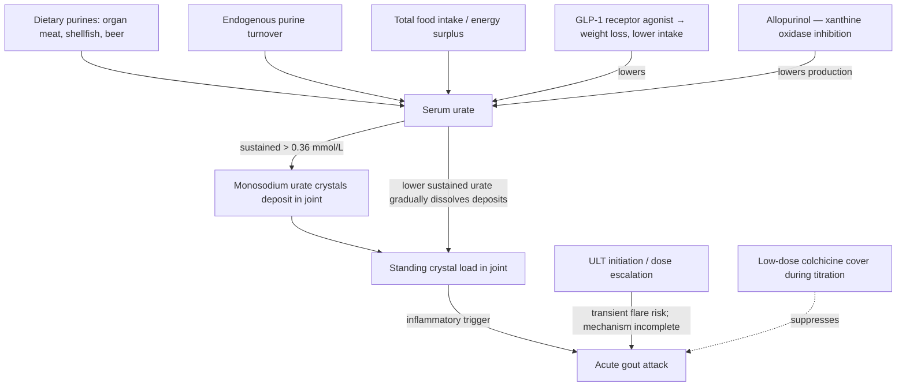

# Gout and urate-lowering therapy

Gout is a crystal-deposition disease. When extracellular urate remains supersaturated, monosodium urate crystals can nucleate and accumulate in joints and periarticular tissue; innate immune recognition of those crystals can then produce an abrupt, intensely painful inflammatory flare. Urate is the terminal product of human purine degradation. Purines come from endogenous cell turnover as well as food, and kidney and intestinal excretion determine most of the steady-state concentration; organ meats, some seafood, and alcohol are relevant exposures, but gout is not simply the result of eating DNA-containing food. The usual treatment target is serum urate below 6 mg/dL (about 0.36 mmol/L), not a claim that crystals appear at one exact universal threshold. [The 2020 American College of Rheumatology guideline](https://pmc.ncbi.nlm.nih.gov/articles/PMC10563586/) strongly supports a serial-measurement, treat-to-target strategy for people receiving urate-lowering therapy. (@DrBradStanfield (Dr Brad Stanfield) — "I’m Tired of Gout Not Being Treated Properly", 2026-07-13, [link](https://www.youtube.com/watch?v=Hz7EwSQuObw))

## Why urate lowering can initially provoke flares

Starting urate-lowering therapy can transiently increase flare frequency while the pre-existing tissue crystal burden is being remodeled. The transcript explains this as urate moving rapidly across the joint membrane in either direction, but that is an instructional simplification rather than an established complete trigger mechanism: flares require crystal-triggered innate inflammation, and the precise link between changing serum urate, deposits, and a particular flare remains incompletely resolved. The clinically supported conclusion is narrower and stronger than the proposed explanation: begin allopurinol at a low dose, titrate to the serum target, and provide anti-inflammatory prophylaxis when urate-lowering therapy starts. [ACR guidance](https://pmc.ncbi.nlm.nih.gov/articles/PMC10563586/) strongly recommends low-dose initiation and concomitant prophylaxis for at least 3–6 months, with longer use if flares continue. (@DrBradStanfield (Dr Brad Stanfield) — "I’m Tired of Gout Not Being Treated Properly", 2026-07-13, [link](https://www.youtube.com/watch?v=Hz7EwSQuObw))

## Management structure

Management has two separable layers: lowering the standing urate level to dissolve deposits and prevent future flares, and suppressing inflammation during acute attacks and the early treatment period. Dietary changes can modestly affect urate and may reduce triggers, but they should not displace indicated urate-lowering therapy. Allopurinol is the preferred first-line drug for most patients who need such therapy; it inhibits xanthine oxidase and therefore urate production. The transcript instead describes allopurinol as making the kidneys excrete urate, which is the mechanism of uricosuric drugs such as probenecid. This correction matters because kidney function, drug interactions, and adverse-effect counseling differ by drug class. (@DrBradStanfield (Dr Brad Stanfield) — "I’m Tired of Gout Not Being Treated Properly", 2026-07-13, [link](https://www.youtube.com/watch?v=Hz7EwSQuObw))

The transcript's clinic protocol starts allopurinol at about 100 mg daily, increases it by about 100 mg every four weeks, and uses colchicine 0.5 mg as prophylaxis. This is a useful example, not a universal prescription: ACR guidance supports an allopurinol starting dose no higher than 100 mg/day and lower in chronic kidney disease, but leaves titration timing and prophylactic agent to patient factors; it recommends continuing colchicine, an NSAID, or glucocorticoid prophylaxis for 3–6 months rather than specifying only the transcript's dose and schedule. HLA-B*58:01 testing is conditionally recommended before allopurinol in selected higher-prevalence ancestry groups because the allele markedly raises severe hypersensitivity risk. [ACR guideline](https://pmc.ncbi.nlm.nih.gov/articles/PMC10563586/) (@DrBradStanfield (Dr Brad Stanfield) — "I’m Tired of Gout Not Being Treated Properly", 2026-07-13, [link](https://www.youtube.com/watch?v=Hz7EwSQuObw))

## What GLP-1 therapy changes

Weight loss and GLP-1 receptor agonist treatment can coincide with lower serum urate, through reduced intake, weight change, and possibly renal effects. The transcript describes one patient whose urate reached about 0.12 mmol/L while allopurinol remained at 600 mg and presents dose reduction as the appropriate response. That case supports medication reconciliation and repeat measurement, not a general stopping threshold: the ACR guideline defines an upper target below 0.36 mmol/L but does not specify a lower boundary at which allopurinol must be reduced, and it conditionally recommends continuing urate-lowering therapy indefinitely because withdrawal can permit recurrence. Brad Stanfield's further position that GLP-1 therapy is beginning to supersede allopurinol is contrarian clinical interpretation; GLP-1 drugs are not guideline-recommended substitutes for first-line urate-lowering therapy and the transcript supplies no gout-outcome comparison. [[glp-1-receptor-agonists]] (@DrBradStanfield (Dr Brad Stanfield) — "I’m Tired of Gout Not Being Treated Properly", 2026-07-13, [link](https://www.youtube.com/watch?v=Hz7EwSQuObw))

## Practical implications

- **If you have gout, treat to a measured urate target with a clinician rather than relying on diet restriction or attack-by-attack painkillers — strong; treat-to-target below about 0.36 mmol/L is standard professional guidance.** Recurrent painful attacks despite dietary restriction may mean the standing urate level was never brought under control. (@DrBradStanfield (Dr Brad Stanfield) — "I’m Tired of Gout Not Being Treated Properly", 2026-07-13, [link](https://www.youtube.com/watch?v=Hz7EwSQuObw))
- **When starting urate-lowering therapy, use prescriber-selected anti-inflammatory prophylaxis and reassess over the first 3–6 months — strong.** Low-dose allopurinol initiation and colchicine, NSAID, or glucocorticoid prophylaxis are guideline-supported; kidney function, interactions, ancestry-related hypersensitivity risk, and tolerance determine the exact regimen. [ACR guideline](https://pmc.ncbi.nlm.nih.gov/articles/PMC10563586/) (@DrBradStanfield (Dr Brad Stanfield) — "I’m Tired of Gout Not Being Treated Properly", 2026-07-13, [link](https://www.youtube.com/watch?v=Hz7EwSQuObw))
- **During substantial weight change or after adding a GLP-1 agonist, review serum urate and the whole medication plan with the prescriber — moderate.** A lower value justifies reassessment but does not by itself prove toxicity or authorize stopping allopurinol; weigh flare history, tophi, kidney function, adverse effects, and rebound risk. [[glp-1-receptor-agonists]] (@DrBradStanfield (Dr Brad Stanfield) — "I’m Tired of Gout Not Being Treated Properly", 2026-07-13, [link](https://www.youtube.com/watch?v=Hz7EwSQuObw))
- **Limit alcohol and avoid personally reproducible food triggers, while keeping diet proportional to its likely effect — moderate.** Do not use a restrictive diet as a substitute for indicated urate-lowering therapy. (@DrBradStanfield (Dr Brad Stanfield) — "I’m Tired of Gout Not Being Treated Properly", 2026-07-13, [link](https://www.youtube.com/watch?v=Hz7EwSQuObw))
- **Investigational practice:** using GLP-1 therapy as the primary urate-lowering strategy, with allopurinol demoted to second line, is an attributed clinical stance without gout-outcome trial support; GLP-1 prescribing remains bound to its approved metabolic indications. [[glp-1-receptor-agonists]]

## Gaps & open questions

- Do GLP-1 receptor agonists reduce gout attacks in randomized comparison — against placebo or against allopurinol — or is the benefit inferred entirely from urate lowering?
- Is there a lower bound below which driving urate is undesirable, and how should deprescribing be sequenced (dose reduction versus withdrawal) as weight loss lowers urate?
- What fraction of the urate fall on GLP-1 therapy comes from reduced purine intake versus weight loss versus renal handling changes?
- Which patients genuinely respond to dietary restriction alone, and can they be identified before committing them to it?
- Does weight regain after GLP-1 discontinuation restore attack risk on the same timeline as urate rise?

## Related

[[glp-1-receptor-agonists]] · [[kidney-stones]] · [[energy-balance-and-calorie-counting]] · [[brad-stanfield]] · [[nutrition-evidence-and-personalization]] · [[practice-playbook]]
