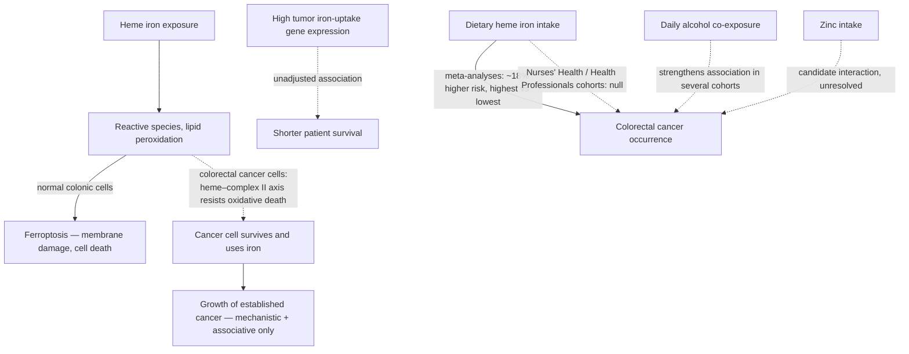

# Heme iron and colorectal cancer

Dietary iron comes in two forms: heme iron, the porphyrin-bound form in meat (especially red meat), and non-heme iron from plants and fortification. Heme iron is absorbed more efficiently and behaves differently in the gut and inside cells. Its relationship to colorectal cancer runs on two distinct time axes that are easy to conflate: whether heme-iron intake raises the risk of *developing* colorectal cancer (prevention), and whether iron *feeds* a cancer that already exists (progression). The evidence for each is different in kind and maturity, and neither is settled. (@Physionic (Physionic) — "Dietary Iron Consumption and Colorectal Cancer: What a Scientific Nightmare!", 2026-07-06, [link](https://www.youtube.com/watch?v=Z9QGMDYU9jk))

## Mechanism: ferroptosis resistance as iron addiction

In normal cells, exposure to heme or free iron generates reactive species that attack cellular components, and sufficient exposure triggers ferroptosis — an iron-dependent form of cell death in which lipid peroxidation perforates the cell membrane. Colorectal cancer cells can escape this: a 2026 study (Jain et al., Cell Metab, doi:10.1016/j.cmet.2026.04.020) describes colorectal cancers exploiting a heme–complex II axis to resist oxidative cell death, taking up iron without succumbing to it — a state the source calls addiction, because the cancer both tolerates and depends on the iron supply. In patient data from the same line of work, tumors with high expression of iron-uptake genes were associated with shorter survival than tumors with low expression. Two limits apply: expression data cannot show that iron flux itself (rather than the transport proteins' other actions) causes the harm, and the survival comparison is a simple association without adjustment for other prognostic factors. (@Physionic (Physionic) — "Dietary Iron Consumption and Colorectal Cancer: What a Scientific Nightmare!", 2026-07-06, [link](https://www.youtube.com/watch?v=Z9QGMDYU9jk))

## Occurrence: a genuinely mixed literature

For people without cancer, the cohort literature does not agree. Meta-analytic summaries (Bastide et al. 2011, Cancer Prev Res) find increased colorectal-cancer risk comparing the highest to the lowest heme-iron consumers — but the pooled estimate is modest, about an 18% relative increase. Against that, the cohort study drawing on the Nurses' Health and Health Professionals cohorts (Zhang et al. 2011, Cancer Causes Control) — which the source weighs somewhat more heavily for its long, meticulous exposure tracking — found no increased risk across heme-iron intake quintiles, and a second dissenting cohort (Kabat et al. 2007, Br J Cancer) also found none. (@Physionic (Physionic) — "Dietary Iron Consumption and Colorectal Cancer: What a Scientific Nightmare!", 2026-07-06, [link](https://www.youtube.com/watch?v=Z9QGMDYU9jk))

Candidate explanations for the disagreement, each examined and none sufficient: alcohol co-exposure (several cohorts, including the Iowa Women's Health Study, found the heme-iron association more robust with high alcohol intake, but the dissenting cohort's null held regardless of alcohol); insufficient exposure contrast (the null cohort's low- and high-intake groups were not far apart — a real limitation against older studies, but the second dissenting study had a contrast comparable to positive studies and was still null); and a possible zinc–heme-iron interaction that could shift risk profiles. The honest reading is that the disagreement is unresolved rather than adjudicated. (@Physionic (Physionic) — "Dietary Iron Consumption and Colorectal Cancer: What a Scientific Nightmare!", 2026-07-06, [link](https://www.youtube.com/watch?v=Z9QGMDYU9jk))

What survives the mess, per the source: at no point does heme iron show a *beneficial* relationship with colorectal cancer — the best case is no link — and the increased-risk side, where present, is modest rather than dramatic, except possibly when combined with daily alcohol consumption. This sits consistently beside the processed-meat and red-meat guidance already on [[colorectal-cancer-prevention-and-screening]], where heme iron is one of several candidate mechanistic routes from red and processed meat to colorectal risk. (@Physionic (Physionic) — "Dietary Iron Consumption and Colorectal Cancer: What a Scientific Nightmare!", 2026-07-06, [link](https://www.youtube.com/watch?v=Z9QGMDYU9jk))

## Progression is not prevention

The ferroptosis-resistance study concerns people who already have colorectal cancer; almost all the cohort evidence concerns people who do not. The source is explicit that the progression question — whether dietary heme iron accelerates an established cancer — is extremely young, resting on mechanism plus one unadjusted survival association, and is even less well understood than the mixed prevention data. No dietary trial in cancer patients exists in this record, so no iron-restriction recommendation for patients can be derived from it; treatment-context nutrition belongs with the treating oncology team. (@Physionic (Physionic) — "Dietary Iron Consumption and Colorectal Cancer: What a Scientific Nightmare!", 2026-07-06, [link](https://www.youtube.com/watch?v=Z9QGMDYU9jk))

## Gaps & open questions

- Does reducing heme-iron intake change colorectal-cancer incidence in any prospective or interventional design, or is intake a marker of the meat-heavy pattern it travels in?
- Is the iron-uptake-gene survival association causal, and would blocking tumor iron uptake (or the heme–complex II axis) change patient outcomes?
- What explains the null in the highest-quality cohorts — exposure contrast, population, measurement, or a genuinely absent effect?
- Is the alcohol–heme interaction a real biological synergy or confounding by dietary pattern?
- Does zinc intake genuinely modify heme-iron risk, and in which direction at dietary doses?
- Do heme-iron supplements (as opposed to food heme) carry the same, more, or less colonic exposure risk?

## Practical implications

- **No change to the standing guidance: keep processed meat and heavy red-meat intake from becoming routine exposures — moderate-to-strong, carried by the broader meat evidence rather than the heme-iron literature alone.** The heme-iron data neither strengthen this into a specific iron limit nor undermine it; the mixed cohort record with a modest pooled risk increase is compatible with the existing pattern advice. [[colorectal-cancer-prevention-and-screening]] [[nutrition-evidence-and-personalization]] (@Physionic (Physionic) — "Dietary Iron Consumption and Colorectal Cancer: What a Scientific Nightmare!", 2026-07-06, [link](https://www.youtube.com/watch?v=Z9QGMDYU9jk))
- **If heme intake is high *and* alcohol is a daily habit, the alcohol is the better-supported thing to cut — moderate.** The co-exposure pattern shows the more robust risk association, and alcohol carries independent colorectal risk. [[colorectal-cancer-prevention-and-screening]]
- **Do not translate the iron-addiction mechanism into self-directed iron restriction after a cancer diagnosis.** Iron status in cancer patients involves anemia, treatment tolerance, and transfusion decisions; the progression evidence is mechanistic and associative only — investigational, not actionable. (@Physionic (Physionic) — "Dietary Iron Consumption and Colorectal Cancer: What a Scientific Nightmare!", 2026-07-06, [link](https://www.youtube.com/watch?v=Z9QGMDYU9jk))

## Related

[[colorectal-cancer-prevention-and-screening]] · [[nutrition-evidence-and-personalization]] · [[dietary-fiber]] · [[food-patterns-and-gut-ecology]] · [[supplement-evidence-and-safety]] · [[practice-playbook]]
