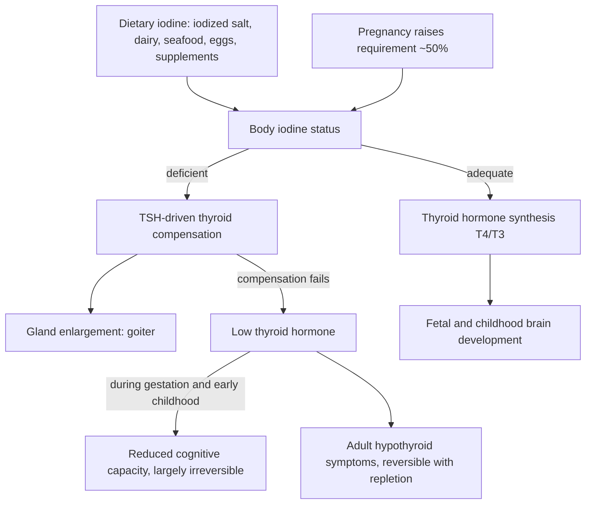

# Iodine and cognitive development

Iodine is the substrate the thyroid cannot substitute: every molecule of thyroxine (T4) and triiodothyronine (T3) contains it, and no other element can take its place. When intake falls, the gland compensates by enlarging — goiter — and when compensation fails, thyroid hormone output drops. Because thyroid hormone directs fetal and early-childhood brain development, the highest-stakes consequence of deficiency is not the visible neck swelling but irreversible loss of cognitive potential, and the World Health Organization identifies iodine deficiency as the most common preventable cause of intellectual disability worldwide. (@DrBradStanfield (Dr Brad Stanfield) — "Our IQ Will Start Dropping Soon (new evidence)", 2026-08-28, [link](https://www.youtube.com/watch?v=CfrE9yZhYFs))

Soil iodine is unevenly distributed — glaciated regions such as the northern-US goiter belt, inland Switzerland, and parts of Australasia are depleted — so food grown locally cannot be assumed to supply it, and adequacy in a population historically depended on deliberate fortification or accidental industrial sources. (@DrBradStanfield (Dr Brad Stanfield) — "Our IQ Will Start Dropping Soon (new evidence)", 2026-08-28, [link](https://www.youtube.com/watch?v=CfrE9yZhYFs))

## Mechanism: one nutrient, two failure modes

The developmental window is what makes this pathway asymmetric: adult hypothyroidism from low intake is treatable, but hormone insufficiency during gestation and early childhood produces deficits that repletion later cannot recover. Pregnancy is the period of maximum vulnerability because the requirement rises by roughly half while the fetal brain is being built. (@DrBradStanfield (Dr Brad Stanfield) — "Our IQ Will Start Dropping Soon (new evidence)", 2026-08-28, [link](https://www.youtube.com/watch?v=CfrE9yZhYFs))

## Evidence: fortification as a population experiment

The causal chain from iodine to goiter was established interventionally a century ago. In David Marine and O.P. Kimball's Ohio schoolgirl trial (1917–1922), pupils received short courses of sodium iodide in water every six months; among girls who started with normal thyroids, more than a quarter of the untreated comparison group developed goiter versus 0.2% of the supplemented group. US table salt carried potassium iodide from 1924 (championed by the Michigan pediatrician David Murray Cowie, who reframed dosing as a supply-chain problem: everyone buys salt, in roughly similar amounts, forever), and goiter prevalence collapsed; Switzerland and Italy saw the same result from school programs. Salt iodization costs roughly 2–5 cents per person per year. (@DrBradStanfield (Dr Brad Stanfield) — "Our IQ Will Start Dropping Soon (new evidence)", 2026-08-28, [link](https://www.youtube.com/watch?v=CfrE9yZhYFs))

The cognitive claim rests on three tiers of weaker evidence, and the distinctions matter:

- **Randomized, small, marginal deficiency:** a 2009 trial in 184 Dunedin, New Zealand schoolchildren found overall cognitive scores 0.19 standard deviations higher with iodine supplementation, with the clearest gains in perceptual reasoning. This is direct trial evidence, but small, short, and in mildly deficient children. (@DrBradStanfield (Dr Brad Stanfield) — "Our IQ Will Start Dropping Soon (new evidence)", 2026-08-28, [link](https://www.youtube.com/watch?v=CfrE9yZhYFs))
- **Natural experiment, large effect, uncontrolled:** a 2013 economic analysis compared cognitive test scores of US military draftees born just after 1924 salt iodization (WWII cohort) with earlier draftees (WWI cohort) and reported scores about one standard deviation — roughly 15 IQ points — higher. This is not a randomized comparison; secular trends in schooling, nutrition, and test-taking (the same forces behind the Flynn effect) ran in the same direction across those decades, so the specific magnitude should not be treated as an isolated iodine effect. (@DrBradStanfield (Dr Brad Stanfield) — "Our IQ Will Start Dropping Soon (new evidence)", 2026-08-28, [link](https://www.youtube.com/watch?v=CfrE9yZhYFs))
- **Review-level association:** modern reviews link moderate-to-severe childhood iodine deficiency to roughly 12–13.5 fewer IQ points. Severity matters; nothing licenses extrapolating this magnitude to mild deficiency. (@DrBradStanfield (Dr Brad Stanfield) — "Our IQ Will Start Dropping Soon (new evidence)", 2026-08-28, [link](https://www.youtube.com/watch?v=CfrE9yZhYFs))

## The quiet reversal: losing the accidental pillars

US iodization has been voluntary since 1924, and population adequacy came to rest on three partly accidental pillars: iodized table salt, iodine residues in dairy from iodine-based udder and equipment sanitizers, and iodate dough conditioners in industrial bread. All three have eroded — dairies moved to other sanitizers, bakers swapped iodate for bromate around 1980, and the salt Americans actually eat shifted toward two iodine-free channels: specialty salts (sea, kosher, Himalayan) that carry essentially no iodine, and processed foods, whose manufacturers almost always use non-iodized salt. Median US urinary iodine fell from about 320 µg/L in the early 1970s to 145 by the early 1990s, and from 153 to 116 in adults (243 to 166 in children) between 2001 and 2020. The sufficiency line is 100: the US is not yet a deficient country, but the buffer is nearly gone, and pregnancy medians have sat below adequacy in every national survey since the mid-2000s. Australia demonstrated how fast the reversal can run — when its dairy industry phased out iodine sanitizers in the 1990s, deficiency returned within five years, and in 2009 Australia and New Zealand made iodized salt mandatory in bread. (@DrBradStanfield (Dr Brad Stanfield) — "Our IQ Will Start Dropping Soon (new evidence)", 2026-08-28, [link](https://www.youtube.com/watch?v=CfrE9yZhYFs))

Ordinary healthy foods do not close the gap reliably: canned tuna carries about 7 µg against a 150 µg daily requirement, most fruits, vegetables, and grains sit at 1–3 µg, and eggs help but do not suffice — so a person eating an otherwise excellent whole-food diet with non-iodized specialty salt can sit closer to deficiency than someone eating iodized-salt processed food decades ago. (@DrBradStanfield (Dr Brad Stanfield) — "Our IQ Will Start Dropping Soon (new evidence)", 2026-08-28, [link](https://www.youtube.com/watch?v=CfrE9yZhYFs))

## Measurement limits

Individual status is hard to test. Spot urinary iodine swings with every meal and is validated as a population statistic, not a personal diagnostic; TSH can remain normal while intake is low, so a normal thyroid panel does not establish iodine adequacy. Practical assessment is therefore a source audit (salt type, dairy, seafood, supplements) rather than a lab number. (@DrBradStanfield (Dr Brad Stanfield) — "Our IQ Will Start Dropping Soon (new evidence)", 2026-08-28, [link](https://www.youtube.com/watch?v=CfrE9yZhYFs)) This is a concrete instance of the general serial-measurement problem in [[blood-marker-variability-and-reference-change]].

## The vehicle problem: iodine rode on a nutrient we should eat less of

Fortification's historical vehicle conflicts with current sodium guidance. Salt reduction lowers blood pressure (a meta-analysis combining 85 trials), and a randomized salt-substitute trial reduced stroke risk by 14% over 4.74 years of follow-up — so eating more iodized salt is the wrong repletion strategy for most people, and reducing bread intake (often reasonable) removes another iodine source. The population-level fix (mandatory iodization of the salt already being eaten, as Australia and New Zealand did for bread) and the individual-level fix (an RDA-level supplement) both decouple iodine from sodium. (@DrBradStanfield (Dr Brad Stanfield) — "Our IQ Will Start Dropping Soon (new evidence)", 2026-08-28, [link](https://www.youtube.com/watch?v=CfrE9yZhYFs))

## Practical implications

- **Pregnancy or planned pregnancy: supplement 150 µg/day iodine alongside folate — strong; aligned with professional guidance (ATA/ACOG-consistent, and the clinical-guideline framing in the source), against a background of below-adequacy US pregnancy surveys.** (@DrBradStanfield (Dr Brad Stanfield) — "Our IQ Will Start Dropping Soon (new evidence)", 2026-08-28, [link](https://www.youtube.com/watch?v=CfrE9yZhYFs))
- **Once: audit your iodine sources — moderate.** If your household salt is sea, kosher, or Himalayan and you eat little dairy, seafood, or iodized bread, you likely have no reliable iodine source; either switch part of your existing salt use to iodized salt (substitution, not addition) or cover the RDA with a low-dose supplement or multivitamin. Do not megadose: excess iodine can itself disturb thyroid function, and the whole benefit case is about reaching adequacy. (@DrBradStanfield (Dr Brad Stanfield) — "Our IQ Will Start Dropping Soon (new evidence)", 2026-08-28, [link](https://www.youtube.com/watch?v=CfrE9yZhYFs))
- **Do not increase total salt intake to obtain iodine — strong.** Salt reduction has randomized blood-pressure support and salt substitution has stroke-outcome support; iodine belongs on the existing salt, not on added salt. [[blood-pressure-targets-and-frailty]] (@DrBradStanfield (Dr Brad Stanfield) — "Our IQ Will Start Dropping Soon (new evidence)", 2026-08-28, [link](https://www.youtube.com/watch?v=CfrE9yZhYFs))
- **When buying an iodine-containing supplement, prefer third-party-tested products — moderate.** Independent testing (ConsumerLab is the example named) has found many products carrying less iodine than labeled. [[supplement-evidence-and-safety]] (@DrBradStanfield (Dr Brad Stanfield) — "Our IQ Will Start Dropping Soon (new evidence)", 2026-08-28, [link](https://www.youtube.com/watch?v=CfrE9yZhYFs))
- **Do not use a single spot urinary-iodine test or a normal TSH to conclude personal adequacy — moderate measurement principle.** (@DrBradStanfield (Dr Brad Stanfield) — "Our IQ Will Start Dropping Soon (new evidence)", 2026-08-28, [link](https://www.youtube.com/watch?v=CfrE9yZhYFs))

## Gaps & open questions

- Does iodine repletion improve cognition in mildly deficient adults, or is the cognitive window exclusively developmental? No adult repletion-cognition RCT is cited.
- How much of the WWI-to-WWII draftee score gain was iodine versus secular schooling and nutrition trends? The natural experiment cannot cleanly partition them.
- Will the US urinary-iodine trend actually cross the deficiency line, and at what rate — and would voluntary industry behavior or regulation respond before it does?
- Is there a validated individual-level iodine-status test, or a practical multi-sample urinary protocol, that could replace source auditing?
- What did the bromate-for-iodate swap in industrial baking cost in net health terms, given bromate's own toxicology?

## Related

[[supplement-evidence-and-safety]] · [[nutrition-evidence-and-personalization]] · [[food-label-literacy-and-health-halos]] · [[blood-marker-variability-and-reference-change]] · [[proactive-health-monitoring]] · [[brad-stanfield]] · [[practice-playbook]]
