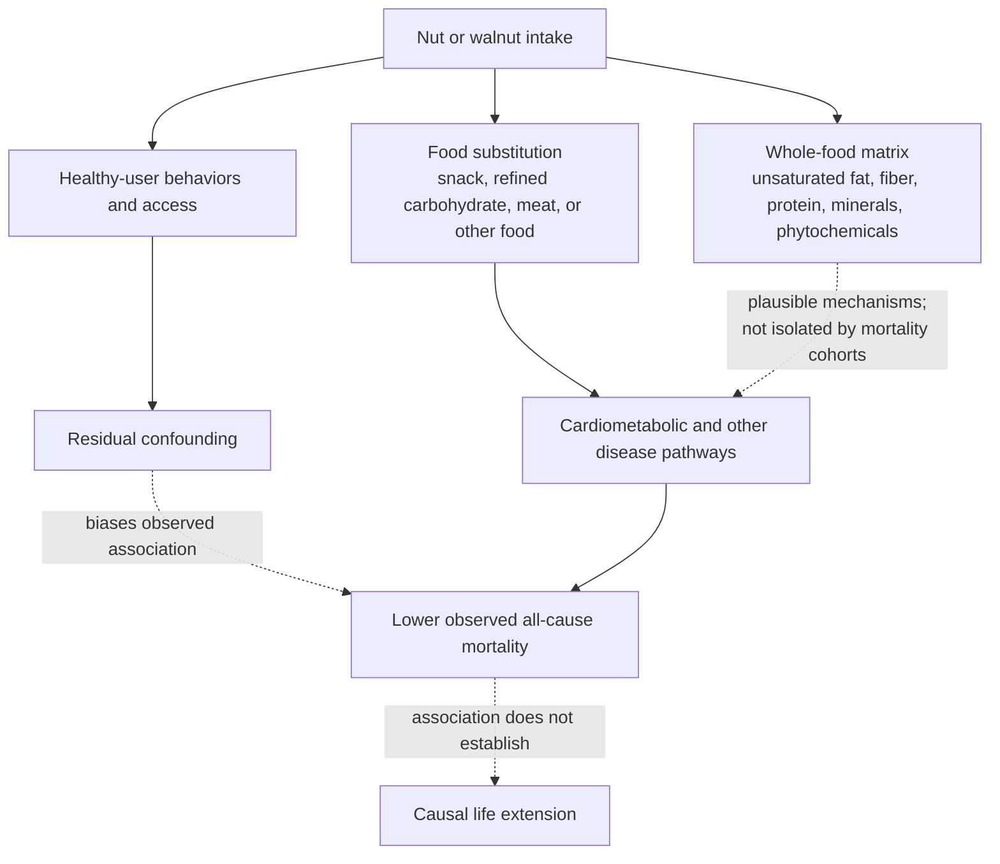

# Nut consumption and mortality

Nuts are energy-dense seeds that package unsaturated fats, protein, fiber, minerals, and phytochemicals inside a whole-food matrix. Prospective cohorts consistently associate eating nuts with lower all-cause mortality, but this is not the same as showing that nuts extend life: people who eat them can differ in smoking, activity, body weight, education, and the rest of their diet, while the food displaced by nuts also changes the comparison. Nut evidence is therefore useful both as dietary guidance and as a lesson in interpreting food–outcome associations ([[nutrition-evidence-and-personalization]]). (@Physionic (Physionic) — "The Mortality Effect of Walnuts is Hard to Ignore", 2026-07-13, [link](https://www.youtube.com/watch?v=3DqCZZgDdF8))

## From a food category to a specific food

A dose–response meta-analysis of 20 prospective studies found lower all-cause mortality among people with higher total-nut intake; none of the included study estimates indicated a statistically identified increase in mortality. The curve fell most steeply up to about 15 g/day and then largely plateaued, suggesting diminishing additional association above roughly half a standard serving. The constituent studies adjusted for major factors such as age, education, family history, body weight, smoking, alcohol, physical activity, and some dietary variables, but they did not use one uniform covariate set. Residual confounding and inconsistent adjustment therefore remain plausible. (@Physionic (Physionic) — "The Mortality Effect of Walnuts is Hard to Ignore", 2026-07-13, [link](https://www.youtube.com/watch?v=3DqCZZgDdF8))

Category-level evidence cannot establish that every nut has the pooled association: one subtype could be neutral or unfavorable while others carry the average. Walnut-specific prospective analyses nevertheless show the same direction, with lower total mortality in combined-sex analyses. Sex-stratified estimates were broadly similar, although women appeared to show an association at lower intake while the estimate for men became clearer only at higher intake; overlapping uncertainty makes that a tentative heterogeneity signal rather than evidence for sex-specific dosing. (@Physionic (Physionic) — "The Mortality Effect of Walnuts is Hard to Ignore", 2026-07-13, [link](https://www.youtube.com/watch?v=3DqCZZgDdF8))

## Diet quality and the healthy-user problem

The walnut analysis stratified participants using the Alternate Healthy Eating Index, a composite that rewards vegetables, fruit, whole grains, nuts and legumes, omega-3 fats, and polyunsaturated fats while penalizing sugar-sweetened beverages, processed meat, trans fat, and other less-favorable exposures. Walnut intake remained associated with lower mortality in both lower- and higher-quality diet strata. This weakens the narrow explanation that walnuts only mark an otherwise healthy diet or only help people starting with a poor one, but it does not eliminate confounding: the index is an incomplete summary, walnuts contribute to the score itself, and people within a stratum can still differ in many ways. (@Physionic (Physionic) — "The Mortality Effect of Walnuts is Hard to Ignore", 2026-07-13, [link](https://www.youtube.com/watch?v=3DqCZZgDdF8))

The source's practical harmonization is one 28-g walnut serving about two to four times weekly, with somewhat more consistent support near the upper end. Averaged across a week, three to four servings yield roughly 12–16 g/day and thus align with the approximately 15-g/day plateau in the total-nut meta-analysis. That arithmetic links two observational descriptions; it does not prove a biological threshold, an optimal dose, or that walnuts outperform other nuts. (@Physionic (Physionic) — "The Mortality Effect of Walnuts is Hard to Ignore", 2026-07-13, [link](https://www.youtube.com/watch?v=3DqCZZgDdF8))

## Evidence strength and interpretation

Consistency across prospective studies, a dose–response shape, persistence after adjustment, and a walnut-specific association make the finding moderately persuasive as dietary-pattern evidence. Confidence in a causal mortality effect remains limited because exposure was not randomized, intake measurement is imperfect, covariate adjustment varies, and a mortality association does not identify the mediating disease pathway. The appropriate conclusion is that nuts are a well-supported component of a healthy pattern, not that a precise walnut dose is a proven longevity treatment. (@Physionic (Physionic) — "The Mortality Effect of Walnuts is Hard to Ignore", 2026-07-13, [link](https://www.youtube.com/watch?v=3DqCZZgDdF8))

## Gaps & open questions

- How much of the association is caused by nuts themselves versus the foods they replace?
- Do walnuts differ meaningfully from other tree nuts or peanuts for mortality, cardiovascular events, cancer, or kidney outcomes when compared head-to-head?
- Is the apparent sex difference reproducible, and does it reflect biology, intake measurement, baseline risk, or chance?
- What is the absolute mortality difference across intake levels, rather than only the relative association?
- Do randomized dietary-pattern trials support the same dose plateau when adherence, energy intake, allergy, and weight change are counted?

## Practical implications

- **Include a small handful of unsalted nuts most days, or a 28-g walnut serving about three to four times weekly, if tolerated — moderate dietary-pattern evidence; observational for mortality.** Roughly 15 g/day captures most of the total-nut dose–response association, but it is not a proven minimum or optimum. (@Physionic (Physionic) — "The Mortality Effect of Walnuts is Hard to Ignore", 2026-07-13, [link](https://www.youtube.com/watch?v=3DqCZZgDdF8))
- **Use nuts as a substitution, not an automatic calorie addition — strong nutritional logic, unquantified in this mortality record.** Replacing refined snacks or foods rich in saturated fat is more defensible than adding nuts without regard to energy needs ([[dietary-fat-quality-and-cardiovascular-risk]], [[energy-balance-and-calorie-counting]]). This is an inference from the source's diet-quality analysis, not a tested substitution result. (@Physionic (Physionic) — "The Mortality Effect of Walnuts is Hard to Ignore", 2026-07-13, [link](https://www.youtube.com/watch?v=3DqCZZgDdF8))
- **Do not treat walnuts as a mortality therapy.** The frequency estimate comes from cohorts, the incremental benefit above a healthy diet remains associative, and no mortality RCT in the summarized record establishes causation. (@Physionic (Physionic) — "The Mortality Effect of Walnuts is Hard to Ignore", 2026-07-13, [link](https://www.youtube.com/watch?v=3DqCZZgDdF8))

## Related

[[nutrition-evidence-and-personalization]] · [[dietary-fat-quality-and-cardiovascular-risk]] · [[food-patterns-and-gut-ecology]] · [[energy-balance-and-calorie-counting]] · [[cheese-and-mortality]] · [[tomato-products-and-lycopene]] · [[practice-playbook]]
