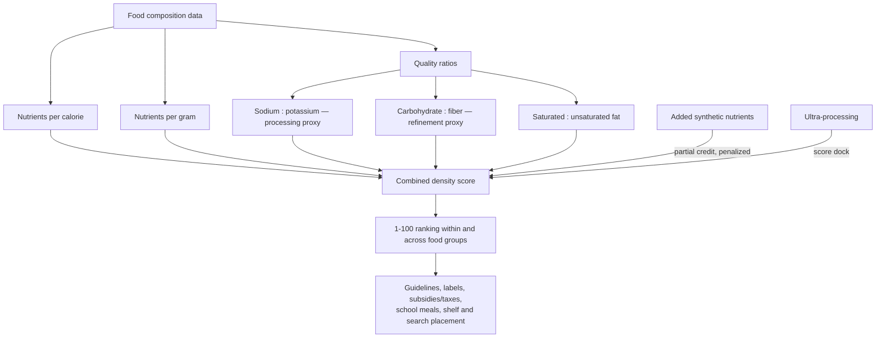

# Nutrient density and food profiling

Nutrient density is the concentration of health-relevant nutrients a food delivers relative to what else it delivers — its calories, its mass, and its load of sodium, added sugar, and refined substrate. A nutrient profiling system turns that idea into an algorithm: score every food on a common scale so that guidelines, front-of-package labels, subsidies, school-meal rules, and store or search placement can rank foods without arguing each one case by case. The design choices inside the algorithm — which nutrients count, per calorie or per gram, how fortification and processing are handled — determine whether the output matches or violates well-established food knowledge, which makes profiling systems both a practical policy tool and a running audit of nutrition science's own assumptions. (@maxlugavere (Max Lugavere) — "Top Nutrition Scientist: Eat These Foods to FIGHT Weight Gain and Disease", 2026-06-03, [link](https://www.youtube.com/watch?v=fqsSqG5Ff7c))

## Why design choices dominate: the Food Compass lesson

The Tufts Food Compass system illustrated failure by construction: despite methodological sophistication, its published rankings placed sweetened breakfast cereals such as Lucky Charms above eggs and ground beef, and scored egg substitute roughly twice as high as eggs. Nutrition researcher Ty Beal's diagnosis was that no single step was fraudulent — decisions at each stage of the scoring pipeline compounded into rankings that failed a common-sense audit. Two structural traps recur in any per-calorie or per-mass scheme: scoring nutrients only per calorie inflates near-zero-calorie foods (dark leafy greens score off the charts, but no one can eat their calories as greens) and punishes energy-dense but nutrient-rich foods such as nuts, seeds, and avocado; scoring only per gram does the reverse. A third trap is fortification: adding synthetic nutrients makes a refined product read like a multivitamin even though it lacks the food matrix — the synergistic package of compounds in the whole food — that the epidemiology of nutrient-rich foods actually measured. (@maxlugavere (Max Lugavere) — "Top Nutrition Scientist: Eat These Foods to FIGHT Weight Gain and Disease", 2026-06-03, [link](https://www.youtube.com/watch?v=fqsSqG5Ff7c)) [[nutrition-evidence-and-personalization]]

## The Nutritional Value Score's architecture

Beal's response, the Nutritional Value Score (published 2026; global data on over 1,000 foods across South Asian, African, Latin American, and high-income contexts), combines both denominators and adds ratio metrics that read the quality of the food rather than a single nutrient count. It scores foods 1–100 on: five public-health-priority minerals (iron, zinc, calcium, magnesium, potassium); eleven vitamins; protein with bioavailability-adjusted quality; long-chain omega-3s (DHA/EPA); fiber; energy density; and three ratios — saturated-to-unsaturated fat, carbohydrate-to-fiber (how refined the carbohydrate is), and sodium-to-potassium (how far the food sits from its intrinsic plant or animal state). Added nutrients earn partial credit but are penalized relative to intrinsic ones, and ultra-processing docks the score without automatically disqualifying a food — a deliberate anti-gaming design, since manufacturers fortify precisely to win profiling systems. (@maxlugavere (Max Lugavere) — "Top Nutrition Scientist: Eat These Foods to FIGHT Weight Gain and Disease", 2026-06-03, [link](https://www.youtube.com/watch?v=fqsSqG5Ff7c))

## What ranks high, what ranks low

At the top of the ranking sit fatty fish and shellfish (especially bivalves — mussels, clams, oysters), dark green leafy vegetables (moringa, collards, chard, kale, and spinach all score high; low-nutrient lettuces score much lower, so a guideline saying consume lettuce spans a large real difference), and organ meats (liver, heart, kidney, across animal species). These are exactly the foods modern diets have largely dropped — bivalves for cost and unfamiliarity, organ meats for flavor — which is part of why they rank so high against prevailing deficiency patterns. At the bottom sit sugar-sweetened beverages (Gatorade scored worst of the individual foods analyzed, combining sugar with added sodium — a ranking about habitual consumption, not electrolyte use during prolonged exercise), instant noodles (refined flour plus sodium, high glycemic index, almost no intact food), baked grain-based sweets, packaged salty snacks, and egg substitute. Variation inside food groups is substantial (among cheeses, paneer scored higher, likely reflecting sodium), so group-level advice systematically under-specifies. (@maxlugavere (Max Lugavere) — "Top Nutrition Scientist: Eat These Foods to FIGHT Weight Gain and Disease", 2026-06-03, [link](https://www.youtube.com/watch?v=fqsSqG5Ff7c)) [[performance-nutrition-and-hydration]]

The processed-meat category dissolves under the same resolution. Most guidelines discourage processed meat as one block, but the score separates minimally processed meat (ground beef — under NOVA not even classified as processed; scores high, since meat is nutrient-dense), moderately processed meat (a salt-cured ham; roughly 40–50 of 100, moderate rather than condemned), and ultra-processed meat (chicken nuggets, bologna — reconstituted, breaded, additive-heavy, with almost no iron left). Whether the epidemiologic harm signal for processed meat tracks this processing gradient rather than the category as a whole is a question the profiling system poses but observational data have not yet answered. (@maxlugavere (Max Lugavere) — "Top Nutrition Scientist: Eat These Foods to FIGHT Weight Gain and Disease", 2026-06-03, [link](https://www.youtube.com/watch?v=fqsSqG5Ff7c)) [[ultra-processed-food]] [[heme-iron-and-colorectal-cancer]]

## The sodium-to-potassium ratio as a consumer instrument

One component of the score doubles as a two-number label check. Plants are intrinsically potassium-rich and sodium-poor; refining strips the potassium along with the rest of the intrinsic matrix, and manufacturing adds sodium back. Whole and minimally processed foods therefore typically carry two to five times more potassium than sodium, while heavily refined packaged products show the ratio inverted — very little potassium, high sodium. Because no manufacturer currently fortifies with potassium, the ratio is hard to game: a plant-based bar, cereal, or protein snack with almost no potassium contains almost none of the original plant, whatever the front of the package says. Beal presents this as the single most informative back-label heuristic for judging how much whole food survives in a packaged product. The claim is mechanistically sound as a processing proxy but has not been validated as an outcome predictor in its own right. (@maxlugavere (Max Lugavere) — "Top Nutrition Scientist: Eat These Foods to FIGHT Weight Gain and Disease", 2026-06-03, [link](https://www.youtube.com/watch?v=fqsSqG5Ff7c)) [[food-label-literacy-and-health-halos]]

Potassium itself carries the cardiovascular rationale: most people consume far less than ancestral intakes (Lugavere recalls estimates near 10 g/day for hunter-gatherer diets, both from wilder plants and from the absence of processing; unverified here), and sodium's blood-pressure risk appears conditional on the sodium-to-potassium balance rather than sodium alone. This aligns with the potassium-enriched-salt outcome trial recorded at [[food-label-literacy-and-health-halos]]. Beal's personal practice — a daily pinch of potassium chloride salt substitute taken with psyllium husk — is investigational practice: potassium supplementation can be overdone, is risky with renal impairment or potassium-sparing drugs, and the trial evidence is for salt substitution in specific populations, not routine supplementation by healthy people. (@maxlugavere (Max Lugavere) — "Top Nutrition Scientist: Eat These Foods to FIGHT Weight Gain and Disease", 2026-06-03, [link](https://www.youtube.com/watch?v=fqsSqG5Ff7c))

## Where profiling disagrees with outcome evidence

A profiling score is a nutrient-and-composition claim, not an outcome claim, and the divergences are informative. Cheese scores only moderate on the Nutritional Value Score — sodium and energy density penalize it — while the prospective-cohort record links cheese to neutral-to-reduced mortality ([[cheese-and-mortality]]); Beal concedes he would have liked cheese to score higher and attributes the gap to fermentation and matrix effects the data cannot yet represent, the same limitation that keeps full-fat dairy's neutral weight-gain record surprising on paper. Plain Cheerios and oatmeal score similarly because fortification credit offsets processing penalties, though an argument stands that the minimally processed food is healthier than its score-equal fortified competitor (plain Cheerios at ~2 g added sugar per serving are also a different food from Honey Nut Cheerios at 12 g — Lucky Charms territory). Fortified nutrients do contribute to nutrient adequacy in deficient populations, which is why the penalty is partial; unsweetened soy milk and tofu are further exceptions where an ultra-processed item scores near its whole-food comparator (soy protein being the plant protein closest to animal quality). The general rule: use profiling to rank within honest categories, and treat score-versus-outcome disagreements as flags for matrix effects, not errors to suppress. (@maxlugavere (Max Lugavere) — "Top Nutrition Scientist: Eat These Foods to FIGHT Weight Gain and Disease", 2026-06-03, [link](https://www.youtube.com/watch?v=fqsSqG5Ff7c))

## Policy surface

Because a validated score is machine-readable, it can act at every choke point between food supply and diet: front-of-package tiers or warning marks; qualification rules for health claims; which foods subsidies promote and taxes discourage (current commodity subsidies flow to corn, soy, and wheat rather than the produce the score ranks highest — see the subsidy economics at [[ultra-processed-food]]); school-meal and snack-program eligibility, where defining candy in enforceable terms is otherwise surprisingly hard; and physical or algorithmic shelf placement, since both supermarkets and online stores currently sell position to whoever pays. Beal reports early FDA-level interest and a role in shaping the 2026 US dietary guidelines, whose main shifts he characterizes as calling out highly processed foods and refined grains, tightening added sugar (as little as possible; at most about 10 g per meal; zero for ages 6–23 months), and framing alcohol as less-is-better without a defined moderate allowance. He criticizes one provision from inside: the zero-added-sugar rule for ages 2–10 is, in his view as a parent and researcher, infeasible and stricter than the evidence, which concentrates on sugar-sweetened beverages and juices rather than occasional treats. He also argues most public controversy over the guidelines is manufactured: practitioners across the political spectrum agree on roughly 90% — real food, limited highly processed food — and outrage is an engagement product ([[health-misinformation-and-media-incentives]]). These are participant characterizations of a policy process, not independent summaries of the guideline documents. (@maxlugavere (Max Lugavere) — "Top Nutrition Scientist: Eat These Foods to FIGHT Weight Gain and Disease", 2026-06-03, [link](https://www.youtube.com/watch?v=fqsSqG5Ff7c)) [[ty-beal]]

## Practical implications

- **When comparing packaged foods, check the sodium-to-potassium ratio on the nutrition panel: prefer products with at least as much potassium as sodium, and ideally two to five times more — Investigational practice as a heuristic (sound processing proxy from the score's author; no outcome validation).** A near-zero potassium number in a nominally plant-based product means the plant is mostly gone. (@maxlugavere (Max Lugavere) — "Top Nutrition Scientist: Eat These Foods to FIGHT Weight Gain and Disease", 2026-06-03, [link](https://www.youtube.com/watch?v=fqsSqG5Ff7c))
- **Weekly, work one or two top-ranked neglected foods into the pattern — fatty fish or bivalve shellfish, dark leafy greens beyond salad lettuce, occasionally organ meats — moderate (nutrient-adequacy rationale is strong; the specific ranking is one group's algorithm).** (@maxlugavere (Max Lugavere) — "Top Nutrition Scientist: Eat These Foods to FIGHT Weight Gain and Disease", 2026-06-03, [link](https://www.youtube.com/watch?v=fqsSqG5Ff7c))
- **Treat fortified processed foods as partial substitutes at best: added nutrients help close deficiencies but do not confer the whole food's matrix — moderate.** A cereal box that reads like a multivitamin is a flag, not a credential. (@maxlugavere (Max Lugavere) — "Top Nutrition Scientist: Eat These Foods to FIGHT Weight Gain and Disease", 2026-06-03, [link](https://www.youtube.com/watch?v=fqsSqG5Ff7c))
- **Within the processed-meat category, distinguish minimally processed (ground meat), moderately processed (simple cured ham), and ultra-processed reconstituted products, and concentrate avoidance on the last — Investigational practice (nutrient logic is clear; outcome data do not yet resolve the gradient).** (@maxlugavere (Max Lugavere) — "Top Nutrition Scientist: Eat These Foods to FIGHT Weight Gain and Disease", 2026-06-03, [link](https://www.youtube.com/watch?v=fqsSqG5Ff7c))
- **Do not supplement potassium on your own initiative; raise intake through whole foods, or discuss salt substitutes with a clinician if hypertensive — strong safety boundary (renal disease and interacting drugs make unsupervised potassium loading hazardous).** (@maxlugavere (Max Lugavere) — "Top Nutrition Scientist: Eat These Foods to FIGHT Weight Gain and Disease", 2026-06-03, [link](https://www.youtube.com/watch?v=fqsSqG5Ff7c))

## Gaps & open questions

- Does ranking or purchasing by any profiling score improve hard outcomes, or only nutrient adequacy? No profiling system has outcome-trial validation.
- How should fermentation, food-matrix, and satiety properties — the features that make cheese and full-fat dairy outperform their scores — be quantified and weighted?
- Does the epidemiologic processed-meat risk follow the processing gradient (nuggets and bologna versus simple cured ham), or the whole category?
- Will manufacturers begin adding potassium to defeat the sodium-to-potassium proxy, and how quickly would the heuristic decay?
- Can score-driven shelf and search placement measurably shift population diet, and at what cost to food affordability?
- How sensitive are the rankings to the specific nutrient list and penalty weights — would a different defensible parameterization reorder the top and bottom foods?

## Related

[[food-label-literacy-and-health-halos]] · [[ultra-processed-food]] · [[nutrition-evidence-and-personalization]] · [[cheese-and-mortality]] · [[free-sugars-and-glycemic-response]] · [[dietary-fiber]] · [[heme-iron-and-colorectal-cancer]] · [[health-misinformation-and-media-incentives]] · [[ty-beal]] · [[practice-playbook]]
