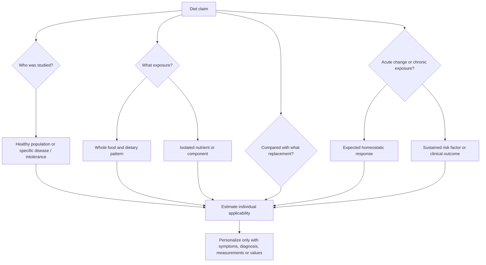

# Nutrition evidence and personalization

Nutrition evidence asks how repeated dietary exposures affect meaningful human outcomes. A useful interpretation moves from isolated nutrients and acute biomarker changes to foods, substitutions, long-term dietary patterns, and the individual's clinical context. This prevents both reductionism—declaring a food healthy or harmful because it contains one molecule—and indiscriminate personalization, in which a real intolerance or disease-specific restriction is projected onto everyone. (@NutritionMadeSimple (Nutrition Made Simple!) — "I Studied Nutrition for 30 Years. Here’s What Actually Matters.", 2026-07-25, [link](https://www.youtube.com/watch?v=T1-5Ic9iiPs))

## A decision framework

### Foods are packages

Foods combine nutrients, physical structure, processing, fermentation products, energy density, contaminants, and social eating context. Saturated fat illustrates why a single component is insufficient: salmon, yogurt, kefir, dark chocolate, and olive oil can contain some saturated fat while showing favorable health associations, whereas high habitual intakes of butter, tallow, or coconut oil are more concerning. This does not make saturated fat irrelevant; it means its type, dose, food matrix, and replacement determine the inference. (@NutritionMadeSimple (Nutrition Made Simple!) — "I Studied Nutrition for 30 Years. Here’s What Actually Matters.", 2026-07-25, [link](https://www.youtube.com/watch?v=T1-5Ic9iiPs))

The same principle prevents nutrient fortification from laundering a poor dietary pattern. Fiber-rich foods are consistently associated with lower cardiovascular disease, cancer, and diabetes risk, but adding isolated fiber to a sugar-rich ultra-processed product does not make it equivalent to legumes, intact whole grains, fruits, vegetables, or nuts. (@NutritionMadeSimple (Nutrition Made Simple!) — "I Studied Nutrition for 30 Years. Here’s What Actually Matters.", 2026-07-25, [link](https://www.youtube.com/watch?v=T1-5Ic9iiPs))

Fiber illustrates why a nutrient category must still be unpacked: viscosity can slow nutrient delivery, fermentability supplies microbial short-chain-fatty-acid production, and less-fermentable material contributes stool bulk. Diversity across legumes, whole grains, produce, nuts, and seeds therefore covers mechanisms that a single isolated additive or repeated food may not. Current targets are about 30 g/day in the UK or 14 g per 1,000 kcal in the US; proposals for 40–50 g/day remain less securely tested against clinical outcomes. (@joinzoe (ZOE) — "You’re obsessing over the wrong thing! The #1 food that cuts disease risk", 2026-07-30, [link](https://www.youtube.com/watch?v=0CWC1GUEzHA)) [[dietary-fiber]]

Lycopene provides a direct test of the package principle. Higher blood lycopene correlates with less arterial plaque, and one randomized trial reported plaque regression with isolated lycopene, but longer-term studies do not show strong independent cardiovascular-outcome benefit. Tomato products have the stronger outcome signal, suggesting that lycopene may contribute within a food matrix rather than acting as a sufficient isolated therapy. A daily serving of a tomato food is reasonable within a healthy pattern; lycopene supplementation should not replace established lipid, blood-pressure, smoking, diet, and activity interventions. (@Physionic (Physionic) — "I analyzed 1,000 Health Studies: Here are 10 Things I Learned", 2026-08-06, [link](https://www.youtube.com/watch?v=sx8MyamJf3g))

Whole fruit, juice, and a packaged sweet illustrate the same matrix principle. Whole fruit supplies fiber, water, micronutrients, and phytochemicals with its sugars; juice removes much of the fiber and concentrates the sugar-containing fraction, while packaged sweets often combine high sugar dose with low satiety and habitual overconsumption. High-glycemic dietary patterns are associated with more persistent acne and with hyperinsulinemia-related findings such as acanthosis nigricans, but this does not establish that ordinary whole-fruit intake or an occasional modest added-sugar exposure independently causes skin disease. Dr Dray's contrarian position is that pattern and excess matter more than total elimination of a naturally occurring ingredient; her reassurance is clinically framed rather than a quantified dose-response review. (@DrDrayzday (Dr Dray) — "Is Sugar Really Bad for Your Skin? | Dermatologist Q&A", 2026-08-09, [link](https://www.youtube.com/watch?v=c0tYCBtxRO4))

Free and intrinsic sugar sharpen that distinction. Intact fruit tissue generally slows delivery relative to pulp, juice, and free sugar, while protein, fat, and fiber within a meal can further change the acute curve. Claims that an ordinary glucose rise is intrinsically inflammatory or directly causes cancer, dementia, or mental illness overreach the transcript's evidence; chronic excess energy, persistent dysglycemia, and dietary displacement are the more defensible pathways. (@joinzoe (ZOE) — "The 5 foods you’re eating every day that are more HARMFUL than sugar", 2026-07-23, [link](https://www.youtube.com/watch?v=yHv2NLaS7kw)) [[free-sugars-and-glycemic-response]]

### Applicability is conditional

Celiac disease, oxalate-stone formation, irritable bowel syndrome, inflammatory bowel disease, diabetes, salt sensitivity, and unusually large cholesterol responses to dietary cholesterol can justify targeted dietary changes. Those restrictions should not be generalized to people without the relevant condition. The source estimates that most people have only a modest cholesterol increase with egg consumption while some hyperrespond substantially; the practical lesson is to use symptoms, diagnosis, and measured response rather than treating population averages or exceptional responders as universal. (@NutritionMadeSimple (Nutrition Made Simple!) — "I Studied Nutrition for 30 Years. Here’s What Actually Matters.", 2026-07-25, [link](https://www.youtube.com/watch?v=T1-5Ic9iiPs))

Personalization also includes filling predictable nutrient gaps. A vegan pattern requires a reliable vitamin B12 source, and people avoiding seafood, dairy, and iodized salt may need to assess iodine intake. Personalization is therefore bounded by nutritional adequacy and clinical evidence, not freedom from all population-level principles. (@NutritionMadeSimple (Nutrition Made Simple!) — "I Studied Nutrition for 30 Years. Here’s What Actually Matters.", 2026-07-25, [link](https://www.youtube.com/watch?v=T1-5Ic9iiPs))

Protein quantity and source illustrate the same boundary. Low-protein longevity prescriptions extrapolate partly from model organisms and growth signaling such as IGF-1, whereas high-protein prescriptions emphasize preservation of muscle with age. The source judges human translation of generalized protein restriction weak, notes that plant protein and fish are associated with lower rather than higher mortality, and places maximal hypertrophy near 1.6 g/kg/day. That does not prove 1.6 g/kg is a longevity optimum: it supports adequate protein—particularly in older, active, or energy-restricted people—while treating food source and the whole dietary pattern as more informative than protein grams alone. (@NutritionMadeSimple (Nutrition Made Simple!) — "Bryan Johnson´s $2M Anti-AgingPlan, Fact-Checked", 2026-06-12, [link](https://www.youtube.com/watch?v=zqDW_Ouz1M0)) [[muscle-strength-and-mortality]]

An expensive longevity menu can therefore be decomposed into ordinary causal inputs. Legumes, whole grains, vegetables, fruit, nuts, seeds, and unsaturated fats increase fiber and nutrient density while displacing refined snacks, sugary drinks, processed meat, and trans fat. A wholly vegan pattern is not established as necessary: observational comparisons discussed in the source found significantly lower mortality among pescatarians, while vegan and vegetarian estimates trended lower without statistical significance. Diet-pattern associations remain vulnerable to confounding, but they support plant-rich quality rather than plant exclusivity as the central health principle. (@NutritionMadeSimple (Nutrition Made Simple!) — "Bryan Johnson´s $2M Anti-AgingPlan, Fact-Checked", 2026-06-12, [link](https://www.youtube.com/watch?v=zqDW_Ouz1M0))

Salt decisions also require measured context. Sodium is essential but need not be supplied as discretionary salt because it occurs in foods; many Western diets provide excess sodium, much of it through ultra-processed food. Individual blood-pressure response varies, while pink and specialty salts remain overwhelmingly sodium chloride and supply nutritionally trivial trace minerals at ordinary doses. For hypertension, a potassium-enriched salt substitute can be evidence-based when medically appropriate, but kidney disease and medications that raise potassium change its safety. (@NutritionMadeSimple (Nutrition Made Simple!) — "Bryan Johnson´s $2M Anti-AgingPlan, Fact-Checked", 2026-06-12, [link](https://www.youtube.com/watch?v=zqDW_Ouz1M0))

### Acute response is not chronic disease

Blood pressure rises during exercise, triglycerides rise after a fat-containing meal, and glucose rises after carbohydrate intake. These are acute homeostatic responses; sustained hypertension, fasting hypertriglyceridemia, or persistent hyperglycemia are chronic risk states. An acute rise can still matter when its magnitude or duration is abnormal, especially in diabetes, but it cannot be equated with disease without context and outcome evidence. (@NutritionMadeSimple (Nutrition Made Simple!) — "I Studied Nutrition for 30 Years. Here’s What Actually Matters.", 2026-07-25, [link](https://www.youtube.com/watch?v=T1-5Ic9iiPs))

### Every comparison is a substitution

Changing one food usually changes another food or total energy intake. Butter may look neutral when compared with refined bread or muffins yet less favorable when replaced by olive oil, brown rice, or steel-cut oats. Claims that a food is good, bad, or neutral are therefore incomplete until the comparator and energy context are specified. (@NutritionMadeSimple (Nutrition Made Simple!) — "I Studied Nutrition for 30 Years. Here’s What Actually Matters.", 2026-07-25, [link](https://www.youtube.com/watch?v=T1-5Ic9iiPs))

### Pattern and cadence dominate isolated events

Macronutrient labels do not specify diet quality. A low-carbohydrate pattern built from salmon, avocado, seeds, nuts, greens, and berries differs biologically from one dominated by bacon, butter, and processed meat; either a high- or low-carbohydrate diet can also be fiber-deficient. Protein quantity is similarly distinct from protein source and displacement: a higher-protein pattern can retain vegetables, whole grains, and fiber while drawing protein from legumes, tempeh, fish, fermented dairy, or lean poultry rather than processed meat. The source's contrarian position is that warnings about low carbohydrate or high protein often confuse the label with poor construction; adequacy, source foods, energy, and replacement are the actionable variables. (@NutritionMadeSimple (Nutrition Made Simple!) — "New York Times Botches Food Advice (Doctor Explains)", 2026-07-18, [link](https://www.youtube.com/watch?v=y3SyUGWOO68))

Unprocessed rolled or steel-cut oats illustrate why internet claims should be tested against human evidence and preparation context. The source reports overwhelmingly favorable human trial and observational findings for cardiometabolic markers, diabetes risk, and mortality, while finding no human evidence of harm from unsweetened, minimally processed oats. This is a source-level synthesis rather than a quantified systematic review, so it supports oats as a reasonable whole-grain staple more strongly than it proves benefit for every person or sweetened oat product. (@NutritionMadeSimple (Nutrition Made Simple!) — "New York Times Botches Food Advice (Doctor Explains)", 2026-07-18, [link](https://www.youtube.com/watch?v=y3SyUGWOO68)) [[dietary-fiber]]

Carbohydrate does not have a unique ability to create body fat independent of total energy balance. Whole carbohydrate foods such as potatoes, oats, rice, legumes, and fruit can be filling, support training, and coexist with fat loss; fat supplies more energy per gram and is readily added through oils, restaurant preparation, and mixed dishes. Max Lugavere’s corrective position is that blanket carbohydrate avoidance can make fat loss harder for some people by replacing satiating foods with more energy-dense fat. This is a rebuttal to carbohydrate exceptionalism, not proof that one macronutrient ratio is optimal for everyone; ketogenic diets can still be clinically or personally useful when sustainable and appropriately monitored. (@maxlugavere (Max Lugavere) — "Carbs Don’t Make You Fat: 10 Health Myths That Need to Die", 2026-08-05, [link](https://www.youtube.com/watch?v=TqcKy8yuc1U)) [[ketogenic-diet-apob-and-atherosclerosis]]

Clock time likewise does not make food intrinsically fattening. Late eating often correlates with distracted eating, alcohol, restaurant food, and energy-dense snacks, so timing can influence intake and sleep without creating a magical cutoff after which calories change identity. One large restaurant meal can erase a modest weekly energy deficit, and posted calorie values are estimates because preparation varies; this makes home cooking and simple restaurant orders useful control strategies, not moral requirements. (@maxlugavere (Max Lugavere) — "Carbs Don’t Make You Fat: 10 Health Myths That Need to Die", 2026-08-05, [link](https://www.youtube.com/watch?v=TqcKy8yuc1U)) [[caloric-restriction-and-meal-timing]]

Ingredient-level fear can also obscure dose and displacement. A product’s energy density, protein and fiber, portion, frequency, and role in the total pattern are usually more decision-relevant than the mere presence of an emulsifier, noncaloric sweetener, or small quantity of seed oil. Lugavere explicitly revises his earlier emphasis on refined seed oils and additives toward a fundamentals-first view. His reassurance that occasional artificially sweetened beverages are benign is stronger than the evidence supplied in the transcript; reverse causation is a real limitation of observational associations, but invoking it does not by itself prove no harm. Water remains the default, while substitution away from sugar-sweetened beverages is the relevant comparison. (@maxlugavere (Max Lugavere) — "Carbs Don’t Make You Fat: 10 Health Myths That Need to Die", 2026-08-05, [link](https://www.youtube.com/watch?v=TqcKy8yuc1U))

Unprocessed red meat supplies protein, iron, zinc, vitamin B12, and creatine, but nutrient density alone does not resolve long-term risk. Lugavere argues that healthy-user confounding and mixed dishes distort observational associations and favors lean red meat within a high-quality diet. The existing evidence framework requires a narrower conclusion: distinguish unprocessed from processed meat, quantify dose and cooking method, specify the replacement food, and consider iron needs, ApoB response, colorectal risk, and the total pattern. His invitation to eat unrestricted amounts is not supported by evidence presented in the transcript and conflicts with the wiki’s precaution around high habitual red-meat exposure. (@maxlugavere (Max Lugavere) — "Carbs Don’t Make You Fat: 10 Health Myths That Need to Die", 2026-08-05, [link](https://www.youtube.com/watch?v=TqcKy8yuc1U)) [[colorectal-cancer-prevention-and-screening]]

Long-term health reflects foods eaten consistently more than an occasional treat. A traditional Mediterranean-style pattern—rich in fruits, vegetables, legumes, whole grains, olive oil, fish or seafood, with some dairy and lean meat and little ultra-processed food—has convergent evidence for lower cardiovascular disease, diabetes, some cancers, mortality, and better mental health. It is a reference pattern rather than a rigid menu and can be adapted to lower-carbohydrate, lower-fat, or vegetarian preferences while maintaining food quality and nutrient adequacy. (@NutritionMadeSimple (Nutrition Made Simple!) — "I Studied Nutrition for 30 Years. Here’s What Actually Matters.", 2026-07-25, [link](https://www.youtube.com/watch?v=T1-5Ic9iiPs))

An evolutionary perspective reaches the same pattern-level conclusion without identifying one ancestral menu. Humans adapted to cooking and to ecologically diverse mixtures of plant and animal foods; appetite and fat storage evolved under variable supply and high acquisition costs, whereas modern engineered foods combine persistent cues with little acquisition effort. Daniel Lieberman’s contrarian framework rejects both a single paleo optimum and moralized accounts of hunger: energy balance remains true, but appetite biology and environment determine whether a deficit can be sustained. (@joinzoe (ZOE) — "Harvard professor: The 3 evolutionary reasons why you can’t lose weight", 2026-08-06, [link](https://www.youtube.com/watch?v=9kXWRFZhj3s)) [[evolutionary-mismatch-and-weight-regulation]]

The source's contrarian position is that many protein, carbohydrate, fat, seed-oil, and fiber disputes ask the wrong unit of analysis. Canola-oil studies summarized there report favorable lipids, triglycerides, liver fat, and observational mortality associations, including among people who cook with it; those human outcomes weigh more heavily than mechanism-only objections about omega-6 content, double bonds, hexane, or erucic acid. Residual confounding remains possible for observational endpoints, so this supports ordinary dietary safety more strongly than it proves a unique benefit. (@NutritionMadeSimple (Nutrition Made Simple!) — "I Studied Nutrition for 30 Years. Here’s What Actually Matters.", 2026-07-25, [link](https://www.youtube.com/watch?v=T1-5Ic9iiPs))

### Foundation before optimization

A useful progression is hierarchical rather than moral. First replace routinely sweetened drinks, then make minimally processed foods convenient, include a satiating protein source at most meals, favor unsaturated over saturated fats, supply fermentable fiber and resistant starch, and only then optimize polyphenols or cooking technique. Each layer acts on a different constraint—liquid calories, spontaneous intake, satiety, lipoproteins, microbial substrates, or heat-generated compounds—so spices and supplements cannot compensate for a weak foundation. The seven-level framing is a teaching heuristic rather than a validated clinical staging system, and the sequence should be adapted to the person's largest exposure and disease risk. (@NutritionMadeSimple (Nutrition Made Simple!) — "The REAL 7 Levels of Eating That Transform Your Health (Backed by Science)", 2026-04-28, [link](https://www.youtube.com/watch?v=U9a4KsG7QNw))

In a controlled ad-libitum feeding trial summarized by the source, an ultra-processed menu led participants to consume about 500 kcal/day more than an unprocessed menu. That supports a causal effect of the tested menus on short-term energy intake, not the conclusion that every processed food is harmful: soy milk, unsweetened yogurt, canned legumes, and other formulated foods can retain favorable composition. Processing classification is therefore a screening cue; energy density, eating rate, protein, fiber, added sugar, sodium, matrix, and the food displaced are the mechanisms to inspect. [[food-label-literacy-and-health-halos]] (@NutritionMadeSimple (Nutrition Made Simple!) — "The REAL 7 Levels of Eating That Transform Your Health (Backed by Science)", 2026-04-28, [link](https://www.youtube.com/watch?v=U9a4KsG7QNw))

Protein supports satiety partly through amino-acid-triggered gut signals including GLP-1, but it is one input among food volume, fiber, energy density, palatability, and eating context. Healthy fats likewise matter chiefly as substitutions: trials summarized in the source found that unsaturated-fat-rich foods and oils improved glycemic markers when they replaced refined starch, added sugar, or saturated fat. These findings support meal construction around intact protein foods and unsaturated fats without implying that more protein or added oil is always better. [[satiety-oriented-diet-design]] [[dietary-fat-quality-and-cardiovascular-risk]] (@NutritionMadeSimple (Nutrition Made Simple!) — "The REAL 7 Levels of Eating That Transform Your Health (Backed by Science)", 2026-04-28, [link](https://www.youtube.com/watch?v=U9a4KsG7QNw))

Cooking method becomes relevant after the pattern is sound. Charring animal flesh can form heterocyclic amines and polycyclic aromatic hydrocarbons; lowering grill temperature or time, precooking, marinating, limiting fat drips onto flame, and removing heavily charred portions reduce formation or exposure. Deep frying raises energy density and can generate acrylamide, oxidized lipids, or trans fats depending on food, oil, temperature, and reuse. These are exposure-reduction measures with mechanistic and intermediate evidence, not proof that lightly grilled food or an occasional fried food produces a measurable individual disease increment. (@NutritionMadeSimple (Nutrition Made Simple!) — "The REAL 7 Levels of Eating That Transform Your Health (Backed by Science)", 2026-04-28, [link](https://www.youtube.com/watch?v=U9a4KsG7QNw))

Protein can influence satiety through more than stomach volume or total energy. A mechanistic study identified the neuronal calcium channel CaV3.1 as a sensor affected by a protein-derived amino acid, with downstream signaling that reduced food intake; the source interprets the ligand as supporting leucine-rich protein choices. Human clinical evidence is sparse, so this pathway is an emerging explanation rather than a basis for a leucine supplement or a guaranteed weight-loss effect. (@Physionic (Physionic) — "I analyzed 1,000 Health Studies: Here are 10 Things I Learned", 2026-08-06, [link](https://www.youtube.com/watch?v=sx8MyamJf3g))

Effective dietary systems can use different macronutrient ratios, eating frequencies, and timing while sharing a common foundation: mostly minimally processed foods, energy intake matched to the goal, sufficient high-quality protein, both soluble and insoluble fiber, varied fruits and non-starchy vegetables, and attention to allergies, food safety, and sustainability. Processing is not itself a binary quality test—yogurt, fermented vegetables, cheese, and whey are processed—so the useful distinction is the food's nutritional function and place in the total pattern. (@drandygalpin (Andy Galpin) — "The Fundamentals of Nutrition, Hydration & Performance Fueling", 2026-08-05, [link](https://www.youtube.com/watch?v=_GEhu3vdL7w))

A rough fiber target is 13–15 g per 1,000 kcal, which corresponds to about 25–30 g at 2,000 kcal. Soluble and insoluble fibers have different water interactions and gastrointestinal effects, so simply maximizing total grams can aggravate diarrhea or constipation in susceptible people. Fruits and vegetables should also be varied in color and preparation: raw, cooked, frozen, chopped, and blended forms trade convenience, digestibility, mineral availability, and preservation of oxidation-sensitive compounds rather than forming a universal best-to-worst hierarchy. (@drandygalpin (Andy Galpin) — "The Fundamentals of Nutrition, Hydration & Performance Fueling", 2026-08-05, [link](https://www.youtube.com/watch?v=_GEhu3vdL7w))

Implementation should proceed from large constraints to small optimizations. First identify and fill obvious nutrient or food-quality gaps, often by adding satiating, nutrient-dense foods that crowd out poorer choices; next adjust energy and macronutrient amounts or food types; only then fine-tune meal timing, supplements, and other tactics. Galpin's distinctive add-before-subtract approach is intended to improve health and adherence before restriction, with immediate removal reserved for known allergy or an obvious repeated harmful pattern. It is a coaching framework rather than comparative trial evidence. (@drandygalpin (Andy Galpin) — "The Fundamentals of Nutrition, Hydration & Performance Fueling", 2026-08-05, [link](https://www.youtube.com/watch?v=_GEhu3vdL7w))

### Gastrointestinal symptoms are not long-term outcomes

Dietary comfort and chronic disease risk answer different questions. A sudden increase from very little fiber to daily legumes and fibrous vegetables can cause bloating and gas before gut ecology and tolerance adapt; the source places this adaptation on an approximate eight-to-ten-week scale and recommends starting low and increasing slowly. Conversely, short-term symptom relief on a low-fiber carnivore diet does not establish colorectal safety because exclusion may reduce fermentable substrates while also removing protective plant foods. (@RenaMalikMD (Rena Malik, M.D.) — "The #1 Food Mistake Raising Young Adults’ Cancer Risk – Are You Guilty?", 2026-08-05, [link](https://www.youtube.com/watch?v=wyuknV4btfE))

Ultra-processed food illustrates addition and displacement simultaneously: additives may alter mucus and microbial function, while low fiber removes substrate for short-chain-fatty-acid production. Processed meat has a stronger colorectal-risk signal than unprocessed red meat; charring and high-temperature cooking are plausible contributors, but gentler cooking or marinating has not been shown to eliminate risk. This evidence belongs at the dietary-pattern level and is developed in [[colorectal-cancer-prevention-and-screening]]. (@RenaMalikMD (Rena Malik, M.D.) — "The #1 Food Mistake Raising Young Adults’ Cancer Risk – Are You Guilty?", 2026-08-05, [link](https://www.youtube.com/watch?v=wyuknV4btfE))

## Practical implications

- **Daily: build the pattern around legumes, whole grains, vegetables, fruit, nuts, seeds, and unsaturated fats, with fish, fermented dairy, or lean meat according to preference — moderate-to-strong pattern evidence.** Plant-rich does not require plant-exclusive; remove sugary drinks, processed meats, fried fast foods, and low-satiety snacks before optimizing minor details. (@NutritionMadeSimple (Nutrition Made Simple!) — "Bryan Johnson´s $2M Anti-AgingPlan, Fact-Checked", 2026-06-12, [link](https://www.youtube.com/watch?v=zqDW_Ouz1M0))
- **For older, active, or energy-restricted adults: ensure adequate protein and distribute useful sources through the day — strong for supporting muscle, uncertain for a single longevity-optimal dose.** Roughly 1.6 g/kg/day is a defensible hypertrophy-oriented target for many active adults, not a universal prescription; adjust for body size, goals, tolerance, and kidney or other clinical constraints. (@NutritionMadeSimple (Nutrition Made Simple!) — "Bryan Johnson´s $2M Anti-AgingPlan, Fact-Checked", 2026-06-12, [link](https://www.youtube.com/watch?v=zqDW_Ouz1M0))
- **When managing blood pressure: review total sodium and measure response rather than buying premium salt for trace minerals — strong for sodium reduction in salt-sensitive hypertension, weak for specialty-salt benefits.** Consider potassium salt only when kidney function and medications make it safe. (@NutritionMadeSimple (Nutrition Made Simple!) — "Bryan Johnson´s $2M Anti-AgingPlan, Fact-Checked", 2026-06-12, [link](https://www.youtube.com/watch?v=zqDW_Ouz1M0))
- **At each diet review: inspect staple foods, fiber, protein sources, fat quality, and total energy before judging a low-carb, high-carb, or high-protein label — strong framework, moderate for any specific macronutrient pattern.** Build from fruits, vegetables, whole grains or other fiber-rich plants, legumes, nuts and seeds, fish, fermented dairy if tolerated, and appropriate lean proteins; adapt amounts to preference, activity, age, and clinical needs. (@NutritionMadeSimple (Nutrition Made Simple!) — "New York Times Botches Food Advice (Doctor Explains)", 2026-07-18, [link](https://www.youtube.com/watch?v=y3SyUGWOO68))

- **For fat loss: choose a sustainable energy deficit and retain filling carbohydrate foods if they improve adherence and training — strong for energy balance, moderate for individual food selection.** Audit restaurant meals, oils, drinks, and weekend intake before blaming carbohydrate as a class. (@maxlugavere (Max Lugavere) — "Carbs Don’t Make You Fat: 10 Health Myths That Need to Die", 2026-08-05, [link](https://www.youtube.com/watch?v=TqcKy8yuc1U))
- **When choosing red meat: prefer unprocessed, lean portions within a varied pattern and individualize to iron status and cardiometabolic risk — moderate.** Do not infer unlimited safety from nutrient density or treat observational confounding as proof of no risk. (@maxlugavere (Max Lugavere) — "Carbs Don’t Make You Fat: 10 Health Myths That Need to Die", 2026-08-05, [link](https://www.youtube.com/watch?v=TqcKy8yuc1U))

- **At most meals: choose a minimally processed, plant-rich pattern with varied protein sources and unsaturated fats — strong for cardiometabolic risk reduction.** Judge foods by the whole package and habitual pattern, not one feared or celebrated molecule. (@NutritionMadeSimple (Nutrition Made Simple!) — "I Studied Nutrition for 30 Years. Here’s What Actually Matters.", 2026-07-25, [link](https://www.youtube.com/watch?v=T1-5Ic9iiPs))
- **Whenever evaluating a nutrition claim: ask who, compared with what, over what duration, and with which endpoint — strong as an evidentiary method.** Give chronic clinical outcomes more weight than acute spikes or untested biochemical stories. (@NutritionMadeSimple (Nutrition Made Simple!) — "I Studied Nutrition for 30 Years. Here’s What Actually Matters.", 2026-07-25, [link](https://www.youtube.com/watch?v=T1-5Ic9iiPs))
- **At routine care or after a meaningful dietary change: use relevant blood pressure, lipid, glucose, symptom, or deficiency measurements to personalize — moderate-to-strong.** Test when a result can change a decision; do not use continuous measurement to invent pathology in a healthy person. (@NutritionMadeSimple (Nutrition Made Simple!) — "I Studied Nutrition for 30 Years. Here’s What Actually Matters.", 2026-07-25, [link](https://www.youtube.com/watch?v=T1-5Ic9iiPs))
- **Periodically: audit predictable nutrient gaps and overall adherence — strong for known deficiencies, moderate for the cadence.** Occasional discretionary foods need not trigger compensatory restriction when the habitual pattern remains sound. (@NutritionMadeSimple (Nutrition Made Simple!) — "I Studied Nutrition for 30 Years. Here’s What Actually Matters.", 2026-07-25, [link](https://www.youtube.com/watch?v=T1-5Ic9iiPs))
- **When changing a diet: correct clear quality or nutrient gaps first, adjust amounts second, and fine-tune timing or supplements last — moderate coaching evidence.** Account deliberately for liquid calories because oils and sweetened drinks can add substantial energy with little satiety, while liquid calories may be useful when higher intake is the goal. (@drandygalpin (Andy Galpin) — "The Fundamentals of Nutrition, Hydration & Performance Fueling", 2026-08-05, [link](https://www.youtube.com/watch?v=_GEhu3vdL7w))
- **When increasing fiber from a low baseline: increase portions gradually over several weeks and judge adaptation separately from alarm symptoms — moderate.** Use a varied whole-food pattern rather than assuming that either transient bloating or transient symptom relief predicts long-term colorectal health. (@RenaMalikMD (Rena Malik, M.D.) — "The #1 Food Mistake Raising Young Adults’ Cancer Risk – Are You Guilty?", 2026-08-05, [link](https://www.youtube.com/watch?v=wyuknV4btfE))
- **After an unusually carbohydrate-rich meal: an easy ten-minute walk within roughly 20–30 minutes can lower the acute glucose excursion — moderate for the biomarker, unproven here for long-term outcomes.** Meal structure and the habitual pattern remain more important than repeatedly compensating for a poor default. (@joinzoe (ZOE) — "The 5 foods you’re eating every day that are more HARMFUL than sugar", 2026-07-23, [link](https://www.youtube.com/watch?v=yHv2NLaS7kw)) [[free-sugars-and-glycemic-response]]

## Gaps & open questions

- What protein intake and source mix best balances muscle preservation, cardiometabolic outcomes, cancer risk, and healthy longevity across age and activity levels?
- How much of the observed advantage of plant-rich patterns is causal, and which substitutions account for it?
- Which people benefit from potassium-enriched salt, and how should kidney function and interacting medication risks be screened?
- How do minimally processed carbohydrate and fat sources compare for long-term appetite, adherence, training performance, and body composition at equal energy and protein?
- At what dose does unprocessed red meat materially change cardiovascular or colorectal outcomes, and how do replacement food and cooking method modify that effect?
- What are the long-term outcomes of replacing sugar-sweetened drinks with noncaloric sweeteners versus water?

- Which food-matrix properties explain outcomes beyond measured nutrients, and how should they be represented in trials?
- When do postprandial biomarker excursions independently predict disease after chronic levels are considered?
- How can N-of-1 responses be measured without mistaking ordinary biological variability for intolerance?
- Which Mediterranean-pattern components are essential, and which can be substituted across cultures without losing benefit?
- What outcome evidence would justify concern about culinary seed oils despite generally favorable human biomarker and observational data?
- Which add-before-subtract coaching sequences improve long-term adherence compared with restriction-first counseling?
- How should fiber type and preparation be personalized for gastrointestinal function without sacrificing dietary variety?
- At what dose and processing level do fruit-based smoothies materially differ from intact fruit for satiety, glycemic exposure, acne, and long-term metabolic outcomes?
- Which fiber types and escalation schedules best support microbial adaptation in people with gastrointestinal sensitivity?
- Does CaV3.1-mediated amino-acid sensing materially explain human meal satiety, and which intact protein foods engage it at ordinary doses?
- Which tomato-matrix components or substitutions explain stronger cardiovascular evidence for foods than isolated lycopene?
- Does a fixed foundation-to-optimization sequence improve adherence or clinical outcomes compared with targeting each person's largest risk first?
- Which properties of ultra-processed trial menus—energy density, texture, eating rate, palatability, protein, fiber, or additives—caused the higher spontaneous intake?
- How much do household marinating, precooking, and lower-temperature grilling reduce actual carcinogen exposure and long-term risk?

## Related

[[visceral-and-ectopic-fat]] · [[dietary-fiber]] · [[free-sugars-and-glycemic-response]] · [[food-label-literacy-and-health-halos]] · [[food-patterns-and-gut-ecology]] · [[evolutionary-mismatch-and-weight-regulation]] · [[resistant-starch]] · [[olive-oil-and-cognitive-aging]] · [[omega-3-fatty-acids]] · [[supplement-evidence-and-safety]] · [[nattokinase]] · [[caloric-restriction-and-meal-timing]] · [[ketogenic-diet-apob-and-atherosclerosis]] · [[performance-nutrition-and-hydration]] · [[muscle-strength-and-mortality]] · [[microplastics-exposure-and-measurement]] · [[colorectal-cancer-prevention-and-screening]] · [[practice-playbook]] · [[dr-dray]]
