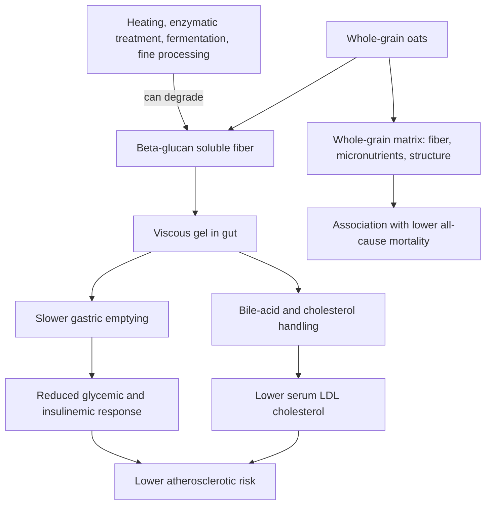

# Oats and cardiovascular health

Oats are a whole-grain cereal whose health effects run mainly through their food matrix — most distinctively the viscous, fermentable soluble fiber beta-glucan — rather than through any single nutrient. "Oats" is not one exposure: rolled, whole, steel-cut, Scottish, and instant preparations differ in processing, and a whole-grain oat product is one retaining all three parts of the kernel (bran, endosperm, germ). The epidemiological literature examines primarily oatmeal and whole-grain oats. (@Physionic (Physionic) — "The Link Between Oats and Heart Disease: Harm or Help?", 2026-08-31, [link](https://www.youtube.com/watch?v=c0Hm9tQ9zuc))

## What the cohort evidence shows

Across the large prospective cohorts reviewed by the source (including US health-professional cohorts and the Danish Diet, Cancer and Health cohort), every study indicated a beneficial or neutral association between oat consumption and cardiovascular health — none showed harm. Specific patterns: (@Physionic (Physionic) — "The Link Between Oats and Heart Disease: Harm or Help?", 2026-08-31, [link](https://www.youtube.com/watch?v=c0Hm9tQ9zuc))

- **Coronary heart disease incidence** falls with increasing oatmeal intake in a dose-shaped way, with the studied range capped at two or more servings per week — leaving the top of the dose–response curve (daily intake) unmeasured. Whole-oat consumption shows similar associations, stronger in men than women.
- **Coronary heart disease mortality** shows the reverse sex pattern: a mild risk reduction in women, while the estimate in men crosses the null. The source attributes this instability to statistical power — only a few hundred coronary deaths accrued, versus thousands of all-cause deaths — and speculates (labeled as speculation) that an order of magnitude more events would likely yield a clear protective signal.
- **All-cause mortality** shows the most robust association: reduced risk in both men and women at all intakes above the lowest consumption level. The cohort design cannot say how much of this runs through cardiovascular disease versus other pathways.

On confounding: the underlying studies adjusted for physical activity, body weight, calorie intake, family history, insulin resistance, and other dietary factors across several populations, so a confounder would have to be unique yet widespread across tens of thousands of people in different regions. The source's calibrated conclusion is that a causal role for oats is a good bet, though not foolproof. Under this wiki's evidence hierarchy these remain observational associations — the same class of evidence, with the same limits, as the food-specific cohorts in [[cheese-and-mortality]] and [[nut-consumption-and-mortality]]. (@Physionic (Physionic) — "The Link Between Oats and Heart Disease: Harm or Help?", 2026-08-31, [link](https://www.youtube.com/watch?v=c0Hm9tQ9zuc))

## Mechanism: beta-glucan viscosity

Randomized trials cited in the source's references anchor the mechanism in humans: the physicochemical properties of oat beta-glucan — its viscosity in particular — determine its ability to lower serum LDL cholesterol, and increasing beta-glucan viscosity in a breakfast meal slows gastric emptying and reduces glycemic and insulinemic responses (without changing appetite, food intake, or ghrelin/PYY in healthy adults). This makes viscosity, not the word "oats" on a label, the active property — and viscosity is exactly what processing can destroy. (@Physionic (Physionic) — "The Link Between Oats and Heart Disease: Harm or Help?", 2026-08-31, [link](https://www.youtube.com/watch?v=c0Hm9tQ9zuc))

## Processing

Heating, enzymatic treatment, and fermentation can degrade the beta-glucan fiber, so a heavily processed oat product may deliver less of the mechanism even when nominally whole-grain. The cohorts did not directly compare processing levels, so this is a mechanism-based caution, not an outcome-proven distinction: benefits are unlikely to vanish with processing, but may be reduced relative to minimally processed forms (steel-cut oats, whole oat groats, large-flake rolled oats; old-fashioned rather than instant oatmeal). (@Physionic (Physionic) — "The Link Between Oats and Heart Disease: Harm or Help?", 2026-08-31, [link](https://www.youtube.com/watch?v=c0Hm9tQ9zuc))

The ZOE panel's guidance converges on the same processing hierarchy from the nutrition side: steel-cut and plain traditional oats (ingredient list reading simply "oats") are endorsed as micronutrient-rich, relatively high-protein for a cereal, and cholesterol-lowering at regular-porridge beta-glucan doses, while flavored instant sachets with added sugars, emulsifiers, and other additives are excluded from the health claim. (@joinzoe (ZOE) — "Tim Spector: They're fooling you! The 3 nutrition scams he wants banned | Live Audience Q&A", 2026-06-25, [link](https://www.youtube.com/watch?v=g3J4phCrvvw))

## Glycemic response and preparation

Cooked oats can produce large glucose spikes in susceptible individuals even when minimally processed — the episode's host reports this from repeated CGM wear. Two mitigations are offered: soaking oats overnight instead of cooking (Federica Amati's account is that soaking avoids the starch gelatinization that cooking causes, leaving starches less rapidly available while improving availability of some micronutrients), and treating oats as a foundation rather than a stand-alone meal — adding nuts, seeds, and nut butters so fat and protein blunt the glucose excursion and extend fullness. The overnight-oats glycemic claim is mechanistically plausible and consistent with starch chemistry but is presented without a controlled comparison; individual CGM responses are anecdote-tier. (@joinzoe (ZOE) — "Tim Spector: They're fooling you! The 3 nutrition scams he wants banned | Live Audience Q&A", 2026-06-25, [link](https://www.youtube.com/watch?v=g3J4phCrvvw)) [[free-sugars-and-glycemic-response]] [[resistant-starch]]

## Pesticide residue

Tim Spector identifies non-organic oat products as his top organic-buying priority, on the claim that glyphosate — used on wet crops like oats and rye both against weeds and to dry the crop before harvest — leaves the highest residues among common foods, with some non-organic breakfast cereals carrying what he calls excessive levels. The factual core (glyphosate desiccation of oats; residue findings in consumer-organization testing of oat cereals) is real; the health significance is contested, since detected residues have generally fallen below regulatory safety limits and no human outcome evidence ties oat-product residues to harm. His accompanying triage — thin-skinned produce eaten regularly (berries, especially strawberries) worth buying organic; thick-skinned produce (oranges, avocados) not worth it; eating non-organic produce still better than skipping produce, with frozen organic berries as the affordable middle path (Amati) — is a reasonable exposure heuristic, recorded as attributed expert opinion rather than an evidence-graded recommendation. (@joinzoe (ZOE) — "Tim Spector: They're fooling you! The 3 nutrition scams he wants banned | Live Audience Q&A", 2026-06-25, [link](https://www.youtube.com/watch?v=g3J4phCrvvw))

## Practical implications

- **Weekly: a serving of oatmeal or whole-grain oats two or more times per week — moderate evidence (consistent, well-adjusted cohort associations for coronary disease incidence and all-cause mortality; no outcome RCTs).** The source's synthesis-level best guess, offered as such because studies measured intake differently, is roughly 50–75 g dry oats per serving, with possibly greater benefit above twice weekly — the studied range simply ends there. (@Physionic (Physionic) — "The Link Between Oats and Heart Disease: Harm or Help?", 2026-08-31, [link](https://www.youtube.com/watch?v=c0Hm9tQ9zuc))
- **Prefer minimally processed forms — steel-cut, groats, large-flake rolled, old-fashioned oatmeal over instant — limited evidence (mechanistic, viscosity-based; not directly tested against outcomes).** Do not treat processed oat products as worthless; treat them as probably delivering less. (@Physionic (Physionic) — "The Link Between Oats and Heart Disease: Harm or Help?", 2026-08-31, [link](https://www.youtube.com/watch?v=c0Hm9tQ9zuc))
- **For LDL lowering specifically, choose products whose beta-glucan is high-viscosity — moderate evidence from randomized trials of beta-glucan physicochemistry.** This is a biomarker outcome; it supports but does not by itself establish event reduction. ([[lipoprotein-retention-and-atherogenesis]]) (@Physionic (Physionic) — "The Link Between Oats and Heart Disease: Harm or Help?", 2026-08-31, [link](https://www.youtube.com/watch?v=c0Hm9tQ9zuc))

- **If oats spike your glucose or you want a no-cook option: soak overnight and top with nuts, seeds, or nut butter — limited evidence (mechanism plus expert practice; no controlled trial cited), low cost and risk.** (@joinzoe (ZOE) — "Tim Spector: They're fooling you! The 3 nutrition scams he wants banned | Live Audience Q&A", 2026-06-25, [link](https://www.youtube.com/watch?v=g3J4phCrvvw))
- **If buying organic selectively, oat products and frequently eaten thin-skinned produce are the defensible priorities — weak evidence (exposure heuristic; no demonstrated health outcome), and never a reason to eat less produce.** (@joinzoe (ZOE) — "Tim Spector: They're fooling you! The 3 nutrition scams he wants banned | Live Audience Q&A", 2026-06-25, [link](https://www.youtube.com/watch?v=g3J4phCrvvw))

## Gaps & open questions

- Does daily oat intake outperform twice-weekly? The cohort dose–response range is capped at two or more servings per week.
- Would the coronary-mortality association in men become protective with more accrued events, as the all-cause data suggest, or is the sex difference real?
- How much of the all-cause-mortality association runs through cardiovascular disease versus other pathways?
- How much benefit survives industrial processing — instant oatmeal, oat flour, oat-based ultra-processed products — in outcome terms?
- What do substitution analyses show for replacing specific breakfast foods (eggs, toast, yogurt) with oatmeal, and do oats help in established coronary disease? (The source defers these to its full analysis.)
- Does overnight soaking measurably lower the glycemic response versus cooked oats at matched doses?
- Do glyphosate residues at levels found in non-organic oat products carry any human health risk, and does buying organic change any measurable outcome?

## Related

[[dietary-fiber]] · [[free-sugars-and-glycemic-response]] · [[nutrition-evidence-and-personalization]] · [[lipoprotein-retention-and-atherogenesis]] · [[dietary-fat-quality-and-cardiovascular-risk]] · [[cheese-and-mortality]] · [[nut-consumption-and-mortality]] · [[food-patterns-and-gut-ecology]] · [[satiety-oriented-diet-design]] · [[resistant-starch]] · [[tim-spector]] · [[practice-playbook]]
