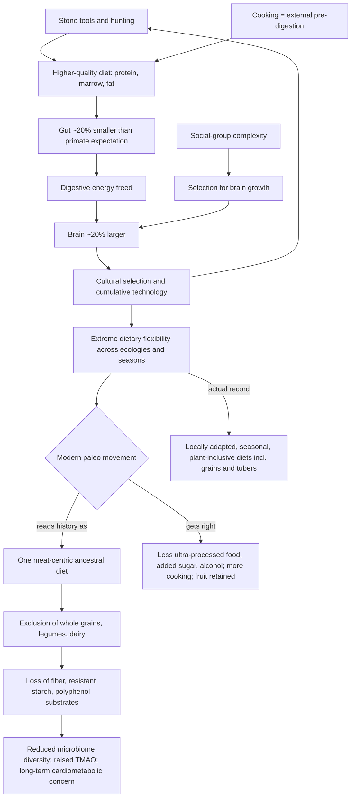

# Paleolithic diets and modern paleo

The Paleolithic ("old stone age") is the period beginning with the first stone tools in the archaeological record, currently dated to about 3.3 million years ago, inside a roughly seven-million-year hominin trajectory since the last common ancestor with chimpanzees; Homo sapiens itself appears in the fossil record only about 300,000 years ago, with the evidence now favoring a pan-African rather than single-locality origin. Two distinct questions get conflated under the word "paleo": what Paleolithic hominins actually ate — an archaeological question with increasingly good answers — and whether the modern commercial paleo diet, codified by a 2002 book, improves health. The archaeological answer undermines the commercial one: there was no single paleo diet to return to. (@joinzoe (ZOE) — "The evolution expert: Are you really eating like our ancestors? Ancient evidence vs modern diets", 2026-07-09, [link](https://www.youtube.com/watch?v=SP6G7V2oGQ4))

## How ancient diets are reconstructed

Meat eating is established by cut marks from stone tools on animal bone, distinguishable under a microscope from hoof damage or trampling and traceable back nearly two million years. Plant eating is established mainly from dental calculus — the mineralized build-up on teeth — whose isotopic and chemical signatures reveal grasses, sedges, and other plant foods, and can even suggest self-medication (poplar bark, the base ingredient family of aspirin, in Neanderthal remains). The same chemical-signature methods that track mammoth herd migrations across Europe can track hominin mobility and local dietary adaptation. Burnt seeds preserved in hearth ashes at sites such as Gesher Benot Ya'aqov show that plants, not just meat, were cooked; hearths at Beeches Pit in England date to roughly 400,000–450,000 years ago. (@joinzoe (ZOE) — "The evolution expert: Are you really eating like our ancestors? Ancient evidence vs modern diets", 2026-07-09, [link](https://www.youtube.com/watch?v=SP6G7V2oGQ4))

## There was no single Paleolithic diet

Reconstructed diets vary radically by ecology and season. Neanderthals at the Belgian cave of Spy show a very high-nitrogen, meat-heavy trophic signature; Neanderthals in Spain show almost no meat, eating mushrooms, moss, and grasses; Neanderthals at Gibraltar exploited a marine diet of shellfish and occasionally dolphin and seal. The popular ancestors-ate-only-meat image traces to an early isotope study placing Neanderthals at a higher protein trophic level than hyenas, amplified by caveman iconography originally constructed to depict human ancestors as less evolved; later evidence added the plant, seasonal, and regional components. Whole grains were consumed long before agriculture — Neanderthals appear to have eaten them at least ~60,000 years ago, and Australopithecine and Paranthropine diets included sedges and underground storage organs some 3 million years ago. Dairy is the genuinely recent food, entering regular consumption after ~10,000 years ago with farming — yet many human populations subsequently evolved lactase persistence, which is itself evidence that evolution did not stop at the Paleolithic. James Cole's methodological caution applies throughout: "absence of evidence is not evidence of absence." (@joinzoe (ZOE) — "The evolution expert: Are you really eating like our ancestors? Ancient evidence vs modern diets", 2026-07-09, [link](https://www.youtube.com/watch?v=SP6G7V2oGQ4))

Cannibalism illustrates how unrepresentative "eat like your ancestors" reasoning can get: butchery-positioned cut marks on hominin bones recur persistently across a small fossil record going back almost a million years. Cole's calorie-value work — human muscle yields roughly 30,000 kcal against about 200,000 kcal for a horse — argues the practice was not primarily nutritional, since far larger prey was being taken in the same layers. (@joinzoe (ZOE) — "The evolution expert: Are you really eating like our ancestors? Ancient evidence vs modern diets", 2026-07-09, [link](https://www.youtube.com/watch?v=SP6G7V2oGQ4))

## The expensive-tissue trade-off and cooking

Human gut anatomy is the deepest evidence for dietary flexibility. As primates we "should" have large gorilla-like fermentation guts; instead human stomachs run about 20% smaller and brains about 20% larger than expected for a primate of our size. The expensive-tissue hypothesis (Aiello and Wheeler, ~30 years old and still the working frame) proposes a coupled trade: as diet quality rose — first protein and marrow accessed with stone tools, with a later refinement emphasizing fat's higher energy yield — less energy was needed for digestion, freeing energy for brain growth that social-complexity pressures were selecting for. Transitional fossils support the sequence: Australopith rib-cage shape already suggests gut reduction alongside bipedality. Cooking then acts as external pre-digestion — it makes protein, carbohydrate, and some micronutrients easier to absorb — and fire brought coupled non-dietary benefits: extended usable hours, predator protection, and a social focus where foraged food was processed and shared. Fire appears, disappears, and is rediscovered several times in the record rather than arriving once. Ethnographic work with contemporary indigenous communities suggests roughly 4–5 hours daily sufficed for food acquisition, with substantial time in shared processing and social life — the communal-meal structure, more than any macronutrient ratio, may be the most transferable feature of ancestral eating. (@joinzoe (ZOE) — "The evolution expert: Are you really eating like our ancestors? Ancient evidence vs modern diets", 2026-07-09, [link](https://www.youtube.com/watch?v=SP6G7V2oGQ4)) [[evolutionary-mismatch-and-weight-regulation]]

## The modern paleo diet: right problem, wrong solution

The modern paleo diet (a 1970s "caveman diet" precursor; the influential 2002 book; later radicalized offshoots in keto and carnivore) diagnoses the modern food environment as making people sick — a diagnosis Federica Amati credits as ahead of its time on added sugars and ultra-processed foods — but, in her phrase, "they got the right problem but the wrong solution." The template centers fish, meat, fruits, nuts, and seeds; eliminates dairy, whole grains, and legumes; excludes alcohol and added sugar; and typically prescribes protein in excess of 2 g/kg body weight daily, implying meat or fish at every meal. Its defensible features: whole-food emphasis, ultra-processed-food reduction, alcohol removal, added-sugar avoidance, forced reconnection with home cooking, and — unlike its keto/carnivore descendants — retention of whole fruit, correctly distinguishing intrinsic from free sugars. [[free-sugars-and-glycemic-response]] (@joinzoe (ZOE) — "The evolution expert: Are you really eating like our ancestors? Ancient evidence vs modern diets", 2026-07-09, [link](https://www.youtube.com/watch?v=SP6G7V2oGQ4))

Its exclusions rest on bad history and bad biochemistry. Historically, whole grains and tuber-like sedges were eaten deep into the Paleolithic, and the meat-at-every-meal picture overstates hunting success — catching a large animal was not an every-meal event. Biochemically, the lectin argument against legumes is misinformation as a chronic-disease claim: lectins and phytates are deactivated by proper soaking and cooking (tinned and jarred pulses arrive already cooked), and the real risk is limited to acute vomiting and diarrhea from undercooked pulses. Amati's position is blunt — the claimed link between lectins and chronic health conditions does not exist — and the excluded foods are precisely those with strong evidence of benefit: whole-grain intake around 90 g/day associates with up to 25% lower cardiovascular mortality in dietary-pattern data, and whole grains and legumes supply the fibers, resistant starches, and polyphenols on which gut-microbiome composition and function depend. [[dietary-fiber]] [[oats-and-cardiovascular-health]] [[food-patterns-and-gut-ecology]] (@joinzoe (ZOE) — "The evolution expert: Are you really eating like our ancestors? Ancient evidence vs modern diets", 2026-07-09, [link](https://www.youtube.com/watch?v=SP6G7V2oGQ4))

Longer-term evidence points the wrong way for strict adherence. Long-term paleo eating is associated with increased serum TMAO, a gut-microbiome-derived metabolite associated with heart disease (European Journal of Clinical Nutrition cohort comparison, cited by the source); and in a trial in postmenopausal women with obesity, the paleo diet outperformed a standard American-style diet at 6 months but participants had returned to baseline by 24 months — the source's reading is that it is not a sustainable long-term intervention and that long-term adherence carries plausible harm to gut microbiome and cardiometabolic risk. These are association- and single-trial-level claims, not settled outcome evidence, but they run against the diet's health framing. A related trap is red-meat conflation: the source describes fresh red meat occasionally as compatible with a healthy diet while processed meat (bacon, sausages, ham — and health-halo products like jerky) carries measurable cancer-risk increases, with a source-quoted figure of up to 70% higher colorectal-cancer risk per daily portion that should be treated as a speaker's estimate pending verification against the underlying literature; the wiki's colorectal page carries the established dose-response separately. [[colorectal-cancer-prevention-and-screening]] [[heme-iron-and-colorectal-cancer]] (@joinzoe (ZOE) — "The evolution expert: Are you really eating like our ancestors? Ancient evidence vs modern diets", 2026-07-09, [link](https://www.youtube.com/watch?v=SP6G7V2oGQ4))

Two further marketing corrections. Grass-fed beef differs only modestly in nutrient profile from conventional: its omega-3 content is small (comparable to a walnut's) and is ALA rather than the marine DHA/EPA, so the health premium is largely marketing even where the welfare case stands; and wild or extensively raised game like venison is closer in composition to hunted ancestral meat than any sedentary domestic cow. Nose-to-tail eating has ancestral precedent (marrow extraction, whole-carcass use, selective hunting of prime-age adults), but the modern organ-meat version carries a modern caveat: liver is where vitamin A (with real poisoning risk at regular high intake), PFAS "forever chemicals," and veterinary antibiotic residues concentrate. On fasting, the archaeological record cannot resolve daily meal timing at all; the source's modern-evidence position (ZOE's Big IF study and others) is that a 12–14-hour overnight fast supports circadian alignment, with flexible day-to-day intake rather than rigid protocols. [[caloric-restriction-and-meal-timing]] [[sleep-quality-and-circadian-alignment]] (@joinzoe (ZOE) — "The evolution expert: Are you really eating like our ancestors? Ancient evidence vs modern diets", 2026-07-09, [link](https://www.youtube.com/watch?v=SP6G7V2oGQ4))

What a historically honest paleo principle would actually prescribe, per both experts: local, seasonal, maximally varied whole foods — humans once ate thousands of plant species against a few hundred now — prepared and shared socially, with nothing about eliminating the grain, legume, and (for lactase-persistent populations) dairy foods our ancestors demonstrably ate or adapted to. Ancestral lifestyle is also no health guarantee: most Paleolithic individuals died young, so their practices are a starting hypothesis, never an authority. (@joinzoe (ZOE) — "The evolution expert: Are you really eating like our ancestors? Ancient evidence vs modern diets", 2026-07-09, [link](https://www.youtube.com/watch?v=SP6G7V2oGQ4)) [[nutrition-evidence-and-personalization]]

## Practical implications

- **If using paleo as an entry ramp: keep the removals (ultra-processed foods, added sugar, alcohol, ready meals) and the cooking habit, but do not adopt the grain, legume, and dairy exclusions — moderate; the excluded food groups carry some of nutrition's strongest pattern evidence.** Awareness-then-crowding-out is the sustainable route: identify ultra-processed items in the kitchen, build meals around foods to eat more of, and let UPF products lose their place. (@joinzoe (ZOE) — "The evolution expert: Are you really eating like our ancestors? Ancient evidence vs modern diets", 2026-07-09, [link](https://www.youtube.com/watch?v=SP6G7V2oGQ4))
- **Daily: include whole grains and properly cooked legumes rather than fearing them — strong for the pattern association (whole-grain cardiovascular-mortality data), strong against the lectin chronic-disease claim.** Cook or buy pre-cooked pulses; the acute-toxicity concern applies only to undercooked beans. [[dietary-fiber]] (@joinzoe (ZOE) — "The evolution expert: Are you really eating like our ancestors? Ancient evidence vs modern diets", 2026-07-09, [link](https://www.youtube.com/watch?v=SP6G7V2oGQ4))
- **Weekly: pursue plant variety (the source's 30-plants-a-week heuristic) and seasonal rotation — moderate; the diversity target is a heuristic from microbiome research, not an outcome-trial threshold.** [[food-patterns-and-gut-ecology]]
- **Do not sustain a strict paleo pattern long-term expecting cardiometabolic benefit — moderate caution; TMAO elevation and the 24-month regression are association- and single-trial-level but directionally consistent with the mechanism of removing microbiome substrates.** (@joinzoe (ZOE) — "The evolution expert: Are you really eating like our ancestors? Ancient evidence vs modern diets", 2026-07-09, [link](https://www.youtube.com/watch?v=SP6G7V2oGQ4))
- **Keep processed meat out of the routine diet regardless of its packaging as a health food — strong direction (established colorectal association), with the specific per-portion figure in this source unverified.** Fresh red meat occasionally, preferring wild or extensively raised sources where practical, is the bounded alternative. [[colorectal-cancer-prevention-and-screening]]
- **Treat organ-meat maximalism cautiously — moderate.** Liver is nutrient-dense but concentrates vitamin A, PFAS, and antibiotic residues; regular high intake risks vitamin A toxicity. (@joinzoe (ZOE) — "The evolution expert: Are you really eating like our ancestors? Ancient evidence vs modern diets", 2026-07-09, [link](https://www.youtube.com/watch?v=SP6G7V2oGQ4))
- **A 12–14-hour overnight fast is a reasonable default eating window — moderate (modern intervention data, not archaeology).** Flexibility beats rigidity; day-to-day variation in intake is physiologically normal. [[caloric-restriction-and-meal-timing]]
- **Recreate the social layer: prepare and share meals with others when possible — emerging as a specific health intervention, but convergent with the well-being and adherence literature.** [[relationship-maintenance-and-friendship]]

## Gaps & open questions

- Can compositional differences between wild game and domestic beef be tied to differential human health outcomes in controlled comparisons?
- Does the paleo-associated TMAO elevation translate into measurable cardiovascular events, and is it reversible on reintroducing grains and legumes?
- What did Paleolithic meal timing and eating frequency actually look like? The archaeological record currently cannot resolve daily-scale behavior at all.
- How much of paleo's short-term benefit (6-month trial signal) is explained by UPF removal, alcohol removal, and cooking rather than the exclusions?
- Did gut length and compartment proportions shrink together in hominin evolution, or differentially across stomach, small intestine, and colon? Cole flagged his all-shrink-together reading as open to correction, and the answer matters for fermentation-capacity claims.
- Which populations, if any, are better served by dairy exclusion given the global distribution of lactase persistence?

## Related

[[evolutionary-mismatch-and-weight-regulation]] · [[nutrition-evidence-and-personalization]] · [[dietary-fiber]] · [[food-patterns-and-gut-ecology]] · [[free-sugars-and-glycemic-response]] · [[oats-and-cardiovascular-health]] · [[colorectal-cancer-prevention-and-screening]] · [[heme-iron-and-colorectal-cancer]] · [[caloric-restriction-and-meal-timing]] · [[ketogenic-diet-apob-and-atherosclerosis]] · [[nutritional-psychiatry]] · [[practice-playbook]]
