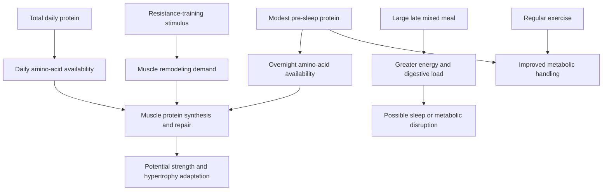

# Pre-sleep protein feeding

Pre-sleep protein feeding is the deliberate consumption of a modest, protein-dominant serving shortly before sleep. It should be separated from late consumption of a large mixed meal: dose, macronutrient composition, total daily intake, exercise status, and the outcome being measured all change the inference. The principal rationale is to supply amino acids during the overnight interval and, secondarily, to make a daily protein target easier to reach. (@drandygalpin (Andy Galpin) — "The Truth About Eating Before Bed | Dr. Michael Ormsbee & Dr. Andy Galpin", 2026-08-01, [link](https://www.youtube.com/watch?v=fOeZrm7LlZs))

## Mechanism and hierarchy of effects

Dietary protein is digested into amino acids, absorbed, and made available for tissue turnover. Because sleep creates a long interval without food, protein consumed before bed can raise overnight amino-acid availability and muscle protein synthesis. This is a timing mechanism, but it sits below total daily protein and resistance training in the causal hierarchy: a bedtime serving cannot compensate for inadequate training or a persistently inadequate diet. (@drandygalpin (Andy Galpin) — "The Truth About Eating Before Bed | Dr. Michael Ormsbee & Dr. Andy Galpin", 2026-08-01, [link](https://www.youtube.com/watch?v=fOeZrm7LlZs)) [[resistance-training]] [[performance-nutrition-and-hydration]]

## What the evidence establishes

Acute laboratory studies described in the source found that protein consumed before sleep can be digested and can increase overnight muscle protein synthesis in young and older men. Ormsbee's early studies compared roughly 30 g whey, casein, carbohydrate, or a noncaloric placebo and measured next-morning resting metabolism and respiratory quotient; small protein feedings did not show the feared suppression of fat mobilization, while casein produced a next-morning substrate-use pattern similar to placebo. These surrogate and short-term outcomes do not establish long-term fat loss, sleep benefit, or disease prevention. (@drandygalpin (Andy Galpin) — "The Truth About Eating Before Bed | Dr. Michael Ormsbee & Dr. Andy Galpin", 2026-08-01, [link](https://www.youtube.com/watch?v=fOeZrm7LlZs))

Population and exercise context matter. In women with obesity, a pre-sleep shake was initially followed by higher next-morning glucose and insulin, but the source reports that two exercise sessions per week over four weeks removed those adverse changes. This supports exercise as an important modifier, but the transcript does not provide sample sizes, absolute effects, or enough protocol detail to establish general safety in insulin resistance or diabetes. (@drandygalpin (Andy Galpin) — "The Truth About Eating Before Bed | Dr. Michael Ormsbee & Dr. Andy Galpin", 2026-08-01, [link](https://www.youtube.com/watch?v=fOeZrm7LlZs))

A 12-week resistance-training study reported larger muscle cross-sectional area and greater one-repetition maximum strength with a pre-sleep carbohydrate-protein shake. Interpretation is limited because the supplemented group consumed about 1.9 g protein/kg/day versus 1.3 g/kg/day in the comparison group. The study therefore supports the bedtime serving as a successful way to raise total protein, but cannot isolate a sleep-specific timing advantage. The source's practical proposal of about 40 g protein from a food or drink under roughly 220 kcal, around 30 minutes before bed, is a coaching protocol rather than a universally established optimum. (@drandygalpin (Andy Galpin) — "The Truth About Eating Before Bed | Dr. Michael Ormsbee & Dr. Andy Galpin", 2026-08-01, [link](https://www.youtube.com/watch?v=fOeZrm7LlZs))

## Boundary with sleep advice

Avoiding all food near bedtime is not equivalent to avoiding a large late dinner. One short reading trial included a shared instruction to avoid food and caffeine in the hour before bed, but it did not isolate food avoidance as the active component. The pre-sleep-protein studies concern small, protein-dominant servings and primarily metabolic or training outcomes, not definitive sleep outcomes. The appropriate conclusion is conditional: use the feeding only when it closes a meaningful protein gap and does not worsen reflux, gastrointestinal comfort, sleep continuity, or energy balance. [[pre-sleep-routines-and-stimulus-control]] [[sleep-quality-and-circadian-alignment]]

## Practical implications

- **Daily: meet total protein needs before optimizing bedtime timing — moderate-to-strong for training adaptation.** A pre-sleep feeding is optional when meals already meet the daily target. (@drandygalpin (Andy Galpin) — "The Truth About Eating Before Bed | Dr. Michael Ormsbee & Dr. Andy Galpin", 2026-08-01, [link](https://www.youtube.com/watch?v=fOeZrm7LlZs))
- **On training days or when a protein gap remains: trial roughly 30–40 g of a protein-dominant food or drink about 30 minutes before bed — moderate for overnight protein synthesis, limited for a unique long-term timing advantage.** Keep the serving modest; the source proposes under about 220 kcal. Track sleep, reflux, hunger, and total intake for one to two weeks. (@drandygalpin (Andy Galpin) — "The Truth About Eating Before Bed | Dr. Michael Ormsbee & Dr. Andy Galpin", 2026-08-01, [link](https://www.youtube.com/watch?v=fOeZrm7LlZs))
- **If glucose regulation is impaired: do not infer safety from athletic studies — limited.** The source's small exercise intervention removed an adverse next-morning glucose and insulin response in women with obesity, but it does not establish a universal prescription or safety across metabolic disease. (@drandygalpin (Andy Galpin) — "The Truth About Eating Before Bed | Dr. Michael Ormsbee & Dr. Andy Galpin", 2026-08-01, [link](https://www.youtube.com/watch?v=fOeZrm7LlZs))

## Gaps & open questions

- How much long-term hypertrophy benefit remains when total daily protein, energy, and training are matched between groups?
- Which dose, protein source, and interval before sleep best balance amino-acid delivery, comfort, and sleep quality?
- Do responses differ by age, sex, obesity, insulin resistance, training status, or habitual meal timing?
- What are the effects on objectively measured sleep architecture, reflux, appetite, glucose regulation, and body composition over months?

## Related

[[performance-nutrition-and-hydration]] · [[resistance-training]] · [[pre-sleep-routines-and-stimulus-control]] · [[sleep-quality-and-circadian-alignment]] · [[training-frequency-and-hypertrophy]] · [[practice-playbook]]
