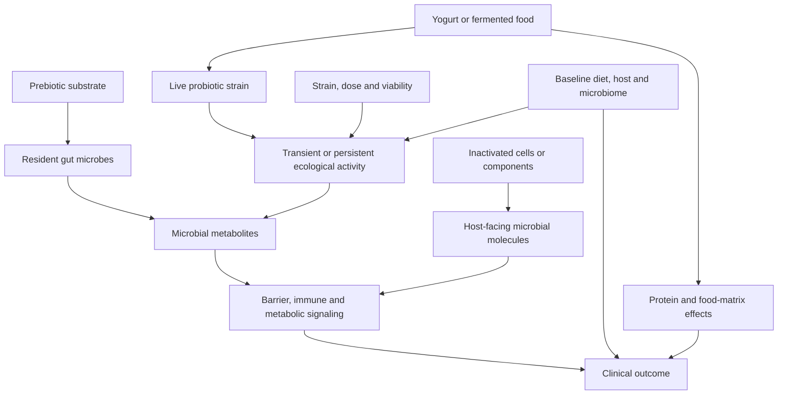

# Probiotics, prebiotics, and postbiotics

Probiotics are live microorganisms administered with the aim of producing a health benefit. Prebiotics are substrates, commonly specific fermentable fibers, that resident microorganisms can use. Postbiotics are preparations of nonliving microorganisms or their components intended to retain biologically active molecules. These categories are not interchangeable: a live strain, a food containing cultures, a microbial substrate, and a pasteurized bacterial preparation have different exposures and must each be tested for a specific outcome. (@biolayne1 (Dr. Layne Norton) — "Probiotics Cut Cancer Risk by 50% and Melt Fat! | Educational Video | Biolayne", 2026-08-05, [link](https://www.youtube.com/watch?v=RVN6GosoJUI))

## Why category and endpoint matter

A reported association for a combined exposure to yogurt, prebiotics, or probiotics cannot identify which member produced the signal. Yogurt can contribute protein and other food-matrix effects; fiber can support fermentation; and a named organism can have strain-specific actions. Likewise, prevention of weight regain after deliberate loss is not the same endpoint as causing initial weight loss. Category pooling and endpoint substitution can turn a narrow result into a claim the study did not test. (@biolayne1 (Dr. Layne Norton) — "Probiotics Cut Cancer Risk by 50% and Melt Fat! | Educational Video | Biolayne", 2026-08-05, [link](https://www.youtube.com/watch?v=RVN6GosoJUI))

Commercial probiotic capsules add identity and delivery problems. Labels may not match the species or concentration delivered, while heat, oxygen, storage, and gastric acid can reduce viability before organisms reach the intestine. Even a viable, correctly labeled strain encounters a host ecosystem containing hundreds of interacting taxa; colonization varies greatly between people, so adding a few selected organisms is not equivalent to restoring a whole microbiome. The source reports that as many as two thirds of users in cited studies showed neither detectable colonization nor digestive benefit, but does not identify those studies, so the figure should be treated as an evidence-summary claim rather than a precise general rate. (@NutritionMadeSimple (Nutrition Made Simple!) — "If YOU Have Probiotics, You NEED To Stop!", 2026-06-19, [link](https://www.youtube.com/watch?v=YKSR4TRLd70))

## Antibiotics, specific indications, and safety

After antibiotics, spontaneous ecological recovery is not necessarily accelerated by adding an arbitrary consortium. In one study summarized in the source, an 11-species probiotic delayed microbiome recovery relative to no probiotic; this is a product- and endpoint-specific warning, not proof that all probiotics after every antibiotic are harmful. Conversely, evidence for the yeast *Saccharomyces boulardii* in preventing *C. difficile* infection is characterized as limited but sufficient to make selected clinical use defensible. Pouchitis and preterm-infant care are other specialist contexts in which particular products may be used. (@NutritionMadeSimple (Nutrition Made Simple!) — "If YOU Have Probiotics, You NEED To Stop!", 2026-06-19, [link](https://www.youtube.com/watch?v=YKSR4TRLd70))

Gas, bloating, and discomfort are usually mild and temporary, but live microorganisms can cause infection in immunocompromised people, including some people receiving chemotherapy. Risk therefore depends on organism, preparation, host defenses, and indication rather than on the friendly-bacteria label. (@NutritionMadeSimple (Nutrition Made Simple!) — "If YOU Have Probiotics, You NEED To Stop!", 2026-06-19, [link](https://www.youtube.com/watch?v=YKSR4TRLd70))

## Fermented foods are a different exposure

Fermented foods may combine multiple bacteria and yeasts with a food matrix, substrates, fermentation metabolites, protein, fatty acids, and amino acids. This differs from an isolated capsule in ecological diversity, relative abundance, survival context, and nonmicrobial nutrition; pasteurization timing and later heating determine whether cultures remain live. A trial in generally healthy adults summarized by the source found greater microbiome diversity and lower inflammation with fermented foods, but no study identifier or effect size is supplied, and those intermediate outcomes do not establish long-term disease prevention. (@NutritionMadeSimple (Nutrition Made Simple!) — "If YOU Have Probiotics, You NEED To Stop!", 2026-06-19, [link](https://www.youtube.com/watch?v=YKSR4TRLd70))

Food form also limits category-wide rankings. Kefir generally contains a broader cultured community than yogurt and is described as improving glucose and inflammatory measures in randomized trials, but substrate, strains, viability, added sugar, and comparator vary. Kombucha has weaker human outcome evidence; its clearest practical value may be replacing sugar-sweetened soda rather than treating disease. Feeding resident organisms with varied fiber and resistant starch is a complementary exposure, not proof that ingested organisms permanently colonize the gut. (@NutritionMadeSimple (Nutrition Made Simple!) — "8 Foods That Actually Fix Your Gut (Not Probiotics)", 2026-05-30, [link](https://www.youtube.com/watch?v=ykpITcKqWCo)) [[food-patterns-and-gut-ecology]]

## Colorectal-cancer association

An NHANES analysis of roughly 10,000 adults older than 50 associated reported regular consumption of any of yogurt, prebiotics, or probiotics with about 50% lower reported colon-cancer prevalence. The design was cross-sectional rather than prospective, so exposure and disease timing were not securely ordered; diet could have changed after diagnosis. The combined exposure also prevented attribution to probiotics, and consumers differed in income, education, smoking, and alcohol use, with important factors reportedly not included in adjustment. The result is therefore hypothesis-generating and highly vulnerable to healthy-user bias, not evidence that a probiotic prevents half of colorectal cancers. (@biolayne1 (Dr. Layne Norton) — "Probiotics Cut Cancer Risk by 50% and Melt Fat! | Educational Video | Biolayne", 2026-08-05, [link](https://www.youtube.com/watch?v=RVN6GosoJUI)) [[colorectal-cancer-prevention-and-screening]]

## Postbiotic and weight-regain trial

In a placebo-controlled randomized trial, participants first lost at least 8% of body weight during a very-low-energy diet of about 900 kcal/day and then returned to free living. A pasteurized bacterial preparation reduced subsequent body-fat regain relative to placebo. This supports a product-specific maintenance signal, not the broader claims that probiotics cause weight loss or that postbiotics generally prevent regain. Fecal energy loss did not explain the result; food recalls showed no clear intake difference but are imprecise; and GLP-1 was not measured under a design suited to resolving that mechanism. Company funding and researcher affiliations raise the need for independent replication without automatically invalidating randomization. (@biolayne1 (Dr. Layne Norton) — "Probiotics Cut Cancer Risk by 50% and Melt Fat! | Educational Video | Biolayne", 2026-08-05, [link](https://www.youtube.com/watch?v=RVN6GosoJUI)) [[energy-balance-and-calorie-counting]]

## Evidence hierarchy and interpretation

Mechanistic plausibility becomes useful only when joined to product identity, dose, comparator, endpoint, and design. Cross-sectional associations can generate hypotheses but are weak for causal direction; randomization strengthens causal inference for the tested preparation and population but does not license category-wide generalization. Norton’s distinctive corrective is to prioritize established fiber evidence and ordinary yogurt as a nutritious protein food while treating probiotic and postbiotic longevity claims as unresolved. The source characterizes fiber evidence as supported across randomized and prospective research, but supplies no effect sizes or study identifiers, so that claim should guide priority rather than quantify benefit. (@biolayne1 (Dr. Layne Norton) — "Probiotics Cut Cancer Risk by 50% and Melt Fat! | Educational Video | Biolayne", 2026-08-05, [link](https://www.youtube.com/watch?v=RVN6GosoJUI)) [[dietary-fiber]]

## Practical implications

- **Daily: meet fiber needs with varied whole foods before buying a microbiome product — moderate-to-strong for fiber as a health priority, weak for any claim that it substitutes for a tested strain or postbiotic.** Increase gradually if intake is low. (@biolayne1 (Dr. Layne Norton) — "Probiotics Cut Cancer Risk by 50% and Melt Fat! | Educational Video | Biolayne", 2026-08-05, [link](https://www.youtube.com/watch?v=RVN6GosoJUI))
- **Use yogurt as a food when tolerated and compatible with the dietary pattern — moderate as a nutrient-dense protein-food choice, not proven here as a colon-cancer treatment.** Do not infer a 50% personal risk reduction from the pooled cross-sectional association. (@biolayne1 (Dr. Layne Norton) — "Probiotics Cut Cancer Risk by 50% and Melt Fat! | Educational Video | Biolayne", 2026-08-05, [link](https://www.youtube.com/watch?v=RVN6GosoJUI))
- **Before a probiotic or postbiotic trial: record the exact strain or preparation, dose, intended endpoint, and a reassessment date — product-specific evidence only.** Avoid extrapolating a maintenance trial to initial weight loss or a pooled food association to cancer prevention. (@biolayne1 (Dr. Layne Norton) — "Probiotics Cut Cancer Risk by 50% and Melt Fat! | Educational Video | Biolayne", 2026-08-05, [link](https://www.youtube.com/watch?v=RVN6GosoJUI))
- **For a healthy person without a defined indication: do not take a generic probiotic capsule every day by default — moderate evidence against category-wide benefit.** If using one for a condition, match the exact strain and dose to that condition, prefer third-party verification, and set a reassessment date. (@NutritionMadeSimple (Nutrition Made Simple!) — "If YOU Have Probiotics, You NEED To Stop!", 2026-06-19, [link](https://www.youtube.com/watch?v=YKSR4TRLd70))
- **During or after antibiotics, or with immune suppression, cancer treatment, prematurity, or complex gastrointestinal disease: make probiotic use a clinician-guided decision — moderate safety rationale, indication-specific efficacy.** Do not assume that any multi-strain product rebuilds the microbiome; infection and delayed-recovery risks change the decision. (@NutritionMadeSimple (Nutrition Made Simple!) — "If YOU Have Probiotics, You NEED To Stop!", 2026-06-19, [link](https://www.youtube.com/watch?v=YKSR4TRLd70))
- **Several times per week if tolerated: fermented foods such as yogurt or kefir are a reasonable food-based option — moderate evidence for intermediate microbiome and inflammation outcomes, weak for long-term clinical outcomes.** People with immune compromise or relevant sensitivities, including histamine intolerance, should seek clinical advice first. (@NutritionMadeSimple (Nutrition Made Simple!) — "If YOU Have Probiotics, You NEED To Stop!", 2026-06-19, [link](https://www.youtube.com/watch?v=YKSR4TRLd70))

## Gaps & open questions

- Which component of the pooled yogurt/prebiotic/probiotic exposure, if any, explains the colorectal-cancer association after prospective measurement and fuller confounder control?
- Can the postbiotic weight-maintenance result be independently replicated, and what is the absolute effect size and duration?
- Does the postbiotic alter appetite, energy expenditure, substrate partitioning, inflammation, or another pathway not adequately measured in the trial?
- Which benefits require live organisms, and which can be reproduced by inactivated cells or isolated microbial products?
- How strongly do baseline microbiome, diet, medication, and host phenotype modify response?
- Which probiotic preparations delay post-antibiotic recovery, and which prevent clinically important antibiotic complications with a favorable net benefit?
- How often do independently assayed commercial products match their labels and retain viable organisms through shelf life and digestion?
- Do fermented-food changes in diversity and inflammation persist and translate into fewer clinical events?

## Related

[[dietary-fiber]] · [[food-patterns-and-gut-ecology]] · [[colorectal-cancer-prevention-and-screening]] · [[microbiome-directed-cancer-therapy]] · [[resistant-starch]] · [[energy-balance-and-calorie-counting]] · [[supplement-evidence-and-safety]] · [[practice-playbook]] · [[aging-model]]
