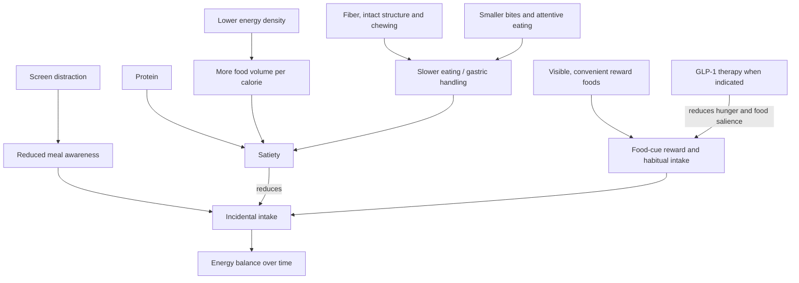

# Satiety-oriented diet design

Satiety-oriented diet design arranges food composition, physical structure, pacing, cues, and convenience so that an appropriate energy intake requires less moment-to-moment restraint. It operates upstream of [[energy-balance-and-calorie-counting]]: energy balance determines the direction of stored-energy change, while meal design changes hunger, reward, portion size, and adherence. (@JeremyEthier (Jeremy Ethier) — "I Proved My 6-Pack Abs Diet Works For ANYONE", 2026-07-12, [link](https://www.youtube.com/watch?v=HkrWExj1QNk))

## Composition and food structure

Meals can be large yet relatively low in energy when vegetables, fruit, lean protein, and lower-energy substitutions displace calorie-dense fats, refined snacks, and sugar-sweetened drinks. Protein, fiber, volume, and chewing may improve fullness through partly distinct routes. The source’s one-day menu contrast—reported as 1,994 versus 8,312 kcal—illustrates how beverages, sauces, fats, snacks, and energy density can accumulate without proportionate volume; it is a calculated case example, not a controlled feeding trial or proof that one menu works for everyone. (@JeremyEthier (Jeremy Ethier) — "I Proved My 6-Pack Abs Diet Works For ANYONE", 2026-07-12, [link](https://www.youtube.com/watch?v=HkrWExj1QNk)) [[dietary-fiber]] [[free-sugars-and-glycemic-response]]

A plate heuristic can operationalize the same principles without numerical tracking: allocate the largest area to fibrous vegetables, a substantial area to protein, and a smaller area to starchy carbohydrate, while using added fats deliberately. This can reduce decision burden, but plate area does not measure energy and the proportions must still accommodate individual needs. The source explicitly retains starch and rejects excluding ordinary fruit and vegetables as an extreme route to abdominal definition. (@athleanx (ATHLEAN-X™) — "I'm 51. Here's How I Still Have Visible Abs (WORKS AT ANY AGE)", 2026-08-04, [link](https://www.youtube.com/watch?v=ZOMKA0qCQ_w)) [[abdominal-definition-and-training]]

Replacing sugar-sweetened beverages with water or noncaloric drinks can remove substantial energy. The source also describes a study in habitual diet-drink users where continuing or increasing diet beverages reportedly outperformed switching to water for weight loss and maintenance, attributing this to craving control. Because the study is not identified and the comparison is characterized only in the transcript, it supports a testable substitution strategy rather than a general claim that diet soda is superior to water. (@JeremyEthier (Jeremy Ethier) — "I Proved My 6-Pack Abs Diet Works For ANYONE", 2026-07-12, [link](https://www.youtube.com/watch?v=HkrWExj1QNk))

## Attention, reward, and environment

Eating during screens can weaken attention to sensory satisfaction and portion consumed. A stale-popcorn cinema experiment is invoked to show habitual context overriding enjoyment, but the transcript does not identify the study or quantify the effect. Smaller utensils and foods requiring more chewing may slow eating, giving satiation signals more time to influence the meal; these are low-cost behavioral tools with uncertain effect size and substantial individual variation. (@JeremyEthier (Jeremy Ethier) — "I Proved My 6-Pack Abs Diet Works For ANYONE", 2026-07-12, [link](https://www.youtube.com/watch?v=HkrWExj1QNk))

Food-cue response is not reducible to willpower. A three-person EEG demonstration reported different activation patterns while participants viewed food, including low apparent cue response in a participant taking semaglutide. These images cannot validate a simple reward-center versus self-control-center model, diagnose overeating, or show that resisting food cues trains a discrete control region. The more defensible inference is that cue reactivity, habits, medication, and environment can differ among people and that reducing repeated exposure may be easier than repeatedly exerting inhibition. (@JeremyEthier (Jeremy Ethier) — "I Proved My 6-Pack Abs Diet Works For ANYONE", 2026-07-12, [link](https://www.youtube.com/watch?v=HkrWExj1QNk)) [[evolutionary-mismatch-and-weight-regulation]] [[glp-1-receptor-agonists]]

## Practical implications

- **At most meals: include a satisfying protein source, a fruit or vegetable, and an intact or fiber-rich component; use lower-energy substitutions only when they remain enjoyable — moderate evidence for the combined design, not for the specific recipes.** Assess hunger, adherence, dietary adequacy, and the multiweek weight trend. (@JeremyEthier (Jeremy Ethier) — "I Proved My 6-Pack Abs Diet Works For ANYONE", 2026-07-12, [link](https://www.youtube.com/watch?v=HkrWExj1QNk))
- **Daily: replace routine sugar-sweetened drinks with water or a tolerable noncaloric option — moderate-to-strong substitution rationale.** Diet drinks can be a bridge when they reduce cravings, but water remains a valid default and individual tolerance matters. (@JeremyEthier (Jeremy Ethier) — "I Proved My 6-Pack Abs Diet Works For ANYONE", 2026-07-12, [link](https://www.youtube.com/watch?v=HkrWExj1QNk))
- **For one meal per day at first: eat without a phone or television, slow the pace, and stop when comfortably satisfied — plausible, low-risk strategy with limited quantified evidence in this source.** Smaller utensils or more chewable food are optional means, not requirements. (@JeremyEthier (Jeremy Ethier) — "I Proved My 6-Pack Abs Diet Works For ANYONE", 2026-07-12, [link](https://www.youtube.com/watch?v=HkrWExj1QNk))
- **Weekly during intentional weight loss: review the trend rather than reacting to one-day scale changes — strong measurement principle.** A 24-hour change largely reflects water, glycogen, gut contents, and measurement variation and cannot validate a diet. (@JeremyEthier (Jeremy Ethier) — "I Proved My 6-Pack Abs Diet Works For ANYONE", 2026-07-12, [link](https://www.youtube.com/watch?v=HkrWExj1QNk))
- **When calorie tracking is unwanted: use a repeatable vegetable–protein–starch plate template at most meals and adjust portions from multiweek outcomes — moderate as a behavior tool, weak for any fixed geometry.** Retain enjoyable foods in bounded portions when that improves adherence rather than imposing fragile all-or-none rules. (@athleanx (ATHLEAN-X™) — "I'm 51. Here's How I Still Have Visible Abs (WORKS AT ANY AGE)", 2026-08-04, [link](https://www.youtube.com/watch?v=ZOMKA0qCQ_w))

## Gaps & open questions

- Which combination of protein, fiber, energy density, texture, and pacing produces the greatest durable adherence for different people?
- Do diet beverages improve long-term outcomes versus water among people who do not already consume them?
- How valid and reproducible are brief food-cue EEG paradigms, especially for individual clinical decisions?
- Does attentive eating reduce energy intake or weight over months, and for whom might increased monitoring be counterproductive?
- How do cost, cooking time, culture, sensory preference, and household support alter the feasibility of high-volume menus?
- How does a plate heuristic compare with calorie tracking for dietary adequacy, adherence, and long-term weight change?

## Related

[[abdominal-definition-and-training]] · [[energy-balance-and-calorie-counting]] · [[evolutionary-mismatch-and-weight-regulation]] · [[dietary-fiber]] · [[free-sugars-and-glycemic-response]] · [[glp-1-receptor-agonists]] · [[nutrition-evidence-and-personalization]] · [[practice-playbook]] · [[aging-model]]
