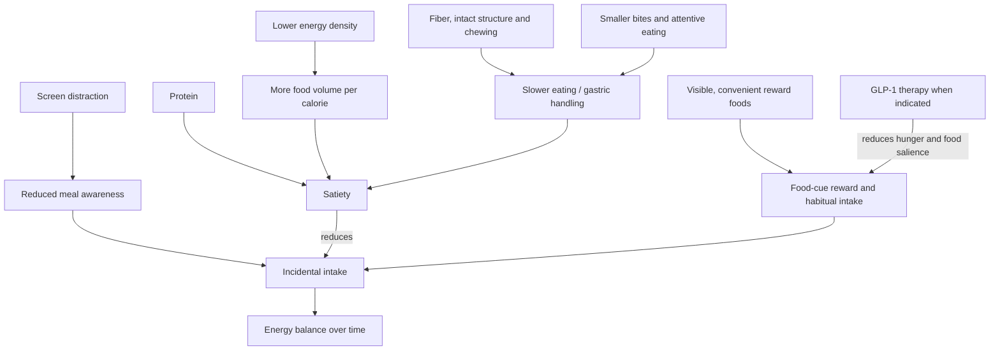
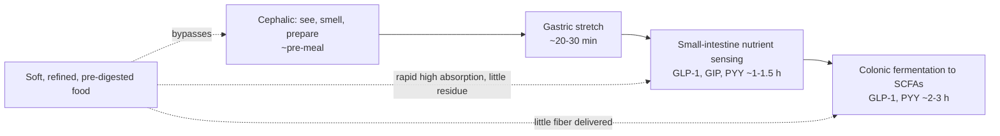

# Satiety-oriented diet design

Satiety-oriented diet design arranges food composition, physical structure, pacing, cues, and convenience so that an appropriate energy intake requires less moment-to-moment restraint. It operates upstream of [[energy-balance-and-calorie-counting]]: energy balance determines the direction of stored-energy change, while meal design changes hunger, reward, portion size, and adherence. (@JeremyEthier (Jeremy Ethier) — "I Proved My 6-Pack Abs Diet Works For ANYONE", 2026-07-12, [link](https://www.youtube.com/watch?v=HkrWExj1QNk))

```mermaid
flowchart TD
  DENS[Lower energy density] --> VOL[More food volume per calorie]
  PRO[Protein] --> SAT[Satiety]
  FIB[Fiber, intact structure and chewing] --> SLOW[Slower eating / gastric handling]
  VOL --> SAT
  SLOW --> SAT
  PACE[Smaller bites and attentive eating] --> SLOW
  CUES[Visible, convenient reward foods] --> REWARD[Food-cue reward and habitual intake]
  DIST[Screen distraction] --> AWARE[Reduced meal awareness]
  AWARE --> INTAKE[Incidental intake]
  SAT -->|reduces| INTAKE
  REWARD --> INTAKE
  GLP[GLP-1 therapy when indicated] -->|reduces hunger and food salience| REWARD
  INTAKE --> BAL[Energy balance over time]
```

## Composition and food structure

Meals can be large yet relatively low in energy when vegetables, fruit, lean protein, and lower-energy substitutions displace calorie-dense fats, refined snacks, and sugar-sweetened drinks. Protein, fiber, volume, and chewing may improve fullness through partly distinct routes. The source’s one-day menu contrast—reported as 1,994 versus 8,312 kcal—illustrates how beverages, sauces, fats, snacks, and energy density can accumulate without proportionate volume; it is a calculated case example, not a controlled feeding trial or proof that one menu works for everyone. (@JeremyEthier (Jeremy Ethier) — "I Proved My 6-Pack Abs Diet Works For ANYONE", 2026-07-12, [link](https://www.youtube.com/watch?v=HkrWExj1QNk)) [[dietary-fiber]] [[free-sugars-and-glycemic-response]]

A plate heuristic can operationalize the same principles without numerical tracking: allocate the largest area to fibrous vegetables, a substantial area to protein, and a smaller area to starchy carbohydrate, while using added fats deliberately. This can reduce decision burden, but plate area does not measure energy and the proportions must still accommodate individual needs. The source explicitly retains starch and rejects excluding ordinary fruit and vegetables as an extreme route to abdominal definition. (@athleanx (ATHLEAN-X™) — "I'm 51. Here's How I Still Have Visible Abs (WORKS AT ANY AGE)", 2026-08-04, [link](https://www.youtube.com/watch?v=ZOMKA0qCQ_w)) [[abdominal-definition-and-training]]

Replacing sugar-sweetened beverages with water or noncaloric drinks can remove substantial energy. The source also describes a study in habitual diet-drink users where continuing or increasing diet beverages reportedly outperformed switching to water for weight loss and maintenance, attributing this to craving control. Because the study is not identified and the comparison is characterized only in the transcript, it supports a testable substitution strategy rather than a general claim that diet soda is superior to water. (@JeremyEthier (Jeremy Ethier) — "I Proved My 6-Pack Abs Diet Works For ANYONE", 2026-07-12, [link](https://www.youtube.com/watch?v=HkrWExj1QNk)) A second source strengthens the substitution reading and addresses the online scare directly: much of the observational association between diet drinks and weight gain is reverse causation (people already gaining weight switch drinks, and the drink gets blamed), while in randomized trials non-sugar-sweetened drinks beat sugary drinks for weight loss and performed at least as well as water. The claim is about substitution for sugared drinks, not about diet drinks conferring benefit over never drinking them. (@DrBradStanfield (Dr Brad Stanfield) — "$7 Pill Shrinks the Fat Around Your Heart", 2026-07-15, [link](https://www.youtube.com/watch?v=jn-HKoOUd5o))

## The appetite cascade from mouth to colon

Satiety is not a single stomach signal but a staged cascade, and each stage is a design target. Federica Amati teaches it in four phases with an approximate time course: a cephalic phase (seeing, smelling, preparing, and anticipating food primes salivation, gastric readiness, and insulin secretion — bypassed when lunch is drunk from a bottle or tipped from a packet); gastric stretch (mechanoreceptors report volume roughly 20–30 minutes into a meal, favoring high-volume foods); small-intestinal nutrient sensing (enteroendocrine cells releasing GLP-1, GIP, and PYY on detecting protein, fats, and micronutrients, on the order of an hour or more after eating); and colonic fermentation (fiber reaching the proximal colon feeds microbes whose short-chain fatty acids trigger further GLP-1/PYY release from L cells 2–3 hours post-meal). A meal engaging every stage produces satiety lasting hours from hormones whose individual half-lives are minutes; the distinction between short-term fullness and longer-term satiety rests on the later stages. The staging is standard gut physiology taught through a commercial lens (ZOE meal scores, the presenter's products); the design implication — structure meals so signaling continues after the stomach empties — does not depend on the products. (@joinzoe (ZOE) — "The Nutrition Doctor: “You’re at risk of becoming malnourished!” How to avoid Ozempic's hidden risks", 2026-06-18, [link](https://www.youtube.com/watch?v=GwZhDggykMQ)) [[dietary-fiber]] [[glp-1-receptor-agonists]]

```mermaid
flowchart LR
  CEPH[Cephalic: see, smell, prepare<br/>~pre-meal] --> STRETCH[Gastric stretch<br/>~20-30 min]
  STRETCH --> INTEST[Small-intestine nutrient sensing<br/>GLP-1, GIP, PYY ~1-1.5 h]
  INTEST --> COLON[Colonic fermentation to SCFAs<br/>GLP-1, PYY ~2-3 h]
  UPF[Soft, refined, pre-digested food] -.bypasses.-> CEPH
  UPF -.rapid high absorption, little residue.-> INTEST
  UPF -.little fiber delivered.-> COLON
```

Food texture is the industrial counterpart of the same physiology. Ultra-processed manufacture strips fibrous structure — partly for shelf life and manipulability, partly because soft food is eaten faster — and softness defeats satiety twice: less chewing feedback, and rapid absorption high in the small intestine that leaves nothing for distal sensing, so a calorie-dense snack can leave a person hungry half an hour later. Sarah Berry's chew-and-spit feeding studies isolate the variable: identical ingredients and back-of-pack nutrition served as coarse versus finely ground porridge changed where nutrients were absorbed and how full people felt. She reports that minimally processed versus processed versions of similar foods differ by about 50% in eating rate, with at least a comparably sized difference in fullness and in subsequent calorie intake, and offers a colleague's slogan — put the crunch back into your lunch — as the practical rule: recrisping components of a meal slows eating and reduces intake with a better metabolic response. Population context from the same discussion: about 4,000 kcal/day per person is available in the food system, and roughly 40% of people who eat careful main meals undo the effort with poor-quality snacks; in Berry's randomized trial in which only snacks were changed for 6 weeks, blood lipids and vessel function improved to a degree she equates to a 30% cardiovascular-risk reduction — a biomarker-derived risk equation from a company-affiliated trial promoting a forthcoming ZOE snack bar, not an outcome result, and the conflict of interest is direct. (@joinzoe (ZOE) — "Tim Spector: They're fooling you! The 3 nutrition scams he wants banned | Live Audience Q&A", 2026-06-25, [link](https://www.youtube.com/watch?v=g3J4phCrvvw)) [[food-label-literacy-and-health-halos]]

## Attention, reward, and environment

Eating during screens can weaken attention to sensory satisfaction and portion consumed. A stale-popcorn cinema experiment is invoked to show habitual context overriding enjoyment, but the transcript does not identify the study or quantify the effect. Smaller utensils and foods requiring more chewing may slow eating, giving satiation signals more time to influence the meal; these are low-cost behavioral tools with uncertain effect size and substantial individual variation. (@JeremyEthier (Jeremy Ethier) — "I Proved My 6-Pack Abs Diet Works For ANYONE", 2026-07-12, [link](https://www.youtube.com/watch?v=HkrWExj1QNk))

Cultural stopping rules are a pacing tool the Anglophone script lacks. Michael Pollan contrasts the American "are you full?" — which sets the stop point at capacity — with Japan's hara hachi bu (eat until about 80% full) and the French question "are you satisfied?", which set it at sufficiency; because satiety hormones lag intake by tens of minutes (the cascade above), a sufficiency-framed stop point plus slower eating gives the signal time to arrive, and he adds that pleasure per bite declines across a meal, so lingering over the first bites concentrates the enjoyment where it actually is. One engineering caveat from the same conversation: ultra-processed products deliver their flavor almost entirely up front with little lingering finish, so eat-slowly advice does least for exactly the foods designed around immediate reward — a reason the lever is food choice first, pacing second ([[ultra-processed-food]]). These are cultural practices and expert reasoning consistent with the cascade physiology, not trial results. (@joinzoe (ZOE) — "Michael Pollan: The TRUTH about junk food and why you can’t stop eating", 2026-05-28, [link](https://www.youtube.com/watch?v=2H1kqw-uyM0))

Friction is the operational form of environment design, and it works in both directions: reduce the effort standing between you and the behavior you want, raise it for the behavior you don't. The asymmetry matters because the default environment is already engineered against the person — palatable food is cheap, everywhere, and requires no preparation — so leaving the arrangement to chance is itself a choice. Concretely, keeping a prepared lower-calorie substitute permanently ready (a chocolate protein shake in the fridge, available the moment the evening dessert urge arrives) converts a high-failure decision into a default, while a visible bag of palatable snacks on the counter converts each pass through the kitchen into a repeated act of resistance; the countermeasure is simply the cupboard. A mechanistic footnote offered in the same conversation, attributed to nutrition scientist Mario Kratz, is that seeing or even thinking about a palatable food can initiate anticipatory physiological preparation including salivation and an insulin response — the cephalic phase described above running on a cue rather than a meal, which is why cue exposure is not merely psychological. The exposure-reduction principle is well supported behaviorally; the specific cephalic-insulin claim is relayed secondhand without citation. Life-stage context also changes the environment involuntarily: work obligations and childcare compress time, degrade sleep, and shift food choices in ways that are easy to attribute to willpower failure. (@maxlugavere (Max Lugavere) — "The Protein Expert: Fat Loss Gets EASIER When You Understand This - Angelo Keely", 2026-06-01, [link](https://www.youtube.com/watch?v=XTWDoFs4PE8)) [[energy-balance-and-calorie-counting]]

Food-cue response is not reducible to willpower. A three-person EEG demonstration reported different activation patterns while participants viewed food, including low apparent cue response in a participant taking semaglutide. These images cannot validate a simple reward-center versus self-control-center model, diagnose overeating, or show that resisting food cues trains a discrete control region. The more defensible inference is that cue reactivity, habits, medication, and environment can differ among people and that reducing repeated exposure may be easier than repeatedly exerting inhibition. (@JeremyEthier (Jeremy Ethier) — "I Proved My 6-Pack Abs Diet Works For ANYONE", 2026-07-12, [link](https://www.youtube.com/watch?v=HkrWExj1QNk)) [[evolutionary-mismatch-and-weight-regulation]] [[glp-1-receptor-agonists]]

## Practical implications

- **At most meals: include a satisfying protein source, a fruit or vegetable, and an intact or fiber-rich component; use lower-energy substitutions only when they remain enjoyable — moderate evidence for the combined design, not for the specific recipes.** Assess hunger, adherence, dietary adequacy, and the multiweek weight trend. (@JeremyEthier (Jeremy Ethier) — "I Proved My 6-Pack Abs Diet Works For ANYONE", 2026-07-12, [link](https://www.youtube.com/watch?v=HkrWExj1QNk))
- **Daily: replace routine sugar-sweetened drinks with water or a tolerable noncaloric option — moderate-to-strong substitution rationale.** Diet drinks can be a bridge when they reduce cravings, but water remains a valid default and individual tolerance matters. (@JeremyEthier (Jeremy Ethier) — "I Proved My 6-Pack Abs Diet Works For ANYONE", 2026-07-12, [link](https://www.youtube.com/watch?v=HkrWExj1QNk))
- **For one meal per day at first: eat without a phone or television, slow the pace, and stop when comfortably satisfied — plausible, low-risk strategy with limited quantified evidence in this source.** Smaller utensils or more chewable food are optional means, not requirements. (@JeremyEthier (Jeremy Ethier) — "I Proved My 6-Pack Abs Diet Works For ANYONE", 2026-07-12, [link](https://www.youtube.com/watch?v=HkrWExj1QNk))
- **Weekly during intentional weight loss: review the trend rather than reacting to one-day scale changes — strong measurement principle.** A 24-hour change largely reflects water, glycogen, gut contents, and measurement variation and cannot validate a diet. (@JeremyEthier (Jeremy Ethier) — "I Proved My 6-Pack Abs Diet Works For ANYONE", 2026-07-12, [link](https://www.youtube.com/watch?v=HkrWExj1QNk))
- **When calorie tracking is unwanted: use a repeatable vegetable–protein–starch plate template at most meals and adjust portions from multiweek outcomes — moderate as a behavior tool, weak for any fixed geometry.** Retain enjoyable foods in bounded portions when that improves adherence rather than imposing fragile all-or-none rules. (@athleanx (ATHLEAN-X™) — "I'm 51. Here's How I Still Have Visible Abs (WORKS AT ANY AGE)", 2026-08-04, [link](https://www.youtube.com/watch?v=ZOMKA0qCQ_w))

- **Design friction deliberately in both directions: keep one prepared substitute for your most failure-prone eating occasion permanently ready, and move palatable snack foods out of sight rather than resisting them repeatedly — moderate behavioral rationale.** Reducing repeated cue exposure is more reliable than repeated inhibition. (@maxlugavere (Max Lugavere) — "The Protein Expert: Fat Loss Gets EASIER When You Understand This - Angelo Keely", 2026-06-01, [link](https://www.youtube.com/watch?v=XTWDoFs4PE8))
- **When snacking is habitual: upgrade the snack rather than fighting the habit — moderate (one company-run randomized trial changing only snacks improved lipid and vascular biomarkers over 6 weeks; the 30% risk figure is an equation, not events).** Prefer snacks with intact plant structure, protein, fiber, and chewing resistance over soft, fast-eating bars and chips; snacks supply 20–25% of calories in UK/US diets, so the lever is material. (@joinzoe (ZOE) — "Tim Spector: They're fooling you! The 3 nutrition scams he wants banned | Live Audience Q&A", 2026-06-25, [link](https://www.youtube.com/watch?v=g3J4phCrvvw))
- **At most meals: design for the whole cascade — prepare some food yourself, include volume, protein and fats, and enough fiber to reach the colon; keep textures that require chewing (add crunch back rather than choosing pre-softened versions) — moderate mechanistic and controlled-feeding evidence, weak for long-term weight outcomes.** (@joinzoe (ZOE) — "The Nutrition Doctor: “You’re at risk of becoming malnourished!” How to avoid Ozempic's hidden risks", 2026-06-18, [link](https://www.youtube.com/watch?v=GwZhDggykMQ)) (@joinzoe (ZOE) — "Tim Spector: They're fooling you! The 3 nutrition scams he wants banned | Live Audience Q&A", 2026-06-25, [link](https://www.youtube.com/watch?v=g3J4phCrvvw))

- **At most meals: adopt a sufficiency-framed stop point — stop when no longer hungry (roughly 80% full) rather than when full, and teach children "have you had enough?" instead of "are you full?" — limited evidence (cultural practice plus cascade physiology; no controlled trial cited), zero cost.** (@joinzoe (ZOE) — "Michael Pollan: The TRUTH about junk food and why you can’t stop eating", 2026-05-28, [link](https://www.youtube.com/watch?v=2H1kqw-uyM0))

## Gaps & open questions

- Which combination of protein, fiber, energy density, texture, and pacing produces the greatest durable adherence for different people?
- Does the snack-substitution biomarker improvement translate into event reduction, and does it replicate outside the company that sells the replacement snack?
- How large is the colonic-fermentation contribution to everyday satiety at realistic fiber intakes, and does it differ by baseline microbiome?
- Do diet beverages improve long-term outcomes versus water among people who do not already consume them?
- How valid and reproducible are brief food-cue EEG paradigms, especially for individual clinical decisions?
- Does attentive eating reduce energy intake or weight over months, and for whom might increased monitoring be counterproductive?
- How do cost, cooking time, culture, sensory preference, and household support alter the feasibility of high-volume menus?
- How does a plate heuristic compare with calorie tracking for dietary adequacy, adherence, and long-term weight change?

## Related

[[abdominal-definition-and-training]] · [[energy-balance-and-calorie-counting]] · [[evolutionary-mismatch-and-weight-regulation]] · [[ultra-processed-food]] · [[michael-pollan]] · [[dietary-fiber]] · [[free-sugars-and-glycemic-response]] · [[glp-1-receptor-agonists]] · [[nutrition-evidence-and-personalization]] · [[food-label-literacy-and-health-halos]] · [[federica-amati]] · [[practice-playbook]] · [[aging-model]]
