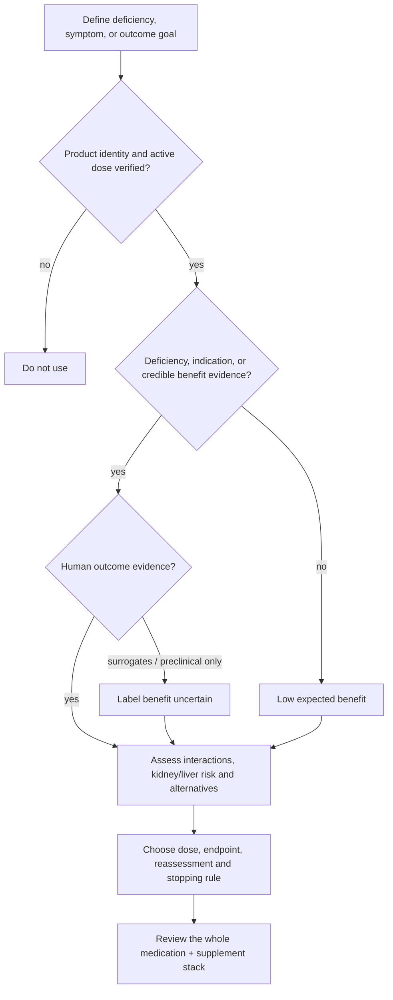

# Supplement evidence and safety

A supplement decision is a clinical inference under uncertainty, not a vote on whether a molecule is natural. The relevant chain runs from identity and dose to mechanism, target engagement, meaningful human outcomes, individual need, and net benefit. Animal lifespan extension, a plausible pathway, or movement in a surrogate biomarker supports a hypothesis; none alone proves that routine use improves human healthspan. Small, short trials also tend to measure convenient endpoints and may collectively look more persuasive than their ability to predict durable clinical benefit warrants. (@matt.kaeberlein (Healthspan Medicine) — "Longevity Doctors Rank the Most Hyped Supplements (AMA with Dr. Kaeberlein and Dr. Byrne)", 2026-04-03, [link](https://www.youtube.com/watch?v=yM-vL5J3BIA))

## Decision structure

Combining individually plausible compounds does not preserve their individual risk estimates. Supplements are bioactive small molecules, yet multi-product interaction data and systematic medication screening are often absent. Products marketed as natural alternatives may also reproduce pharmaceutical mechanisms: berberine can overlap mechanistically with metformin through mitochondrial electron-transport effects, and red yeast rice can contain a statin. Matt Kaeberlein’s contrarian formulation is that berberine is effectively an unregulated metformin-like intervention rather than an intrinsically gentler category; this is a mechanistic position, not evidence of equivalent clinical outcomes or quality control. (@matt.kaeberlein (Healthspan Medicine) — "Longevity Doctors Rank the Most Hyped Supplements (AMA with Dr. Kaeberlein and Dr. Byrne)", 2026-04-03, [link](https://www.youtube.com/watch?v=yM-vL5J3BIA))

## Examples and evidence tiers

**Creatine:** supplementation has substantial support for strength and lean-tissue goals, while cognitive and mood effects are less settled. Roughly half of 16–17 randomized depression trials summarized by Physionic were positive; possible concentration of benefit in diagnosed depression or with concurrent SSRI treatment remains a hypothesis. A small microbiome-product-plus-creatine trial lacked creatine-only and microbiome-only arms, preventing component attribution; see [[creatine-for-depression]]. (@Physionic (Physionic) — "I analyzed 1,000 Health Studies: Here are 10 Things I Learned", 2026-08-06, [link](https://www.youtube.com/watch?v=sx8MyamJf3g)) Vegetarians and vegans tend to have lower creatine stores and may have more room to respond. Creatine can raise serum creatinine without a true fall in filtration, complicating creatinine-based eGFR interpretation; cystatin C can help separate marker artifact from renal change. Expert consensus remains cautious in chronic kidney disease, although small dialysis studies and monitored clinical experience motivate the minority view that selected kidney-disease patients might benefit rather than face universal exclusion. This is a clinician-supervised research question, not a self-treatment recommendation. (@matt.kaeberlein (Healthspan Medicine) — "Longevity Doctors Rank the Most Hyped Supplements (AMA with Dr. Kaeberlein and Dr. Byrne)", 2026-04-03, [link](https://www.youtube.com/watch?v=yM-vL5J3BIA))

**Vitamin D and K2:** vitamin D response varies with baseline status, environment, and physiology, reaches steady state over months, and can accumulate because it is fat-soluble; dosing should therefore follow a measured need rather than a universal longevity dose. K2 has a plausible role in bone biology and epidemiologic associations with less vascular calcification or coronary mortality, but supplementation outcome trials remain limited. Vitamins A, D, E, and K deserve particular overdose caution; high vitamin A intake can be hepatotoxic. (@matt.kaeberlein (Healthspan Medicine) — "Longevity Doctors Rank the Most Hyped Supplements (AMA with Dr. Kaeberlein and Dr. Byrne)", 2026-04-03, [link](https://www.youtube.com/watch?v=yM-vL5J3BIA))

Vitamin K2 nomenclature is clinically consequential. Trials summarized in hepatocellular carcinoma used 45 mg of the short-circulating MK-4 form alongside chemotherapy or immunotherapy and reported less progression than conventional treatment alone; this is an adjunctive signal, not prevention or stand-alone cancer treatment. It must not be converted to 45 mg of longer-circulating MK-7, which is ordinarily discussed in micrograms. Vitamin K participates in coagulation and can interact with anticoagulation, so oncology and prescribing clinicians must direct any use. (@Physionic (Physionic) — "I analyzed 1,000 Health Studies: Here are 10 Things I Learned", 2026-08-06, [link](https://www.youtube.com/watch?v=sx8MyamJf3g))

**Omega-3:** a higher red-cell EPA+DHA index is associated observationally with lower all-cause mortality and other favorable outcomes, but an association-defined target is not equivalent to randomized proof that supplementing every person to that target improves outcomes. Cognitive-trial syntheses report modest or null average effects with more apparent benefit at low baseline status, while randomized trials show a dose-related atrial-fibrillation signal that is larger above 1 g/day. Diet, baseline level, absolute arrhythmia risk, dose, product quality, and indication therefore matter; see [[omega-3-fatty-acids]]. (@matt.kaeberlein (Healthspan Medicine) — "Longevity Doctors Rank the Most Hyped Supplements (AMA with Dr. Kaeberlein and Dr. Byrne)", 2026-04-03, [link](https://www.youtube.com/watch?v=yM-vL5J3BIA)) (@NutritionMadeSimple (Nutrition Made Simple!) — "Watch This Before You Take Fish Oil (Protect Your Heart)", 2026-08-10, [link](https://www.youtube.com/watch?v=GpzX3NQzmio))

**Taurine and astaxanthin:** taurine has multi-species preclinical longevity findings, but later studies question whether circulating taurine consistently declines with age, and reproducible mouse lifespan extension has not reached the level Kaeberlein considers first-tier evidence. Astaxanthin has biological activity and several short human trials, mainly on surrogate oxidative, inflammatory, or lipid endpoints, without established long-term clinical benefit. Both remain emerging rather than general longevity prescriptions. (@matt.kaeberlein (Healthspan Medicine) — "Longevity Doctors Rank the Most Hyped Supplements (AMA with Dr. Kaeberlein and Dr. Byrne)", 2026-04-03, [link](https://www.youtube.com/watch?v=yM-vL5J3BIA))

**Sulforaphane products:** plants contain glucoraphanin, and tissue disruption releases myrosinase that converts it to sulforaphane; product formulation therefore determines whether the claimed active molecule can be generated. Sulforaphane can engage NRF2-related biomarkers, but human outcome evidence is sparse, the molecule is unstable, and products lacking active sulforaphane or the precursor-enzyme combination may not reproduce food chemistry. Eating cruciferous vegetables is better supported than treating a branded extract as a proven geroprotector. (@matt.kaeberlein (Healthspan Medicine) — "Longevity Doctors Rank the Most Hyped Supplements (AMA with Dr. Kaeberlein and Dr. Byrne)", 2026-04-03, [link](https://www.youtube.com/watch?v=yM-vL5J3BIA))

**CoQ10 and lithium orotate:** statins lower circulating CoQ10, but trials of CoQ10 for statin-associated muscle symptoms are mixed and routine co-supplementation is not expert consensus. Low-dose lithium-orotate longevity use lacks established clinical benefit; SGLT2 inhibitors can increase urinary lithium loss, documented at psychiatric lithium doses, so changing a lithium dose by mechanistic extrapolation alone is unsafe. Very-high-dose rodent orotic-acid liver findings do not directly establish low-dose human harm, but neither do they prove chronic safety. (@matt.kaeberlein (Healthspan Medicine) — "Longevity Doctors Rank the Most Hyped Supplements (AMA with Dr. Kaeberlein and Dr. Byrne)", 2026-04-03, [link](https://www.youtube.com/watch?v=yM-vL5J3BIA))

Kaeberlein ranks low-dose lithium orotate unusually highly based on repeated ecological associations between lithium in drinking water and lower suicide, dementia, or mortality rates, plus a 2025 mouse study reporting brain-region lithium depletion and benefit from lithium orotate in Alzheimer-like models. This is a contrarian risk–reward judgment: ecological correlation and disease-model rescue do not establish that healthy people benefit, and the transcript supplies no randomized human prevention trial. Conversely, CoQ10 is a required mitochondrial electron carrier, but biochemical necessity does not show that adding more improves aging in replete healthy people. (@matt.kaeberlein (Healthspan Medicine) — "Dr. Matt Ranks Longevity Supplements: The Winners and Total Scams", 2026-02-15, [link](https://www.youtube.com/watch?v=mD_DfRDXklc))

**Senolytic and mitochondrial candidates:** fisetin is marketed as a senolytic, yet reported mouse lifespan effects have not reproduced consistently and human trials had not supplied a strong efficacy signal in the transcript. Urolithin A, a gut-derived ellagitannin metabolite proposed to promote mitophagy, has reproducible worm lifespan findings, mouse healthspan signals, and small directionally favorable human muscle or mitochondrial trials; the likely effect, if real, is modest. Resveratrol's original yeast-longevity story is disputed, and a broad cross-organism synthesis described in the transcript found no lifespan effect, although condition-specific human metabolic effects remain possible. Pentadecanoic acid (C15:0, marketed as Fatty15) is associated with dairy intake and favorable observational outcomes but lacks intervention evidence establishing that supplementation causes benefit. (@matt.kaeberlein (Healthspan Medicine) — "Dr. Matt Ranks Longevity Supplements: The Winners and Total Scams", 2026-02-15, [link](https://www.youtube.com/watch?v=mD_DfRDXklc))

**Extracts and proprietary blends:** a fucoidan mouse lifespan report used a dose that Kaeberlein estimates would translate very roughly to tens of grams per day in humans, far above typical products; one laboratory and an impractical exposure make it hypothesis-generating. A proprietary blend further prevents component attribution and may vary in purity or activity between batches. Marketing a mixture as anti-aging does not identify an active ingredient, validated dose, or clinical outcome. (@matt.kaeberlein (Healthspan Medicine) — "Dr. Matt Ranks Longevity Supplements: The Winners and Total Scams", 2026-02-15, [link](https://www.youtube.com/watch?v=mD_DfRDXklc))

**Collagen peptides, probiotics, and gummy formulation:** small studies suggest orally consumed collagen peptides may reach tissues and modestly improve wrinkles or skin hydration through fibroblast signaling, but product dose, formulation, co-ingredients, and outcome evidence remain limited. Adding probiotics does not make a product universally beneficial, and prebiotic substrate can generally be obtained from varied plant foods. Multi-ingredient gummies add a manufacturing problem: consistent distribution of several actives across individual chews is difficult to infer from the label alone. (@DrDrayzday (Dr Dray) — "Costco Skincare: What’s Actually Worth Buying? | Dermatologist Shops", 2026-08-10, [link](https://www.youtube.com/watch?v=JukyC7WttqI))

**High-dose biotin:** biotin supplementation has not been shown to improve hair growth in people without deficiency, which is uncommon. Very high doses can interfere with assays that use biotinylated reagents, including some thyroid and cardiac tests, and may cause acne-like eruptions in some users. Thus a hair-and-nails product can create diagnostic risk without a credible benefit for a biotin-replete person. (@DrDrayzday (Dr Dray) — "Costco Skincare: What’s Actually Worth Buying? | Dermatologist Shops", 2026-08-10, [link](https://www.youtube.com/watch?v=JukyC7WttqI))

**Creatine gummies:** creatine can degrade in water, and acidic gummy formulations may accelerate loss during manufacture or storage. A label claim therefore does not guarantee that a gummy still delivers the intended dose. Certificates of analysis, lot-specific independent testing, and recognized sport-certification programs reduce uncertainty but do not make a brand universally reliable. Gummies can improve adherence for people who dislike powder, but their calories count toward intake; the usual 3–5 g/day regimen described in the interview concerns creatine use generally, not proof that every gummy formulation delivers it. (@maxlugavere (Max Lugavere) — "Carbs Don’t Make You Fat: 10 Health Myths That Need to Die", 2026-08-05, [link](https://www.youtube.com/watch?v=TqcKy8yuc1U))

## Practical implications

- **When choosing creatine: prefer a simple formulation with credible independent verification; use gummies only when they improve adherence — moderate for formulation logic, strong for checking delivered dose.** Count the gummy’s energy and avoid inferring stability from the amount originally added. (@maxlugavere (Max Lugavere) — "Carbs Don’t Make You Fat: 10 Health Myths That Need to Die", 2026-08-05, [link](https://www.youtube.com/watch?v=TqcKy8yuc1U))

- **Before starting: define a deficiency, symptom, or outcome and review the entire medication-and-supplement list — strong.** Prefer interventions with human clinical outcomes; record the baseline measure, expected time to response, and stopping rule.
- **At initiation or dose change: use a verified product and conservative dose, then reassess at a pharmacologically sensible interval — moderate.** For vitamin D, steady-state reassessment requires months rather than next-day testing; exact timing belongs with a clinician.
- **Periodically: remove products without a clear indication, observed benefit, or credible evidence — moderate.** Do not infer safety from natural origin or benefit from a shifted surrogate alone.
- **When comparing longevity products: rank human outcomes and replicated evidence above mechanistic novelty, then compare expected effect with exercise, sleep, nutrition, and indicated care — strong decision principle.** Do not use fisetin, resveratrol, C15:0, CoQ10, urolithin A, or fucoidan as substitutes for higher-impact foundations; evidence is insufficient for routine longevity use in healthy people. (@matt.kaeberlein (Healthspan Medicine) — "Dr. Matt Ranks Longevity Supplements: The Winners and Total Scams", 2026-02-15, [link](https://www.youtube.com/watch?v=mD_DfRDXklc))
- **With kidney disease, liver disease, pregnancy, or interacting prescriptions: do not self-experiment — strong.** Creatine, lithium, fat-soluble vitamins, red yeast rice, and berberine all illustrate why context changes risk.
- **Before laboratory testing or urgent evaluation: disclose biotin and every other supplement — strong.** Avoid high-dose biotin for hair growth without diagnosed deficiency; ask the ordering clinician or laboratory how long it should be withheld because the interval depends on dose and assay. (@DrDrayzday (Dr Dray) — "Costco Skincare: What’s Actually Worth Buying? | Dermatologist Shops", 2026-08-10, [link](https://www.youtube.com/watch?v=JukyC7WttqI))

## Gaps & open questions

- How quickly does creatine degrade across commercial gummy matrices, storage conditions, and shelf lives, and how often do lot-specific assays match labels?

- Which supplement biomarkers are validated treatment targets rather than correlates of diet or health status?
- How often do common multi-supplement stacks create clinically important interactions?
- Can creatine benefit selected chronic-kidney-disease populations without accelerating harm, and how should renal function be measured?
- Which sulforaphane formulations reliably deliver target engagement, and does it produce meaningful clinical outcomes?
- Do taurine, astaxanthin, K2, or low-dose lithium improve morbidity or mortality in adequately powered human trials?
- Can lithium-orotate prevention benefits be separated from ecological confounding and reproduced without chronic renal, thyroid, or neurological harm?
- Do urolithin A or fisetin improve function or clinical outcomes in adequately powered human trials, and which baseline state predicts response?
- Does adjunctive MK-4 improve hepatocellular-carcinoma survival in adequately controlled trials, and which standard regimens and patients benefit?
- Which baseline omega-3 status and absolute arrhythmia-risk combinations produce a favorable net benefit from supplementation?
- Which oral collagen-peptide preparations, doses, and populations produce clinically meaningful rather than merely measurable skin benefit?
- How variable are active doses within multi-ingredient gummies, and which assay platforms remain vulnerable to common over-the-counter biotin doses?

## Related

[[practice-playbook]] · [[aging-model]] · [[nad-supplementation]] · [[experimental-peptides]] · [[nattokinase]] · [[caloric-restriction-and-meal-timing]] · [[creatine-for-depression]] · [[omega-3-fatty-acids]] · [[nutrition-evidence-and-personalization]] · [[hair-loss-diagnosis-and-scalp-health]] · [[skincare-evidence-and-routine-design]] · [[dr-dray]]
