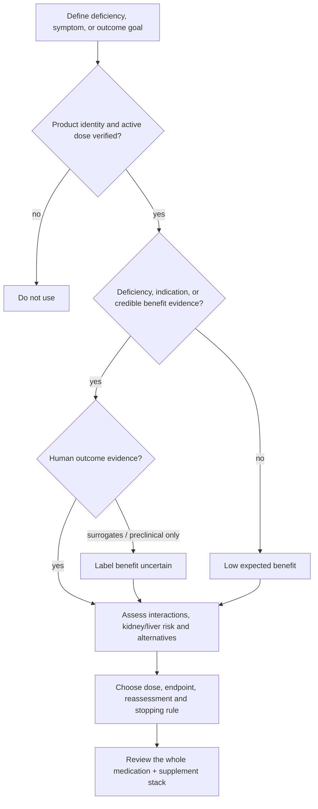
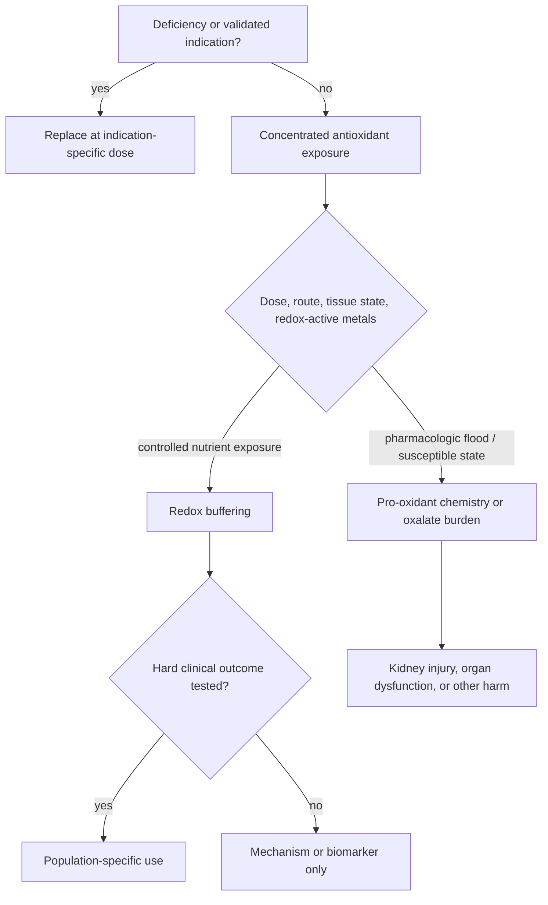
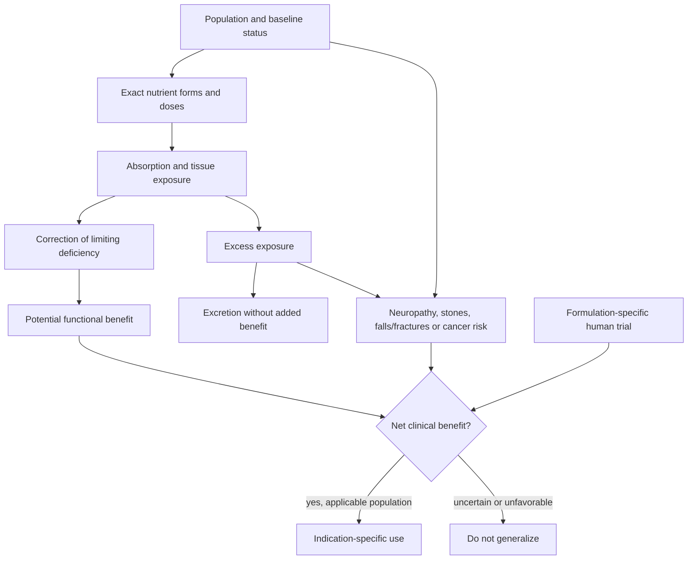

# Supplement evidence and safety

A supplement decision is a clinical inference under uncertainty, not a vote on whether a molecule is natural. The relevant chain runs from identity and dose to mechanism, target engagement, meaningful human outcomes, individual need, and net benefit. Animal lifespan extension, a plausible pathway, or movement in a surrogate biomarker supports a hypothesis; none alone proves that routine use improves human healthspan. Small, short trials also tend to measure convenient endpoints and may collectively look more persuasive than their ability to predict durable clinical benefit warrants. (@matt.kaeberlein (Healthspan Medicine) — "Longevity Doctors Rank the Most Hyped Supplements (AMA with Dr. Kaeberlein and Dr. Byrne)", 2026-04-03, [link](https://www.youtube.com/watch?v=yM-vL5J3BIA))

## Decision structure

```mermaid
flowchart TD
  G[Define deficiency, symptom, or outcome goal] --> ID{Product identity and active dose verified?}
  ID -->|no| STOP[Do not use]
  ID -->|yes| NEED{Deficiency, indication, or credible benefit evidence?}
  NEED -->|no| LOW[Low expected benefit]
  NEED -->|yes| OUT{Human outcome evidence?}
  OUT -->|yes| RISK[Assess interactions, kidney/liver risk and alternatives]
  OUT -->|surrogates / preclinical only| UNC[Label benefit uncertain]
  UNC --> RISK
  LOW --> RISK
  RISK --> PLAN[Choose dose, endpoint, reassessment and stopping rule]
  PLAN --> STACK[Review the whole medication + supplement stack]
```

Combining individually plausible compounds does not preserve their individual risk estimates. Supplements are bioactive small molecules, yet multi-product interaction data and systematic medication screening are often absent. Products marketed as natural alternatives may also reproduce pharmaceutical mechanisms: berberine can overlap mechanistically with metformin through mitochondrial electron-transport effects, and red yeast rice can contain a statin. Matt Kaeberlein’s contrarian formulation is that berberine is effectively an unregulated metformin-like intervention rather than an intrinsically gentler category; this is a mechanistic position, not evidence of equivalent clinical outcomes or quality control. (@matt.kaeberlein (Healthspan Medicine) — "Longevity Doctors Rank the Most Hyped Supplements (AMA with Dr. Kaeberlein and Dr. Byrne)", 2026-04-03, [link](https://www.youtube.com/watch?v=yM-vL5J3BIA))

## Antioxidants: redox biology is dose- and context-dependent

Reactive oxygen species are not merely damage. At controlled concentrations they participate in host defense and cellular signaling; at excessive concentrations they can oxidize lipids, proteins, and nucleic acids. An antioxidant can donate electrons to terminate one radical reaction yet become pro-oxidant under a different chemical environment, especially at pharmacologic concentrations and in the presence of redox-active metals. This makes the chain from antioxidant capacity in a test tube to clinical benefit unusually unreliable. (@DrBradStanfield (Dr Brad Stanfield) — "They Had to Stop This Vitamin C Trial Early", 2026-07-07, [link](https://www.youtube.com/watch?v=5gU4ydlgf_Y))

```mermaid
flowchart TD
  DEF[Deficiency or validated indication?] -->|yes| REP[Replace at indication-specific dose]
  DEF -->|no| EXP[Concentrated antioxidant exposure]
  EXP --> CTX{Dose, route, tissue state, redox-active metals}
  CTX -->|controlled nutrient exposure| BUF[Redox buffering]
  CTX -->|pharmacologic flood / susceptible state| PRO[Pro-oxidant chemistry or oxalate burden]
  BUF --> END{Hard clinical outcome tested?}
  PRO --> HARM[Kidney injury, organ dysfunction, or other harm]
  END -->|yes| USE[Population-specific use]
  END -->|no| UNC[Mechanism or biomarker only]
```

The 2026 VICTORY phase 3 trial tested intravenous vitamin C at 50 mg/kg every six hours for 96 hours in adults with severe burns. It stopped at its first prespecified interim analysis for futility or harm; because it stopped early with relatively few deaths, the direction is concerning but the exact mortality effect is imprecise. This was a pharmacologic intravenous exposure of roughly 14–16 g/day for a typical adult, not ordinary dietary intake or a direct trial of retail oral supplements. [VICTORY trial](https://pubmed.ncbi.nlm.nih.gov/42267875/) A prior trial used the same schedule in vasopressor-dependent sepsis: death or persistent organ dysfunction at day 28 occurred in 44.5% with vitamin C versus 38.5% with placebo (risk ratio 1.21, 95% CI 1.04–1.40). [LOVIT trial](https://pubmed.ncbi.nlm.nih.gov/35704292/) Proposed explanations include oxalate burden and iron-dependent pro-oxidant chemistry, but those mechanisms were not established as the causes of the clinical findings. (@DrBradStanfield (Dr Brad Stanfield) — "They Had to Stop This Vitamin C Trial Early", 2026-07-07, [link](https://www.youtube.com/watch?v=5gU4ydlgf_Y))

The prevention literature supplies a second, population-specific warning. High-dose beta-carotene increased lung-cancer risk in trials enrolling smokers or asbestos-exposed workers, and 400 IU/day of alpha-tocopherol increased prostate-cancer incidence by 17% after extended SELECT follow-up. [SELECT](https://pmc.ncbi.nlm.nih.gov/articles/PMC4169010/) The [USPSTF](https://www.uspreventiveservicestaskforce.org/uspstf/index.php/recommendation/vitamin-supplementation-to-prevent-cvd-and-cancer-preventive-medication) therefore recommends against beta-carotene or vitamin E supplementation to prevent cardiovascular disease or cancer in community-dwelling, nonpregnant adults. This does not prove that every antioxidant, chemical form, dose, or indication is harmful. It does show why a different form such as tocotrienols cannot be assumed safe or outcome-effective from short biomarker trials alone. (@DrBradStanfield (Dr Brad Stanfield) — "They Had to Stop This Vitamin C Trial Early", 2026-07-07, [link](https://www.youtube.com/watch?v=5gU4ydlgf_Y))

Indication can reverse the decision. In people with intermediate or advanced age-related macular degeneration, the tested AREDS2 formulation replaces beta-carotene with lutein and zeaxanthin and reduces progression risk without beta-carotene's lung-cancer concern in former smokers. That is evidence for a defined ophthalmic formulation in a defined disease stage, not for lutein, vitamin C, or vitamin E as general longevity supplements. The transcript also proposes that antioxidant supplements impair exercise adaptation in younger adults but help older adults, and suggests GlyNAC as a self-regulating alternative. Those age-stratified generalizations outrun the evidence reviewed here: exercise trials are heterogeneous in compound, dose, baseline status, training, and endpoint, while small GlyNAC studies do not establish clinical outcomes. Treat these as research hypotheses, not age-based supplement instructions. (@DrBradStanfield (Dr Brad Stanfield) — "They Had to Stop This Vitamin C Trial Early", 2026-07-07, [link](https://www.youtube.com/watch?v=5gU4ydlgf_Y))

## Multivitamins: formulation and population are the intervention

The category name multivitamin hides materially different doses, chemical forms, and target populations. AREDS and AREDS2 show the indication-specific end of the spectrum: in people with defined age-related macular degeneration, the tested antioxidant-and-mineral formula reduced progression to moderate vision loss, and replacing beta-carotene with the retinal carotenoids lutein and zeaxanthin reduced the lung-cancer concern, especially relevant to former smokers. In the comparison described, lung cancer occurred in 2% with the beta-carotene-containing version and 0.9% with the replacement formulation, while the updated formulation trended toward better eye outcomes. This does not generalize the AREDS2 formula to healthy adults or turn every multivitamin into eye therapy. (@DrBradStanfield (Dr Brad Stanfield) — "Multivitamins Are No Longer 'Expensive Urine'", 2026-08-18, [link](https://www.youtube.com/watch?v=lULieGSxVrU))

```mermaid
flowchart TD
  POP[Population and baseline status] --> FORM[Exact nutrient forms and doses]
  FORM --> ABS[Absorption and tissue exposure]
  ABS --> DEF[Correction of limiting deficiency]
  ABS --> EXC[Excess exposure]
  DEF --> OUT[Potential functional benefit]
  EXC --> WASTE[Excretion without added benefit]
  EXC --> HARM[Neuropathy, stones, falls/fractures or cancer risk]
  POP --> HARM
  TRIAL[Formulation-specific human trial] --> NET{Net clinical benefit?}
  OUT --> NET
  HARM --> NET
  NET -->|yes, applicable population| USE[Indication-specific use]
  NET -->|uncertain or unfavorable| AVOID[Do not generalize]
```

Water solubility does not make escalating dose useful. Riboflavin can turn urine bright yellow when surplus is excreted, illustrating limited marginal absorption rather than a clinical benefit. Pyridoxine excess is more consequential: the source reports Australia's warning requirement above 10 mg/day after neuropathy reports involving tingling, numbness, and burning feet, with tighter controls planned from 2027; changing to pyridoxal-5-phosphate does not establish freedom from the class risk. The same dose principle applies across nutrients: the transcript identifies high-dose vitamin C with kidney stones, high-dose vitamin D with falls and fractures, and high-dose vitamin E with prostate cancer. These examples support checking total exposure across overlapping products, not assuming that the recommended dietary allowance is a therapeutic target or that every amount above it is toxic. (@DrBradStanfield (Dr Brad Stanfield) — "Multivitamins Are No Longer 'Expensive Urine'", 2026-08-18, [link](https://www.youtube.com/watch?v=lULieGSxVrU))

The COSMOS randomized trial did not show that a daily multivitamin prevented cancer, cardiovascular disease, death, or longer life over roughly 3.5 years. Three cognitive substudies, pooled across 5,203 older adults in the transcript, found small improvements in global cognition and episodic memory over about two years. Patrick describes those score differences as roughly two years less global cognitive aging and 4.8 years less episodic-memory aging; those are scale translations, not observed rejuvenation, functional improvement, or years of dementia-free life. A later questionnaire analysis in 16,027 participants reported slightly fewer cardiovascular-related physical limitations; the 7.58-point difference in the carotid-stenosis subgroup was potentially noticeable but arose from only 122 people and is hypothesis-generating. These endpoint-specific results challenge the blanket claim that every multivitamin is merely waste, but they do not establish dementia prevention, cardiovascular-event reduction, or longevity. (@DrBradStanfield (Dr Brad Stanfield) — "Multivitamins Are No Longer 'Expensive Urine'", 2026-08-18, [link](https://www.youtube.com/watch?v=lULieGSxVrU)) (@FoundMyFitness (FoundMyFitness) — "Dr. Rhonda Patrick: Optimizing Longevity with Micronutrients & Vigorous Exercise", 2025-11-05, [link](https://www.youtube.com/watch?v=JelnAdNFL2M))

Evidence guidance and newer trials are in tension rather than cleanly contradictory. The 2022 USPSTF found insufficient evidence that multivitamins prevent cardiovascular disease or cancer. The source reports that the WHO's 2026 dementia-prevention guideline recommends against B vitamins, vitamin E, omega-3, and multivitamins for dementia risk reduction without diagnosed deficiency, but also states that the update did not reassess supplementation and did not include the COSMOS cognitive results. Brad Stanfield's contrarian position is that the recommendation is therefore substantively inherited from 2019 and underweights newer randomized cognitive evidence. The unresolved issue is clinical significance: a small cognitive-test difference over two years can coexist with insufficient evidence for dementia prevention. (@DrBradStanfield (Dr Brad Stanfield) — "Multivitamins Are No Longer 'Expensive Urine'", 2026-08-18, [link](https://www.youtube.com/watch?v=lULieGSxVrU))

Proposed nutrient synergy remains exploratory. A post hoc split of a two-year B-vitamin trial in older adults with mild memory problems associated higher baseline omega-3 status with about 40% less brain-volume loss under B vitamins. Because the comparison depends on baseline subgrouping and a neuroimaging endpoint, it does not establish that combining B vitamins with omega-3 prevents cognitive decline or dementia. Claims that chelated trace minerals, vitamin K2, boron, or magnesium make a generally superior formula likewise require finished-product outcome trials rather than absorption logic alone; Stanfield disclosed a commercial interest in his formulation advice. (@DrBradStanfield (Dr Brad Stanfield) — "Multivitamins Are No Longer 'Expensive Urine'", 2026-08-18, [link](https://www.youtube.com/watch?v=lULieGSxVrU)) [[omega-3-fatty-acids]]

## Examples and evidence tiers

**Creatine:** supplementation has substantial support for strength and lean-tissue goals, while cognitive and mood effects are less settled. Roughly half of 16–17 randomized depression trials summarized by Physionic were positive; possible concentration of benefit in diagnosed depression or with concurrent SSRI treatment remains a hypothesis. A small microbiome-product-plus-creatine trial lacked creatine-only and microbiome-only arms, preventing component attribution; see [[creatine-for-depression]]. (@Physionic (Physionic) — "I analyzed 1,000 Health Studies: Here are 10 Things I Learned", 2026-08-06, [link](https://www.youtube.com/watch?v=sx8MyamJf3g)) Vegetarians and vegans tend to have lower creatine stores and may have more room to respond. Creatine can raise serum creatinine without a true fall in filtration, complicating creatinine-based eGFR interpretation; cystatin C can help separate marker artifact from renal change. Expert consensus remains cautious in chronic kidney disease, although small dialysis studies and monitored clinical experience motivate the minority view that selected kidney-disease patients might benefit rather than face universal exclusion. This is a clinician-supervised research question, not a self-treatment recommendation. (@matt.kaeberlein (Healthspan Medicine) — "Longevity Doctors Rank the Most Hyped Supplements (AMA with Dr. Kaeberlein and Dr. Byrne)", 2026-04-03, [link](https://www.youtube.com/watch?v=yM-vL5J3BIA))

**Calcium:** the textbook case of substrate logic failing an outcome test. The intuition — bone is made of calcium, so supplying more should strengthen it — was falsified in two independent settings: supplementation did not slow astronaut bone loss in flight, and a 2017 analysis pooling about 51,000 people found calcium with or without vitamin D not linked to fewer fractures of any kind. The Auckland trials of Ian Reid and Mark Bolland, run expecting fracture benefit in supplemented older women, instead observed more heart attacks in the calcium group — an unsought safety signal the investigators maintained against years of industry and specialty pushback, later recognized with New Zealand's top science prize, with official US guidance shifting to advise against calcium supplements for fracture prevention in most people. The mineral itself remains necessary and is best obtained from food (dairy, leafy greens, fish); a clinician-directed supplement for documented deficiency or dairy avoidance is a separate indication. Mechanistically, bone responds to load rather than supply, which is why supplementation without a loading stimulus had nothing to act on ([[bone-remodeling-and-mechanical-loading]]). (@DrBradStanfield (Dr Brad Stanfield) — "NASA Found How To Stop Osteoporosis", 2026-08-12, [link](https://www.youtube.com/watch?v=bPviC3mFAxg))

**Vitamin D and K2:** vitamin D response varies with baseline status, environment, and physiology, reaches steady state over months, and can accumulate because it is fat-soluble; dosing should therefore follow a measured need rather than a universal longevity dose. K2 has a plausible role in bone biology and epidemiologic associations with less vascular calcification or coronary mortality, but supplementation outcome trials remain limited. Vitamins A, D, E, and K deserve particular overdose caution; high vitamin A intake can be hepatotoxic. (@matt.kaeberlein (Healthspan Medicine) — "Longevity Doctors Rank the Most Hyped Supplements (AMA with Dr. Kaeberlein and Dr. Byrne)", 2026-04-03, [link](https://www.youtube.com/watch?v=yM-vL5J3BIA))

Vitamin K2 nomenclature is clinically consequential. Trials summarized in hepatocellular carcinoma used 45 mg of the short-circulating MK-4 form alongside chemotherapy or immunotherapy and reported less progression than conventional treatment alone; this is an adjunctive signal, not prevention or stand-alone cancer treatment. It must not be converted to 45 mg of longer-circulating MK-7, which is ordinarily discussed in micrograms. Vitamin K participates in coagulation and can interact with anticoagulation, so oncology and prescribing clinicians must direct any use. (@Physionic (Physionic) — "I analyzed 1,000 Health Studies: Here are 10 Things I Learned", 2026-08-06, [link](https://www.youtube.com/watch?v=sx8MyamJf3g))

The vascular-calcification case for MK-7 has since been examined in its own right and remains unresolved: a 2026 two-year randomized trial in people with symptomatic coronary disease found slower coronary calcium progression, but no trial in this literature measures cardiovascular events, and lower calcification is not established as the desirable direction because calcified plaque is the more stable phenotype. See [[vitamin-k2]] for the mechanism, the trial base, and why the outcome question is the binding one. (@Physionic (Physionic) — "Could this change Everything about Vitamin K2 and Calcified Arteries? [New Study]", 2026-08-17, [link](https://www.youtube.com/watch?v=STML7Yugs70))

**Omega-3:** a higher red-cell EPA+DHA index is associated observationally with lower all-cause mortality and other favorable outcomes, but an association-defined target is not equivalent to randomized proof that supplementing every person to that target improves outcomes. Cognitive-trial syntheses report modest or null average effects with more apparent benefit at low baseline status, while randomized trials show a dose-related atrial-fibrillation signal that is larger above 1 g/day. Diet, baseline level, absolute arrhythmia risk, dose, product quality, and indication therefore matter; see [[omega-3-fatty-acids]]. (@matt.kaeberlein (Healthspan Medicine) — "Longevity Doctors Rank the Most Hyped Supplements (AMA with Dr. Kaeberlein and Dr. Byrne)", 2026-04-03, [link](https://www.youtube.com/watch?v=yM-vL5J3BIA)) (@NutritionMadeSimple (Nutrition Made Simple!) — "Watch This Before You Take Fish Oil (Protect Your Heart)", 2026-08-10, [link](https://www.youtube.com/watch?v=GpzX3NQzmio))

**Taurine and astaxanthin:** taurine has multi-species preclinical longevity findings, but later studies question whether circulating taurine consistently declines with age, and reproducible mouse lifespan extension has not reached the level Kaeberlein considers first-tier evidence. Astaxanthin has biological activity and several short human trials, mainly on surrogate oxidative, inflammatory, or lipid endpoints, without established long-term clinical benefit. Both remain emerging rather than general longevity prescriptions. (@matt.kaeberlein (Healthspan Medicine) — "Longevity Doctors Rank the Most Hyped Supplements (AMA with Dr. Kaeberlein and Dr. Byrne)", 2026-04-03, [link](https://www.youtube.com/watch?v=yM-vL5J3BIA))

**Sulforaphane products:** plants contain glucoraphanin, and tissue disruption releases myrosinase that converts it to sulforaphane; product formulation therefore determines whether the claimed active molecule can be generated. Sulforaphane can engage NRF2-related biomarkers, but human outcome evidence is sparse, the molecule is unstable, and products lacking active sulforaphane or the precursor-enzyme combination may not reproduce food chemistry. Eating cruciferous vegetables is better supported than treating a branded extract as a proven geroprotector. (@matt.kaeberlein (Healthspan Medicine) — "Longevity Doctors Rank the Most Hyped Supplements (AMA with Dr. Kaeberlein and Dr. Byrne)", 2026-04-03, [link](https://www.youtube.com/watch?v=yM-vL5J3BIA))

**CoQ10 and lithium orotate:** statins lower circulating CoQ10, but trials of CoQ10 for statin-associated muscle symptoms are mixed and routine co-supplementation is not expert consensus. Low-dose lithium-orotate longevity use lacks established clinical benefit; SGLT2 inhibitors can increase urinary lithium loss, documented at psychiatric lithium doses, so changing a lithium dose by mechanistic extrapolation alone is unsafe. Very-high-dose rodent orotic-acid liver findings do not directly establish low-dose human harm, but neither do they prove chronic safety. (@matt.kaeberlein (Healthspan Medicine) — "Longevity Doctors Rank the Most Hyped Supplements (AMA with Dr. Kaeberlein and Dr. Byrne)", 2026-04-03, [link](https://www.youtube.com/watch?v=yM-vL5J3BIA))

Kaeberlein ranks low-dose lithium orotate unusually highly based on repeated ecological associations between lithium in drinking water and lower suicide, dementia, or mortality rates, plus a 2025 mouse study reporting brain-region lithium depletion and benefit from lithium orotate in Alzheimer-like models. This is a contrarian risk–reward judgment: ecological correlation and disease-model rescue do not establish that healthy people benefit, and the transcript supplies no randomized human prevention trial. Conversely, CoQ10 is a required mitochondrial electron carrier, but biochemical necessity does not show that adding more improves aging in replete healthy people. (@matt.kaeberlein (Healthspan Medicine) — "Dr. Matt Ranks Longevity Supplements: The Winners and Total Scams", 2026-02-15, [link](https://www.youtube.com/watch?v=mD_DfRDXklc))

**Glucosamine:** the common joint supplement illustrates how the same molecule can carry opposite associations in different populations. Prospective cohorts of cognitively healthy users show null-to-reduced dementia risk, while a 2026 Nature Metabolism study combining brain glycomics with cohort follow-up associated glucosamine use with faster progression from mild cognitive impairment to Alzheimer's disease and with higher mortality in established Alzheimer's — adjusted only for age, sex, and demographics. The reconciling variable appears to be baseline cognitive state, making this a state-dependent safety question rather than a general warning; see [[glucosamine]]. (@Physionic (Physionic) — "Glucosamine: More Death, More Alzheimer's Disease - New Study!", 2026-07-30, [link](https://www.youtube.com/watch?v=MqZku0O93k8))

**Senolytic and mitochondrial candidates:** fisetin is marketed as a senolytic, yet reported mouse lifespan effects have not reproduced consistently and human trials had not supplied a strong efficacy signal in the transcript. The record has since firmed up in the negative direction: the NIA Interventions Testing Program — the same protocol run in three laboratories on genetically heterogeneous mice — found no lifespan extension in either sex and, measuring p16 by antibody-independent qPCR, no reduction in senescent-cell burden; and the first randomized double-blind placebo-controlled human trial (74 people with knee osteoarthritis, intermittent senolytic dosing) found no improvement in pain, function, or the joint versus placebo. The supplement labels were launched principally by a single 2018 mouse paper, a case study in marketing outrunning both measurement and evidence; the reagent scandal behind much of the surrounding senescence literature is described in [[cellular-senescence]]. (@DrBradStanfield (Dr Brad Stanfield) — "The Anti-Aging Supplement Everyone Took Never Worked", 2026-06-30, [link](https://www.youtube.com/watch?v=cy5ntNFqWoM)) Urolithin A, a gut-derived ellagitannin metabolite proposed to promote mitophagy, has reproducible worm lifespan findings, mouse healthspan signals, and small directionally favorable human muscle or mitochondrial trials; the likely effect, if real, is modest. Resveratrol's original yeast-longevity story is disputed, and a broad cross-organism synthesis described in the transcript found no lifespan effect, although condition-specific human metabolic effects remain possible. Pentadecanoic acid (C15:0, marketed as Fatty15) is associated with dairy intake and favorable observational outcomes but lacks intervention evidence establishing that supplementation causes benefit. (@matt.kaeberlein (Healthspan Medicine) — "Dr. Matt Ranks Longevity Supplements: The Winners and Total Scams", 2026-02-15, [link](https://www.youtube.com/watch?v=mD_DfRDXklc))

**Extracts and proprietary blends:** a fucoidan mouse lifespan report used a dose that Kaeberlein estimates would translate very roughly to tens of grams per day in humans, far above typical products; one laboratory and an impractical exposure make it hypothesis-generating. A proprietary blend further prevents component attribution and may vary in purity or activity between batches. Marketing a mixture as anti-aging does not identify an active ingredient, validated dose, or clinical outcome. (@matt.kaeberlein (Healthspan Medicine) — "Dr. Matt Ranks Longevity Supplements: The Winners and Total Scams", 2026-02-15, [link](https://www.youtube.com/watch?v=mD_DfRDXklc))

**Collagen peptides, probiotics, and gummy formulation:** small studies suggest orally consumed collagen peptides may reach tissues and modestly improve wrinkles or skin hydration through fibroblast signaling, but product dose, formulation, co-ingredients, and outcome evidence remain limited. A 2023 meta-analysis of 26 randomized trials concluded collagen peptide supplements significantly improved skin hydration and elasticity, and randomized trials of oral hyaluronic acid at 200 mg/day report measurably better hydration and shallower wrinkles — trial-level skin-surrogate evidence for two of the better-tested cosmetic supplements, though the endpoints are instrumental skin measurements rather than outcomes people can necessarily see, and this wiki has not yet reviewed the underlying trials for duration, independence, or formulation comparability. Neither approaches the evidence position of sunscreen and topical retinoids for skin aging ([[photoprotection]], [[topical-retinoids]]). (@DrBradStanfield (Dr Brad Stanfield) — "$12 Sunscreen Beats Every Anti-Aging Cream", 2026-06-25, [link](https://www.youtube.com/watch?v=vYgxQ9BOKng)) Adding probiotics does not make a product universally beneficial, and prebiotic substrate can generally be obtained from varied plant foods. Multi-ingredient gummies add a manufacturing problem: consistent distribution of several actives across individual chews is difficult to infer from the label alone. (@DrDrayzday (Dr Dray) — "Costco Skincare: What’s Actually Worth Buying? | Dermatologist Shops", 2026-08-10, [link](https://www.youtube.com/watch?v=JukyC7WttqI))

**High-dose biotin:** biotin supplementation has not been shown to improve hair growth in people without deficiency, which is uncommon. Very high doses can interfere with assays that use biotinylated reagents, including some thyroid and cardiac tests, and may cause acne-like eruptions in some users. Thus a hair-and-nails product can create diagnostic risk without a credible benefit for a biotin-replete person. (@DrDrayzday (Dr Dray) — "Costco Skincare: What’s Actually Worth Buying? | Dermatologist Shops", 2026-08-10, [link](https://www.youtube.com/watch?v=JukyC7WttqI))

**Creatine gummies:** creatine can degrade in water, and acidic gummy formulations may accelerate loss during manufacture or storage. A label claim therefore does not guarantee that a gummy still delivers the intended dose. Certificates of analysis, lot-specific independent testing, and recognized sport-certification programs reduce uncertainty but do not make a brand universally reliable. Gummies can improve adherence for people who dislike powder, but their calories count toward intake; the usual 3–5 g/day regimen described in the interview concerns creatine use generally, not proof that every gummy formulation delivers it. (@maxlugavere (Max Lugavere) — "Carbs Don’t Make You Fat: 10 Health Myths That Need to Die", 2026-08-05, [link](https://www.youtube.com/watch?v=TqcKy8yuc1U))

## Practical implications

- **When choosing creatine: prefer a simple formulation with credible independent verification; use gummies only when they improve adherence — moderate for formulation logic, strong for checking delivered dose.** Count the gummy’s energy and avoid inferring stability from the amount originally added. (@maxlugavere (Max Lugavere) — "Carbs Don’t Make You Fat: 10 Health Myths That Need to Die", 2026-08-05, [link](https://www.youtube.com/watch?v=TqcKy8yuc1U))

- **Before starting: define a deficiency, symptom, or outcome and review the entire medication-and-supplement list — strong.** Prefer interventions with human clinical outcomes; record the baseline measure, expected time to response, and stopping rule.
- **If a multivitamin is being considered: use one daily only after reviewing diet, indication, and the full label; avoid megadoses and overlapping products — moderate for harm minimization, limited for general cognitive benefit.** A small COSMOS cognitive signal in older adults does not establish dementia, cardiovascular-event, cancer, or survival benefit. Prefer a credibly third-party-tested finished product and do not treat chelation or a long ingredient list as proof of effectiveness. (@DrBradStanfield (Dr Brad Stanfield) — "Multivitamins Are No Longer 'Expensive Urine'", 2026-08-18, [link](https://www.youtube.com/watch?v=lULieGSxVrU))
- **For diagnosed intermediate or advanced age-related macular degeneration: use the clinician-directed AREDS2 formulation, not a generic multivitamin — strong and indication-specific.** Avoid beta-carotene-containing formulas in current or former smokers; lutein and zeaxanthin are the tested replacement. (@DrBradStanfield (Dr Brad Stanfield) — "Multivitamins Are No Longer 'Expensive Urine'", 2026-08-18, [link](https://www.youtube.com/watch?v=lULieGSxVrU))
- **If tingling, numbness, or burning pain develops while using B6-containing products: stop self-escalation and seek medication-and-supplement review promptly — strong safety precaution.** Add B6 across the entire stack; changing its chemical form does not negate dose-related neuropathy concern. (@DrBradStanfield (Dr Brad Stanfield) — "Multivitamins Are No Longer 'Expensive Urine'", 2026-08-18, [link](https://www.youtube.com/watch?v=lULieGSxVrU))
- **Do not use high-dose intravenous vitamin C for severe burns or vasopressor-dependent sepsis outside a research protocol — strong for lack of benefit and a concerning harm signal in the studied ICU populations.** These results do not establish harm from food-level vitamin C, but they refute the assumption that more antioxidant exposure is automatically protective. (@DrBradStanfield (Dr Brad Stanfield) — "They Had to Stop This Vitamin C Trial Early", 2026-07-07, [link](https://www.youtube.com/watch?v=5gU4ydlgf_Y))
- **Do not take beta-carotene or vitamin E to prevent cardiovascular disease or cancer — strong for community-dwelling, nonpregnant adults.** This is USPSTF guidance; beta-carotene is particularly hazardous for current or former smokers and people with asbestos exposure. A clinician-recommended AREDS2 formula for eligible macular degeneration is a different indication and formulation. (@DrBradStanfield (Dr Brad Stanfield) — "They Had to Stop This Vitamin C Trial Early", 2026-07-07, [link](https://www.youtube.com/watch?v=5gU4ydlgf_Y))
- **At initiation or dose change: use a verified product and conservative dose, then reassess at a pharmacologically sensible interval — moderate.** For vitamin D, steady-state reassessment requires months rather than next-day testing; exact timing belongs with a clinician.
- **Periodically: remove products without a clear indication, observed benefit, or credible evidence — moderate.** Do not infer safety from natural origin or benefit from a shifted surrogate alone.
- **When comparing longevity products: rank human outcomes and replicated evidence above mechanistic novelty, then compare expected effect with exercise, sleep, nutrition, and indicated care — strong decision principle.** Do not use fisetin, resveratrol, C15:0, CoQ10, urolithin A, or fucoidan as substitutes for higher-impact foundations; evidence is insufficient for routine longevity use in healthy people. (@matt.kaeberlein (Healthspan Medicine) — "Dr. Matt Ranks Longevity Supplements: The Winners and Total Scams", 2026-02-15, [link](https://www.youtube.com/watch?v=mD_DfRDXklc))
- **Do not take calcium supplements for fracture prevention without a clinician-identified indication; meet calcium needs from food — strong for the null fracture benefit (pooled ~51,000 people) and reflected in US guidance; the cardiovascular-harm signal is credible but less settled.** For bone, the effective self-directed lever is progressive loading, not supplemental substrate ([[bone-remodeling-and-mechanical-loading]], [[resistance-training]]). (@DrBradStanfield (Dr Brad Stanfield) — "NASA Found How To Stop Osteoporosis", 2026-08-12, [link](https://www.youtube.com/watch?v=bPviC3mFAxg))
- **With kidney disease, liver disease, pregnancy, or interacting prescriptions: do not self-experiment — strong.** Creatine, lithium, fat-soluble vitamins, red yeast rice, and berberine all illustrate why context changes risk.
- **Before laboratory testing or urgent evaluation: disclose biotin and every other supplement — strong.** Avoid high-dose biotin for hair growth without diagnosed deficiency; ask the ordering clinician or laboratory how long it should be withheld because the interval depends on dose and assay. (@DrDrayzday (Dr Dray) — "Costco Skincare: What’s Actually Worth Buying? | Dermatologist Shops", 2026-08-10, [link](https://www.youtube.com/watch?v=JukyC7WttqI))

## Gaps & open questions

- How quickly does creatine degrade across commercial gummy matrices, storage conditions, and shelf lives, and how often do lot-specific assays match labels?

- Which supplement biomarkers are validated treatment targets rather than correlates of diet or health status?
- What mechanism produced the VICTORY harm signal, and does risk depend on burn severity, iron availability, kidney function, or infusion exposure?
- Do tocotrienols improve any long-term clinical outcome, and what chronic safety data distinguish them from high-dose alpha-tocopherol?
- Which antioxidant compound, baseline status, age group, and training endpoint explain apparently conflicting exercise-adaptation trials?
- Is the calcium-supplement cardiovascular signal causal and dose-dependent, and does food-source calcium behave differently in vascular tissue?
- How often do common multi-supplement stacks create clinically important interactions?
- Can creatine benefit selected chronic-kidney-disease populations without accelerating harm, and how should renal function be measured?
- Which sulforaphane formulations reliably deliver target engagement, and does it produce meaningful clinical outcomes?
- Do taurine, astaxanthin, K2, or low-dose lithium improve morbidity or mortality in adequately powered human trials?
- Can lithium-orotate prevention benefits be separated from ecological confounding and reproduced without chronic renal, thyroid, or neurological harm?
- Do urolithin A or fisetin improve function or clinical outcomes in adequately powered human trials, and which baseline state predicts response?
- Does adjunctive MK-4 improve hepatocellular-carcinoma survival in adequately controlled trials, and which standard regimens and patients benefit?
- Which baseline omega-3 status and absolute arrhythmia-risk combinations produce a favorable net benefit from supplementation?
- Does the glucosamine–Alzheimer's-progression association survive fuller confounder adjustment, and should MCI diagnosis trigger routine supplement deprescribing review?
- Which oral collagen-peptide preparations, doses, and populations produce clinically meaningful rather than merely measurable skin benefit?
- How variable are active doses within multi-ingredient gummies, and which assay platforms remain vulnerable to common over-the-counter biotin doses?
- Do the small COSMOS cognitive-score effects persist, improve daily function, or reduce incident mild cognitive impairment or dementia, and which baseline deficiencies mediate response?
- Does the carotid-stenosis physical-function subgroup replicate prospectively, or is it a chance subgroup result?
- Does baseline omega-3 status genuinely modify B-vitamin effects on cognition or clinical dementia rather than brain-volume imaging alone?

## Related

[[practice-playbook]] · [[aging-model]] · [[bone-remodeling-and-mechanical-loading]] · [[nad-supplementation]] · [[experimental-peptides]] · [[nattokinase]] · [[vitamin-k2]] · [[glucosamine]] · [[caloric-restriction-and-meal-timing]] · [[creatine-for-depression]] · [[omega-3-fatty-acids]] · [[nutrition-evidence-and-personalization]] · [[hair-loss-diagnosis-and-scalp-health]] · [[skincare-evidence-and-routine-design]] · [[dr-dray]]
