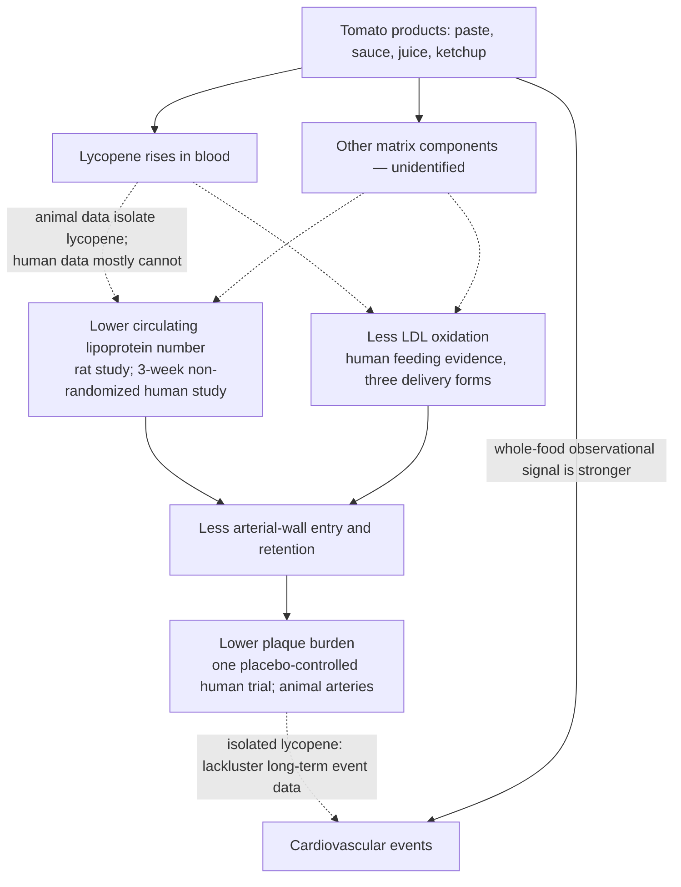

# Tomato products and lycopene

Lycopene is the red carotenoid pigment of tomatoes and the most studied molecule in tomato-based foods — paste, sauce, juice, and even ketchup all deliver it. Its cardiovascular interest rests on two linked observations: intervention evidence that lycopene can reduce arterial plaque, and a mechanistic account running through the lipoprotein pathway that causes atherosclerosis ([[lipoprotein-retention-and-atherogenesis]]). The instructive complication is attributional: most of the human evidence used whole tomato foods rather than isolated lycopene, and the long-term outcome evidence is stronger for the foods than for the molecule — making this page a worked example of the food-matrix principle ([[nutrition-evidence-and-personalization]]).

## Plaque evidence

A human intervention trial with a placebo group reported that lycopene supplementation can reduce arterial plaque buildup — an acceleration of regression rather than only slowed progression. Animal experiments agree directionally: excised arteries from lycopene-supplemented animals show visibly and quantitatively lower plaque burden than controls. Plaque is an imaging/anatomy endpoint, not an event endpoint; the distinction matters below. (@Physionic (Physionic) — "A Difficult Heart Disease Effect of Tomato based Products", 2026-07-16, [link](https://www.youtube.com/watch?v=Yn7Vgnj_G5g))

The same randomized trial (Zou et al. 2014, carotid intima-media thickness in Chinese adults with subclinical atherosclerosis) also contained a lutein-only arm, and lutein alone improved the arterial endpoint over the 12 months as well — so the regression signal in this trial is not exclusive to lycopene, and the two carotenoids share the same larger evidence pattern: an intermediate-endpoint benefit that has not translated into cardiovascular events in any outcome study to date ([[lutein]]). (@Physionic (Physionic) — "1 Year of Lutein: Reversing Arterial Plaque", 2026-07-09, [link](https://www.youtube.com/watch?v=DYedJh6-1jo))

## Mechanisms: fewer particles, less oxidation

Two mechanisms have human-adjacent support, both acting on the causal chain in which cholesterol-carrying lipoproteins (dominantly LDL) enter and are retained in the arterial wall.

**Lowering circulating lipoprotein burden.** In rats under controlled nutrition, lycopene reduced cholesterol-containing lipoproteins in blood. In a human study, tomato-juice consumption reduced blood lipoprotein concentrations, with a larger reduction in the high-juice group than the low-juice group. That human study ran only three weeks and was not a randomized controlled trial, so it is consistent with the animal data but needs corroboration. Fewer circulating particles means fewer opportunities for arterial-wall capture. (@Physionic (Physionic) — "A Difficult Heart Disease Effect of Tomato based Products", 2026-07-16, [link](https://www.youtube.com/watch?v=Yn7Vgnj_G5g))

**Reducing LDL oxidation.** Oxidative modification of LDL is linked to greater retention in the arterial wall and plaque growth — a particle-quality effect distinct from particle number. Human feeding evidence across three delivery forms — spaghetti sauce, tomato juice, and tomato-based pills — showed reduced LDL oxidation on two different oxidation measures. So tomato exposure may improve both how many particles circulate and how likely each is to be damaged and retained. (@Physionic (Physionic) — "A Difficult Heart Disease Effect of Tomato based Products", 2026-07-16, [link](https://www.youtube.com/watch?v=Yn7Vgnj_G5g))

## The attribution problem and the outcome hierarchy

Because the interventions mostly delivered tomato paste, sauce, juice, or ketchup, the measured effects cannot be assigned exclusively to lycopene even where blood lycopene demonstrably rose — the foods contain more than lycopene. Some animal studies did isolate the molecule, so it is fair to say some of the effect, possibly a majority, is lycopene's; exclusivity is what the evidence cannot support. That reservation matches the outcome data: for isolated lycopene, long-term cardiovascular-disease endpoints such as heart attacks are lackluster despite the plaque and mechanism findings, whereas tomato products as a whole show benefits against cardiovascular disease under comparable observational conditions. The stronger evidence therefore favors consuming the food, not isolating the molecule. (@Physionic (Physionic) — "A Difficult Heart Disease Effect of Tomato based Products", 2026-07-16, [link](https://www.youtube.com/watch?v=Yn7Vgnj_G5g)) An earlier synthesis on this wiki reached the same gradient — higher blood lycopene correlates with less plaque, one randomized trial reported regression, yet the independent outcome benefit belongs to tomato foods — recorded at [[nutrition-evidence-and-personalization]].

By the wiki's outcome hierarchy, this evidence sits at mechanism and intermediate-anatomy level for lycopene (lipoprotein counts, oxidation measures, plaque imaging) and at observational-outcome level for tomato foods. None of it is an event-endpoint randomized trial, and reduced LDL oxidation in particular is a biomarker, not a validated surrogate.

## A prostate footnote with the same attribution problem

Lycopene-containing foods (cooked tomatoes, watermelon) are also cited in urologic teaching as supportive of prostate health, folded into diet advice for preventing benign prostatic enlargement alongside vegetables and a Mediterranean-style pattern ([[benign-prostatic-hyperplasia]]). The evidence there is association-level and food-based, so it inherits this page's attribution caveat unchanged: the food pattern, not the isolated molecule, is the evidence-bearing unit. The same source notes that for men already symptomatic from prostate enlargement, tomato-based products can act as a bladder irritant in a subset — a symptom-stage distinction, not a contradiction of the food-level association. (@RenaMalikMD (Rena Malik, M.D.) — "Why Men Care So Much About Squirting — And What Actually Matters", 2026-08-28, [link](https://www.youtube.com/watch?v=55KdS4gS6k4))

## Gaps & open questions

- Which non-lycopene components of the tomato matrix contribute to the lipoprotein, oxidation, and outcome signals — and would any reproduce them alone?
- The human lipoprotein-lowering finding rests on a three-week non-randomized study; no adequately powered RCT confirms the particle-number effect or quantifies it against established lipid therapy.
- No randomized trial links tomato products or lycopene to cardiovascular events; the whole-food advantage is observational and could partly reflect the dietary patterns tomato foods travel in.
- Effective dose, preparation effects (cooking and fat co-ingestion alter carotenoid bioavailability), and duration needed for any plaque effect are unquantified in this record.
- Whether reduced LDL-oxidation measures translate into fewer events is itself unestablished ([[lipoprotein-retention-and-atherogenesis]]).

## Practical implications

- **Eat tomato-based products a few times per week within a healthy pattern — moderate observational evidence for cardiovascular benefit; the effect size is supportive, not large.** Sauce, paste, juice, and cooked tomatoes all raise lycopene; the food form is the evidence-bearing unit. (@Physionic (Physionic) — "A Difficult Heart Disease Effect of Tomato based Products", 2026-07-16, [link](https://www.youtube.com/watch?v=Yn7Vgnj_G5g))
- **Do not use lycopene supplements as a plaque or lipid therapy.** The long-term event data for the isolated molecule are lackluster, and supplementation must not displace established lipid, blood-pressure, smoking, diet, and activity interventions ([[lipoprotein-retention-and-atherogenesis]], [[nutrition-evidence-and-personalization]]).

## Related

[[nutrition-evidence-and-personalization]] · [[lipoprotein-retention-and-atherogenesis]] · [[dietary-fat-quality-and-cardiovascular-risk]] · [[supplement-evidence-and-safety]] · [[lutein]] · [[anthocyanins-and-cardiovascular-health]] · [[cheese-and-mortality]] · [[nut-consumption-and-mortality]] · [[benign-prostatic-hyperplasia]] · [[practice-playbook]]
