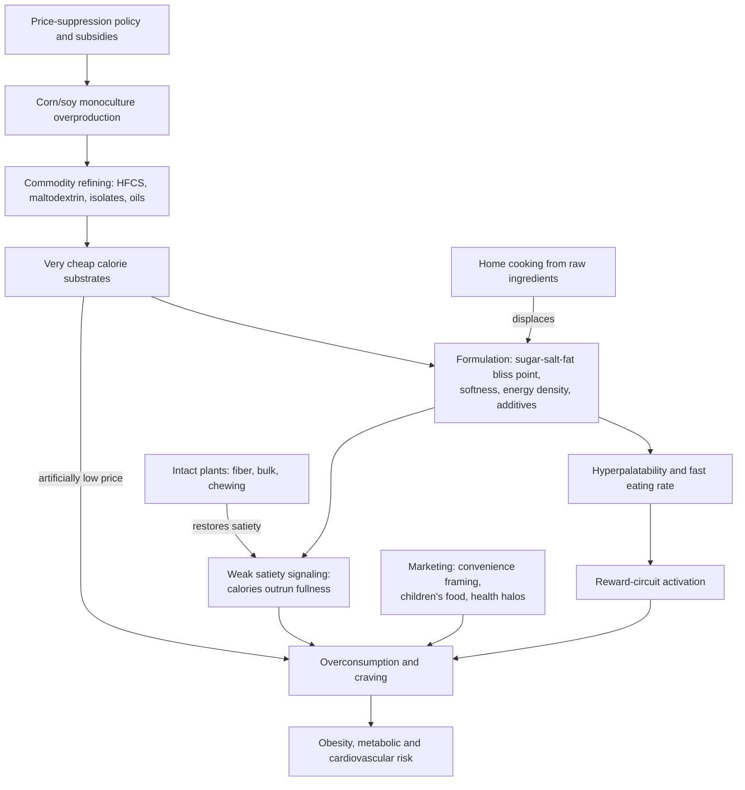

# Ultra-processed food

Ultra-processed foods (UPFs) are industrial formulations assembled largely from refined substrates — starches, sugars, extracted oils, protein isolates — plus additives for texture, shelf life, color, and palatability. Michael Pollan's working folk definition is foods you need a factory to make that contain ingredients no normal person has in their pantry; the category now supplies an estimated 50–60% of foods eaten in countries like the UK and US (Tim Spector's figure). This page covers the production economics, the engineering of overconsumption, and identification; the appetite physiology UPFs exploit is developed at [[satiety-oriented-diet-design]], and the evolved vulnerability they target at [[evolutionary-mismatch-and-weight-regulation]]. (@joinzoe (ZOE) — "Michael Pollan: The TRUTH about junk food and why you can’t stop eating", 2026-05-28, [link](https://www.youtube.com/watch?v=2H1kqw-uyM0))

## From monoculture to formulation

The supply side is upstream of the factory. US agriculture consolidated around corn and soy monocultures after 1970s policy under agriculture secretary Earl Butz deliberately drove down food prices by incentivizing single-crop planting and farm consolidation; the resulting commodity corn is inedible as harvested — hard, starch-dense kernels that must pass through corn refineries to become food inputs. Refining decomposes the crop into the ingredient list of ultra-processed food: maltodextrin, high-fructose corn syrup (a major food-supply presence only from the early 1980s), soy lecithin, and dozens of other starch derivatives. Pollan reports isotope work suggesting a majority of dietary carbon in Americans traces to corn — a vivid provenance claim, not itself evidence of harm; the harm argument is that these fractions rebuild into calorie-dense, fiber-poor products. Overproduction then requires disposal: sweetening formerly unsweetened products (tomato sauce, ketchup, bread) is one route, biofuels another. The EU pattern is parallel with wheat and subsidized sugar beet. Because grain commodities — unlike perishable produce — can be stored and subsidized without waste, US and EU subsidies flow disproportionately to the raw materials of the least healthy calories, making UPFs artificially cheap relative to whole foods. All of this is historical and economic narrative from a well-sourced journalist, corroborated in outline by agricultural-policy history but not independently verified here. (@joinzoe (ZOE) — "Michael Pollan: The TRUTH about junk food and why you can’t stop eating", 2026-05-28, [link](https://www.youtube.com/watch?v=2H1kqw-uyM0))

## Engineered overconsumption

The defining functional property is that these products are formulated to be eaten past fullness. Spector describes decades of laboratory optimization of the sugar–salt–fat combination toward a "bliss point" that maximally activates dopamine-linked reward circuitry while overriding fullness signaling — the same satiety pathway GLP-1 drugs act on pharmacologically ([[glp-1-receptor-agonists]]). Energy density compounds this: with little water or fiber, calories per bite are high and arrive faster than satiety feedback, and the flavor is engineered to peak immediately with little lingering finish, so slow eating buys nothing. The industry's own vocabulary — "crave-ability" and "snack-ability," per Pollan — states the design goal. His sharpest framing is the contrast with home cooking: a parent cooks to satisfy, the industry formulates to maximize consumption, and "cravings are desires you've lost control of." (@joinzoe (ZOE) — "Michael Pollan: The TRUTH about junk food and why you can’t stop eating", 2026-05-28, [link](https://www.youtube.com/watch?v=2H1kqw-uyM0)) The controlled-feeding physiology behind eating rate, texture, and distal nutrient sensing is at [[satiety-oriented-diet-design]].

**Is this addiction?** Pollan's documented position shift is itself informative: he long treated "food addiction" as metaphor, but now accepts it as a fair description on the dopamine model of addiction, citing researchers he has interviewed. This remains expert interpretation of a contested construct — the dopamine model is itself debated, food addiction lacks the withdrawal syndrome and diagnostic consensus of substance dependence, and the claim should be read as one credible framing rather than settled science. Spector adds the behavioral phenotype: a subset of people report near-continuous craving of these products, cigarette-like in persistence. (@joinzoe (ZOE) — "Michael Pollan: The TRUTH about junk food and why you can’t stop eating", 2026-05-28, [link](https://www.youtube.com/watch?v=2H1kqw-uyM0))

Pollan draws a manipulation parallel to tobacco — the same conglomerates bought food companies from the 1970s–80s, and he asserts (without documentary evidence in this episode) that internal documents are now being destroyed to avoid the discovery process that undid cigarette denial. The ownership history is factual; the document-destruction claim is an attributed allegation and recorded as such. (@joinzoe (ZOE) — "Michael Pollan: The TRUTH about junk food and why you can’t stop eating", 2026-05-28, [link](https://www.youtube.com/watch?v=2H1kqw-uyM0))

## The displacement of cooking and the shared meal

UPFs did not only add calories; they displaced a practice. The industry positioned ready-to-eat food as the resolution of the postwar household-labor conflict — Pollan recounts KFC billboards captioned "Women's Liberation" — ending, rather than completing, the renegotiation of domestic cooking. Ready-meal marketing then segmented households (different products for each family member), which observational anthropology commissioned by a food manufacturer found had hollowed out the family meal even where families still reported having one. Pollan's cultural claim — he has called the family dinner table the "nursery of democracy" — is values argument, not health evidence; the health-relevant mechanism is that cooking from raw ingredients approximately caps energy density, additive load, and eating rate without any tracking, and that cooking skills transmission (home economics education has been dropped in both the US and UK) is a population-level exposure determinant. Children's menus as a category — chicken fingers, fries, pizza — are historically novel and largely Anglophone. (@joinzoe (ZOE) — "Michael Pollan: The TRUTH about junk food and why you can’t stop eating", 2026-05-28, [link](https://www.youtube.com/watch?v=2H1kqw-uyM0))

## Identification, and the decay of the grandmother rule

Pollan's food rules — avoid what your great-grandmother wouldn't recognize as food; be wary past roughly five ingredients; avoid ingredients absent from any home pantry or unpronounceable by a child — were designed as consumer heuristics. The episode records their partial obsolescence, conceded by both participants: manufacturers now engineer traditional appearance (happy-farmer packaging, short-looking lists, "plant-based" claims — sugar and refined corn derivatives are plants), and the host's supermarket hot cross bun — a food his grandmother literally made — scanned as high-risk UPF on ingredient inspection. Packaged bread is the exemplar: bread needs about three ingredients, but industrial versions add chemical leaveners, ten-day anti-staling preservatives, and colorings. The durable form of the rule is therefore back-label inspection ([[food-label-literacy-and-health-halos]]), and Spector's answer is scientific classification by measured properties — hyperpalatability, energy density, eating rate, additive profile — implemented in ZOE's app, which is a direct commercial interest disclosed here. (@joinzoe (ZOE) — "Michael Pollan: The TRUTH about junk food and why you can’t stop eating", 2026-05-28, [link](https://www.youtube.com/watch?v=2H1kqw-uyM0))

## Protein fortification and the limits of the category

The protein boom is the current test of whether "ultra-processed" is one category or a gradient. Supermarkets now carry protein-enriched chips, donuts, pretzels, Pop-Tarts, and cereals, and the enrichment is a marketing lever: it earns a front-of-package claim and a price premium. Two separable questions follow. On protein quality, the added protein is often the cheapest available rather than the most useful — rice protein scores poorly (below wheat, quinoa, and legumes); one high-protein pretzel is fortified entirely with wheat gluten, effectively macro-dosing a single low-quality protein. On whether fortification redeems the product, the honest answer is partly. Nutrition researcher Ty Beal's position is that there is little evidence protein in highly processed foods is beneficial, that a high-protein cookie can still be overeaten because refined extracted protein does not confer the satiety of whole-food protein, and that the 2026 dietary guidelines' emphasis on plant and animal *food sources* of protein exists for this reason — but he accepts them as legitimate post-workout convenience and grants that a higher-protein UPF is preferable to a low-protein one ([[nutrient-density-and-food-profiling]]). A randomized comparison relayed in a second source points the same way: people still overconsume protein-enriched ultra-processed foods, but less than they overconsume low-protein equivalents, plausibly through protein's satiety effect or protein leverage. (@maxlugavere (Max Lugavere) — "Top Nutrition Scientist: Eat These Foods to FIGHT Weight Gain and Disease", 2026-06-03, [link](https://www.youtube.com/watch?v=fqsSqG5Ff7c)) (@maxlugavere (Max Lugavere) — "The Protein Expert: Fat Loss Gets EASIER When You Understand This - Angelo Keely", 2026-06-01, [link](https://www.youtube.com/watch?v=XTWDoFs4PE8))

Protein fortification is also worth contrasting with fiber fortification, where the two nutrients behave differently under extraction. Isolated high-quality protein — whey in particular — retains its amino-acid function outside a food matrix, which is why a protein-fortified product delivers something real. Most isolated fibers do not: the longevity and cardiometabolic evidence for fiber attaches to fiber-containing whole foods, and cheap extracts such as inulin or chicory root added to processed products have no comparable outcome evidence, while some of whole-food fiber's benefit is mechanical (in feeding studies, up to about 30% of the calories in whole nuts pass through undigested, trapped in a fibrous matrix an extract cannot reproduce). The clear exceptions are viscous gel-forming fibers — psyllium, beta-glucan — which do work in isolation by trapping bile acids and slowing absorption ([[dietary-fiber]], [[oats-and-cardiovascular-health]]). So the question of whether an added nutrient makes a product healthier has to be answered per nutrient, and the answer differs for protein, viscous fiber, fermentable fiber extracts, and synthetic micronutrients. (@maxlugavere (Max Lugavere) — "The Protein Expert: Fat Loss Gets EASIER When You Understand This - Angelo Keely", 2026-06-01, [link](https://www.youtube.com/watch?v=XTWDoFs4PE8))

Not every ultra-processed product scores badly. Unsweetened soy milk rates close to cow's milk (adequate protein and nutrient density, no added sugar, favorable carbohydrate-to-fiber and sodium-to-potassium ratios), tofu likewise, and plain Cheerios at about 2 g added sugar per serving score moderately — while Honey Nut Cheerios at 12 g per serving match Lucky Charms and are better classified as dessert. Beal's related contrarian note is that soy's reputational damage over the past 25 years was largely marketing by competing plant proteins: soy is the plant protein closest to animal protein in quality, and the displacement of soy milk by oat, almond, and rice milk is a nutritional downgrade. The categorical lesson is that ultra-processing docks a food's score without automatically condemning it, and within-category variation is often larger than between-category. (@maxlugavere (Max Lugavere) — "Top Nutrition Scientist: Eat These Foods to FIGHT Weight Gain and Disease", 2026-06-03, [link](https://www.youtube.com/watch?v=fqsSqG5Ff7c)) (@maxlugavere (Max Lugavere) — "The Protein Expert: Fat Loss Gets EASIER When You Understand This - Angelo Keely", 2026-06-01, [link](https://www.youtube.com/watch?v=XTWDoFs4PE8))

## Brain outcomes

Neurodegenerative risk is an emerging outcome domain. Neurologist David Perlmutter cites a cohort of 1,375 people (average age 67) followed 12.7 years with food-frequency assessment, in which each average daily serving of ultra-processed food was associated with a 13% increase in Alzheimer's risk, and intake of ten or more servings per day with a 2.7-fold risk — against his figure that about 60% of American adults' calories are ultra-processed. The proposed mechanism runs through systemic inflammation shifting brain microglia toward a destructive state ([[microglia-and-neuroinflammation]]). This is a single food-frequency cohort with the usual confounding (UPF intake tracks income, education, and overall diet quality), and the study is unverified from the transcript; it is directionally consistent with the UPF–dementia associations already reported in larger cohorts and with the UPF–depression evidence at [[nutritional-psychiatry]]. Perlmutter also independently corroborates the eating-rate mechanism above, citing the Kevin Hall NIH feeding trial's finding that rapid intake outruns small-intestinal nutrient sensing. (@maxlugavere (Max Lugavere) — "What to Eat to BEAT Alzheimer's - Dr. David Perlmutter", 2026-08-19, [link](https://www.youtube.com/watch?v=HiL3Phwl2d0))

The evidential basis for UPF harm in this episode is asserted rather than argued ("ultra-processed foods we now know are detrimental to our health"); the wiki's independent treatment of the underlying pathways — energy density and satiety override, free sugars, sodium, fat quality, fiber displacement — is spread across the linked pages, and the NOVA-classification debate (whether processing per se, versus the nutrient profile it produces, is the causal exposure) is a standing gap below.

## Practical implications

- **Incrementally increase home cooking: if you cook zero days a week, cook one; if two, three — moderate (mechanistic and dietary-pattern rationale; no trial of the increment itself).** Almost anything home-cooked from raw ingredients beats an ultra-processed ready meal on energy density, additives, and eating rate, without calorie counting; pre-cut convenience ingredients are a legitimate shortcut. (@joinzoe (ZOE) — "Michael Pollan: The TRUTH about junk food and why you can’t stop eating", 2026-05-28, [link](https://www.youtube.com/watch?v=2H1kqw-uyM0))
- **Screen products with the updated rules — turn the pack over; treat long ingredient lists, pantry-alien ingredients, and front-of-pack health claims as flags — moderate as a screening practice.** Pollan endorses the host's framing that foods carrying health claims are best avoided in general; traditional-looking packaged foods (bread, buns, cereals) need the same inspection. [[food-label-literacy-and-health-halos]] (@joinzoe (ZOE) — "Michael Pollan: The TRUTH about junk food and why you can’t stop eating", 2026-05-28, [link](https://www.youtube.com/watch?v=2H1kqw-uyM0))
- **Keep habitual UPFs out of the shopping basket rather than resisting them at home — moderate behavioral rationale.** Spector's formulation: once they're in your house, the food companies have won. This is environment design, consistent with the cue-management evidence at [[evolutionary-mismatch-and-weight-regulation]]. (@joinzoe (ZOE) — "Michael Pollan: The TRUTH about junk food and why you can’t stop eating", 2026-05-28, [link](https://www.youtube.com/watch?v=2H1kqw-uyM0))
- **Default dietary pattern: "Eat food, not too much, mostly plants." — strong as a summary of pattern-level evidence, with Pollan's own 2026 amendment that some plants should be fermented and Spector's diversity target (about 30 plant types weekly) as the operational form.** Meat is not excluded; the mostly-plants center is where traditional diets and modern pattern evidence converge. [[food-patterns-and-gut-ecology]] [[nutrition-evidence-and-personalization]] (@joinzoe (ZOE) — "Michael Pollan: The TRUTH about junk food and why you can’t stop eating", 2026-05-28, [link](https://www.youtube.com/watch?v=2H1kqw-uyM0))

- **Rank within the category rather than treating it as uniform: prefer higher-protein over low-protein versions of a product you will eat anyway, plain over sweetened cereals, and unsweetened soy milk or tofu over lower-quality plant-milk and protein substitutes — moderate.** This is triage inside a category to minimize, not permission to expand it. (@maxlugavere (Max Lugavere) — "Top Nutrition Scientist: Eat These Foods to FIGHT Weight Gain and Disease", 2026-06-03, [link](https://www.youtube.com/watch?v=fqsSqG5Ff7c))
- **Do not treat a protein or fiber claim as making an ultra-processed product a whole-food substitute — moderate-to-strong.** Added protein is real but does not confer whole-food satiety; most added fiber extracts (excepting viscous psyllium and beta-glucan) lack the outcome evidence that attaches to fiber-containing foods. (@maxlugavere (Max Lugavere) — "The Protein Expert: Fat Loss Gets EASIER When You Understand This - Angelo Keely", 2026-06-01, [link](https://www.youtube.com/watch?v=XTWDoFs4PE8))

## Gaps & open questions

- Does protein fortification of ultra-processed foods change body composition or cardiometabolic outcomes, or only reduce the degree of overconsumption relative to low-protein versions?
- Is processing itself causal, or is UPF harm fully explained by the nutrient and physical profile (energy density, fiber, sugar, sodium, texture) that processing produces? Reformulation experiments could discriminate; Spector answers "No" to whether recipe tweaks could solve the problem, but that is position, not trial evidence.
- How large is the food-addiction phenotype, and does it respond to abstinence-style, moderation, or pharmacologic (GLP-1) approaches?
- Do subsidy reallocation or institutional UPF bans (the policy levers Spector advocates at [[tim-spector]]) measurably change population intake or outcomes?
- What fraction of the home-cooking benefit is the food versus the displaced UPF versus the behavioral context (slower eating, shared meals)?
- Can hyperpalatability, eating-rate, and additive-based risk classifications (like ZOE's) predict outcomes better than NOVA categories, and can any of them survive independent validation?

## Related

[[satiety-oriented-diet-design]] · [[evolutionary-mismatch-and-weight-regulation]] · [[nutrient-density-and-food-profiling]] · [[essential-amino-acid-supplementation]] · [[ty-beal]] · [[food-label-literacy-and-health-halos]] · [[free-sugars-and-glycemic-response]] · [[dietary-fiber]] · [[food-patterns-and-gut-ecology]] · [[energy-balance-and-calorie-counting]] · [[nutrition-evidence-and-personalization]] · [[glp-1-receptor-agonists]] · [[microglia-and-neuroinflammation]] · [[michael-pollan]] · [[tim-spector]] · [[practice-playbook]] · [[aging-model]]
