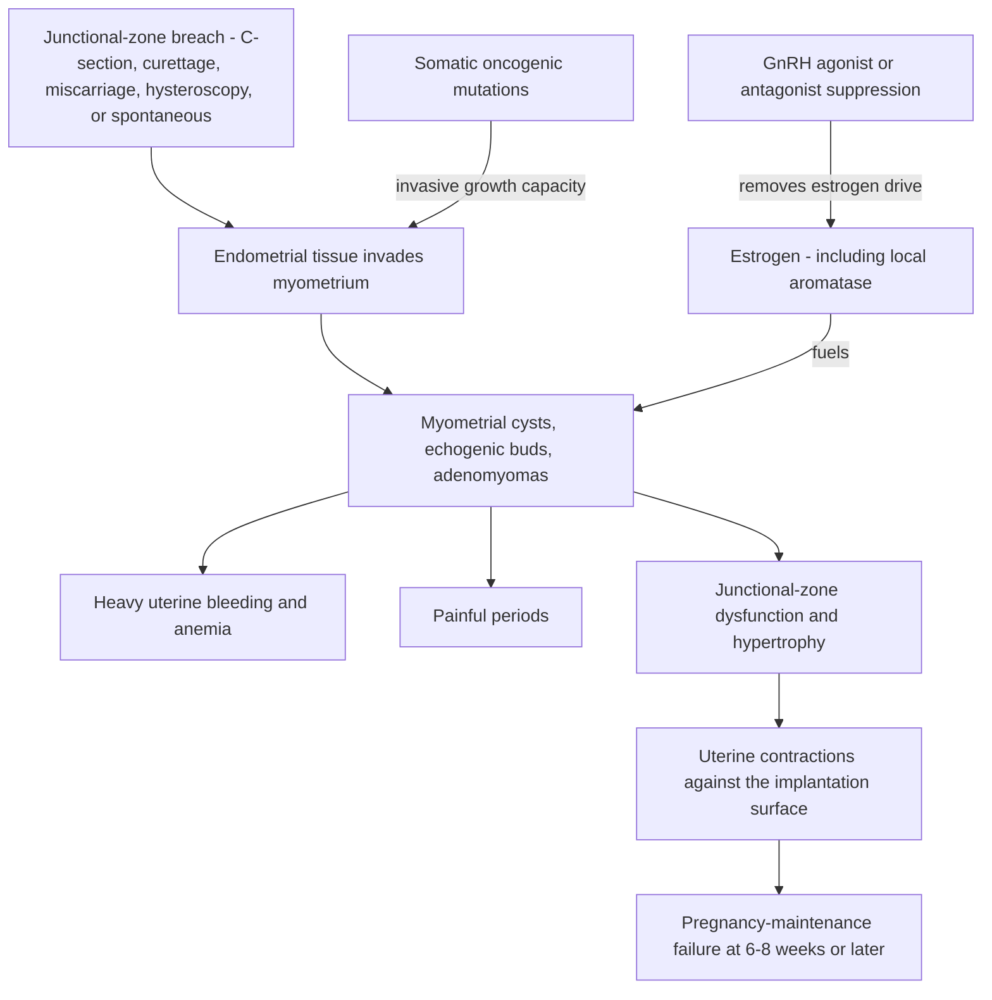

# Adenomyosis

Adenomyosis is the presence of endometrial-like tissue inside the myometrium, the muscular wall of the uterus. Historically called "internal endometriosis," it is now treated as a distinct disease: single-cell transcriptomics (including work published by Linda Giudice's group) shows the molecular pathways differ from endometriosis, even though the two share estrogen dominance with aromatase overexpression, progesterone resistance, and the same class of somatic oncogenic mutations. It may be the more prevalent and the more missed disease — an estimated 20–30% of women have adenomyosis versus about 10% with endometriosis, and up to 70% of endometriosis patients have some degree of adenomyosis, an overlap with large consequences for fertility care. Unlike endometriosis, adenomyosis has a definitive cure, because the disease lives entirely in the uterus: hysterectomy (performed with salpingectomy as standard) removes it — an option only for women done with childbearing. (Peter Attia MD — "397 - Endometriosis and adenomyosis: diagnosis, fertility, reproductive aging, & emerging treatments", 2026-06-22, [link](https://www.youtube.com/watch?v=IxHRYDM64dQ))

## Mechanism: tissue injury and repair at the junctional zone

The working mechanism is TIAR — tissue injury and repair. The junctional zone is a thin boundary layer between endometrium and myometrium; when it is disrupted, endometrial tissue invades inward into the muscle, producing islands of cysts and echogenic buds that enlarge and soften the uterus. Mechanical breaches are established risk factors: cesarean section, curettage, miscarriage, and hysteroscopic surgery for fibroids or polyps. The somatic mutations shared with endometriosis may supply the invasive aggressiveness, but why the junctional zone fails in a given woman is not understood. Adenomyosis was traditionally a disease of women in their forties (accumulated pregnancies, cesareans, curettage), but younger patients without any pregnancy are now presenting. A contested variant, termed external adenomyosis, describes deep infiltrating endometriosis invading the myometrium from the serosal side; not all authors accept the label. (Peter Attia MD — "397 - Endometriosis and adenomyosis: diagnosis, fertility, reproductive aging, & emerging treatments", 2026-06-22, [link](https://www.youtube.com/watch?v=IxHRYDM64dQ))

## Presentation and differential

Where endometriosis presents chiefly as pain, adenomyosis presents chiefly as heavy uterine bleeding — patients can bleed to the point of anemia — alongside very painful periods. Roughly one-third of patients may be asymptomatic depending on phenotype: a single myometrial cyst may cause nothing, while diffuse adenomyosis or an adenomyoma (a discrete nodule of adenomyosis) causes heavy bleeding and pain. The main bleeding differential is fibroids (leiomyomas): benign nodules present in up to 70–80% of women, mostly asymptomatic, classified by FIGO position from 0 (fully intracavitary) to 8 (serosal). The submucosal classes 0–2 — closest to the endometrial cavity — are the ones that cause bleeding and impair fertility, and large fibroids can distort the cavity and provoke miscarriage; clinical significance falls, not rises, as position moves outward toward the serosa. (Peter Attia MD — "397 - Endometriosis and adenomyosis: diagnosis, fertility, reproductive aging, & emerging treatments", 2026-06-22, [link](https://www.youtube.com/watch?v=IxHRYDM64dQ))

## Fertility: the uterus as the failing organ

Adenomyosis inverts the fertility logic of endometriosis. Donor-oocyte studies suggest endometriosis does not clinically impair implantation, and unrecognized adenomyosis is a suspected confounder wherever implantation deficits were reported — because in adenomyosis the uterus itself is the problem. Junctional-zone contractions work against the implanted embryo, so the characteristic failure is not implantation but pregnancy maintenance, with losses typically at six to eight weeks or later. A common IVF presentation is repeated failed transfers of good embryos with adenomyosis found only on subsequent workup. Overall, adenomyosis lowers IVF success by roughly 30%, phenotype-dependent; junctional-zone involvement roughly triples miscarriage risk. Endometriosis and adenomyosis also raise obstetric risks: preterm birth, preeclampsia, small-for-gestational-age infants, and cesarean delivery. (Peter Attia MD — "397 - Endometriosis and adenomyosis: diagnosis, fertility, reproductive aging, & emerging treatments", 2026-06-22, [link](https://www.youtube.com/watch?v=IxHRYDM64dQ))

GnRH-analog suppression before embryo transfer is used by some fertility programs, but efficacy is unresolved. Recent adenomyosis-specific systematic reviews found no statistically demonstrated live-birth benefit from pretreatment before frozen embryo transfer, and the underlying studies are predominantly retrospective and heterogeneous.[^gonzalez-comadran-2025] [^cozzolino-2024] Other observational syntheses report favorable associations, illustrating rather than resolving the risk of confounding by patient selection and protocol.[^ge-2024] ASRM consequently describes the evidence as limited and says pretreatment may be considered in selected recurrent-implantation-failure cases rather than presenting it as routine established therapy.[^asrm-rif-2026] The podcast's more confident protocol—two to four months of suppression followed by transfer on minimal estrogen and high progesterone—therefore remains expert practice provenance, not a generally proven live-birth intervention. (Peter Attia MD — "397 - Endometriosis and adenomyosis: diagnosis, fertility, reproductive aging, & emerging treatments", 2026-06-22, [link](https://www.youtube.com/watch?v=IxHRYDM64dQ))

## Practical implications

- **Investigate heavy menstrual bleeding, especially with anemia, for structural causes including adenomyosis and submucosal fibroids — strong.** Bleeding out of proportion to pain points toward adenomyosis or FIGO 0–2 fibroids rather than endometriosis; imaging interpretation requires an operator experienced with the junctional zone. (Peter Attia MD — "397 - Endometriosis and adenomyosis: diagnosis, fertility, reproductive aging, & emerging treatments", 2026-06-22, [link](https://www.youtube.com/watch?v=IxHRYDM64dQ))
- **After repeated failed transfers of good embryos, look for adenomyosis — strong as a diagnostic principle.** This is described as a very common overlooked cause; finding it changes the protocol rather than spending further embryos. (Peter Attia MD — "397 - Endometriosis and adenomyosis: diagnosis, fertility, reproductive aging, & emerging treatments", 2026-06-22, [link](https://www.youtube.com/watch?v=IxHRYDM64dQ))
- **Do not present GnRH-agonist pretreatment before frozen-embryo transfer as established benefit — contested/low certainty.** Recent reviews do not demonstrate improved live birth before frozen transfer, while favorable findings come mainly from observational cohorts.[^gonzalez-comadran-2025] [^cozzolino-2024] Treatment may be considered in selected specialist-managed cases, but a routine two-to-four-month protocol is not established. Discuss possible delay, hypoestrogenic adverse effects, cost, phenotype, prior failures, and uncertainty with a reproductive endocrinologist.[^asrm-rif-2026]
- **Counsel expectations quantitatively — moderate.** Roughly 30% lower IVF success overall and about three-fold miscarriage risk with junctional-zone involvement; pregnancies that continue carry elevated preterm-birth, preeclampsia, and SGA risk warranting obstetric surveillance. (Peter Attia MD — "397 - Endometriosis and adenomyosis: diagnosis, fertility, reproductive aging, & emerging treatments", 2026-06-22, [link](https://www.youtube.com/watch?v=IxHRYDM64dQ))
- **Reserve hysterectomy (with salpingectomy) for completed childbearing — strong.** It is the only cure; earlier, symptom control follows the same hormonal logic as endometriosis. (Peter Attia MD — "397 - Endometriosis and adenomyosis: diagnosis, fertility, reproductive aging, & emerging treatments", 2026-06-22, [link](https://www.youtube.com/watch?v=IxHRYDM64dQ))

## Gaps & open questions

- Why does the junctional zone fail in young women without pregnancies or uterine surgery, and can breach-free cases be predicted?
- What fraction of "endometriosis-related implantation failure" in older heterogeneous studies is actually unrecognized adenomyosis?
- Does GnRH pretreatment change pregnancy-complication rates (preterm birth, preeclampsia), not just implantation and miscarriage? No data exist.
- Is external adenomyosis a real third entity or deep infiltrating endometriosis misclassified?
- Could earlier diagnosis and sustained progestin suppression in adolescence prevent progression, as hypothesized for endometriosis?

## References

[^gonzalez-comadran-2025]: González-Comadran M, Alwane Olmos E, Agüero Mariño MA, Checa Vizcaíno MA. “Utility of GnRH Agonists before embryo transfer in women with adenomyosis: Systematic review and meta-analysis.” *JBRA Assisted Reproduction* (2025). [systematic review and meta-analysis]. [PubMed](https://pubmed.ncbi.nlm.nih.gov/40674550/) · [DOI](https://doi.org/10.5935/1518-0557.20250012)
[^cozzolino-2024]: Cozzolino M, et al. “Medical treatment before in-vitro fertilization in patients with adenomyosis: a systematic review and meta-analysis.” (2024). [systematic review and meta-analysis]. [PubMed](https://pubmed.ncbi.nlm.nih.gov/39666211/)
[^ge-2024]: Ge R, et al. “Effect of Gonadotropin-Releasing Hormone Agonist Pre-Treatment on Outcomes of Fresh and Frozen Embryo Transfers in Women With Adenomyosis.” *BJOG* (2024). [retrospective cohort and literature review]. [PubMed](https://pubmed.ncbi.nlm.nih.gov/39688600/) · [DOI](https://doi.org/10.1111/1471-0528.18026)
[^asrm-rif-2026]: American Society for Reproductive Medicine Practice Committee. “Recurrent implantation failure: a committee opinion.” (2026). [professional-society guidance]. [ASRM](https://www.asrm.org/practice-guidance/practice-committee-documents/american-society-for-reproductive-medicine-recurrent-implantation-failure-a-committee-opinion-2026/)

## Related

[[endometriosis]] · [[oocyte-aneuploidy-and-reproductive-aging]] · [[perimenopause-assessment-and-testing]] · [[proactive-health-monitoring]] · [[practice-playbook]] · [[aging-model]]
