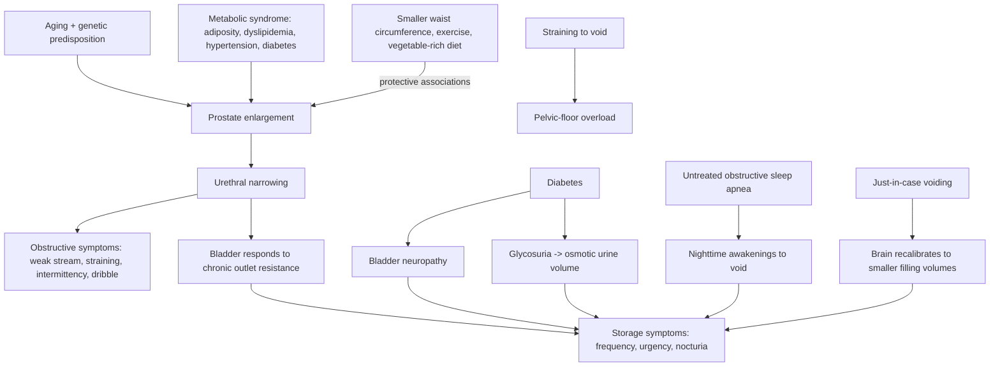

# Benign prostatic hyperplasia

Benign prostatic hyperplasia (BPH) is non-cancerous enlargement of the prostate. Because the prostatic urethra runs through the gland, enlargement narrows the tube urine must pass through, and the resulting symptoms fall into two mechanistically distinct groups: obstructive symptoms from the narrowed outlet (weak stream, straining, a stream that starts and stops, prolonged emptying, post-void dribbling) and storage symptoms from a bladder adapting to chronic outlet resistance (frequency, urgency, nocturia, urgency leakage). BPH is close to a default state of male aging — up to 80% of 80-year-olds are affected — and paternal history predicts both occurrence and somewhat earlier onset. (@RenaMalikMD (Rena Malik, M.D.) — "Why Men Care So Much About Squirting — And What Actually Matters", 2026-08-28, [link](https://www.youtube.com/watch?v=55KdS4gS6k4))

## Why frequency is not only about the prostate

The transcript's most instructive teaching point is that lower-urinary-tract symptoms in an aging man are multi-causal, and several contributors are treatable without touching the prostate. Diabetes acts on the bladder in two ways: it damages bladder nerves the same way it damages peripheral nerves in the hands and feet, and glycosuria increases urine production, driving frequency directly. Untreated obstructive sleep apnea causes nighttime awakenings to urinate, and treating the apnea has been reported to reduce nocturia — so nocturia in this population is a screening prompt for [[obstructive-sleep-apnea]], not automatically a prostate symptom. Learned voiding behavior contributes as well: habitual just-in-case voiding conditions the brain to signal urgency at smaller volumes, and straining against an enlarged prostate loads the pelvic floor ([[bladder-filling-and-voiding-behavior]]). (@RenaMalikMD (Rena Malik, M.D.) — "Why Men Care So Much About Squirting — And What Actually Matters", 2026-08-28, [link](https://www.youtube.com/watch?v=55KdS4gS6k4))

## Modifiable risk structure

The prevention claims in the source are associational — cohort links between exposures and BPH incidence — not randomized prevention trials, and should be graded accordingly. The consistent pattern is metabolic: a normal waist circumference is protective, while metabolic syndrome (high cholesterol, high blood pressure, diabetes) is linked with more BPH. Physical activity at modest doses is associated with lower risk — the source cites benefit even from walking about two hours — alongside the general 150-minutes-per-week moderate aerobic recommendation that serves cardiovascular and sexual function simultaneously ([[cardiorespiratory-fitness]], [[erectile-dysfunction-and-vascular-health]]). Higher vegetable intake is associated with reduced BPH risk, an unprocessed Mediterranean-style pattern is described as most beneficial overall, and lycopene-containing foods (cooked tomatoes, watermelon) are presented as supportive of prostate health ([[tomato-products-and-lycopene]]). These converge with the broader principle that BPH risk tracks the same metabolic terrain as [[insulin-resistance]] and [[visceral-and-ectopic-fat]], which makes metabolic health the plausible common lever even though no single food is proven preventive. (@RenaMalikMD (Rena Malik, M.D.) — "Why Men Care So Much About Squirting — And What Actually Matters", 2026-08-28, [link](https://www.youtube.com/watch?v=55KdS4gS6k4))

One boundary worth preserving: tomato-based products appear on both sides of this page — as a prostate-supportive food and, for a subset of already-symptomatic men, as a bladder irritant that worsens urgency and frequency. The two claims are not contradictory (one concerns gland growth over years, the other acute bladder sensitivity), but they illustrate why symptom-stage matters when translating food associations into advice. (@RenaMalikMD (Rena Malik, M.D.) — "Why Men Care So Much About Squirting — And What Actually Matters", 2026-08-28, [link](https://www.youtube.com/watch?v=55KdS4gS6k4))

## Symptom management behaviors

For men already symptomatic, the source describes behavioral load-reduction: limit fluids in the roughly two hours before bed, and identify personal bladder irritants. Caffeine and alcohol bother most affected people; spicy foods, artificial sweeteners, tomato-based products, and citrus fruits and juices irritate some. Sensitivity to caffeine can increase later in life even after decades of tolerance. Avoiding just-in-case voiding and avoiding straining protect the bladder–brain signaling loop and pelvic floor respectively. These are expert behavioral guidance consistent with urologic practice, not trial-graded protocols. (@RenaMalikMD (Rena Malik, M.D.) — "Why Men Care So Much About Squirting — And What Actually Matters", 2026-08-28, [link](https://www.youtube.com/watch?v=55KdS4gS6k4))

## Practical implications

- **Ongoing: maintain waist circumference, metabolic health (lipids, blood pressure, glucose), and regular aerobic activity (~150 min/week moderate; even regular walking is associated with benefit) as the primary modifiable BPH levers — moderate; consistent cohort associations, no randomized prevention trial.** These same actions carry strong evidence for cardiovascular outcomes, so the marginal cost is zero. (@RenaMalikMD (Rena Malik, M.D.) — "Why Men Care So Much About Squirting — And What Actually Matters", 2026-08-28, [link](https://www.youtube.com/watch?v=55KdS4gS6k4))
- **Ongoing: favor a vegetable-rich, minimally processed Mediterranean-style pattern; include lycopene foods if enjoyed — limited-to-moderate association-level evidence for the prostate outcome.** (@RenaMalikMD (Rena Malik, M.D.) — "Why Men Care So Much About Squirting — And What Actually Matters", 2026-08-28, [link](https://www.youtube.com/watch?v=55KdS4gS6k4))
- **When nocturia is prominent: get evaluated for obstructive sleep apnea rather than attributing every nighttime void to the prostate — moderate-to-strong; OSA treatment reportedly improves nocturia and carries independent cardiometabolic benefit.** (@RenaMalikMD (Rena Malik, M.D.) — "Why Men Care So Much About Squirting — And What Actually Matters", 2026-08-28, [link](https://www.youtube.com/watch?v=55KdS4gS6k4)) [[obstructive-sleep-apnea]]
- **Daily habits: do not void just in case routinely, do not strain to urinate; if symptomatic, restrict fluids ~2 hours before bed and trial-eliminate personal bladder irritants (caffeine and alcohol first) — moderate expert behavioral guidance.** Recurrent straining, retention, or worsening symptoms warrant clinical evaluation rather than self-management. (@RenaMalikMD (Rena Malik, M.D.) — "Why Men Care So Much About Squirting — And What Actually Matters", 2026-08-28, [link](https://www.youtube.com/watch?v=55KdS4gS6k4))

## Gaps & open questions

- How much of the waist-circumference and metabolic-syndrome association with BPH is causal versus shared aging and inflammation, and does intentional weight loss shrink prostate growth trajectories?
- What exercise dose–response actually applies (the "walking 2 hours" claim lacks a stated cadence and comparator in this source)?
- Does treating obstructive sleep apnea reduce nocturia in men with coexisting BPH specifically, and by how much?
- Can behavioral bladder retraining measurably improve storage symptoms in men whose frequency is partly learned?
- Which men with early BPH progress to retention or surgery, and can metabolic intervention change that trajectory?

## Related

[[bladder-filling-and-voiding-behavior]] · [[obstructive-sleep-apnea]] · [[tomato-products-and-lycopene]] · [[insulin-resistance]] · [[visceral-and-ectopic-fat]] · [[erectile-dysfunction-and-vascular-health]] · [[testosterone-replacement-therapy]] · [[proactive-health-monitoring]] · [[rena-malik]]
