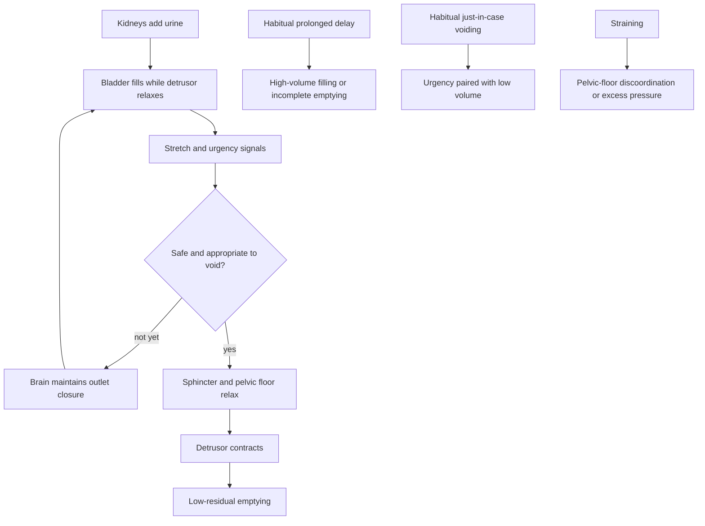

# Bladder filling and voiding behavior

Normal urination coordinates a compliant bladder reservoir, sensation of filling, central permission to void, relaxation of the urethral sphincter and pelvic floor, and contraction of the detrusor muscle. Stream duration is therefore an output of voided volume, flow resistance, bladder contraction, and behavioral timing—not a diagnosis by itself. A roughly 20-second void is an engineering-scale observation across many mammals and a loose human reference, not a validated home screening threshold. (@RenaMalikMD (Rena Malik, M.D.) — "Peeing 'Just in Case?' The #1 Peeing Mistake That Could Be Weakening Your Bladder", 2026-07-27, [link](https://www.youtube.com/watch?v=CWDOyOkSyag))

## Filling, storage, and emptying

As urine enters, the detrusor accommodates increasing volume at relatively low pressure. Afferent signals convey filling state to the brain; during storage, outlet muscles remain active. When voiding is chosen, outlet relaxation and detrusor contraction must be coordinated. Weak contraction can occur with neurologic disease or longstanding diabetes, while resistance can arise from prostate enlargement, urethral narrowing, scar, or dysfunctional outlet relaxation. Either can prolong a stream or leave residual urine. A short void can simply reflect a small starting volume, but repeated small voids with urgency may accompany inflammation, infection, incomplete emptying, or learned frequency. (@RenaMalikMD (Rena Malik, M.D.) — "Peeing 'Just in Case?' The #1 Peeing Mistake That Could Be Weakening Your Bladder", 2026-07-27, [link](https://www.youtube.com/watch?v=CWDOyOkSyag))

The cross-species study cited by the source found that mammals above a small body-size threshold emptied in about 20–21 seconds because larger animals combine greater volume with proportionally different urethral dimensions and gravitational pressure. This physical regularity does not establish that every healthy person should void within a narrow band regardless of sex, age, posture, volume, anatomy, or hydration. Symptoms and repeated patterns matter more than a stopwatch reading. (@RenaMalikMD (Rena Malik, M.D.) — "Peeing 'Just in Case?' The #1 Peeing Mistake That Could Be Weakening Your Bladder", 2026-07-27, [link](https://www.youtube.com/watch?v=CWDOyOkSyag))

## Behavior can shift the signal–response loop

Habitually delaying urination may repeatedly expose the bladder to larger volumes and can coexist with limited bathroom access or avoidance of dirty facilities. The source cites a cross-sectional study of more than 800 university women in which habitual delayed voiding was associated with about twice the odds of a history of urinary-tract infection. Association does not show that delay caused infection: prior symptoms, hydration, sexual activity, access, and hygiene could confound the relationship. (@RenaMalikMD (Rena Malik, M.D.) — "Peeing 'Just in Case?' The #1 Peeing Mistake That Could Be Weakening Your Bladder", 2026-07-27, [link](https://www.youtube.com/watch?v=CWDOyOkSyag))

Habitual pre-emptive voiding at low volume may condition attention and urgency around smaller filling signals. This provides a plausible learning mechanism for frequency, but the transcript does not present a trial showing that occasional just-in-case voiding shrinks anatomical capacity or that stopping it alone cures symptoms. Conversely, deliberately holding through severe urgency is not appropriate bladder training without assessment. The useful distinction is between occasional situational choices and a persistent pattern associated with frequency, urgency, pain, leakage, infection, or incomplete emptying. (@RenaMalikMD (Rena Malik, M.D.) — "Peeing 'Just in Case?' The #1 Peeing Mistake That Could Be Weakening Your Bladder", 2026-07-27, [link](https://www.youtube.com/watch?v=CWDOyOkSyag))

Straining attempts to replace coordinated detrusor contraction and outlet relaxation with abdominal pressure. Repeated pushing may signal obstruction, weak contraction, constipation, or pelvic-floor discoordination rather than a harmless technique. The source warns that it can strain the pelvic floor, but it does not quantify long-term risk. (@RenaMalikMD (Rena Malik, M.D.) — "Peeing 'Just in Case?' The #1 Peeing Mistake That Could Be Weakening Your Bladder", 2026-07-27, [link](https://www.youtube.com/watch?v=CWDOyOkSyag))

## Practical implications

- **Respond to a comfortable, meaningful urge when access permits; avoid making either prolonged holding or low-volume just-in-case voiding a routine — moderate behavioral guidance, direct intervention evidence not reviewed here.** Occasional delay or pre-emptive voiding is not by itself evidence of damage. (@RenaMalikMD (Rena Malik, M.D.) — "Peeing 'Just in Case?' The #1 Peeing Mistake That Could Be Weakening Your Bladder", 2026-07-27, [link](https://www.youtube.com/watch?v=CWDOyOkSyag))
- **During each void, allow the pelvic floor to relax and avoid routine pushing or rushing — moderate expert guidance.** Repeated need to strain warrants assessment. (@RenaMalikMD (Rena Malik, M.D.) — "Peeing 'Just in Case?' The #1 Peeing Mistake That Could Be Weakening Your Bladder", 2026-07-27, [link](https://www.youtube.com/watch?v=CWDOyOkSyag))
- **Use stream timing, if at all, only as an occasional observation alongside symptoms — weak, unvalidated self-monitoring.** A consistent change plus leakage, frequency, recurrent infection, multiple nighttime voids, poor emptying, pain, or difficulty delaying should prompt evaluation. The video's suggested monthly cadence is expert advice, not a validated screening protocol. (@RenaMalikMD (Rena Malik, M.D.) — "Peeing 'Just in Case?' The #1 Peeing Mistake That Could Be Weakening Your Bladder", 2026-07-27, [link](https://www.youtube.com/watch?v=CWDOyOkSyag))
- **Seek urgent care for inability to urinate with a painful or enlarging lower abdomen, or for urinary symptoms with severe systemic illness — strong safety principle.** The transcript does not provide a full triage protocol. (@RenaMalikMD (Rena Malik, M.D.) — "Peeing 'Just in Case?' The #1 Peeing Mistake That Could Be Weakening Your Bladder", 2026-07-27, [link](https://www.youtube.com/watch?v=CWDOyOkSyag))

## Gaps & open questions

- What stream-duration distributions are normal after accounting for volume, sex, age, posture, and anatomy?
- Does habitual delayed voiding independently cause infection, retention, or detrusor dysfunction?
- Can reducing low-volume pre-emptive voiding improve urgency and frequency, and for whom?
- Which workplace and school bathroom-access interventions improve urinary outcomes?
- When does straining cause pelvic-floor harm versus reveal an existing problem?

## Related

[[benign-prostatic-hyperplasia]] · [[proactive-health-monitoring]] · [[daily-movement-mobility-and-pain]] · [[sleep-quality-and-circadian-alignment]] · [[rena-malik]]
