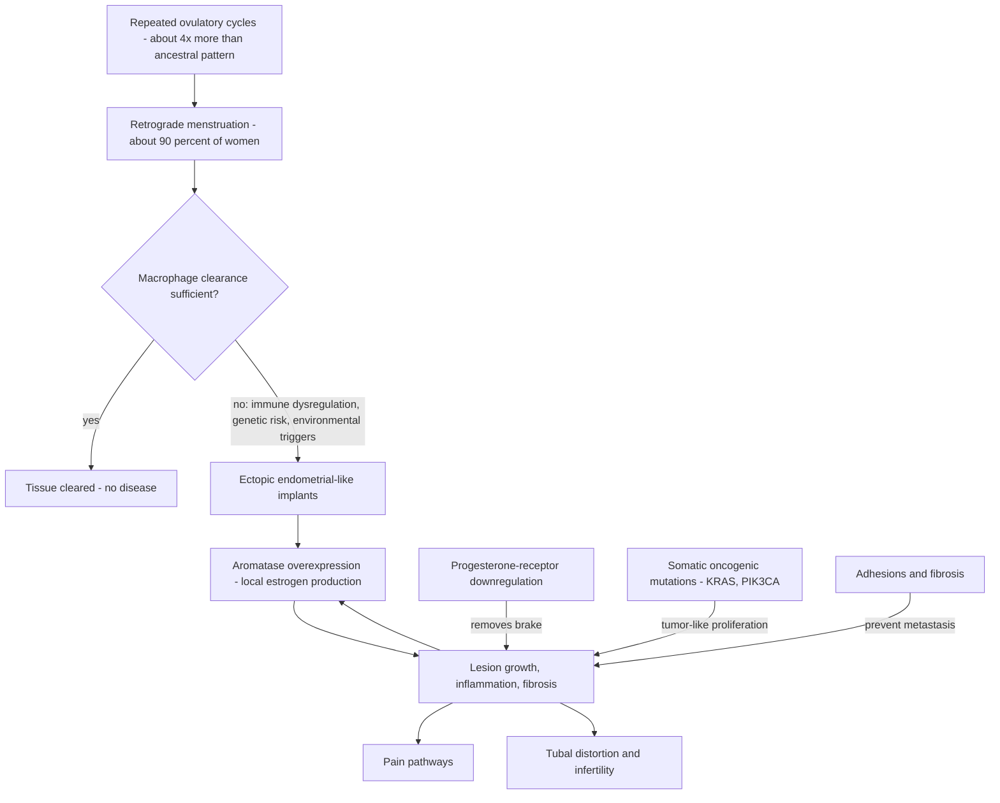
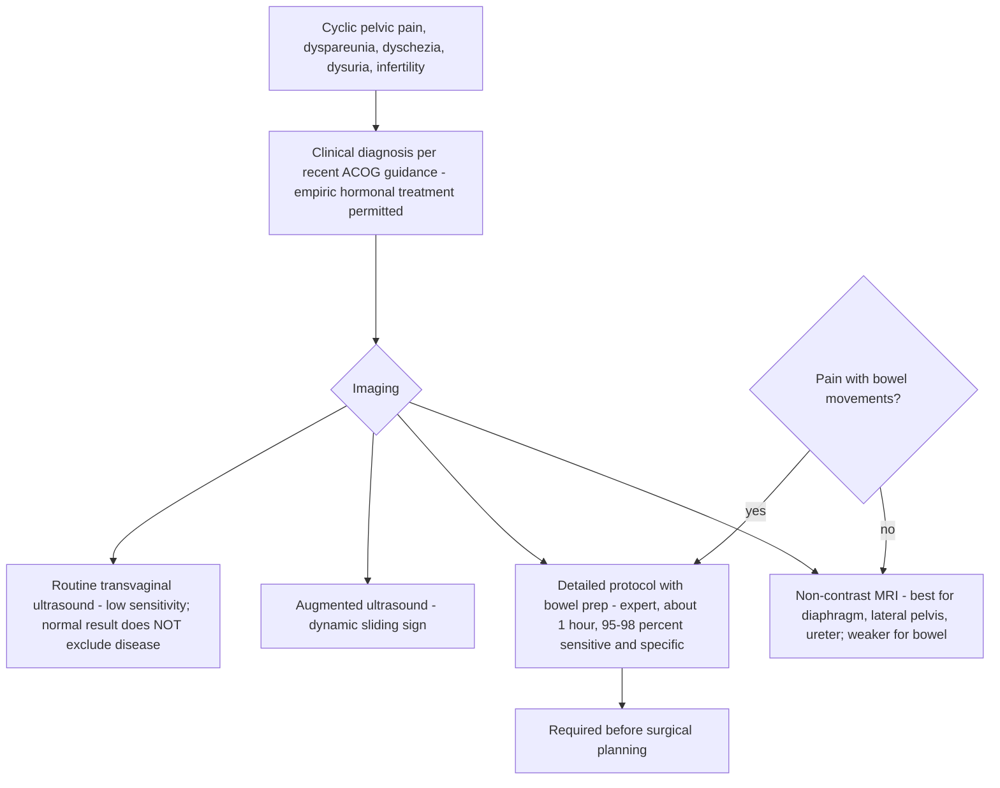

# Endometriosis

Endometriosis is a chronic, estrogen-dependent disease in which tissue resembling the endometrium — the inner uterine layer of stroma and glands that thickens and sheds each cycle — grows outside the uterus: on the fallopian tubes, ovaries, bowel, bladder, uterosacral ligaments, occasionally the appendix, and even the diaphragm. The uterus has three layers — the outer serosa, the muscular myometrium that contracts in labor, and the inner endometrium where an embryo implants — and endometriosis is defined by endometrial-like tissue escaping that inner compartment. Roughly 10% of reproductive-age women globally have the disease (about 200 million women); among women with infertility the proportion rises to 30–50%, and a woman with endometriosis has about a 40% chance of infertility. (Peter Attia MD — "397 - Endometriosis and adenomyosis: diagnosis, fertility, reproductive aging, & emerging treatments", 2026-06-22, [link](https://www.youtube.com/watch?v=IxHRYDM64dQ))

## Mechanism: retrograde menstruation, immune failure, and hormonal self-sufficiency

About 90% of women experience retrograde menstruation — part of the menstrual flow travels backward through the fallopian tubes into the pelvis — yet only about 10% develop endometriosis, so retrograde flow appears necessary in most cases but not sufficient. The difference is attributed partly to immune dysregulation: pelvic macrophages normally clear the refluxed endometrial tissue, and when that clearance capacity is overwhelmed or dysregulated, ectopic tissue can implant and persist. Heritability is about 50%, and a first-degree relative (mother or sister) with endometriosis raises risk about seven-fold; candidate environmental triggers include pollution, microplastics, poor diet, and poor sleep acting through immune regulation, though none is definitively established. (Peter Attia MD — "397 - Endometriosis and adenomyosis: diagnosis, fertility, reproductive aging, & emerging treatments", 2026-06-22, [link](https://www.youtube.com/watch?v=IxHRYDM64dQ))

Cumulative ovulatory-cycle exposure is the leading explanation for rising prevalence, and it is an evolutionary-mismatch argument: about 200 years ago a woman had roughly 100 lifetime ovulatory cycles (menarche near 16 rather than 12, first pregnancy near 20 rather than 30+, years of breastfeeding per child, five to seven children), while an uninterrupted modern reproductive life produces roughly 400 cycles — about a four-fold increase in retrograde-menstruation exposure that ovarian-suppressive hormonal treatment partly reverses by mimicking the ancestral pattern. (Peter Attia MD — "397 - Endometriosis and adenomyosis: diagnosis, fertility, reproductive aging, & emerging treatments", 2026-06-22, [link](https://www.youtube.com/watch?v=IxHRYDM64dQ)) [[evolutionary-mismatch-and-weight-regulation]] develops the general logic of modern environments outrunning evolved regulation.

Established lesions become hormonally self-sustaining. They overexpress aromatase and synthesize their own estrogen, so suppressing the ovaries alone does not always starve them; and they downregulate the progesterone receptor (progesterone resistance, loosely analogous to insulin resistance — more hormone is needed for the same effect), blunting the main counterweight to estrogen-driven growth. Up to 37% of deep infiltrating lesions also carry somatic mutations in oncogenes such as KRAS and PIK3CA: they possess tumor-like growth machinery yet essentially never metastasize, apparently constrained by surrounding adhesions and fibrosis — benign tumors with a racing engine and no drivetrain. There is currently no assay for progesterone resistance and no drug pipeline targeting it, a gap the episode explicitly flags. (Peter Attia MD — "397 - Endometriosis and adenomyosis: diagnosis, fertility, reproductive aging, & emerging treatments", 2026-06-22, [link](https://www.youtube.com/watch?v=IxHRYDM64dQ))

## Phenotypes and anatomy

Three phenotypes matter clinically: superficial lesions (sitting on the peritoneum, less than 5 mm deep), deep infiltrating endometriosis, and endometriomas (ovarian pseudo-cysts of endometriosis). Gravity and anatomy concentrate lesions behind the uterus on the uterosacral ligaments; about 10–12% of patients have urinary-tract lesions; diaphragmatic lesions occur about 80% on the right because the sigmoid colon blocks leftward peritoneal flow; rectovaginal-septum disease is rare but among the hardest to treat because it can invade the pelvic floor and nerves. Ureteral involvement can silently destroy a kidney — the episode describes a nephrectomy for hydronephrosis from unrecognized ureteral endometriosis. (Peter Attia MD — "397 - Endometriosis and adenomyosis: diagnosis, fertility, reproductive aging, & emerging treatments", 2026-06-22, [link](https://www.youtube.com/watch?v=IxHRYDM64dQ))

## Presentation: the six Ds and three layers of pain

The classic presentation is organized as six Ds: dysmenorrhea (menstrual pain severe enough to send patients to the emergency department for intravenous medication), deep dyspareunia (pain with intercourse at the posterior vaginal wall), dyschezia (pain with bowel movements), dysuria (cyclic pain with urination), difficulty conceiving, and dysfunctional chronic pelvic pain persisting more than six months without cycle relation. About 10% of patients are asymptomatic, presenting only as infertility — or they have normalized the pain, or been told it is normal. Presentation is no longer confined to adulthood: among teenagers with pelvic pain, 50–75% have endometriosis. (Peter Attia MD — "397 - Endometriosis and adenomyosis: diagnosis, fertility, reproductive aging, & emerging treatments", 2026-06-22, [link](https://www.youtube.com/watch?v=IxHRYDM64dQ))

Pain has three mechanistically distinct layers with different treatments. Nociceptive pain arises directly from lesions and responds to surgery and hormonal therapy. Neuropathic pain comes from nerve infiltration, producing burning sensations into the legs or back; gabapentin or SNRIs help, and nerve-sparing surgical technique can remove some infiltrating lesions. Nociplastic pain is central sensitization: after years of untreated signaling the wiring itself changes, so pain persists even after a technically perfect surgery clears the pelvis. The episode's analogy — the lesion is a burglar, surgery removes the burglar, hormones lock the door, but an alarm system that has rung for years now triggers on wind — is why diagnostic delay is itself pathogenic, and why this layer needs pelvic-floor physiotherapy and pain-specialist care rather than more surgery. (Peter Attia MD — "397 - Endometriosis and adenomyosis: diagnosis, fertility, reproductive aging, & emerging treatments", 2026-06-22, [link](https://www.youtube.com/watch?v=IxHRYDM64dQ))

## Diagnosis: from surgical to imaging-based

Diagnostic delay runs 5–12 years from first symptom depending on country (about six years in the US, seven in Brazil), driven by three failures: cultural normalization of female pain, the absence of a simple blood biomarker, and the historical requirement of diagnostic laparoscopy — a general-anesthesia surgical procedure — to confirm disease. Recent ACOG guidance now supports diagnosing and treating endometriosis clinically, on symptoms alone, without surgical confirmation, which the episode frames as disease-modifying prevention in the same spirit as early statin therapy: treat early to change trajectory and avoid central sensitization and infertility. The estimated economic cost is $80–120 billion per year, two-thirds of it productivity loss, yet NIH invests about 15 times more in diabetes despite comparable per-patient annual cost. (Peter Attia MD — "397 - Endometriosis and adenomyosis: diagnosis, fertility, reproductive aging, & emerging treatments", 2026-06-22, [link](https://www.youtube.com/watch?v=IxHRYDM64dQ))

Imaging now substitutes for surgery in expert hands, but the tier of the exam matters more than the modality. A routine transvaginal ultrasound has low sensitivity for endometriosis — in the episode's words, "If you do a normal ultrasound and you don't have an endometriosis in the report, doesn't mean that you don't have an endometriosis." An augmented ultrasound adds dynamic probe pressure and the sliding sign (checking whether the uterus glides freely over adjacent structures, which static MRI cannot assess). The best exam is a detailed endometriosis protocol with bowel preparation (enema, low-residue diet, vaginal gel), an hour-long expert study that can visualize bowel-wall layers and small bladder or rectal lesions; both this protocol and MRI reach roughly 95–98% sensitivity and specificity for deep disease. MRI (non-contrast T1/T2 with vaginal gel, about 20 minutes) is preferred in the US where the ultrasound protocol is scarce, and is superior for extra-pelvic lesions (diaphragm), the lateral pelvis, ureter, and deep nerve infiltration — but weaker for bowel disease. Pain with bowel movements raises the prior for bowel lesions and favors the ultrasound protocol; expert surgeons will not operate without it, and often both studies are done. (Peter Attia MD — "397 - Endometriosis and adenomyosis: diagnosis, fertility, reproductive aging, & emerging treatments", 2026-06-22, [link](https://www.youtube.com/watch?v=IxHRYDM64dQ))

## Treatment: chronic-disease management, not one surgery

When conception is not the immediate goal, first-line therapy is hormonal ovulatory suppression, which doubles as needed contraception: a combined pill at the lowest effective estrogen dose (estrogen can activate lesions, though data show low- and standard-dose outcomes are similar), a progestin-only pill (norethindrone, dienogest, or drospirenone; dienogest is a mainstay in Brazil), or a levonorgestrel IUD. The IUD is a good option when there is no endometrioma (it does not suppress ovulation, so it cannot control cysts) and no myofascial pelvic pain; its progestin action suppresses the endometrium and abolishes menstruation for about five years. If three to six months of medication fails, the method is changed or surgery is planned. (Peter Attia MD — "397 - Endometriosis and adenomyosis: diagnosis, fertility, reproductive aging, & emerging treatments", 2026-06-22, [link](https://www.youtube.com/watch?v=IxHRYDM64dQ))

Surgery is laparoscopic (or robotic) excision of visible lesions, but tiny sub-visual lesions persist, so what looks like recurrence is often disease that was never seen — analogous to why disseminated cancer is treated systemically rather than surgically. Without postoperative medication, recurrence runs about 10% per year, especially for endometriomas; inserting a levonorgestrel IUD after surgery reduced recurrence 88% versus placebo in one study. Surgery is indicated despite medication for red flags even without symptoms: endometriomas larger than 5–6 cm, obstructing bowel lesions, ureteral involvement threatening the kidney, and appendiceal lesions (which can mimic neuroendocrine tumors). A French group's "endometriosis life" concept, published in Nature Reviews, frames the disease like type 1 or type 2 diabetes: plan for the patient's next decades, not one appointment, one surgery, or one prescription. (Peter Attia MD — "397 - Endometriosis and adenomyosis: diagnosis, fertility, reproductive aging, & emerging treatments", 2026-06-22, [link](https://www.youtube.com/watch?v=IxHRYDM64dQ))

Three surgical-selection mistakes recur. First, operating on central sensitization: excision cannot treat nociplastic pain, so those patients need pelvic-floor physiotherapy (ideally about eight weeks before surgery and resuming two to four weeks after) and pain-specialist care. Second, stripping out endometriomas in a woman who wants fertility: the pseudo-cyst wall is attached to the ovarian cortex where primordial follicles live, and cystectomy can cut AMH by 40–50% — while the cyst itself also erodes reserve via a Fenton reaction generating DNA-toxic hydroxyl radicals ("follicular burnout"), so the right sequence is harvest eggs first, then operate if indicated. Third, leaving a damaged, dilated tube (hydrosalpinx) to "preserve" it: Cochrane-reviewed evidence shows a hydrosalpinx halves IVF success, both mechanically (fluid washing over the implantation site) and through embryotoxic secretions, so salpingectomy is required. (Peter Attia MD — "397 - Endometriosis and adenomyosis: diagnosis, fertility, reproductive aging, & emerging treatments", 2026-06-22, [link](https://www.youtube.com/watch?v=IxHRYDM64dQ))

## Fertility: a mainly mechanical problem

Endometriosis-associated infertility is understood as primarily mechanical: adhesions kink or obstruct the fallopian tubes so the fimbriae cannot pick up the oocyte or transport the embryo, rather than a failure of the uterus to accept an embryo. The key evidence is donor-oocyte studies from about two decades ago: recipients with laparoscopy-confirmed endometriosis and without it showed similar implantation, miscarriage, and live-birth rates when given good embryos — implying the eutopic endometrium is molecularly abnormal but clinically functional, with unrecognized adenomyosis as a plausible confounder in heterogeneous studies that found deficits. Patients with endometriosis do retrieve fewer oocytes, fewer mature oocytes, and fewer embryos per IVF cycle, requiring more cycles, but age-matched embryo quality and euploidy rates are similar. Practical consequences: a frozen-embryo transfer in endometriosis does not benefit from prior surgery, whereas coexisting [[adenomyosis]] does benefit from hormonal suppression first; surgical restoration of tubal anatomy can permit natural conception, with the endometriosis fertility index (scoring tubes, fimbriae, and ovaries after surgery) predicting up to about 65% natural-pregnancy rates at high scores; and when the patient prioritizes pain relief before conceiving, surgery beats hormonal therapy because hormonal control confers no cumulative benefit after stopping — the medications are contraceptive by nature, so a patient who wants to conceive soon "just lost some time." Systemic markers (CRP, IL-6, TNF-alpha) differ in endometriosis pelves, but clinically the anatomy dominates. (Peter Attia MD — "397 - Endometriosis and adenomyosis: diagnosis, fertility, reproductive aging, & emerging treatments", 2026-06-22, [link](https://www.youtube.com/watch?v=IxHRYDM64dQ))

Severity classification and symptoms diverge: the ASRM stage (I–IV) is a surgical map that predicts neither pain nor fertility — a stage IV patient with a 12 cm endometrioma can be asymptomatic while a stage I patient is housebound — which is why symptom burden, not lesion size, drives treatment urgency. (Peter Attia MD — "397 - Endometriosis and adenomyosis: diagnosis, fertility, reproductive aging, & emerging treatments", 2026-06-22, [link](https://www.youtube.com/watch?v=IxHRYDM64dQ))

## Emerging treatment

HMI-115, a monoclonal antibody against the prolactin receptor (which endometriosis lesions can express), is in phase 3 trials with reported reductions in pain and disease progression; it would be the first non-hormonal biologic for endometriosis, a first step toward drugs that target the disease rather than suppressing ovulation. (Peter Attia MD — "397 - Endometriosis and adenomyosis: diagnosis, fertility, reproductive aging, & emerging treatments", 2026-06-22, [link](https://www.youtube.com/watch?v=IxHRYDM64dQ))

## Practical implications

- **Do not accept persistent pelvic pain as normal — strong.** Dysmenorrhea that fails ordinary analgesics, deep dyspareunia, cyclic bowel or urinary pain, or missed school/work warrants explicit evaluation for endometriosis; the goal is compressing a 5–12-year diagnostic delay toward months, because delay itself causes central sensitization and infertility. (Peter Attia MD — "397 - Endometriosis and adenomyosis: diagnosis, fertility, reproductive aging, & emerging treatments", 2026-06-22, [link](https://www.youtube.com/watch?v=IxHRYDM64dQ))
- **A normal routine ultrasound does not exclude endometriosis — strong.** Request MRI and, where available, a detailed endometriosis ultrasound protocol with bowel prep performed by an experienced operator; insist on the specific protocol by name. (Peter Attia MD — "397 - Endometriosis and adenomyosis: diagnosis, fertility, reproductive aging, & emerging treatments", 2026-06-22, [link](https://www.youtube.com/watch?v=IxHRYDM64dQ))
- **Treat empirically and early when the clinical picture fits — moderate-to-strong, now guideline-supported.** Hormonal suppression on clinical diagnosis alone is endorsed by recent ACOG guidance; early suppression may avert an estimated 40% of later disease burden in adolescents, though prospective data are limited. (Peter Attia MD — "397 - Endometriosis and adenomyosis: diagnosis, fertility, reproductive aging, & emerging treatments", 2026-06-22, [link](https://www.youtube.com/watch?v=IxHRYDM64dQ))
- **Expect chronic-disease management, not cure by one surgery — strong.** Continue suppression after excision (post-operative levonorgestrel IUD cut recurrence 88% in one trial); plan care over years. (Peter Attia MD — "397 - Endometriosis and adenomyosis: diagnosis, fertility, reproductive aging, & emerging treatments", 2026-06-22, [link](https://www.youtube.com/watch?v=IxHRYDM64dQ))
- **If fertility matters, sequence decisions deliberately — moderate-to-strong.** Check ovarian reserve (AMH, antral follicle count) at diagnosis; freeze oocytes or embryos before any endometrioma surgery; remove a hydrosalpinx before transfer; do not expect pre-transfer surgery to improve frozen-embryo outcomes in endometriosis without adenomyosis. (Peter Attia MD — "397 - Endometriosis and adenomyosis: diagnosis, fertility, reproductive aging, & emerging treatments", 2026-06-22, [link](https://www.youtube.com/watch?v=IxHRYDM64dQ))
- **Match the pain treatment to the pain layer — moderate.** Surgery and hormones for nociceptive pain; gabapentin/SNRIs and nerve-sparing excision for neuropathic pain; pelvic-floor physiotherapy plus pain-specialist care for central sensitization, where more surgery is the classic selection error. (Peter Attia MD — "397 - Endometriosis and adenomyosis: diagnosis, fertility, reproductive aging, & emerging treatments", 2026-06-22, [link](https://www.youtube.com/watch?v=IxHRYDM64dQ))

## Gaps & open questions

- What molecular mechanism produces progesterone resistance in lesions, and can it be drugged the way insulin-sensitizers address insulin resistance? No pipeline currently targets it.
- Which environmental triggers (microplastics, pollution, diet, sleep-mediated immune change) causally drive the rising prevalence, including in teenagers well below the lifetime-cycle threshold?
- Can a blood biomarker replace expert imaging for screening, and can the detailed ultrasound protocol be scaled outside a handful of centers?
- Does early empiric hormonal suppression in adolescents actually prevent the projected ~40% of disease burden? Prospective data are lacking.
- Why do somatic oncogene-bearing lesions never metastasize, and does the fibrosis-containment mechanism suggest therapeutic angles?
- Will HMI-115 (anti-prolactin-receptor) confirm efficacy in phase 3, and does prolactin signaling define a lesion subtype?

## Related

[[adenomyosis]] · [[oocyte-aneuploidy-and-reproductive-aging]] · [[evolutionary-mismatch-and-weight-regulation]] · [[immune-recognition-and-trafficking]] · [[perimenopause-assessment-and-testing]] · [[proactive-health-monitoring]] · [[adhd-and-reproductive-hormone-transitions]] · [[practice-playbook]] · [[aging-model]]
