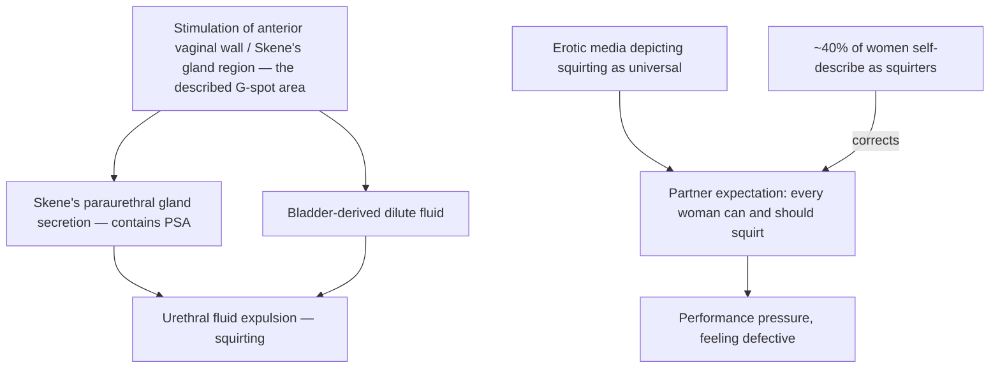

# Female ejaculation and squirting

Squirting is the expulsion of fluid from the urethra during sexual stimulation or orgasm in women. Studies attempting to localize its origin conclude that the fluid comes predominantly from the bladder, mixed with secretions from the Skene's (paraurethral) glands — small glands beneath the urethra near the anterior vaginal wall that are developmentally analogous to the male prostate. The prostatic homology is demonstrated biochemically: the expelled fluid contains prostate-specific antigen (PSA), which urine alone does not explain. Chemical-composition studies find the fluid similar to urine but distinctly different — markedly more dilute — so the popular binary of "pee or not pee" misframes a mixed-origin fluid. (@RenaMalikMD (Rena Malik, M.D.) — "Why Men Care So Much About Squirting — And What Actually Matters", 2026-08-28, [link](https://www.youtube.com/watch?v=55KdS4gS6k4))

## Prevalence and the expectation problem

Survey data summarized in the source put self-described squirters at about 40% of women, meaning a 60% majority do not — against a media environment (particularly pornography) that presents the phenomenon as universal. Whether the capacity is learnable is unresolved: in theory, stimulating the Skene's-gland region — essentially where people describe the G-spot — might elicit more fluid, but the source explicitly declines to claim everyone can learn it. Squirting is not a marker of arousal intensity, orgasm authenticity, or sexual satisfaction; qualitative interviews with women who squirt find the full range of reactions, from experiencing it as a superpower to embarrassment, inconvenience, and indifference. The clinically useful reframe is that it is a visible byproduct in some bodies, not an achievement to pursue or a deficiency to fix — the same normalization logic this wiki records for lubrication, which also fails as a proxy for desire ([[sexual-desire-arousal-and-aging]]). (@RenaMalikMD (Rena Malik, M.D.) — "Why Men Care So Much About Squirting — And What Actually Matters", 2026-08-28, [link](https://www.youtube.com/watch?v=55KdS4gS6k4))

## Orgasm has a physiological signature; fluid does not

Part of the male investment in squirting is evidential — wanting visible proof of a partner's orgasm analogous to ejaculation. The source offers a better-grounded physiological marker: orgasm in both sexes produces involuntary rhythmic pelvic-floor contractions at a characteristic interval of about 0.8 seconds, a pattern described as practically impossible to fake voluntarily. Nonverbal responses and direct communication remain the accessible everyday signals; the contraction signature is the physiological anchor, not a home test. (@RenaMalikMD (Rena Malik, M.D.) — "Why Men Care So Much About Squirting — And What Actually Matters", 2026-08-28, [link](https://www.youtube.com/watch?v=55KdS4gS6k4))

## Practical implications

- **Do not treat squirting as a goal, a proxy for orgasm, or evidence of arousal — moderate-to-strong as a counseling principle grounded in prevalence and fluid-origin data.** About 60% of women do not squirt; pursuing it as proof of partner satisfaction misreads the physiology. (@RenaMalikMD (Rena Malik, M.D.) — "Why Men Care So Much About Squirting — And What Actually Matters", 2026-08-28, [link](https://www.youtube.com/watch?v=55KdS4gS6k4))
- **When orgasm verification matters to a couple, rely on communication rather than fluid — strong as a relational principle.** Asking a partner directly is the recommended default; deception-proof physiological markers exist but are not practical bedside tools. (@RenaMalikMD (Rena Malik, M.D.) — "Why Men Care So Much About Squirting — And What Actually Matters", 2026-08-28, [link](https://www.youtube.com/watch?v=55KdS4gS6k4))

## Gaps & open questions

- What determines which women squirt — Skene's gland size and secretory capacity, bladder-neck behavior, pelvic-floor pattern, or learned technique?
- Is the capacity trainable in women who have never experienced it, and does training change satisfaction at all?
- What are the exact volume and composition distributions of expelled fluid across individuals and episodes?
- How much does pornographic depiction shift partner expectations and sexual distress, and in which direction for women who do squirt?

## Related

[[sexual-desire-arousal-and-aging]] · [[vulvovaginal-anatomy-and-hormone-sensitivity]] · [[pornography-motivation-and-sexual-health]] · [[bladder-filling-and-voiding-behavior]] · [[rena-malik]]
