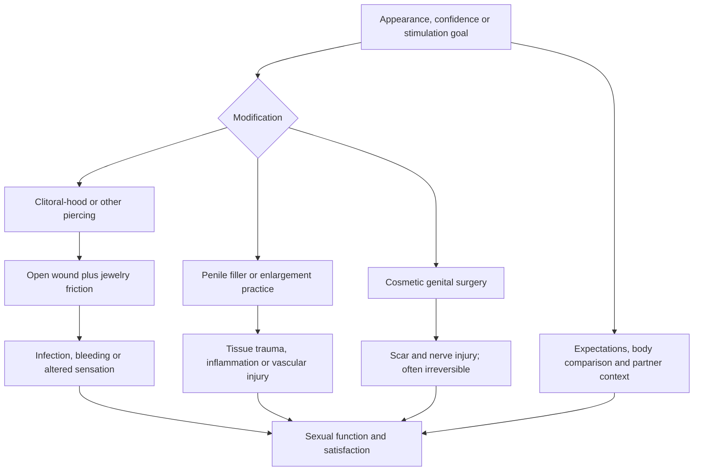

# Genital modification and sexual function

Elective genital modification includes piercings, fillers, traction or manual enlargement practices, and cosmetic surgery. These interventions differ in anatomy, reversibility, evidence, and purpose, but share a decision problem: a change intended to improve appearance, confidence, or stimulation can injure nerves, vessels, skin, erectile tissue, or barrier defenses and thereby worsen the function it was meant to improve. Satisfaction also depends on expectations and partner communication, not anatomy alone. (@RenaMalikMD (Rena Malik, M.D.) — "Can a Clitoral Piercing Make Sex Feel Better? | Tight Foreskin, Testosterone for Women", 2026-07-31, [link](https://www.youtube.com/watch?v=1jlLfaoHTcI)) (@RenaMalikMD (Rena Malik, M.D.) — "Why The Average Penis Is Better Than Most Men Think", 2026-07-29, [link](https://www.youtube.com/watch?v=P3UbnEG8aaI))

## Anatomy, stimulation, and wound healing

The clitoris is highly vascular and densely innervated; piercing the clitoral body itself therefore carries bleeding and nerve-injury risk. A clitoral-hood piercing traverses adjacent skin and may change mechanical stimulation, but increased stimulation can be pleasurable, excessive, painful, or neutral. The transcript cites an infection estimate near 9% across genital piercings and a typical six-to-eight-week healing window for clitoral-hood piercing. Because the source does not identify the underlying studies or separate anatomical sites, jewelry, technique, or case definitions, neither number is a precise individualized prediction. (@RenaMalikMD (Rena Malik, M.D.) — "Can a Clitoral Piercing Make Sex Feel Better? | Tight Foreskin, Testosterone for Women", 2026-07-31, [link](https://www.youtube.com/watch?v=1jlLfaoHTcI))

During healing, the tract is a wound exposed to moisture, friction, microbes, and sexual contact. Infection, bleeding, hypersensitivity, diminished sensation, migration, tearing, and condom damage are plausible site- and technique-dependent harms. Shame or fear of judgment can add a second pathway to harm by delaying care. The source recommends an experienced piercer with anatomical knowledge, but supplies no credentialing standard that reliably predicts safety. (@RenaMalikMD (Rena Malik, M.D.) — "Can a Clitoral Piercing Make Sex Feel Better? | Tight Foreskin, Testosterone for Women", 2026-07-31, [link](https://www.youtube.com/watch?v=1jlLfaoHTcI))

## Enlargement and cosmetic surgery

Penile length or girth interventions are often marketed against a comparison standard rather than a functional disorder. Sue Goldstein and Rena Malik take a strongly precautionary position: absent micropenis or a reconstructive indication, an average-sized functional penis generally does not need enlargement, and greater size does not reliably produce greater partner pleasure. They specifically discourage jelqing and penile fillers because benefit is uncertain and injury can be permanent. Malik distinguishes dissolvable hyaluronic-acid filler from permanent filler, but reversibility of material does not eliminate injection, vascular, inflammatory, contour, or sexual-function risk. (@RenaMalikMD (Rena Malik, M.D.) — "Why The Average Penis Is Better Than Most Men Think", 2026-07-29, [link](https://www.youtube.com/watch?v=P3UbnEG8aaI))

Cosmetic vulvar surgery similarly requires separating reconstructive or symptom-directed need from appearance normalization. Cutting or scarring near sensory nerves may alter sensation, and an operation cannot simply be undone. The speakers' broad opposition is a clinical perspective rather than a reviewed comparative synthesis; outcomes likely depend on indication, technique, surgeon experience, baseline symptoms, and how benefit is measured. (@RenaMalikMD (Rena Malik, M.D.) — "Why The Average Penis Is Better Than Most Men Think", 2026-07-29, [link](https://www.youtube.com/watch?v=P3UbnEG8aaI))

## A decision framework

A sound decision starts with a specific target: pain, interference with clothing or activity, a reconstructive need, appearance distress, or desired stimulation. It then compares nonprocedural options, expected absolute benefit, reversibility, operator training, infection control, aftercare, sexual-rest periods, device or condom interactions, and rescue options. Persistent preoccupation despite reassurance may warrant attention to body-image distress before an irreversible procedure; this is not a claim that every elective request is pathological. (@RenaMalikMD (Rena Malik, M.D.) — "Why The Average Penis Is Better Than Most Men Think", 2026-07-29, [link](https://www.youtube.com/watch?v=P3UbnEG8aaI))

## Practical implications

- **Before any elective genital procedure: define the functional goal and obtain anatomy-specific counseling about reversibility, sensation, infection, scarring, sexual activity, and condom compatibility — strong harm-reduction principle; outcome evidence not reviewed here.** More anatomical change does not imply more pleasure. (@RenaMalikMD (Rena Malik, M.D.) — "Why The Average Penis Is Better Than Most Men Think", 2026-07-29, [link](https://www.youtube.com/watch?v=P3UbnEG8aaI))
- **For a genital piercing: use a practitioner experienced with the exact site and follow a written wound-care and return-to-sex plan — moderate expert guidance.** Avoid submersion and unprotected sexual exposure during initial healing as advised; obtain prompt care for spreading redness, worsening pain, pus, fever, persistent bleeding, or discoloration. (@RenaMalikMD (Rena Malik, M.D.) — "Can a Clitoral Piercing Make Sex Feel Better? | Tight Foreskin, Testosterone for Women", 2026-07-31, [link](https://www.youtube.com/watch?v=1jlLfaoHTcI))
- **Avoid unsupervised jelqing, injections, or internet enlargement products — strong precautionary recommendation, comparative benefit evidence not reviewed here.** Seek sexual-medicine or reconstructive-urology assessment first. (@RenaMalikMD (Rena Malik, M.D.) — "Why The Average Penis Is Better Than Most Men Think", 2026-07-29, [link](https://www.youtube.com/watch?v=P3UbnEG8aaI))
- **Do not delay medical care because a complication followed an elective procedure — strong safety principle.** Early assessment may limit infection, ischemia, scarring, or sensory loss. (@RenaMalikMD (Rena Malik, M.D.) — "Can a Clitoral Piercing Make Sex Feel Better? | Tight Foreskin, Testosterone for Women", 2026-07-31, [link](https://www.youtube.com/watch?v=1jlLfaoHTcI))

## Gaps & open questions

- What are complication rates by piercing site, technique, jewelry, operator training, and follow-up duration?
- Do clitoral-hood piercings improve patient-reported pleasure beyond expectancy and selection effects?
- What are the long-term sexual-function outcomes of penile fillers, traction, surgery, and cosmetic vulvar procedures?
- Which credentialing and infection-control standards predict fewer complications?
- How should clinicians distinguish an informed preference from body-image distress likely to persist after anatomical change?

## Related

[[phimosis-and-paraphimosis]] · [[erectile-dysfunction-and-vascular-health]] · [[pornography-motivation-and-sexual-health]] · [[rena-malik]]
