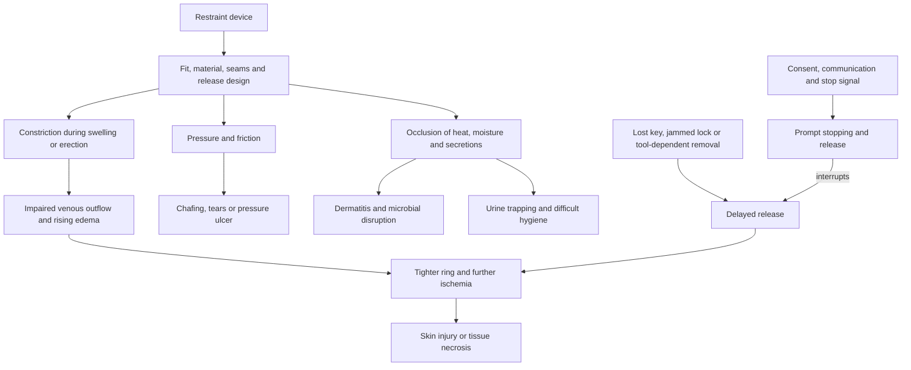

# Genital restraint-device safety

Genital restraint devices restrict access to or expansion of genital tissue. A penile chastity cage encloses the flaccid penis and is anchored by a ring behind the scrotum; unlike an erection-support ring, its intended function is to limit erection and stimulation. A vulvar chastity belt uses a waist attachment and a rigid or semi-rigid shield over the vulva, perineum, and sometimes anus. These devices can be part of consensual sexual power exchange, but the relevant safety model is mechanical and physiological: constriction, pressure, friction, moisture, material exposure, impaired hygiene, and delayed release determine risk. (@RenaMalikMD (Rena Malik, M.D.) — "Chastity Cages Are Getting Popular — But Nobody Warns You About THIS", 2026-08-24, [link](https://www.youtube.com/watch?v=dCKC0aenxeY))

## Injury pathways and recognition

For penile devices, the base ring is the central hazard. Spontaneous nocturnal erections can increase tissue volume against a ring, impair venous drainage, increase edema, and thereby tighten the constriction in a self-amplifying loop. The source extrapolates from the broader penile-strangulation literature because chastity-specific clinical data are sparse; it reports an estimated 6,344 penile ring-related US emergency-department injuries across 20 years and describes delays beyond 72 hours as associated with more serious injury. The exact estimate and delay gradient have not been independently checked for this chapter, so they establish provenance and urgency context rather than a reviewed incidence estimate or safe waiting period. (@RenaMalikMD (Rena Malik, M.D.) — "Chastity Cages Are Getting Popular — But Nobody Warns You About THIS", 2026-08-24, [link](https://www.youtube.com/watch?v=dCKC0aenxeY))

For vulvar belts, the dominant pathway is sustained contact under occlusion. Thin vulvar skin exposed to pressure, seams, friction, sweat, discharge, or retained urine can develop chafing, irritant or allergic contact dermatitis, and pressure injury. Occlusion and difficult cleaning may also disturb local microbial ecology, but the transcript's claims about increased candidiasis, bacterial vaginosis, or urinary-tract infection risk are plausible extrapolations rather than chastity-device outcome evidence. Nickel or poorly characterized alloys add allergy and corrosion concerns, and anatomical variation makes a generic rigid fit especially uncertain. (@RenaMalikMD (Rena Malik, M.D.) — "Chastity Cages Are Getting Popular — But Nobody Warns You About THIS", 2026-08-24, [link](https://www.youtube.com/watch?v=dCKC0aenxeY))

Claims of inevitable permanent penile shrinkage or erectile dysfunction are not supported by the source. Temporary altered sensitivity or difficulty obtaining an erection after prolonged wear is reported, but frequency, duration, and predictors are unmeasured. This absence of evidence does not make prolonged constriction safe: ischemic injury is a separate mechanism and an inability to remove a device during swelling is an emergency problem. (@RenaMalikMD (Rena Malik, M.D.) — "Chastity Cages Are Getting Popular — But Nobody Warns You About THIS", 2026-08-24, [link](https://www.youtube.com/watch?v=dCKC0aenxeY))

## Consent and psychosocial context

Interest in restraint does not by itself imply psychopathology or relationship dysfunction. Malik cites a Norwegian survey of about 4,000 people in which BDSM interest or practice was common and practitioners did not differ in overall mental health or relationship satisfaction, plus a separate study linking a positively experienced consensual BDSM session with lower cortisol and greater relationship closeness. These associations do not show that a device causes better relationships; selection, consent, communication skill, and whether the experience was wanted are likely modifiers. The transferable principle is that negotiated consent and a usable stop-and-release plan are part of physical risk control, not merely relationship etiquette. (@RenaMalikMD (Rena Malik, M.D.) — "Chastity Cages Are Getting Popular — But Nobody Warns You About THIS", 2026-08-24, [link](https://www.youtube.com/watch?v=dCKC0aenxeY))

## Practical implications

- **Before every use: establish affirmative consent, a stop word or signal, who controls release, and an immediately accessible release method — strong harm-reduction logic, but device-specific outcome evidence is sparse.** Do not use a lock without a spare key or a rapid plan that works if the key-holder is unavailable. (@RenaMalikMD (Rena Malik, M.D.) — "Chastity Cages Are Getting Popular — But Nobody Warns You About THIS", 2026-08-24, [link](https://www.youtube.com/watch?v=dCKC0aenxeY))
- **At fitting: avoid a tight flaccid fit, rough edges, corrodible or allergenic alloys, and devices whose emergency removal requires heavy tools — expert safety guidance.** Malik proposes that a finger should slide beneath a penile base ring and favors medical-grade silicone or polymers; these are unvalidated fit heuristics, not guarantees of perfusion. Vulvar devices should not press tightly on the vulva and should permit airflow. (@RenaMalikMD (Rena Malik, M.D.) — "Chastity Cages Are Getting Popular — But Nobody Warns You About THIS", 2026-08-24, [link](https://www.youtube.com/watch?v=dCKC0aenxeY))
- **Investigational practice: Malik recommends penile-device sessions of 30 minutes or less and periodic removal for longer use.** No device-specific trial or guideline was reviewed to validate 30 minutes as a safe threshold, and sleep adds unobserved erection and delayed-release risk. Treat any time limit as secondary to frequent inspection, comfort, normal color and sensation, and immediate removability. (@RenaMalikMD (Rena Malik, M.D.) — "Chastity Cages Are Getting Popular — But Nobody Warns You About THIS", 2026-08-24, [link](https://www.youtube.com/watch?v=dCKC0aenxeY))
- **At every break and after use: remove the device, inspect skin, wash and dry both skin and device, and avoid reapplication over injury — expert safety guidance.** Vulvar users need particular attention to moisture, pressure points, urination, and cleaning access. (@RenaMalikMD (Rena Malik, M.D.) — "Chastity Cages Are Getting Popular — But Nobody Warns You About THIS", 2026-08-24, [link](https://www.youtube.com/watch?v=dCKC0aenxeY))
- **Immediately: release for pain, progressive swelling, bruising, tearing, numbness, coldness, or color change; if release fails, seek emergency care without waiting — high-consequence safety guidance.** Do not let embarrassment delay assessment of a trapped, swollen, or discolored penis or genital tissue. (@RenaMalikMD (Rena Malik, M.D.) — "Chastity Cages Are Getting Popular — But Nobody Warns You About THIS", 2026-08-24, [link](https://www.youtube.com/watch?v=dCKC0aenxeY))

## Gaps & open questions

- What is the incidence of ischemic, skin, urinary, and infectious injury for each device design and wear duration?
- Which objective fit or perfusion checks predict safety better than comfort or the one-finger heuristic?
- Is any duration safe during sleep, exercise, travel, intoxication, or situations in which rapid release is impaired?
- Do custom vulvar devices reduce pressure and dermatitis compared with generic devices, and what ventilation or cleaning design performs best?
- How often are temporary sensory or erectile changes reported, and when do they indicate nerve or vascular injury?
- Which observed associations between consensual BDSM and well-being survive adjustment for communication, relationship quality, and selection into participation?

## Related

[[genital-modification-and-sexual-function]] · [[phimosis-and-paraphimosis]] · [[vulvovaginal-anatomy-and-hormone-sensitivity]] · [[vulvovaginal-candidiasis]] · [[erectile-dysfunction-and-vascular-health]] · [[rena-malik]]
