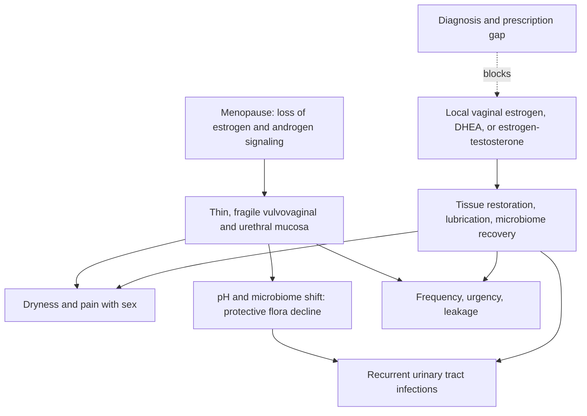

# Genitourinary syndrome of menopause

Genitourinary syndrome of menopause (GSM) is the constellation of vulvar, vaginal, and lower-urinary changes produced by loss of sex-hormone support after menopause. Vaginal and vestibular tissue is densely hormone-responsive; without estrogen (and androgen) signaling it becomes thin, dry, fragile, and easily irritated, producing pain with sex, vaginal dryness, urinary frequency, urgency, leakage, and a markedly higher risk of recurrent urinary tract infections. Unlike hot flashes, GSM does not fade with time — the tissue change is progressive without treatment. (@RenaMalikMD (Rena Malik, M.D.) — "Why Your Vagina Doesn't Get 'Loose' From Sex (Despite What Social Media Says)", 2026-07-24, [link](https://www.youtube.com/watch?v=DnbhB-6vy80))

## Local hormone therapy

Low-dose vaginal hormones act on the tissue directly with minimal systemic exposure — the source characterizes it as microdosing. Options described include vaginal estrogen cream or suppository about twice weekly, vaginal DHEA (which the tissue converts locally to estrogens and androgens) nightly, and an estradiol ring replaced every three months. Reported effects are tissue healing, improved lubrication, restored pH and protective microbiome, fewer UTIs, and improved arousal and orgasm; Rachel Rubin's group helped publish American Urological Association GSM guidance, and clinicians in the source state that no study has shown enough systemic absorption from vaginal estrogen to raise cancer, clot, or stroke risk. That safety claim is an expert summary consistent with the local route, but the "no risk" phrasing is stronger than the underlying evidence can prove for every product and dose; regulator labels still carry class warnings. (@RenaMalikMD (Rena Malik, M.D.) — "Why Your Vagina Doesn't Get 'Loose' From Sex (Despite What Social Media Says)", 2026-07-24, [link](https://www.youtube.com/watch?v=DnbhB-6vy80))

The breast-cancer boundary drawn in the source: vaginal (local) estrogen is presented as usable even with a breast-cancer history — with the explicit exception that patients actively being treated with an aromatase inhibitor or anti-estrogen are not candidates — while systemic hormone therapy after breast cancer depends on stage, receptor status, and time since treatment and is a specialist decision, not an automatic no. This position conflicts with the categorical refusals many oncology patients report receiving; the disagreement between "local estrogen is safe in survivors" and label-level caution is a live clinical dispute rather than settled fact. (@RenaMalikMD (Rena Malik, M.D.) — "Why Your Vagina Doesn't Get 'Loose' From Sex (Despite What Social Media Says)", 2026-07-24, [link](https://www.youtube.com/watch?v=DnbhB-6vy80)) [[menopause-hormone-therapy]]

## The treatment gap

The source cites a colleague's published finding that among Medicare patients who already carry a GSM diagnosis, only about 9% receive a prescription — the undertreatment is at the prescribing step, not only at diagnosis, and diagnosis itself is also widely missed. The contrast drawn is with erectile dysfunction, where pharmacologic treatment is offered routinely. (@RenaMalikMD (Rena Malik, M.D.) — "Why Your Vagina Doesn't Get 'Loose' From Sex (Despite What Social Media Says)", 2026-07-24, [link](https://www.youtube.com/watch?v=DnbhB-6vy80))

Upstream of both diagnosis and prescribing sits disclosure. Gynecologist Maria Sophocles describes midlife dryness and pain with sex as typically suffered silently: shame frames lubricant as an admission of being old and dried up, so symptoms never reach a clinician. Her counter-position — "Lube is for everyone at any age" — converts the lubricant from a confession into an ordinary aid, and its failure into a defined escalation trigger: if lubricant does not resolve discomfort, that is the cue to seek evaluation rather than to endure. She also invites partners to close the gap from the other side by preemptively learning about menopausal genital change and asking about it, rather than waiting for disclosure that shame may indefinitely delay. These are counseling positions from clinical experience, consistent with but not adding to the treatment evidence above. (@RenaMalikMD (Rena Malik, M.D.) — "Think More Chores Will Get You More Sex? Here’s What Actually Builds Desire", 2026-09-02, [link](https://www.youtube.com/watch?v=zLyv9TczNoc)) [[maria-sophocles]]

## Practical implications

- **For any postmenopausal vaginal dryness, painful sex, urinary urgency/frequency, or recurrent UTIs: ask specifically about GSM and local vaginal hormone options — strong; supported by professional-society guidance referenced in the source.** Options include twice-weekly estrogen cream or suppository, nightly vaginal DHEA, or a three-month estradiol ring. (@RenaMalikMD (Rena Malik, M.D.) — "Why Your Vagina Doesn't Get 'Loose' From Sex (Despite What Social Media Says)", 2026-07-24, [link](https://www.youtube.com/watch?v=DnbhB-6vy80))
- **With a breast-cancer history: do not accept a categorical refusal without discussion — moderate; contested territory.** Active aromatase-inhibitor or anti-estrogen treatment is the stated exception; otherwise candidacy depends on the specifics and deserves an informed specialist conversation. (@RenaMalikMD (Rena Malik, M.D.) — "Why Your Vagina Doesn't Get 'Loose' From Sex (Despite What Social Media Says)", 2026-07-24, [link](https://www.youtube.com/watch?v=DnbhB-6vy80))
- **Treat GSM as chronic maintenance, not a course — moderate.** Benefits require continued use; symptoms and UTI risk return off therapy. (@RenaMalikMD (Rena Malik, M.D.) — "Why Your Vagina Doesn't Get 'Loose' From Sex (Despite What Social Media Says)", 2026-07-24, [link](https://www.youtube.com/watch?v=DnbhB-6vy80))

## Gaps & open questions

- What are the absolute systemic-exposure and outcome data for each vaginal product in breast-cancer survivors, by treatment type and receptor status?
- Why does the prescribing gap persist after diagnosis, and which system changes close it?
- How do vaginal estrogen, DHEA, and estrogen–testosterone compounds compare head-to-head on pain, UTI recurrence, and sexual function?
- Does early local therapy at the menopause transition prevent later urinary morbidity better than delayed treatment?

## Related

[[vulvovaginal-anatomy-and-hormone-sensitivity]] · [[menopause-hormone-therapy]] · [[sexual-desire-arousal-and-aging]] · [[hormonal-contraception]] · [[bladder-filling-and-voiding-behavior]] · [[perimenopause-assessment-and-testing]] · [[rena-malik]] · [[maria-sophocles]]
