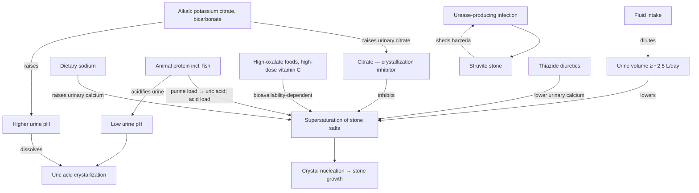
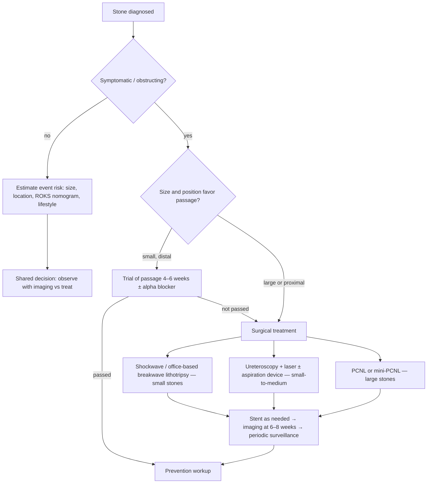

# Kidney stones

A kidney stone is a crystalline concretion of poorly soluble mineral salts, bound together with a variable organic "matrix" of proteins, that precipitates from urine inside the hollow collecting system of the kidney. The governing physics is supersaturation: like salt added to a bowl of water, each urinary salt stays dissolved only up to a concentration threshold, and once urine is saturated the excess crystallizes. Stone salts are far less soluble than table salt, so the balance among urine volume, salt excretion, and inhibitor concentration determines whether crystals form, grow, and anchor. Calcium-based stones (mostly calcium oxalate, some calcium phosphate) make up roughly 80–90% of stones in Western countries; uric acid stones about 5–10%, concentrated in overweight and obese people with acidic urine; and infection (struvite) stones under 10%, grown by urease-producing bacteria that alkalinize urine and become incorporated into the stone, which then re-seeds infection in a self-sustaining cycle. Two stones labeled "calcium oxalate" can still differ materially in protein and organic structure, and why a given person starts forming stones remains only partly understood. (@RenaMalikMD (Rena Malik, M.D.) — "How to Fight Kidney Stones and Win Every Single Time", 2026-07-10, [link](https://www.youtube.com/watch?v=HRPLLdVfiXk))

Roughly 10% of the US population is estimated to be at risk of stone formation, and both symptomatic and incidentally imaged stones have been increasing since the 1970s worldwide. The rise is disproportionately female: a historical ratio of about four men per affected woman has narrowed in some studies to roughly 1.5:1 or parity. Pediatric stone disease, once rare, has also risen enough to create pediatric stone subspecialists. Proposed drivers — dietary deterioration, obesity and metabolic syndrome (linked to stones in children), environmental exposures, women's lifestyle and workforce convergence with men's, and familial transmission — are plausible but explicitly not proven; the panel treats them as theory rather than established cause. A newer uncertainty runs in both directions: GLP-1 receptor agonists may reduce metabolic stone risk the way bariatric surgery improves most 24-hour urine parameters, but appetite suppression can also reduce fluid intake, and urine volume fell after bariatric surgery even as calcium, oxalate, and uric acid improved. (@RenaMalikMD (Rena Malik, M.D.) — "How to Fight Kidney Stones and Win Every Single Time", 2026-07-10, [link](https://www.youtube.com/watch?v=HRPLLdVfiXk)) [[glp-1-receptor-agonists]] [[visceral-and-ectopic-fat]]

## The supersaturation system and its levers

The inhibitor side of the system is chemically specific in a way that defeats most beverage folklore. Urinary citrate is a potent inhibitor of calcium-stone formation, but citrate rises in urine only when the kidney receives an alkali load. Potassium citrate, sodium bicarbonate, and orange juice deliver alkali and raise urinary citrate; lemonade delivers citric acid, whose proton neutralizes the alkali generated from its own citrate, so trials have generally not shown a meaningful urinary-citrate rise. This is a live disagreement within the panel: Margaret Pearle holds the physiological position that lemonade fails to raise urinary citrate, while Roger Sur cites his group's Duke study in which half a cup of lemon juice raised 24-hour urinary citrate over time. Quantity is the second trap: many beverages list potassium citrate as an ingredient at doses far below therapeutic — diet Sunkist, the best-tested citrus soda, carries about 10 mEq, the equivalent of a single tablet against a typical 30 mEq starting prescription — and branded alkaline water changes the pH of the water but delivers too little alkali to affect stones. Almost all of this evidence uses urine chemistry as a surrogate; very few beverages or supplements have been tested against stone formation itself, which requires trials of two to five years. (@RenaMalikMD (Rena Malik, M.D.) — "How to Fight Kidney Stones and Win Every Single Time", 2026-07-10, [link](https://www.youtube.com/watch?v=HRPLLdVfiXk))

Dietary oxalate deserves less anxiety than internet lists give it. Direct evidence that dietary oxalate intake changes stone outcomes is limited; oxalate content is hard to measure, published lists conflict, and content does not equal bioavailability — some high-oxalate foods are poorly absorbed. The panel's practice is to restrict only the few genuinely high-oxalate foods (spinach, beets, rhubarb, almonds and other nuts, potatoes) and only in patients whose 24-hour urinary oxalate is actually elevated, while leaving moderate-oxalate healthy foods (chocolate, raspberries, broccoli, oranges) alone; oranges are net-favorable because they raise citrate. A scientifically measured food list from the Wake Forest urology group is the panel's preferred reference. High-dose supplemental vitamin C (roughly 500–2,000 mg, versus multivitamin doses) is a recurrent, avoidable cause of calcium oxalate stones because ascorbate is metabolized toward oxalate. (@RenaMalikMD (Rena Malik, M.D.) — "How to Fight Kidney Stones and Win Every Single Time", 2026-07-10, [link](https://www.youtube.com/watch?v=HRPLLdVfiXk)) [[supplement-evidence-and-safety]]

## Prevention evidence

Fluid is the best-supported lever, and the target is urine output, not intake: trials showing fewer stone events achieved urine volumes around 2.5 L/day, and the intake needed to produce that differs by person, climate, sweat, and gastrointestinal losses. Patient perception is unreliable — clinicians repeatedly see patients who report drinking heavily whose measured volumes fall short — and thirst evolved to prevent dangerous dehydration, not stones, so stone formers are told to drink on schedule rather than on thirst (the panel's phrasing: "You really need to think about drinking when you're not thirsty"). Sodium moderation matters because sodium drives urinary calcium excretion and hides in restaurant and processed food rather than the salt shaker. Animal-protein moderation (a palm-sized ~4 oz portion per meal as a heuristic; fish is the highest-purine offender despite its health halo) reduces uric acid and acid load. The relationship is a continuum, and none of the three requires vegetarianism — the panel frames it as shifting the plate ratio toward fruits and vegetables, which add both citrate precursors and fluid, consistent with a Mediterranean-style pattern. Water type (hard, soft, mineral content) has not shown meaningful differences in the available lower-quality studies. (@RenaMalikMD (Rena Malik, M.D.) — "How to Fight Kidney Stones and Win Every Single Time", 2026-07-10, [link](https://www.youtube.com/watch?v=HRPLLdVfiXk)) [[food-label-literacy-and-health-halos]]

Prescription prevention is directed by 24-hour urine chemistry. The most common treatable abnormality is high urinary calcium, addressed with thiazide diuretics; low citrate or acidic urine is addressed with potassium citrate (a typical starting dose of 30 mEq, titrated against repeat 24-hour urines, taken with food because gastrointestinal upset drives discontinuation). Sodium bicarbonate is a short-acting alternative that adds an unwanted sodium load; potassium salts are contraindicated with impaired kidney function or potassium-retaining medications. Randomized evidence shows that stone-prevention medications reduce recurrence, including trials that gave medication without 24-hour urine selection — so whether empiric therapy matches urine-directed therapy is an open comparative question, sharpened by claims-data analyses in which 24-hour urine testing was not associated with lower recurrence. The panel's counterpoints: claims data cannot see patient-level behavior; the test doubles as a dietary audit (revealing hidden sodium and protein intake and reinforcing adherence, like seeing one's own cholesterol number); and only a small minority — cited as roughly 10% or less — of high-risk recurrent stone formers ever get metabolic testing, so under-use is a larger real-world problem than over-use. Testing is reserved for recurrent stone formers and first-time formers with risk factors or strong motivation; two baseline collections are preferred because one collection reflects a few days of diet, with follow-up collections 3–6 months after starting a medication and periodically thereafter. (@RenaMalikMD (Rena Malik, M.D.) — "How to Fight Kidney Stones and Win Every Single Time", 2026-07-10, [link](https://www.youtube.com/watch?v=HRPLLdVfiXk)) [[proactive-health-monitoring]]

Home remedies divide into the unsupported and the chemically plausible. Apple cider vinegar is ubiquitous online with essentially no supporting studies (an "ancient Chinese vinegar" is under molecular-level investigation in China, without transferable results); chanca piedra has multiple randomized trials with mixed results across its several distinct claims. The plausible category exploits alkalinization: uric acid stones are genuinely dissolvable with sufficient alkali, and Roger Sur reports a published case series, learned from a patient, in which a baking-soda-plus-lime-and-orange regimen dissolved bilateral kidney stones before scheduled surgery and became part of his practice for suitable patients. Calcium stones are the boundary case — none of the panel has seen one dissolve, and Brian Eisner's mechanistic caution is that any agent aggressive enough to dissolve ubiquitous body calcium would likely harm other tissues. Supplements marketed for stones are largely untested; the panel's minimum bar for a citrate supplement is a known alkali-citrate quantity comparable to prescription starting doses (about 30 mEq), and even the best-characterized product (Moonstone, which Eisner helped develop — a disclosed conflict) has urine-chemistry evidence only, not recurrence trials. Over-the-counter potassium citrate tablets commonly contain ~1 mEq, thirty-fold below a starting dose. (@RenaMalikMD (Rena Malik, M.D.) — "How to Fight Kidney Stones and Win Every Single Time", 2026-07-10, [link](https://www.youtube.com/watch?v=HRPLLdVfiXk))

## Presentation, passage, and the treatment decision

Stones attached to the renal lining are usually silent; classic renal colic — flank pain, hematuria, nausea — occurs when a detached stone obstructs the ureter and urine backs up, stretching the kidney's collecting system. Presentations span a full continuum, including incidental findings on imaging done for other reasons, microscopic hematuria, vague positional back pain, and recurrent urinary tract infections harboring an unrecognized stone. Whether a non-obstructing stone still in the kidney can itself cause pain is contested: classic teaching says no, while Sur reports twenty years of selected patients whose pain resolved after removal of such stones — the panel's synthesis is that obstructing-stone pain reliably resolves with treatment, kidney-stone pain without obstruction is real but less common, and patients should be counseled that removal may not cure the pain. (@RenaMalikMD (Rena Malik, M.D.) — "How to Fight Kidney Stones and Win Every Single Time", 2026-07-10, [link](https://www.youtube.com/watch?v=HRPLLdVfiXk))

Passage odds are governed by size and location. Beyond roughly 5–6 mm, spontaneous passage falls below 50%; a small stone at the ureterovesical junction may have ~98% odds within a week, while a 7 mm stone in the proximal ureter may be under 10%. Observation is bounded at about four to six weeks because prolonged obstruction risks irreversible loss of kidney function and late passage becomes unlikely. Updated AUA surgical guidelines endorse alpha blockers for distal ureteral stones — well tolerated but with a real yet marginal benefit. The roller-coaster and sexual-intercourse passage aids each rest on thin evidence (a 3D-printed-model study and a small randomized trial, respectively); the panel treats them as low-risk options for distal stones without endorsing a causal claim. For asymptomatic kidney stones, treatment is a shared decision built on risk tolerance: the Mayo Clinic ROKS nomogram estimates the chance a given stone will cause an event over 2–15 years, weighed against lifestyle (remote travel, occupation), comorbidity, and procedure risk. One randomized New England Journal trial found that removing small asymptomatic stones during surgery for a symptomatic stone substantially reduced downstream events — level-one evidence for opportunistic clearance, not a mandate to operate on every silent stone. (@RenaMalikMD (Rena Malik, M.D.) — "How to Fight Kidney Stones and Win Every Single Time", 2026-07-10, [link](https://www.youtube.com/watch?v=HRPLLdVfiXk))

## Treatment technology

**Disclosure that conditions this section:** the episode is sponsored by the CVAC aspiration system, and panelists Roger Sur and Brian Eisner are CVAC co-inventors (Eisner also helped develop the Moonstone supplement). The direction of their claims matches the cited randomized and systematic-review evidence, but effect sizes and enthusiasm here come substantially from financially interested parties and deserve independent confirmation. (@RenaMalikMD (Rena Malik, M.D.) — "How to Fight Kidney Stones and Win Every Single Time", 2026-07-10, [link](https://www.youtube.com/watch?v=HRPLLdVfiXk))

Traditional ureteroscopy — flexible scope, laser fragmentation, basket retrieval or spontaneous passage of dust — leaves patients truly fragment-free only about 50–55% of the time, a sobering figure first established by Pearle's group against surgeons' self-perception. Aspiration devices (CVAC's continuous vacuum scope; suction access sheaths) address this by vacuuming fragments and dust during lithotripsy; reported gains include higher stone-free rates (a clearance study led by Eisner reported ~97–99% removal), fewer infections because bacteria-laden fragments leave the body (supported in systematic reviews), better intraoperative visibility through the "snow globe" of stone dust, and — in the two-year randomized ASPIRE trial — fewer downstream emergency visits, admissions, and healthcare events in the suction arm, tracking residual fragment volume. Aspiration is also expanding ureteroscopy's size range into territory once requiring percutaneous surgery: PCNL (scope through a back incision) remains standard for the largest stones, increasingly in miniaturized (mini-PCNL) form, while the 1–2 cm intermediate zone is actively contested between improved ureteroscopy and smaller-tract percutaneous approaches. (@RenaMalikMD (Rena Malik, M.D.) — "How to Fight Kidney Stones and Win Every Single Time", 2026-07-10, [link](https://www.youtube.com/watch?v=HRPLLdVfiXk))

The office is the other frontier. Breakwave lithotripsy, now FDA-approved for small stones, uses low-pressure (~5–6 MPa versus tens of MPa for conventional shockwave) resonance-based acoustic energy delivered through an ultrasound-coupled probe for ~30 minutes without anesthesia or X-ray, with visible live fragmentation; a microbubble-plus-ultrasound system in early trials offers a second anesthesia-free route. Moving lithotripsy from the operating room to the office — and potentially the emergency department, where breakwave has been used to fragment or reposition an acutely obstructing distal stone — would relieve a genuine operating-room bottleneck, though all current trials cover small stones only. Stents (temporary kidney-to-bladder tubes protecting against post-instrumentation ureteral swelling) remain routine and remain the misery of stone surgery — roughly a third of patients barely notice them, a third are bothered, a third are miserable — with mitigation from anticholinergic/alpha-blocker or mirabegron regimens and early-stage work on stentless small-scope protocols, drug-coated stents, and topical upper-tract drug delivery. Follow-up imaging at six to eight weeks checks for residual stones and silent obstruction, then surveillance proceeds ultrasound-first (no radiation), reserving CT for acute questions; ultrasound-to-CT image conversion by machine learning, semi-autonomous surgical robotics, and AI laser-targeting safeguards are the panel's watch-list. (@RenaMalikMD (Rena Malik, M.D.) — "How to Fight Kidney Stones and Win Every Single Time", 2026-07-10, [link](https://www.youtube.com/watch?v=HRPLLdVfiXk))

## Practical implications

- **After any stone: drink to a urine output of about 2.5 L/day, on schedule rather than thirst — strong; this target comes from trials that reduced stone recurrence and is guideline-endorsed.** A practical method is a marked 1 L bottle drunk three times daily, adjusted for sweat and climate; verify with measured 24-hour urine volume rather than perceived intake. Balance against genuine fluid-restriction indications (heart or kidney failure) and note that overactive-bladder symptoms may worsen. (@RenaMalikMD (Rena Malik, M.D.) — "How to Fight Kidney Stones and Win Every Single Time", 2026-07-10, [link](https://www.youtube.com/watch?v=HRPLLdVfiXk))
- **Daily: moderate sodium (read labels and restaurant meals, not the salt shaker), keep animal protein to roughly a palm-sized portion per meal, and favor fruits and vegetables — moderate; consistent with AUA medical-management guidance discussed by the panel.** No stone diet requires vegetarianism; shift ratios, don't eliminate. (@RenaMalikMD (Rena Malik, M.D.) — "How to Fight Kidney Stones and Win Every Single Time", 2026-07-10, [link](https://www.youtube.com/watch?v=HRPLLdVfiXk))
- **Restrict oxalate selectively: only the few highest-oxalate foods (spinach, beets, rhubarb, nuts, potatoes), only to moderation, and ideally only when 24-hour urinary oxalate is high — moderate.** Do not adopt sweeping internet low-oxalate lists that eliminate healthy foods; oranges and orange juice are net-favorable via citrate. (@RenaMalikMD (Rena Malik, M.D.) — "How to Fight Kidney Stones and Win Every Single Time", 2026-07-10, [link](https://www.youtube.com/watch?v=HRPLLdVfiXk))
- **Avoid high-dose vitamin C supplementation (≥500 mg) if you have formed a calcium oxalate stone — moderate mechanistic and clinical-observation evidence.** Multivitamin doses are not implicated. (@RenaMalikMD (Rena Malik, M.D.) — "How to Fight Kidney Stones and Win Every Single Time", 2026-07-10, [link](https://www.youtube.com/watch?v=HRPLLdVfiXk)) [[supplement-evidence-and-safety]]
- **If stones recur, or a first stone comes with risk factors: obtain two baseline 24-hour urine collections during ordinary life (not a best-behavior day), repeat 3–6 months after any medication or diet change, and periodically while risk persists — moderate-to-strong for directed therapy; the empiric-versus-directed comparison is unresolved.** Medications with recurrence-reducing trial evidence include thiazides for high urinary calcium and potassium citrate (typically starting near 30 mEq, taken with food) for low citrate or acidic urine; both require monitoring and are contraindicated or dose-limited with kidney impairment or potassium-retaining drugs. (@RenaMalikMD (Rena Malik, M.D.) — "How to Fight Kidney Stones and Win Every Single Time", 2026-07-10, [link](https://www.youtube.com/watch?v=HRPLLdVfiXk))
- **Investigational practice:** baking soda with citrus for stone dissolution (published case experience, plausible for uric acid stones via alkalinization, no controlled trial); chanca piedra (mixed randomized trials across inconsistent claims); citrate supplements with verified ≥30 mEq alkali citrate (urine-chemistry evidence only); apple cider vinegar (no supporting studies). Roller coasters and intercourse for distal-stone passage are low-risk but rest on a model study and one small trial. None of these substitutes for evaluation of an obstructing stone. (@RenaMalikMD (Rena Malik, M.D.) — "How to Fight Kidney Stones and Win Every Single Time", 2026-07-10, [link](https://www.youtube.com/watch?v=HRPLLdVfiXk))
- **Seek urgent care for stone pain with fever, inability to urinate, uncontrolled vomiting, or a solitary or transplanted kidney; observe an uncomplicated ureteral stone no longer than 4–6 weeks before surgical review — strong clinical framing.** Recurrent UTIs deserve imaging to exclude an infection stone. (@RenaMalikMD (Rena Malik, M.D.) — "How to Fight Kidney Stones and Win Every Single Time", 2026-07-10, [link](https://www.youtube.com/watch?v=HRPLLdVfiXk))

## Gaps & open questions

- Why is stone incidence rising fastest in women and children — diet, obesity, environment, occupational heat, or detection?
- Does 24-hour-urine-directed therapy outperform empiric potassium citrate or thiazide head-to-head on recurrence? No such trial exists.
- Can a validated spot or short-collection urine test, or an in-toilet sensor, replace the burdensome 24-hour collection?
- Do intermediate urine-volume targets (e.g., 2.0 L) retain most of the benefit shown at 2.5 L/day?
- How will GLP-1-driven weight loss net out against reduced fluid intake in population stone rates?
- Which aspiration-device gains (stone-free rate, infection, downstream events) replicate in trials independent of inventor and sponsor involvement?
- Do any herbal or traditional remedies (chanca piedra, investigated vinegars, Ayurvedic preparations) survive standardized-formulation randomized testing?
- What are the long-term outcomes of office-based breakwave and microbubble lithotripsy beyond small stones?

## Related

[[bladder-filling-and-voiding-behavior]] · [[rena-malik]] · [[proactive-health-monitoring]] · [[supplement-evidence-and-safety]] · [[food-label-literacy-and-health-halos]] · [[glp-1-receptor-agonists]] · [[visceral-and-ectopic-fat]] · [[free-sugars-and-glycemic-response]] · [[practice-playbook]]
