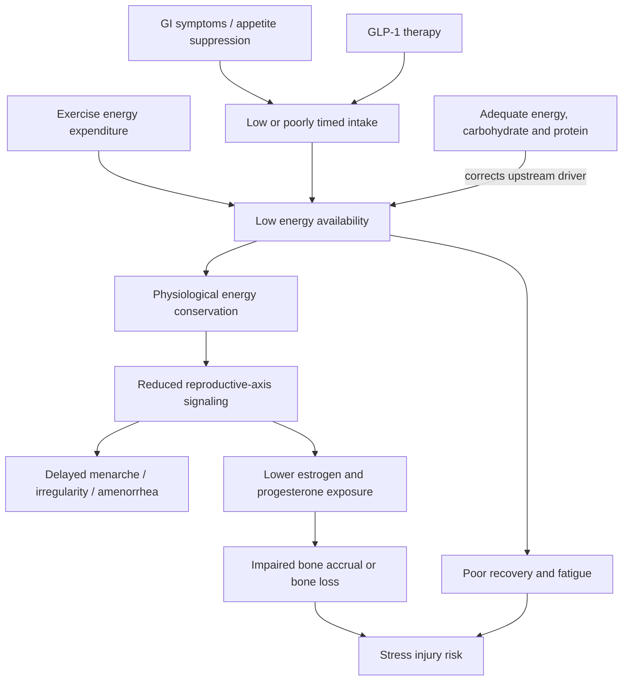

# Low energy availability and menstrual function

Low energy availability occurs when dietary energy remaining after exercise is insufficient to support normal physiological functions. It can be intentional, as in aggressive weight loss, or accidental, as when morning practice, school, suppressed appetite, gastrointestinal discomfort, or a GLP-1 receptor agonist makes adequate intake difficult. In girls and women, delayed menarche, irregular cycles, or amenorrhea can be visible signals of wider endocrine conservation rather than benign signs of fitness. (@PeterAttiaMD (Peter Attia MD) — "378 ‒ Women’s health & performance: how training, nutrition, & hormones interact across life stages", 2026-01-05, [link](https://www.youtube.com/watch?v=CDsH60jt34o))

## Mechanism and lifecourse importance

Energy scarcity shifts resources away from reproduction and tissue building. During adolescence, that can delay reproductive maturation and compromise bone accrual at the stage when peak bone mass is being established; later, the same syndrome can produce fatigue and falling sex hormones that resemble perimenopause even when ovarian aging is not the cause. The transcript links under-fueling, delayed estrogen exposure, bone harm, and stress fractures, but does not provide diagnostic thresholds or controlled effect sizes, so the mechanism is credible while individual diagnosis requires more than a transcript-derived rule. (@PeterAttiaMD (Peter Attia MD) — "How Early Training Choices Shape Women’s Health for Life | Abbie Smith-Ryan, Ph.D.", 2026-01-09, [link](https://www.youtube.com/watch?v=bsw0pKcWf5c)) (@PeterAttiaMD (Peter Attia MD) — "378 ‒ Women’s health & performance: how training, nutrition, & hormones interact across life stages", 2026-01-05, [link](https://www.youtube.com/watch?v=CDsH60jt34o))

Under-fueling need not look like an eating disorder. Training can blunt hunger, gastrointestinal symptoms may discourage food near exercise, and young athletes may lack time between early practice and class. Smith-Ryan's practical response is to treat food as performance and recovery substrate: plan intake rather than relying exclusively on hunger, use energy-dense foods when volume is hard to tolerate, and retain carbohydrate rather than replacing it with a protein-only diet. (@PeterAttiaMD (Peter Attia MD) — "378 ‒ Women’s health & performance: how training, nutrition, & hormones interact across life stages", 2026-01-05, [link](https://www.youtube.com/watch?v=CDsH60jt34o))

## GLP-1 therapy and diagnostic confusion

Appetite-suppressing therapy can reproduce the upstream energy deficit while weight loss also removes lean and bone mass. Resistance training and sufficiently protein-dense meals are proposed safeguards, but they cannot guarantee tissue preservation if total energy remains too low. A crucial differential diagnosis follows: fatigue, cycle disruption, and low estrogen or progesterone during midlife may reflect low intake, the menopausal transition, or both. Assuming every symptom is ovarian aging can miss a modifiable energy deficit; assuming it is only under-fueling can miss clinically important menopause care. (@PeterAttiaMD (Peter Attia MD) — "378 ‒ Women’s health & performance: how training, nutrition, & hormones interact across life stages", 2026-01-05, [link](https://www.youtube.com/watch?v=CDsH60jt34o))

## Practical implications

- **Daily: match total food intake to training and growth demands — strong mechanistic rationale, moderate transcript-level evidence.** Athletes with suppressed appetite should schedule meals and snacks and use tolerable energy-dense foods rather than waiting for hunger. (@PeterAttiaMD (Peter Attia MD) — "378 ‒ Women’s health & performance: how training, nutrition, & hormones interact across life stages", 2026-01-05, [link](https://www.youtube.com/watch?v=CDsH60jt34o))
- **Around demanding sessions: include carbohydrate and protein — moderate.** Carbohydrate supports active young women and should not be displaced by protein-centric restriction; protein supports repair but is not a substitute for adequate energy. (@PeterAttiaMD (Peter Attia MD) — "378 ‒ Women’s health & performance: how training, nutrition, & hormones interact across life stages", 2026-01-05, [link](https://www.youtube.com/watch?v=CDsH60jt34o))
- **Each month or cycle: monitor menstrual regularity alongside fatigue, recovery, performance, and bone-stress symptoms — moderate.** Delayed menarche or lost periods warrants medical and nutrition assessment rather than normalization. (@PeterAttiaMD (Peter Attia MD) — "How Early Training Choices Shape Women’s Health for Life | Abbie Smith-Ryan, Ph.D.", 2026-01-09, [link](https://www.youtube.com/watch?v=bsw0pKcWf5c))
- **During intentional weight loss or GLP-1 therapy: preserve resistance training, raise nutrient density, and reassess body composition and symptoms periodically — plausible and clinically important, but the optimal minimum dose is unknown.** Do not infer tissue composition from scale weight alone. (@PeterAttiaMD (Peter Attia MD) — "378 ‒ Women’s health & performance: how training, nutrition, & hormones interact across life stages", 2026-01-05, [link](https://www.youtube.com/watch?v=CDsH60jt34o))

## Gaps & open questions

- What energy-availability threshold best predicts endocrine and bone effects in free-living girls and women?
- How quickly do cycles, bone turnover, and injury risk recover after adequate intake is restored?
- How often do GLP-1 therapies produce clinically meaningful reproductive-axis suppression independent of weight loss?
- Which biomarkers best distinguish under-fueling from perimenopause when both occur together?
- Can protein and resistance training preserve lean mass during pharmacologic weight loss when total energy intake remains very low?

## Related

[[womens-exercise-across-the-lifespan]] · [[performance-nutrition-and-hydration]] · [[youth-resistance-training]] · [[glp-1-receptor-agonists]] · [[perimenopause-assessment-and-testing]] · [[resistance-training]] · [[aging-model]] · [[practice-playbook]]
