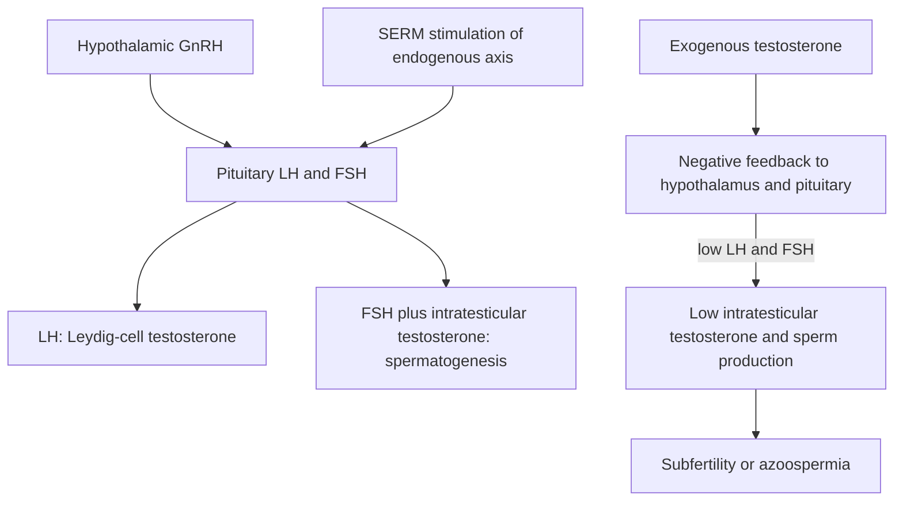

# Male fertility and exogenous testosterone

Male fertility depends on sperm production, maturation, transport, and functional competence. Semen analysis measures concentration, movement, and shape, but these are imperfect proxies for fertilization potential; a result must be interpreted with repeat biological variability, the clinical history, and the female partner's reproductive context. The source characterizes present sperm selection and semen analysis as limited because appearance and motility do not directly measure whether a sperm will fertilize an egg or support development. (@RenaMalikMD (Rena Malik, M.D.) — "A Birth Control Gel for Men Could Be Approved Soon (Would You Actually Trust It?)", 2026-08-07, [link](https://www.youtube.com/watch?v=Z0yWylSfND8))

## Testosterone treatment and fertility

Exogenous testosterone can raise circulating testosterone while lowering the much higher local testosterone concentration required inside the testes. Negative feedback suppresses GnRH, LH, and FSH, so sperm production may fall severely or stop. The degree varies among men, which is why testosterone is simultaneously unsafe to assume fertility-preserving and unreliable as contraception. Recovery after stopping often takes months and is not guaranteed on a chosen schedule; longer exposure, baseline testicular function, age, and other drugs may matter. (@RenaMalikMD (Rena Malik, M.D.) — "A Birth Control Gel for Men Could Be Approved Soon (Would You Actually Trust It?)", 2026-08-07, [link](https://www.youtube.com/watch?v=Z0yWylSfND8))

Symptoms attributed to low testosterone—fatigue, low libido, mood change, and sometimes ED—are nonspecific. A defensible diagnosis therefore combines compatible symptoms with properly timed repeated measurements and evaluation for causes or mimics. The transcript describes checking LH, FSH, prolactin, estradiol, and blood count in context and monitoring erythrocytosis and estrogen-related effects during treatment. Its clinician supports time-limited therapeutic trials in selected symptomatic men within the broad laboratory reference range, with discontinuation when symptoms do not improve; this is a distinctive clinical position rather than evidence that higher-normal values benefit all men. (@RenaMalikMD (Rena Malik, M.D.) — "A Birth Control Gel for Men Could Be Approved Soon (Would You Actually Trust It?)", 2026-08-07, [link](https://www.youtube.com/watch?v=Z0yWylSfND8))

Selective estrogen-receptor modulators such as clomiphene or enclomiphene can increase endogenous LH and FSH and may raise testosterone while preserving or increasing sperm production. The transcript notes that enclomiphene was not FDA-approved and was being compounded; mechanistic plausibility and laboratory response do not remove product-quality, long-term-outcome, or indication-specific uncertainties. Gonadotropin regimens are another specialist option, especially when sperm production is the treatment target. (@RenaMalikMD (Rena Malik, M.D.) — "A Birth Control Gel for Men Could Be Approved Soon (Would You Actually Trust It?)", 2026-08-07, [link](https://www.youtube.com/watch?v=Z0yWylSfND8))

The source also raises possible fertility effects from five-alpha-reductase inhibitors, cannabis, smoking, and other medicines, while emphasizing that reproductive effects are poorly characterized for many approved drugs. Its discussion of persistent post-finasteride sexual symptoms presents a minority clinical concern with uncertain mechanism and incompletely characterized incidence; it should prompt informed monitoring, not a claim that persistent dysfunction is common or proven in every case. (@RenaMalikMD (Rena Malik, M.D.) — "A Birth Control Gel for Men Could Be Approved Soon (Would You Actually Trust It?)", 2026-08-07, [link](https://www.youtube.com/watch?v=Z0yWylSfND8))

## Practical implications

- **Before starting testosterone or an anabolic steroid: discuss desired children and timing, and obtain a baseline reproductive evaluation when future fertility matters — strong.** Do not accept testosterone as a fertility treatment merely because it raises the serum number. (@RenaMalikMD (Rena Malik, M.D.) — "A Birth Control Gel for Men Could Be Approved Soon (Would You Actually Trust It?)", 2026-08-07, [link](https://www.youtube.com/watch?v=Z0yWylSfND8))
- **During prescribed testosterone: monitor symptoms and clinician-selected blood measures at baseline, after dose stabilization, and periodically — strong for monitored treatment; exact cadence is individualized.** Stop or revise therapy when benefit is absent or adverse effects emerge rather than treating a target number as the endpoint. (@RenaMalikMD (Rena Malik, M.D.) — "A Birth Control Gel for Men Could Be Approved Soon (Would You Actually Trust It?)", 2026-08-07, [link](https://www.youtube.com/watch?v=Z0yWylSfND8))
- **When conception is delayed: assess the couple and repeat abnormal semen testing rather than diagnosing from one sample — moderate-to-strong.** Review prescription drugs, nonprescription hormones, smoking, cannabis, heat and occupational exposures with a fertility clinician. (@RenaMalikMD (Rena Malik, M.D.) — "A Birth Control Gel for Men Could Be Approved Soon (Would You Actually Trust It?)", 2026-08-07, [link](https://www.youtube.com/watch?v=Z0yWylSfND8))

## Gaps & open questions

- Which semen or molecular measures best predict fertilization, embryo development, and live birth?
- What predicts incomplete or slow spermatogenic recovery after testosterone?
- What are the long-term comparative benefits and harms of SERMs, gonadotropins, and testosterone in symptomatic younger men?
- How large are drug- and environmental-exposure effects on fertility after confounding and couple-level factors are addressed?

## Related

[[male-contraception]] · [[erectile-dysfunction-and-vascular-health]] · [[hair-loss-diagnosis-and-scalp-health]] · [[practice-playbook]]
