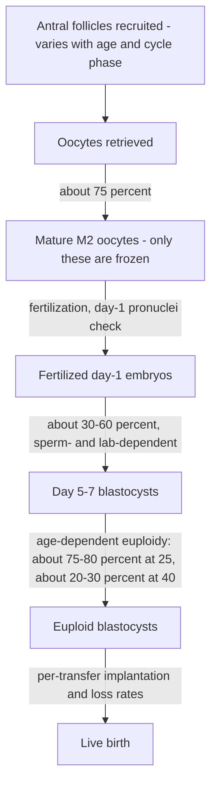

# Oocyte aneuploidy and reproductive aging

The ovary ages faster than any other organ, and the dominant mechanism is aneuploidy: an abnormal chromosome number in the egg. A normal embryo receives 23 chromosomes from each gamete; errors in oocyte meiosis — the source of 93–95% of embryonic aneuploidies — produce monosomies (one copy missing, incompatible with life except monosomy X) and trisomies (a third copy, occasionally survivable, as in trisomy 21). Most aneuploid embryos fail silently as implantation failure or early miscarriage, invisible to any ordinary exam: a 38-year-old with normal cycles and normal labs can be infertile purely because most of her embryos are chromosomally abnormal. Age is the single most important fertility factor, and the episode argues even physicians systematically underweight it — for example, operating on endometriosis at 42 and encouraging natural conception, feeding a hope the aneuploidy math rarely rewards. (Peter Attia MD — "397 - Endometriosis and adenomyosis: diagnosis, fertility, reproductive aging, & emerging treatments", 2026-06-22, [link](https://www.youtube.com/watch?v=IxHRYDM64dQ))

## The aneuploidy curve is a J, and it is exponential

Blastocyst aneuploidy rates by maternal age, as presented in the episode: about 20–25% even at 25; 30–35% at 31; around 40% at 35; around 60% at 38; around 70% at 40; 80–85% at 42. The rise is exponential, not linear — the difference between 31 and 34 is modest, and the curve ramps steeply after 35. Less known is the left arm of the J: the guest reports aneuploidy (particularly monosomy) is probably higher at 20 than at 25, a pattern also seen in other primates, making roughly 25 the biological sweet spot; he speculates, without claiming certainty, that evolution optimized the mid-twenties for carrying, delivering, and raising a child. Human reproduction is intrinsically inefficient by design — about a thousand oocytes are lost to atresia per month for the one that ovulates, mouse and rabbit embryos are far more often euploid — and IVF does not improve egg quality; it only lets more eggs be gathered per unit time. (Peter Attia MD — "397 - Endometriosis and adenomyosis: diagnosis, fertility, reproductive aging, & emerging treatments", 2026-06-22, [link](https://www.youtube.com/watch?v=IxHRYDM64dQ))

Once an embryo is euploid, maternal age matters much less: clinical pregnancy rates with a euploid embryo are broadly similar at 30, 35, or 40, though embryologists note older-egg embryos can look morphologically and morphokinetically worse. This contrasts with sperm, where even chromosomally normal sperm from older fathers carry genetic changes associated with more neuropsychiatric polygenic conditions in offspring. (Peter Attia MD — "397 - Endometriosis and adenomyosis: diagnosis, fertility, reproductive aging, & emerging treatments", 2026-06-22, [link](https://www.youtube.com/watch?v=IxHRYDM64dQ))

## The IVF funnel

Every stage of assisted reproduction multiplies a fraction below one, which is why egg counts that sound large produce few babies.

At 40, a typical AMH is around 1 ng/mL and a typical retrieval yields about eight oocytes — usually insufficient for even one euploid embryo once more than half are aneuploid and the blastocyst attrition is applied. At 25, about 15 frozen eggs give better than an 80% chance of at least one live birth by calculator estimates. Ovarian-reserve measures themselves need careful reading: antral follicle count varies between follicular and luteal phases, so a discouraging count should be rechecked in another phase before conclusions are drawn. Infertility is defined only after a year of trying — a couple's disease requiring evaluation of both partners (semen analysis, karyotype, hysterosalpingogram and other uterine studies) before any cause is assigned. (Peter Attia MD — "397 - Endometriosis and adenomyosis: diagnosis, fertility, reproductive aging, & emerging treatments", 2026-06-22, [link](https://www.youtube.com/watch?v=IxHRYDM64dQ))

## Egg freezing: biology versus economics

Biologically, freezing earlier is strictly better; economically it is not, and the tension is quantifiable. In Brazil a harvest cycle costs about $5,000 (roughly one-third medication, one-third clinic/procedure, one-third laboratory) plus about $150 per year of storage, with about a 1% procedural risk (ovarian torsion, bleeding, infection). Attia's position is that a 25-year-old with unclear timelines who can afford it has capped her downside at $5,000 for high-quality eggs. The guest's counterweight is a striking statistic: only about 10% of women who freeze eggs ever return to use them — many conceive naturally, others change plans — so the cost-effectiveness sweet spot lands around 32–35, old enough that use is likelier, young enough that quality holds. In practice women arrive far too late: the guest's median social-freezing age is 37–38 (his infertility patients are around 40), and the saddest pattern is a woman who froze eight eggs at 34, returns at 40, and thaws them into a single blastocyst that does not implant. The episode also raises a policy angle: in below-replacement-fertility countries, subsidized earlier freezing and IVF (Israel already funds unlimited cycles; Japan faces the demographic pressure) could be framed as prevention of the disease of infertility. (Peter Attia MD — "397 - Endometriosis and adenomyosis: diagnosis, fertility, reproductive aging, & emerging treatments", 2026-06-22, [link](https://www.youtube.com/watch?v=IxHRYDM64dQ))

## What can and cannot be rejuvenated

Donor eggs from a young donor work very well for the woman whose own eggs no longer yield euploid embryos, at the cost of the genetic link. Technologies claiming to restore that link deserve scrutiny against the actual lesion, which is nuclear-chromosomal:

- **Mitochondrial replacement therapy is not egg rejuvenation.** Pronuclear transfer into an enucleated donor oocyte — published for 22 patients by the Newcastle (UK) group in the New England Journal of Medicine — addresses the 37 genes of mitochondrial DNA for families with mitochondrial disease. It swaps the battery, not the engine; the aneuploidy problem lives in the nucleus that is carried over. Clinics (reportedly in northern Cyprus and Greece) marketing this as "egg rejuvenation" for age-related infertility are, in the guest's opinion, misleading. (Peter Attia MD — "397 - Endometriosis and adenomyosis: diagnosis, fertility, reproductive aging, & emerging treatments", 2026-06-22, [link](https://www.youtube.com/watch?v=IxHRYDM64dQ))
- **Ovarian-cortex cryopreservation targets menopause more than fertility.** A UK clinic with a long waiting list offers freezing of ovarian cortex in a woman's thirties (a partial oophorectomy) for autologous reimplantation around 45 — peritoneally or even subcutaneously — modeled to postpone menopause by 10–15 years by restoring endogenous estrogen and progesterone. No publications yet exist; egg freezing outperforms cortex freezing for oocyte outcomes; and the honest open question, which the guest has lectured on, is why grafting is preferable to simply prescribing menopausal hormone therapy — he attributes the appeal partly to the cultural fear of HRT that followed July 2002 (the WHI publicity). (Peter Attia MD — "397 - Endometriosis and adenomyosis: diagnosis, fertility, reproductive aging, & emerging treatments", 2026-06-22, [link](https://www.youtube.com/watch?v=IxHRYDM64dQ)) That question connects directly to the hormone-therapy debates in [[perimenopause-assessment-and-testing]] and [[menopause-related-cognitive-impairment]].
- **Stem-cell-derived oocytes are the prospective game changer.** In vitro gametogenesis has produced eggs from stem cells in mice with apparently normal offspring phenotypes; eggs are much harder to make than sperm, safety and multigenerational consequences are unknown, and while one commentary suggests five years to clinical use, the guest estimates closer to ten. If it works, vitrification-based egg freezing becomes obsolete and reproductive age ceases to be a hard boundary. (Peter Attia MD — "397 - Endometriosis and adenomyosis: diagnosis, fertility, reproductive aging, & emerging treatments", 2026-06-22, [link](https://www.youtube.com/watch?v=IxHRYDM64dQ))

The guest's conservatism extends to IVF itself: for a couple with no fertility problem he would always try naturally first, because IVF (first birth 1978, oldest cohort still under 50) cannot replicate everything the fallopian tube does, and epigenetic effects are his named unknown unknown — possible signals in malformations, neurological, and cardiac outcomes that are heavily confounded by parental age, affluence, and the infertility itself, with data from couples who conceived naturally after needing IVF suggesting selection bias rather than the technology explains much of it. (Peter Attia MD — "397 - Endometriosis and adenomyosis: diagnosis, fertility, reproductive aging, & emerging treatments", 2026-06-22, [link](https://www.youtube.com/watch?v=IxHRYDM64dQ))

## Practical implications

- **Treat reproductive timeline as a planning problem in the twenties and early thirties, not a discovery of the late thirties — strong on the biology, individualized on the action.** Anyone sure she wants children should know the aneuploidy curve is exponential after 35; checking AMH is a reasonable low-cost start even at 25. (Peter Attia MD — "397 - Endometriosis and adenomyosis: diagnosis, fertility, reproductive aging, & emerging treatments", 2026-06-22, [link](https://www.youtube.com/watch?v=IxHRYDM64dQ))
- **If freezing eggs, do it by roughly 32–35, and understand the funnel — moderate.** Later freezing yields fewer, worse eggs; earlier freezing is biologically superior but statistically often unused (about 90% never return). Ask the clinic for age- and count-specific live-birth estimates, not egg counts. (Peter Attia MD — "397 - Endometriosis and adenomyosis: diagnosis, fertility, reproductive aging, & emerging treatments", 2026-06-22, [link](https://www.youtube.com/watch?v=IxHRYDM64dQ))
- **After a year of trying (sooner at older ages), evaluate both partners — strong.** Include semen analysis and structural uterine assessment; consider endometriosis and adenomyosis in the differential, since 30–50% of infertile women have endometriosis. [[endometriosis]] [[adenomyosis]] (Peter Attia MD — "397 - Endometriosis and adenomyosis: diagnosis, fertility, reproductive aging, & emerging treatments", 2026-06-22, [link](https://www.youtube.com/watch?v=IxHRYDM64dQ))
- **Recheck a discouraging antral follicle count in a different cycle phase — moderate.** The measure varies between follicular and luteal phases; do not anchor decisions to one scan. (Peter Attia MD — "397 - Endometriosis and adenomyosis: diagnosis, fertility, reproductive aging, & emerging treatments", 2026-06-22, [link](https://www.youtube.com/watch?v=IxHRYDM64dQ))
- **Be skeptical of "egg rejuvenation" marketing — strong.** Mitochondrial replacement does not fix nuclear aneuploidy; ovarian-cortex grafting for menopause postponement has no publications; stem-cell oocytes are not yet a clinical option. (Peter Attia MD — "397 - Endometriosis and adenomyosis: diagnosis, fertility, reproductive aging, & emerging treatments", 2026-06-22, [link](https://www.youtube.com/watch?v=IxHRYDM64dQ))

## Gaps & open questions

- What causes the elevated aneuploidy below age 25 (the left arm of the J curve), and why does it appear across primates?
- Can any intervention slow meiotic error accumulation in the aging oocyte, or is gamete replacement (in vitro gametogenesis) the only path?
- Are the epigenetic differences in IVF-conceived children attributable to the technology, and can prospective designs escape the parental-age and affluence confounding?
- Does autologous ovarian-cortex transplantation deliver hormone profiles or outcomes superior to conventional menopausal hormone therapy, and at what surgical cost?
- Would state-subsidized early egg freezing measurably change completed fertility in below-replacement countries, given the ~10% utilization rate?

## Related

[[endometriosis]] · [[adenomyosis]] · [[male-fertility-and-exogenous-testosterone]] · [[male-contraception]] · [[perimenopause-assessment-and-testing]] · [[menopause-related-cognitive-impairment]] · [[proactive-health-monitoring]] · [[automation-employment-and-population]] · [[practice-playbook]] · [[aging-model]]
