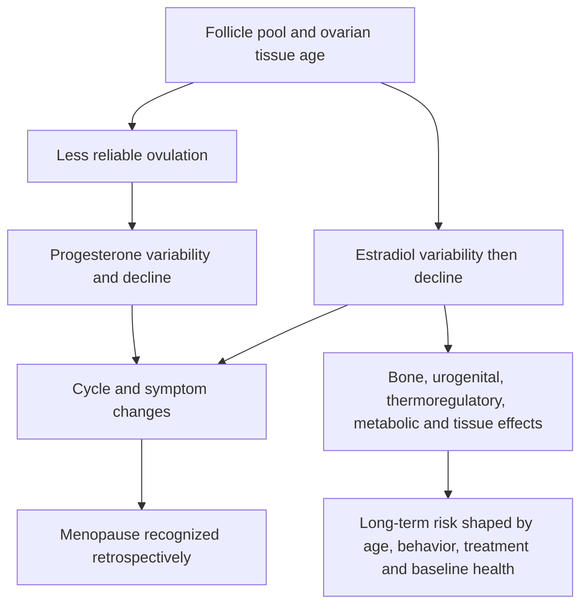
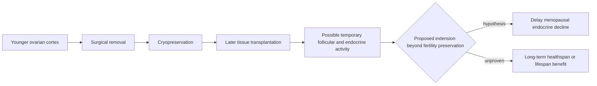

# Ovarian aging and tissue cryopreservation

Ovarian aging is the progressive loss and altered function of follicles and supporting tissue that ultimately ends cyclic ovulation and substantially reduces estradiol and progesterone production. Menopause is therefore an endocrine transition as well as the end of natural reproductive capacity. It differs from the gradual androgen change typical in men and can couple symptoms, body-composition change, bone loss, and other age-related risks over a relatively compressed interval. (@matt.kaeberlein (Healthspan Medicine) — "The Best Women’s Health Tips on the Planet with Dr. Jennifer Pearlman", 2026-03-20, [link](https://www.youtube.com/watch?v=b_LAI4oG0_w))

## Reproductive-axis sensitivity is not a menopause clock

Energy deficit, intensive training, illness, and psychological stress can suppress ovulation through hypothalamic signaling. That demonstrates that reproductive function responds to environment, but temporary hypothalamic suppression is not the same mechanism as depletion of ovarian reserve. Pearlman proposes lifestyle and metabolic optimization as ways to support a healthy transition and possibly avoid unusually early menopause in susceptible people; the interview does not quantify how much ordinary lifestyle change delays natural menopause. (@matt.kaeberlein (Healthspan Medicine) — "The Best Women’s Health Tips on the Planet with Dr. Jennifer Pearlman", 2026-03-20, [link](https://www.youtube.com/watch?v=b_LAI4oG0_w)) [[low-energy-availability-and-menstrual-function]]

## What ovarian tissue cryopreservation does

Ovarian tissue cryopreservation (OTC) surgically removes and freezes ovarian cortical tissue containing follicles. Its established rationale is fertility preservation before gonadotoxic treatment; it is distinct from freezing oocytes or embryos. Later transplantation can restore endocrine activity and reproductive potential in appropriate clinical contexts. The proposed longevity extension is to remove young tissue electively and reimplant small portions years later so their endocrine activity postpones menopausal hormone loss. (@matt.kaeberlein (Healthspan Medicine) — "The Best Women’s Health Tips on the Planet with Dr. Jennifer Pearlman", 2026-03-20, [link](https://www.youtube.com/watch?v=b_LAI4oG0_w))

Pearlman's suggested elective timing near age 32, removal of roughly one-quarter of an ovary, forearm implantation, and serial AI-timed aliquots are exploratory proposals. She acknowledges no long-term longevity data and does not currently refer patients for menopause reversal. Mathematical or AI models can project a schedule, but model output cannot demonstrate that surgery safely delays menopause, improves healthspan, or extends life. (@matt.kaeberlein (Healthspan Medicine) — "The Best Women’s Health Tips on the Planet with Dr. Jennifer Pearlman", 2026-03-20, [link](https://www.youtube.com/watch?v=b_LAI4oG0_w))

Endometrial-derived stem cells and rejuvenation of older ovarian tissue are still more speculative regenerative directions. Their accessibility and biological potential motivate research, but the interview provides neither controlled human outcomes nor a clinical protocol. They belong in experimental regenerative medicine, not current preventive care. (@matt.kaeberlein (Healthspan Medicine) — "The Best Women’s Health Tips on the Planet with Dr. Jennifer Pearlman", 2026-03-20, [link](https://www.youtube.com/watch?v=b_LAI4oG0_w))

## Practical implications

- **Before chemotherapy, pelvic radiation, or another fertility-threatening treatment, ask promptly about established fertility-preservation referral—strong.** Timing is treatment-dependent; OTC is one option alongside oocyte or embryo cryopreservation. (@matt.kaeberlein (Healthspan Medicine) — "The Best Women’s Health Tips on the Planet with Dr. Jennifer Pearlman", 2026-03-20, [link](https://www.youtube.com/watch?v=b_LAI4oG0_w))
- **Do not undergo elective OTC solely to delay or reverse natural menopause outside a research or appropriately governed specialist setting—strong given absent longevity evidence.** Surgery, tissue loss, storage, transplantation, cost, and uncertain duration of endocrine activity all matter. (@matt.kaeberlein (Healthspan Medicine) — "The Best Women’s Health Tips on the Planet with Dr. Jennifer Pearlman", 2026-03-20, [link](https://www.youtube.com/watch?v=b_LAI4oG0_w))
- **Across adulthood, protect bone, muscle, metabolic health, and reproductive function with adequate energy intake, resistance and aerobic training, smoking avoidance, and risk-appropriate care—moderate-to-strong.** These actions do not guarantee delayed menopause but improve resilience across the transition. (@matt.kaeberlein (Healthspan Medicine) — "The Best Women’s Health Tips on the Planet with Dr. Jennifer Pearlman", 2026-03-20, [link](https://www.youtube.com/watch?v=b_LAI4oG0_w))

## Gaps & open questions

- In which non-cancer populations, if any, does elective OTC have a favorable benefit–harm ratio?
- How long does endocrine function last after each graft, and can serial grafts safely change natural menopause timing?
- Does delaying endocrine menopause through grafts reproduce the health associations of naturally later menopause?
- Can ovarian or endometrial tissues be rejuvenated safely without tumorigenesis or loss of function?
- Can prediction models identify early menopause accurately enough to justify irreversible preventive surgery?

## Related

[[oocyte-aneuploidy-and-reproductive-aging]] · [[perimenopause-assessment-and-testing]] · [[menopause-hormone-therapy]] · [[low-energy-availability-and-menstrual-function]] · [[jennifer-pearlman]] · [[aging-model]]
