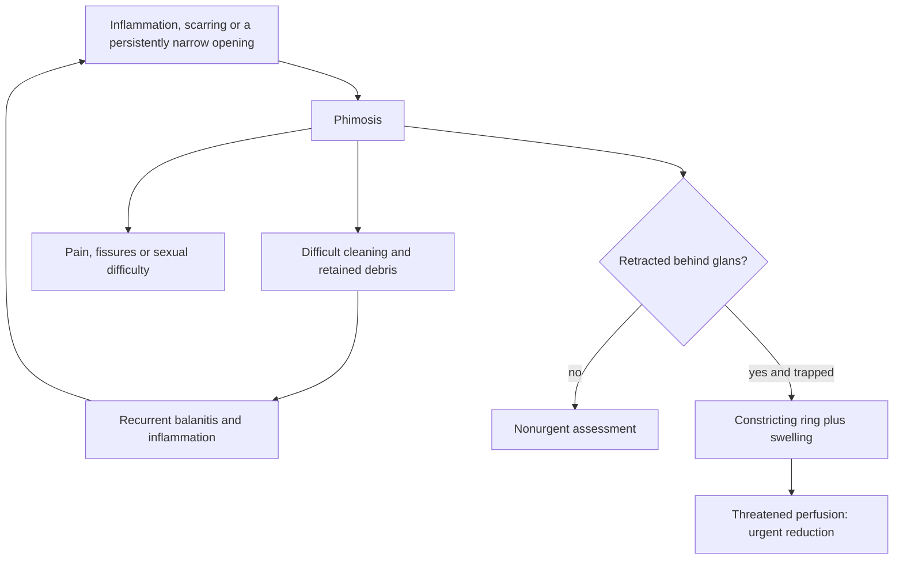

# Phimosis and paraphimosis

Phimosis is a foreskin opening that cannot be retracted comfortably behind the glans. Non-retractability is developmentally common in children, but persistent or newly acquired restriction in an adult can interfere with hygiene, erections, or sex and may reflect scarring or inflammation. Paraphimosis is different: a retracted foreskin becomes trapped behind the glans, creating a constricting ring. Progressive swelling can impair blood flow, making paraphimosis an emergency rather than a chronic tightness problem. (@RenaMalikMD (Rena Malik, M.D.) — "Can a Clitoral Piercing Make Sex Feel Better? | Tight Foreskin, Testosterone for Women", 2026-07-31, [link](https://www.youtube.com/watch?v=1jlLfaoHTcI))

## Mechanism and consequences

The foreskin normally moves over the glans. When its opening is narrowed, attempted retraction concentrates force at a tight ring; repeated inflammation or small tears can produce additional scar and further narrowing. Limited retraction can make cleaning difficult, allowing oils, shed cells, and moisture to accumulate. This does not mean every non-retractile foreskin becomes infected or malignant. The transcript describes recurrent balanitis as a clinically relevant consequence and penile cancer as rare; it does not quantify absolute risks or establish that hygiene alone prevents cancer. (@RenaMalikMD (Rena Malik, M.D.) — "Can a Clitoral Piercing Make Sex Feel Better? | Tight Foreskin, Testosterone for Women", 2026-07-31, [link](https://www.youtube.com/watch?v=1jlLfaoHTcI))

Paraphimosis reverses the geometry: after retraction, the narrow ring remains proximal to the glans. Venous and lymphatic outflow are impeded first, swelling increases, and the swollen glans makes forward replacement harder. If the cycle continues, arterial supply may also be compromised. Catheterization, examination, sexual activity, or hygiene can precipitate it when the foreskin is not returned to its normal position. (@RenaMalikMD (Rena Malik, M.D.) — "Can a Clitoral Piercing Make Sex Feel Better? | Tight Foreskin, Testosterone for Women", 2026-07-31, [link](https://www.youtube.com/watch?v=1jlLfaoHTcI))

## Treatment logic

Treatment depends on symptoms, cause, and severity. Clinician-prescribed topical corticosteroid with gentle stretching can be used to soften and widen a scarred ring in selected cases; devices marketed to stretch the opening were mentioned but not supported with outcome evidence in the transcript. Recurrent infection, painful fissuring, obstructive symptoms, or failure of conservative care can justify a procedural discussion, including circumcision. The source reports that adult circumcision trials generally did not show deterioration in erection, orgasm, or sensation for most participants, while transient glans hypersensitivity can occur; no trial identifiers, effect estimates, or complication rates were supplied, so this evidence requires review before grading. (@RenaMalikMD (Rena Malik, M.D.) — "Can a Clitoral Piercing Make Sex Feel Better? | Tight Foreskin, Testosterone for Women", 2026-07-31, [link](https://www.youtube.com/watch?v=1jlLfaoHTcI))

## Practical implications

- **Seek routine clinical assessment for adult foreskin restriction that prevents comfortable cleaning, causes pain or fissures, or recurs with infection — moderate clinical principle; comparative evidence not reviewed here.** Do not force retraction, because tearing can worsen inflammation and scarring. (@RenaMalikMD (Rena Malik, M.D.) — "Can a Clitoral Piercing Make Sex Feel Better? | Tight Foreskin, Testosterone for Women", 2026-07-31, [link](https://www.youtube.com/watch?v=1jlLfaoHTcI))
- **After retraction for hygiene, examination, or catheter care, return the foreskin over the glans immediately — strong harm-prevention principle.** A trapped retracted foreskin with increasing swelling, discoloration, or pain needs urgent medical evaluation. (@RenaMalikMD (Rena Malik, M.D.) — "Can a Clitoral Piercing Make Sex Feel Better? | Tight Foreskin, Testosterone for Women", 2026-07-31, [link](https://www.youtube.com/watch?v=1jlLfaoHTcI))
- **Use prescribed steroid treatment or procedural care only after diagnosis — regimen details not established by this source.** A clinician should distinguish scarring, active infection, inflammatory skin disease, and other causes. (@RenaMalikMD (Rena Malik, M.D.) — "Can a Clitoral Piercing Make Sex Feel Better? | Tight Foreskin, Testosterone for Women", 2026-07-31, [link](https://www.youtube.com/watch?v=1jlLfaoHTcI))

## Gaps & open questions

- What adult subgroups respond durably to topical corticosteroid and gentle stretching, and at what recurrence rate?
- How do conservative procedures and circumcision compare for pain, sexual function, complications, and patient preference?
- Which clinical features distinguish simple tightness from lichen sclerosus or another scarring disorder?
- What is the absolute contribution of chronic phimosis and inflammation to penile-cancer risk?

## Related

[[erectile-dysfunction-and-vascular-health]] · [[male-fertility-and-exogenous-testosterone]] · [[genital-modification-and-sexual-function]] · [[rena-malik]]
