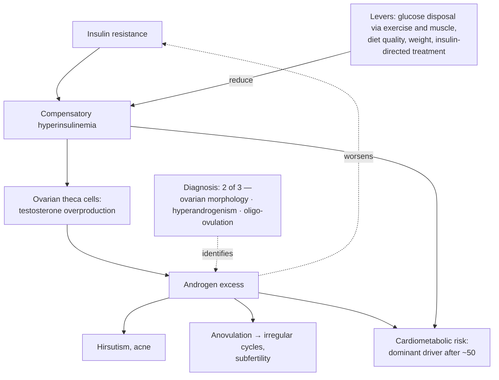

# Polycystic ovary syndrome

Polycystic ovary syndrome (PCOS) is the most common endocrine disorder of reproductive-age women: a syndrome, not a single disease, diagnosed from a cluster of findings rather than one definitive test. The three canonical criteria are polycystic ovarian morphology on ultrasound, clinical or biochemical hyperandrogenism (hirsutism — increased hair growth in a male-type distribution such as chin, chest, or breasts — acne, or elevated measured androgens), and ovulatory dysfunction manifesting as irregular or infrequent periods (cycles stretching toward 35 days or beyond, i.e. skipped ovulations). Because roughly four diagnostic systems coexist in the literature and most require only two of three criteria, phenotypes vary widely — a woman can carry the diagnosis with normal-appearing ovaries — which is a large part of why the condition is confusing to patients and inconsistently recognized. It commonly surfaces only when a woman seeks pregnancy or another problem forces medical contact. PCOS also clusters in families, alongside endometriosis and fibroids, making maternal reproductive history genuinely informative. (@hubermanlab (Andrew Huberman) — "Essentials: How to Optimize Female Hormone Health for Vitality & Longevity | Dr. Sara Gottfried", 2026-08-13, [link](https://www.youtube.com/watch?v=wbuPQPu-03Y))

## Mechanism: the insulin–androgen loop

In a large subset of phenotypes the driving lesion is metabolic, not primarily ovarian: hyperinsulinemia. Elevated circulating insulin stimulates the theca cells of the ovary to overproduce testosterone; androgen excess in turn produces the hirsutism, acne, and anovulation of the syndrome, and worsening insulin resistance closes the loop. Because compensatory hyperinsulinemia precedes any rise in glucose by years (the insulin-first sequence described in [[insulin-resistance]]), fasting and postprandial insulin can flag the process while glucose is still normal — Gottfried cites the Whitehall cohort work for insulin changing years ahead of glucose. (@hubermanlab (Andrew Huberman) — "Essentials: How to Optimize Female Hormone Health for Vitality & Longevity | Dr. Sara Gottfried", 2026-08-13, [link](https://www.youtube.com/watch?v=wbuPQPu-03Y))

## A lifetime disease, not a fertility problem

The syndrome's framing as a reproductive-age problem — irregular cycles in the 20s and 30s, difficulty conceiving in the 30s and early 40s — misses its second act. PCOS is a substantial risk factor for cardiometabolic disease with age, and Gottfried's position is that it matters *more* after menopause (average age 51–52) than before: persistently elevated androgens are, in her account, probably the greatest cardiometabolic disease driver in these women as they age. The claim that androgen excess is the dominant post-menopausal risk mechanism is expert interpretation layered on consistent observational risk data, not a settled causal ranking; the elevated long-term risk of diabetes and cardiovascular disease in PCOS itself is well established in cohort literature. The practical consequence is continuity: a teenage or 20s androgen signal (even a subtle one — a few chin hairs plus elevated testosterone) predicts a trajectory worth managing for decades, and knowing it early can, in her phrase, change the arc of self-care. (@hubermanlab (Andrew Huberman) — "Essentials: How to Optimize Female Hormone Health for Vitality & Longevity | Dr. Sara Gottfried", 2026-08-13, [link](https://www.youtube.com/watch?v=wbuPQPu-03Y))

## Practical implications

- **A woman with two of: irregular cycles (≥35-day spacing or skipped periods), hirsutism or persistent acne, or polycystic ovaries on an ultrasound done for any reason should ask explicitly whether PCOS fits — strong as a diagnosis-seeking principle; the syndrome is underdiagnosed until fertility is at stake.** (@hubermanlab (Andrew Huberman) — "Essentials: How to Optimize Female Hormone Health for Vitality & Longevity | Dr. Sara Gottfried", 2026-08-13, [link](https://www.youtube.com/watch?v=wbuPQPu-03Y))
- **With a PCOS diagnosis or high-androgen phenotype: assess insulin status (fasting insulin alongside glucose and A1c), not glucose alone — moderate; the insulin-first sequence is cohort-supported, though fasting-insulin assays and thresholds vary ([[blood-marker-variability-and-reference-change]]).** (@hubermanlab (Andrew Huberman) — "Essentials: How to Optimize Female Hormone Health for Vitality & Longevity | Dr. Sara Gottfried", 2026-08-13, [link](https://www.youtube.com/watch?v=wbuPQPu-03Y))
- **Treat cardiometabolic surveillance as lifelong, intensifying rather than lapsing at menopause; Gottfried's marker of choice is a coronary artery calcium score by age 45 in women with PCOS or other risk signals — Investigational practice at that specific age trigger (her clinical protocol; CAC's role in risk stratification is established, the age-45 female-specific rule is not guideline-anchored; see [[coronary-ct-angiography]] and [[cancer-screening-and-overdiagnosis]] for the imaging trade-offs).** (@hubermanlab (Andrew Huberman) — "Essentials: How to Optimize Female Hormone Health for Vitality & Longevity | Dr. Sara Gottfried", 2026-08-13, [link](https://www.youtube.com/watch?v=wbuPQPu-03Y))
- **Exercise and muscle mass are first-line insulin levers — moderate-to-strong by extension from the insulin-resistance literature; the transcript's specific framing is matching exercise to one's glucose-disposal needs rather than a universal prescription.** ([[insulin-resistance]], [[resistance-training]]) (@hubermanlab (Andrew Huberman) — "Essentials: How to Optimize Female Hormone Health for Vitality & Longevity | Dr. Sara Gottfried", 2026-08-13, [link](https://www.youtube.com/watch?v=wbuPQPu-03Y))
- **Continuous glucose monitoring is Gottfried's preferred behavior-change tool ("I've never seen any tool that I've ever used in medicine change behavior the way that CGMs do") while she simultaneously ranks it a later signal than insulin — Investigational practice in non-diabetic PCOS; behavior-change enthusiasm is clinical experience, not outcome evidence ([[proactive-health-monitoring]]).** (@hubermanlab (Andrew Huberman) — "Essentials: How to Optimize Female Hormone Health for Vitality & Longevity | Dr. Sara Gottfried", 2026-08-13, [link](https://www.youtube.com/watch?v=wbuPQPu-03Y))

## Gaps & open questions

- Which PCOS phenotypes are insulin-driven versus primarily adrenal or ovarian, and do they need different treatment sequences?
- Is post-menopausal androgen excess causally the dominant cardiometabolic driver in PCOS, or a marker traveling with insulin resistance and adiposity?
- Does adolescent identification of a high-androgen phenotype change adult cardiometabolic outcomes, or only add early labeling?
- What screening cadence (insulin, lipids, blood pressure, CAC) actually improves outcomes in PCOS across the lifespan?
- How should PCOS be diagnosed and managed in women using ovulation-suppressing contraception, which masks the cycle criterion ([[hormonal-contraception]])?

## Related

[[insulin-resistance]] · [[hormonal-contraception]] · [[perimenopause-assessment-and-testing]] · [[proactive-health-monitoring]] · [[visceral-and-ectopic-fat]] · [[blood-marker-variability-and-reference-change]] · [[coronary-ct-angiography]] · [[endometriosis]] · [[low-energy-availability-and-menstrual-function]] · [[sara-gottfried]] · [[practice-playbook]]
