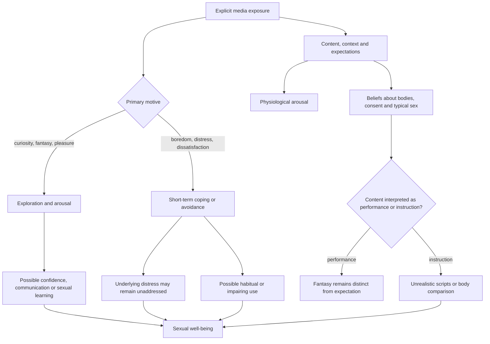

# Pornography, motivation, and sexual health

Pornography is sexually explicit media used in contexts ranging from deliberate arousal and fantasy to accidental exposure, social pressure, information seeking, boredom, emotional avoidance, or coping with relationship dissatisfaction. Those motives are not interchangeable. The same behavior can be exploratory in one setting and functionally impairing in another, so frequency alone cannot explain its relationship to sexual well-being. The staged source links to a longitudinal study, a systematic review and meta-analysis, and a multinational motives study, but those papers were not claim-level reviewed during this integration; the conclusions below therefore preserve provenance without treating the video summary as validation. (@RenaMalikMD (Rena Malik, M.D.) — "Why Millions of Women Watch Porn (It's Not What Men Think)", 2026-08-03, [link](https://www.youtube.com/watch?v=KjUU8YZin5E))

## Arousal, desire, and interpretation

Genital arousal, subjective desire, fantasy, orientation, consent, and intended behavior are distinct variables. The source reports laboratory observations in which genital blood flow to explicit visual material began quickly in both women and men, while women's physiological response was on average less category-specific across depicted partner types. A physiological response does not establish attraction, identity, consent, or a wish to enact the material; it measures one component of an arousal system under laboratory conditions. The exact studies and effect sizes were not supplied in enough detail to grade this sex-difference claim. (@RenaMalikMD (Rena Malik, M.D.) — "Why Millions of Women Watch Porn (It's Not What Men Think)", 2026-08-03, [link](https://www.youtube.com/watch?v=KjUU8YZin5E))

## Associations depend on motive and context

The source describes a large longitudinal sample in which more frequent pornography use among women was associated with greater sexual confidence and some measures of sexual function or satisfaction, and a 42-country study in which pleasure- or curiosity-motivated use correlated with higher desire and function while coping- or dissatisfaction-motivated use correlated with poorer outcomes. These patterns do not establish that pornography caused either benefit or harm: pre-existing desire, distress, relationship quality, openness, and cultural context may influence both motive and outcome. Motive can be a moderator, a marker of an existing problem, or part of a causal pathway. (@RenaMalikMD (Rena Malik, M.D.) — "Why Millions of Women Watch Porn (It's Not What Men Think)", 2026-08-03, [link](https://www.youtube.com/watch?v=KjUU8YZin5E))

Shared viewing may support communication or arousal for some partners, but it is not intrinsically beneficial and requires mutual consent. Solitary viewing also does not by itself imply replacement or relationship dissatisfaction. The clinically relevant questions are whether use conflicts with values or agreements, becomes difficult to control, displaces desired activity or intimacy, is used as the only coping strategy, or causes distress and impairment. The transcript does not supply diagnostic criteria or intervention trials for problematic use. (@RenaMalikMD (Rena Malik, M.D.) — "Why Millions of Women Watch Porn (It's Not What Men Think)", 2026-08-03, [link](https://www.youtube.com/watch?v=KjUU8YZin5E))

## Moral incongruence, shame, and the erectile-dysfunction attribution

The most clinically consequential distinction in this literature is between pornography use and moral incongruence about that use. Both physicians in the staged conversation state that the evidence does not support pornography itself as a cause of erectile dysfunction; the dysfunction-associated pattern is the shame spiral in users who believe pornography is wrong — negative affect after masturbating to it, repeated return to the behavior for short-term relief, and escalating anxiety about being "broken." Annamaria Giraldi describes young men referred for erectile problems who found the porn-causes-ED explanation online and arrive burdened mainly by shame, and summarizes a study in which anxious young men experienced guilt and shame after pornography use while non-anxious users reported feeling good — anxiety, not exposure, separated the groups. Since nearly all men and many women have viewed pornography, the exposure itself has almost no discriminating power. The claim structure matters: this is expert synthesis of research the transcript does not itemize, so it grades as consistent expert interpretation rather than a reviewed meta-analytic conclusion. (@RenaMalikMD (Rena Malik, M.D.) — "Watching Porn And Feeling Guilty? That Anxiety Could Be Hurting Your Sex Life", 2026-07-22, [link](https://www.youtube.com/watch?v=u0fCMM_xEy8)) [[erectile-dysfunction-and-vascular-health]]

The same structure recurs for premature ejaculation: a specialist panel states there is no strong literature associating pornography use with premature ejaculation, while guilt, anxiety, or depression about one's use — and partner conflict over it — can plausibly produce sexual dysfunction of any type (erectile, premature, or delayed). The panelists add a social observation: anonymous online moralizing about pornography amplifies the very shame that mediates harm, even though the large majority of people have used it. This is consistent expert interpretation, not an itemized evidence review. [[premature-ejaculation]] (@RenaMalikMD (Rena Malik, M.D.) — "The #1 Sex Mistake Men Make: Why Lasting Longer Doesn’t Mean Better Sex", 2026-08-14, [link](https://www.youtube.com/watch?v=aJlK0qZD-Xo))

A genuinely concerning subgroup exists but is small. Giraldi cites Danish pornography research (she names a Dr. Hall) identifying a minority who escalate volume and violence of content in a vicious circle — and stresses that these users show multiple other alarming signals, consistent with self-medication of untreated depression or other psychological problems rather than a disorder produced by pornography alone. Meanwhile, commercial quit-porn programs modeled on addiction 12-step formats are described as running against the research: drastic total-abstinence interventions show no evidence of working, and the moralized framing itself feeds the shame that damages sexual health. Cutting back is fine if a person feels better; shame is the active harm. The same normalization logic applies to nocturnal emissions, which are physiologically normal despite taboo-driven distress in some cultures. (@RenaMalikMD (Rena Malik, M.D.) — "Watching Porn And Feeling Guilty? That Anxiety Could Be Hurting Your Sex Life", 2026-07-22, [link](https://www.youtube.com/watch?v=u0fCMM_xEy8))

## Media literacy and developmental risk

Pornography is performance media, not comprehensive sex education. The source notes that explicit scenes may omit negotiation, consent, contraception, foreplay, ordinary variability in response, and aftercare, while selectively depicting aggression or unusual bodies and acts. For inexperienced viewers, repeated exposure without media literacy may shape inaccurate expectations about appearance, readiness, pleasure, or what partners normally want. Greater performer diversity could broaden representations of desirability, but an association between diverse exposure and body confidence would not prove that any particular content improves body image. (@RenaMalikMD (Rena Malik, M.D.) — "Why Millions of Women Watch Porn (It's Not What Men Think)", 2026-08-03, [link](https://www.youtube.com/watch?v=KjUU8YZin5E))

Accidental exposure, unsolicited explicit images, and peer pressure among adolescents differ ethically and developmentally from consensual adult use. A young person seeking basic sexual information from pornography is encountering a market-produced script rather than instruction calibrated to anatomy, consent, safety, or relationships. This supports age-appropriate, evidence-based sexuality education and clear digital-consent boundaries; it does not justify assuming every exposed young person will develop harm. (@RenaMalikMD (Rena Malik, M.D.) — "Why Millions of Women Watch Porn (It's Not What Men Think)", 2026-08-03, [link](https://www.youtube.com/watch?v=KjUU8YZin5E))

## Practical implications

- **Periodically assess function and motive rather than counting viewing occasions alone — emerging, observationally informed.** Ask whether use is chosen for pleasure or exploration, used automatically to escape distress, or displacing sleep, work, partnered intimacy, or other valued activity. The video does not validate a screening cadence or threshold. (@RenaMalikMD (Rena Malik, M.D.) — "Why Millions of Women Watch Porn (It's Not What Men Think)", 2026-08-03, [link](https://www.youtube.com/watch?v=KjUU8YZin5E))
- **Treat pornography as fantasy/performance rather than instruction — strong harm-reduction principle, direct outcome evidence not reviewed here.** Use explicit, age-appropriate education for anatomy, consent, contraception, communication, and normal variability; physiological arousal never substitutes for consent. (@RenaMalikMD (Rena Malik, M.D.) — "Why Millions of Women Watch Porn (It's Not What Men Think)", 2026-08-03, [link](https://www.youtube.com/watch?v=KjUU8YZin5E))
- **For partnered use, discuss consent, boundaries, privacy, and expectations before sharing content — strong relational-safety principle.** A positive association in some couples is not permission to pressure a partner or breach an agreement. (@RenaMalikMD (Rena Malik, M.D.) — "Why Millions of Women Watch Porn (It's Not What Men Think)", 2026-08-03, [link](https://www.youtube.com/watch?v=KjUU8YZin5E))
- **If erectile difficulty is being self-attributed to pornography: evaluate anxiety, mood, shame, and standard ED causes instead of purchasing an abstinence program — moderate-to-strong; abstinence-program efficacy is unsupported in the sources.** Reducing use is a legitimate personal choice, but shame reduction is the therapeutic target. (@RenaMalikMD (Rena Malik, M.D.) — "Watching Porn And Feeling Guilty? That Anxiety Could Be Hurting Your Sex Life", 2026-07-22, [link](https://www.youtube.com/watch?v=u0fCMM_xEy8))
- **Seek qualified help when use feels uncontrollable, causes marked distress or impairment, violates consent, or functions as persistent avoidance of relationship or mental-health problems — strong assessment principle.** The appropriate response depends on the underlying problem rather than on moralizing the medium itself. (@RenaMalikMD (Rena Malik, M.D.) — "Why Millions of Women Watch Porn (It's Not What Men Think)", 2026-08-03, [link](https://www.youtube.com/watch?v=KjUU8YZin5E))

## Gaps & open questions

- How much of the association between motive and sexual well-being is causal, and how much reflects prior desire, distress, relationship quality, or cultural norms?
- Which content features influence consent expectations, body image, sexual scripts, and function over time?
- Do outcomes differ by solitary versus mutually agreed partnered use, age at first exposure, orientation, gender identity, or baseline sexual difficulty?
- What measures distinguish high-frequency but nonproblematic use from impaired control and clinically meaningful harm?
- Which media-literacy, relationship, or mental-health interventions improve patient-centered outcomes when pornography use is part of the presenting problem?
- How large is the escalating-use subgroup with co-occurring psychopathology, and does treating the underlying condition normalize use?
- Does reducing moral incongruence (rather than reducing use) improve erectile function in randomized designs?

## Related

[[durable-well-being-and-hedonic-adaptation]] · [[addiction-recovery-and-emotional-sobriety]] · [[interpersonal-regulation-and-emotional-capacity]] · [[trust-repair-and-safety-learning]] · [[erectile-dysfunction-and-vascular-health]] · [[premature-ejaculation]] · [[sexual-desire-arousal-and-aging]] · [[rena-malik]]
