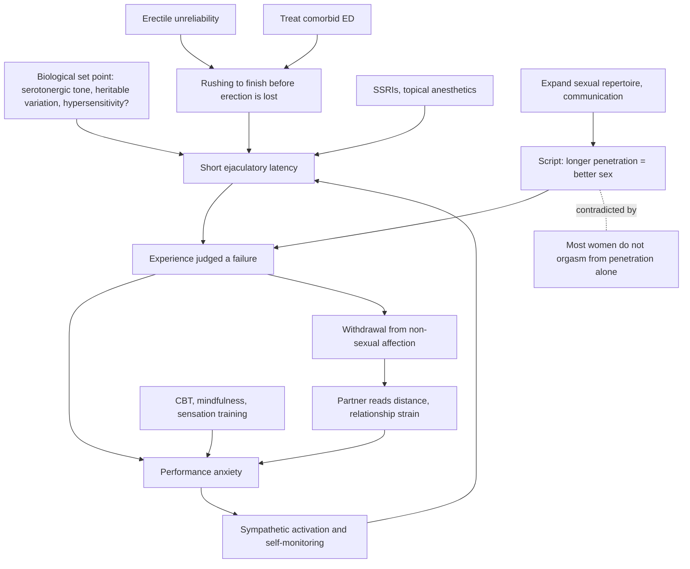

# Premature ejaculation

Premature ejaculation (PE) is a clinical diagnosis, not a stopwatch verdict. Across the major current definitions (DSM, the American Urological Association guideline, the International Consultation on Sexual Medicine, ICD-11), three criteria recur: a perceived lack of control over when ejaculation occurs, bother or distress (usually the man's, sometimes the partner's), and a time criterion — typically an intravaginal ejaculation latency of about two minutes or less, with most affected men at one minute or less. The time criterion matters because normative data put the median latency from penetration to ejaculation at about five minutes in Western countries, so a man lasting twenty minutes who wishes he lasted longer does not have the condition. Historical definitions were looser: Masters and Johnson defined PE as ejaculating before the female partner climaxed at least half the time, which placed the entire standard on a partner who may not climax from penetration at all. (@RenaMalikMD (Rena Malik, M.D.) — "The #1 Sex Mistake Men Make: Why Lasting Longer Doesn’t Mean Better Sex", 2026-08-14, [link](https://www.youtube.com/watch?v=aJlK0qZD-Xo))

Two clinical subtypes behave differently. Lifelong PE is present from the start of sexual activity and is where most research sits. Acquired PE is a distressing reduction from a man's own previous latency — the AUA definition frames roughly a 50% reduction — and functions diagnostically as a change signal: the useful first question is what else changed (health, medications, mental state, hormones, relationship), because sexual function is an integrated readout of overall health. (@RenaMalikMD (Rena Malik, M.D.) — "The #1 Sex Mistake Men Make: Why Lasting Longer Doesn’t Mean Better Sex", 2026-08-14, [link](https://www.youtube.com/watch?v=aJlK0qZD-Xo))

## Prevalence and the 30% artifact

The widely quoted claim that PE affects up to 30% of men traces to a 1999 analysis of the National Health and Social Life Survey, which counted any man who self-reported having ejaculated before he wanted to at some point in the previous year — an experience nearly universal at some frequency, not clinical PE under current criteria. Under the modern control-bother-latency definition the affected population is smaller, though still common enough that the panel treats it as one of the most frequent male sexual complaints. The gap between self-perceived and clinical PE is itself clinically important: in survey work on infertile couples by Alan Shindel and Christian Nelson, when men endorsed concern about ejaculating too soon, half or more of their female partners reported no concern at all. Partner distress, when present, is often directed less at latency than at the man's fixation on it — and at his withdrawal from non-sexual affection (holding hands, kissing goodbye, sitting close) to avoid situations that might lead to sex. (@RenaMalikMD (Rena Malik, M.D.) — "The #1 Sex Mistake Men Make: Why Lasting Longer Doesn’t Mean Better Sex", 2026-08-14, [link](https://www.youtube.com/watch?v=aJlK0qZD-Xo))

## Mechanism: a set point plus an anxiety loop

The biology is acknowledged to be poorly understood. What evidence exists suggests a partly heritable ejaculatory set point — a threshold for the ejaculatory reflex — influenced by small-effect genetic polymorphisms associated with serotonin (and dopamine) signaling, with contested contributions from thyroid excess, testosterone level, prostatic inflammation, and penile hypersensitivity. No single gene, hormone, or test explains the condition. Ejaculation is also harder to drug than erection: erection is a peripheral vascular event with well-mapped effectors, whereas ejaculation integrates brain, spinal cord, and autonomic circuits, which is one reason candidate drugs targeting oxytocin and dopamine signaling failed in larger trials. Evolutionary explanations (fast ejaculation as reproductive advantage) are untestable speculation, and the panel notes a competing speculation that prolonged, bonding-oriented sex also has evolutionary logic for a social species. (@RenaMalikMD (Rena Malik, M.D.) — "The #1 Sex Mistake Men Make: Why Lasting Longer Doesn’t Mean Better Sex", 2026-08-14, [link](https://www.youtube.com/watch?v=aJlK0qZD-Xo))

The psychological arm is better characterized and partly self-reinforcing. Roughly half of PE patients are described as having a significant anxiety component. Anxiety activates sympathetic (fight-or-flight) physiology, which is broadly anti-sexual; hypervigilant self-monitoring during sex reduces control further; and each poor experience loads the next with more anticipatory anxiety. A distinct route runs through erectile dysfunction: a man worried about losing his erection before orgasm rushes to finish, producing acquired PE as a compensation for untreated ED — which is why ED is assessed and treated first when the two coexist. Cultural performance scripts amplify both loops: the belief that longer penetration means better sex, and that lasting defines the man as a lover, collides with the fact that most women do not orgasm from vaginal penetration alone, and that when asked what they value in sex, women tend to rank intimacy and closeness where men rank penetration. (@RenaMalikMD (Rena Malik, M.D.) — "The #1 Sex Mistake Men Make: Why Lasting Longer Doesn’t Mean Better Sex", 2026-08-14, [link](https://www.youtube.com/watch?v=aJlK0qZD-Xo))

## Treatment

No drug is FDA-approved for PE in the United States; everything pharmacological is off-label or over-the-counter, and expectations should be set accordingly. The options with data, as the panel presents them:

- **Behavioral sensation training.** Stop-start and squeeze techniques train recognition of the premonitory sensations that precede ejaculatory inevitability (a reflex point past which nothing stops it), first during masturbation, then with a partner. Masters and Johnson reported very high success rates from an intensive mid-century clinic, but those results were never replicated, and real-world efficacy hinges on consistency and ideally guidance from a sex therapist or psychologist. Deliberate distraction (the thinking-about-baseball joke) is counterproductive — the goal is engaged awareness with control, not absence. Partner participation should be active, not the historical passive-partner instruction the panel criticizes (the era's term was the "quiet vagina"). (@RenaMalikMD (Rena Malik, M.D.) — "The #1 Sex Mistake Men Make: Why Lasting Longer Doesn’t Mean Better Sex", 2026-08-14, [link](https://www.youtube.com/watch?v=aJlK0qZD-Xo))
- **Psychological treatment.** Cognitive-behavioral therapy addresses the distorted cognitions (not lasting means not being a man) alongside the behavioral techniques; mindfulness-based approaches fit the same body-awareness mechanism. Even one or two couple sessions can open communication that neither partner could start alone. Urologists on the panel report it typically takes two to three visits to get a man to accept a therapy referral. (@RenaMalikMD (Rena Malik, M.D.) — "The #1 Sex Mistake Men Make: Why Lasting Longer Doesn’t Mean Better Sex", 2026-08-14, [link](https://www.youtube.com/watch?v=aJlK0qZD-Xo))
- **Pelvic-floor physical therapy.** Assessment-directed, not kegel-by-default: kegels strengthen and tense the pelvic floor, which helps stress urinary incontinence but is counterproductive in the high-tone, anxious, pelvic-pain phenotype common in this population, where relaxation work may be what is needed. (@RenaMalikMD (Rena Malik, M.D.) — "The #1 Sex Mistake Men Make: Why Lasting Longer Doesn’t Mean Better Sex", 2026-08-14, [link](https://www.youtube.com/watch?v=aJlK0qZD-Xo))
- **Topical anesthetics.** Lidocaine-type sprays or creams that modestly reduce penile sensitivity are described as a current first-line option with supporting data, available over the counter; dosing judgment matters to avoid numbing the user or partner. (@RenaMalikMD (Rena Malik, M.D.) — "The #1 Sex Mistake Men Make: Why Lasting Longer Doesn’t Mean Better Sex", 2026-08-14, [link](https://www.youtube.com/watch?v=aJlK0qZD-Xo))
- **SSRIs.** Paroxetine, fluoxetine, sertraline and others have substantial data prolonging latency (paroxetine described as the strongest), used off-label; stigma, sexual and mood side effects, and antidepressant class risks limit uptake. Dapoxetine, a short-acting on-demand SSRI, was approved in Europe and elsewhere specifically for PE but not in the US — the panel attributes the 2014 failure partly to timing against the SSRI-suicidality concern in young men — and real-world discontinuation abroad has been high despite trial efficacy. (@RenaMalikMD (Rena Malik, M.D.) — "The #1 Sex Mistake Men Make: Why Lasting Longer Doesn’t Mean Better Sex", 2026-08-14, [link](https://www.youtube.com/watch?v=aJlK0qZD-Xo))
- **PDE5 inhibitors for the ED-overlap phenotype.** When erectile unreliability drives the rushing, sildenafil or tadalafil treats the adjacent problem rather than PE itself; daily tadalafil may also shorten the refractory period. See [[pde5-inhibitors]]. (@RenaMalikMD (Rena Malik, M.D.) — "The #1 Sex Mistake Men Make: Why Lasting Longer Doesn’t Mean Better Sex", 2026-08-14, [link](https://www.youtube.com/watch?v=aJlK0qZD-Xo))

Magnitude expectations are the panel's most concrete counseling point: available drugs produce fold-changes, not movie latencies — a man at 30 seconds may reach about 2 minutes in a good response, not 10. Investigational directions (Botox injection, an on-demand agent in trials, perineal stimulation devices with small European studies) have either faded or remain preliminary, and the panel notes the commercial incentive to develop PE drugs is weak. Placebo response in sexual-medicine trials runs roughly 20–35%, so single-arm studies of devices, sleeves, or programs cannot establish efficacy. Supplements are recommended against categorically: no randomized controlled trials exist for any PE supplement, and analyses in the adjacent ED-supplement market have repeatedly found undeclared sildenafil-class drugs in products sold as natural. (@RenaMalikMD (Rena Malik, M.D.) — "The #1 Sex Mistake Men Make: Why Lasting Longer Doesn’t Mean Better Sex", 2026-08-14, [link](https://www.youtube.com/watch?v=aJlK0qZD-Xo)) [[supplement-evidence-and-safety]]

## Myths and boundary claims

Several common beliefs get explicit verdicts in the source. Masturbating before sex can lengthen latency if an erection is recoverable, but a long refractory period can convert the tactic into new erectile failure. Stacking condoms is rejected — friction between condoms promotes breakage — while a single thicker condom plausibly acts like a mild anesthetic, with little direct data. Alcohol may blunt anxiety at low doses but impairs erection, body awareness, and control at higher doses, and no clinician on the panel endorses it as a strategy. PE is not simply inexperience. On circumcision, the aggregate evidence reviewed for the AUA disorders-of-ejaculation guideline shows no consistent effect of circumcision status on latency, individual anatomical exceptions notwithstanding — a claim worth stating plainly because the contrary circulates widely online. A normal refractory period that lengthens with age is frequently misread as ED or as an ejaculatory disorder; it is physiology, and education resolves it. (@RenaMalikMD (Rena Malik, M.D.) — "The #1 Sex Mistake Men Make: Why Lasting Longer Doesn’t Mean Better Sex", 2026-08-14, [link](https://www.youtube.com/watch?v=aJlK0qZD-Xo))

The information environment compounds the condition. In Justin Dubin's study of men's-health content on TikTok and Instagram, the majority of popular content was inaccurate, only about 10% came from physicians and perhaps 20% from any healthcare provider, and much of it sells products to men whose embarrassment keeps them from clinicians. Ejaculate volume is a related under-discussed concern: clinicians report it is a frequent primary complaint, that medications (notably alpha blockers) change it without patients being warned, and that partner-focused assumptions about its importance often do not survive asking the partner. (@RenaMalikMD (Rena Malik, M.D.) — "The #1 Sex Mistake Men Make: Why Lasting Longer Doesn’t Mean Better Sex", 2026-08-14, [link](https://www.youtube.com/watch?v=aJlK0qZD-Xo)) [[ai-assisted-science-communication]]

## Practical implications

All items below derive from a specialist panel discussion — consistent expert interpretation with occasional named studies, not a reviewed guideline synthesis; doses and drug choices belong to a prescribing clinician.

- **If ejaculation feels uncontrollable, distressing, and fast (around two minutes or less, or a marked drop from your own baseline): see a urologist or sexual-medicine clinician rather than buying online programs or supplements — strong help-seeking principle.** Say the actual complaint (ejaculating sooner than wanted), because men who say only that they have an erection problem tend to leave with a PDE5 inhibitor that will not help isolated PE. Specialist directories exist through the Sexual Medicine Society of North America, ISSM, AASECT, and SSTAR. (@RenaMalikMD (Rena Malik, M.D.) — "The #1 Sex Mistake Men Make: Why Lasting Longer Doesn’t Mean Better Sex", 2026-08-14, [link](https://www.youtube.com/watch?v=aJlK0qZD-Xo))
- **Treat the couple's definition of sex, not only the stopwatch — moderate-to-strong expert consensus.** Expanding the repertoire beyond penetration (manual, oral, toys, continued stimulation after ejaculation) addresses the misconception driving much of the distress, since most women do not orgasm from penetration alone; talk with the partner first, and consider even one or two couple-therapy sessions to start that conversation.
- **Address anxiety and any erectile dysfunction before or alongside latency treatment — moderate-to-strong.** Roughly half of patients have an anxiety component, and untreated erectile worry produces rushing that no latency drug fixes.
- **Behavioral sensation training (stop-start, squeeze), practiced consistently and ideally coached, first during masturbation — moderate; historic headline success rates were never replicated.** Get a pelvic-floor assessment before assuming kegels help; a high-tone floor needs relaxation, not strengthening.
- **Expect fold-change improvements from any medication, not cinematic latencies — strong expectation-setting point.** Off-label SSRIs, topical anesthetics, and (for the ED-overlap) PDE5 inhibitors are the evidence-bearing options; none is FDA-approved for PE, and supplements marketed for lasting longer are unregulated and sometimes adulterated — do not use them.
- **General health behaviors (exercise, sleep including apnea assessment, stress management, limited alcohol) support treatment — moderate for the general-health outcome, limited for the latency outcome.** Yoga and interval training have only small supporting studies, plausibly acting through anxiety reduction.

## Gaps & open questions

- What is the actual clinical-criteria prevalence of lifelong and acquired PE, as opposed to single-item self-report figures?
- Which serotonergic or other molecular differences set the ejaculatory threshold, and can any be targeted without systemic antidepressant effects?
- Do behavioral techniques work in controlled modern trials, at what consistency, and with what durability after coaching ends?
- Does treating comorbid ED alone resolve a definable fraction of acquired PE?
- Do perineal stimulation devices or masturbation-sleeve training beat placebo in controlled designs, given the 20–35% placebo response typical of sexual medicine?
- How different are PE prevalence, bother, and treatment goals across sexual orientations, given hints that gay men report less bother about latency and more about absent ejaculation?
- Can partner-inclusive treatment be shown to outperform man-only treatment on couple-level outcomes?

## Related

[[erectile-dysfunction-and-vascular-health]] · [[pde5-inhibitors]] · [[sexual-desire-arousal-and-aging]] · [[pornography-motivation-and-sexual-health]] · [[genital-modification-and-sexual-function]] · [[supplement-evidence-and-safety]] · [[ai-assisted-science-communication]] · [[rena-malik]]
