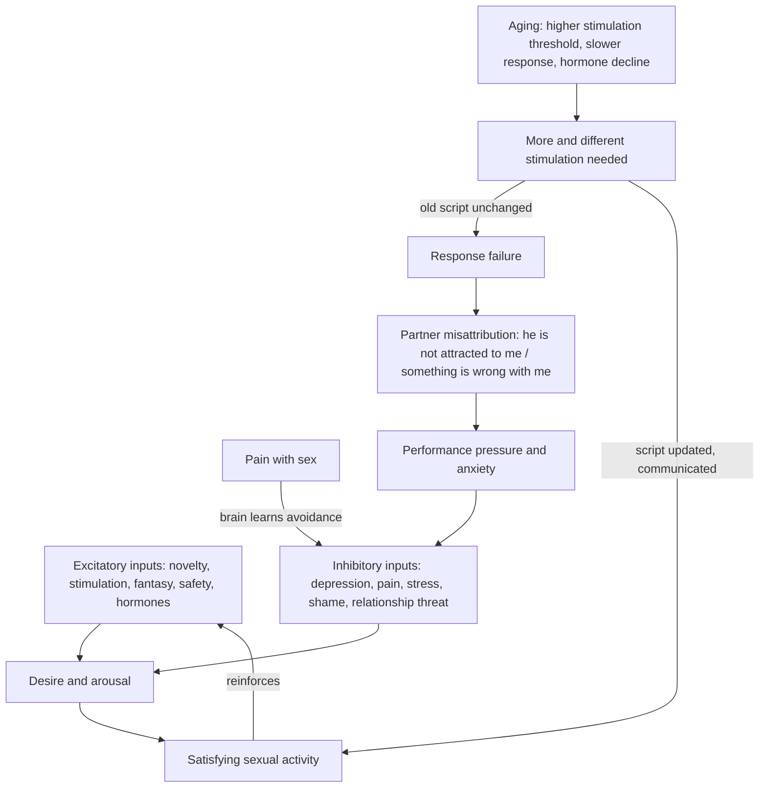
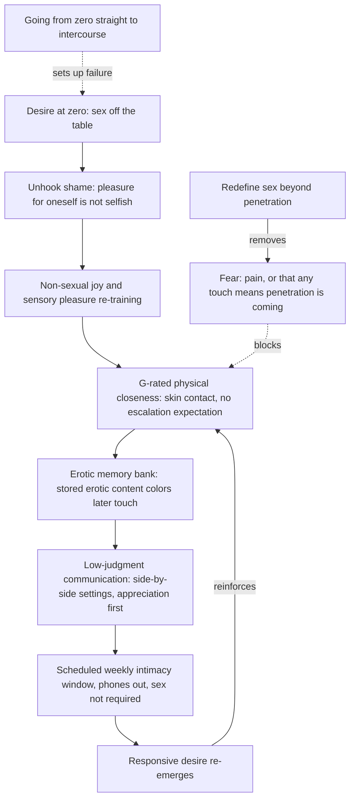

# Sexual desire, arousal, and aging

Sexual response has separable components that are often conflated: central (brain) arousal, genital (pelvic) arousal, and desire. The brain can be willing while genital blood flow is not cooperating, and the reverse; erections make the same dissociation visible in men. Desire itself is regulated like other motivated behaviors by a balance of excitatory and inhibitory neurotransmission, which means strong inhibitors — untreated depression (described in the source as the number-one predictor of low sexual desire), sexual pain, and chronic threat or unsafety — can overpower any excitatory treatment. (@RenaMalikMD (Rena Malik, M.D.) — "Why Your Vagina Doesn't Get 'Loose' From Sex (Despite What Social Media Says)", 2026-07-24, [link](https://www.youtube.com/watch?v=DnbhB-6vy80))

## Concordance: genital arousal and desire are separate measurement channels

Sexual-medicine research formalizes the brain–genital dissociation as (non)concordance between subjective (cognitive) and objective (genital) arousal. Laboratory studies that show women erotica while measuring genital blood flow and brain or self-reported arousal find the two channels poorly correlated — and more discordant in women than in men (Cindy Meston's group at UT Austin is credited with much of this work). The mechanistic explanation is not settled; the sourced interpretation is that genital response can proceed while attention and appraisal are elsewhere. Two clinical corollaries follow. First, lubrication is not evidence of desire or consent: genital response can occur without wanting sex, including during sexual assault — a documented phenomenon that produces intense unwarranted guilt, and which the clinicians reframe as an automatic bodily response (possibly protective against tissue injury, on one evolutionary reading) that says nothing about what the brain wants. Second, absent lubrication is not evidence of absent desire: aging, medications, and lactation all reduce lubrication in women who are subjectively aroused, and couples who treat wetness as the female analogue of an erection — an objective performance gauge — misread both directions. The counseling position is that a lubrication change is a biology problem to diagnose (medication review, hormonal status), not a verdict on attraction or on the relationship. (@RenaMalikMD (Rena Malik, M.D.) — "She's Lubricated… But Does She Actually Want Sex? ft. Women's Sexual Health Expert", 2026-08-26, [link](https://www.youtube.com/watch?v=ioXnBzREeis)) [[female-ejaculation-and-squirting]] [[genitourinary-syndrome-of-menopause]]

The same interview documents the mirror-image communication gap around male ejaculate: many men experience the emission of fluid as integral to pleasure and are distressed by medication-induced or surgical anejaculation, while female partners in the discussion largely reported indifference to the fluid itself — a mismatch clinicians historically ignored when prescribing ejaculation-affecting drugs without counseling. The teaching point generalizes: partners' assumptions about what the other values sexually are often wrong in both directions, and normalizing explicit conversation is itself treatment. (@RenaMalikMD (Rena Malik, M.D.) — "She's Lubricated… But Does She Actually Want Sex? ft. Women's Sexual Health Expert", 2026-08-26, [link](https://www.youtube.com/watch?v=ioXnBzREeis))

Whether emotional connection is required for female arousal is treated as an over-generalization rather than a rule: Tami Rowen's position is that experiences are too diverse for any universal statement, against the common claim that women categorically need emotional connection to be aroused. (@RenaMalikMD (Rena Malik, M.D.) — "She's Lubricated… But Does She Actually Want Sex? ft. Women's Sexual Health Expert", 2026-08-26, [link](https://www.youtube.com/watch?v=ioXnBzREeis)) [[tami-rowen]]

## Spontaneous versus responsive desire

The culturally default model of desire is appetitive — a drive that builds like hunger or thirst (a framing the source traces to Freud). Many people, especially in long-term relationships and under high load, do not experience spontaneous desire yet retain fully functional responsive desire: arousal and then desire emerge after affectionate, pressure-free engagement begins. Kelly Casperson's framing adds that "safety" in the useful sense is not just physical — it is whether one can truthfully say what is or isn't working (needing a vibrator, an orgasm not happening tonight) without consequence, since sex requires vulnerability. Treating responsive desire as normal rather than as dysfunction is itself therapeutic. (@RenaMalikMD (Rena Malik, M.D.) — "Why Your Vagina Doesn't Get 'Loose' From Sex (Despite What Social Media Says)", 2026-07-24, [link](https://www.youtube.com/watch?v=DnbhB-6vy80))

The same misconception drives sexual inactivity in long-term relationships. There is no standard definition of a sexless relationship — researchers variously use fewer than ten encounters per year or less than monthly — and by such definitions roughly 15–40% of married couples are estimated to qualify. When clinicians investigate why intimacy faded, lost love is rarely the explanation. The recurrent contributors are health and pharmacology (a third to nearly half of adults experience some sexual difficulty during adult life; diabetes, hypertension, and neurological disease impair arousal, and antidepressants, blood-pressure drugs, pain medications, and even antihistamines can blunt desire), chronic stress (framed mechanistically as sustained cortisol output suppressing testosterone), desire mismatch handled badly (a repeated initiate-and-reject loop that breeds resentment in one partner and pressure-avoidance in the other, until even affectionate touch is avoided for fear it signals a demand for sex), and — the assumption the video singles out — waiting for spontaneous desire in an attention environment that never leaves space for it. The prescription is the responsive-desire model operationalized: deliberately create undistracted closeness (scheduled, phones away, touch without a sex precondition) and let arousal precede desire, the way commitment precedes motivation at the gym. The compounding cost of the wrong model is delay: couples are reported to wait on average six years before raising the problem with a professional. A claimed longevity association — couples having sex more than once a week (52+ times a year) living significantly longer — is an unadjusted population association whose direction likely runs substantially from health to sexual activity; it is recorded here as provenance, not as evidence that scheduling sex extends life. (@RenaMalikMD (Rena Malik, M.D.) — "The #1 Mistake Keeping Couples in a Sexless Marriage", 2026-08-17, [link](https://www.youtube.com/watch?v=EkYN2Wwfa5I))

Clinical assessment of low desire distinguishes acquired loss from lifelong absence, requires distress for diagnosis, and works through a biopsychosocial screen (neurotransmitters and hormones; depression, anxiety, body image; relationship and life context). One clinician's discriminating question for hypoactive sexual desire disorder: "If you were on vacation and you were away from all the stresses in your life and you had a nice meal and you were relaxed, would you want sex?" — a "no" points toward an intrinsic desire disorder, a "yes" toward situational inhibitors. Dominant inhibitors get treated first (untreated depression, sexual pain — see [[vulvovaginal-anatomy-and-hormone-sensitivity]]); biological and psychological treatment need not be strictly sequential in the gray zone. Two FDA-approved medications for low libido in women, flibanserin (Addyi) and bremelanotide (Vyleesi), are named with reported spillover benefit on arousal, orgasm, and satisfaction, but the transcript provides no trial magnitudes. Antidepressant-induced loss of desire or delayed orgasm is flagged as a common iatrogenic contributor. (@RenaMalikMD (Rena Malik, M.D.) — "Why Your Vagina Doesn't Get 'Loose' From Sex (Despite What Social Media Says)", 2026-07-24, [link](https://www.youtube.com/watch?v=DnbhB-6vy80))

## Rebuilding desire from zero: graded re-engagement

When desire has collapsed entirely — the person could live the rest of their life without sex — the clinical approach described by gynecologist and sexual-medicine clinician Maria Sophocles is graded rather than restorative-by-force, and it begins upstream of anything sexual. The first obstacle she names is socialized self-erasure: many women, raised for centuries to think of others first, experience treating themselves as a sexual being as selfish, so the shame has to be unhooked before pleasure of any kind can be rebuilt. Her office exercise for this is deliberately non-genital sensory retraining — unwrapping and smelling (not yet tasting) an expensive chocolate bar chosen to the patient's preference — to re-teach the experience of pleasure in a form that carries no threat, because what many sexually averse patients actually fear is pain with intercourse, or that any cuddle will be taken as consent to penetration. (@RenaMalikMD (Rena Malik, M.D.) — "Think More Chores Will Get You More Sex? Here’s What Actually Builds Desire", 2026-09-02, [link](https://www.youtube.com/watch?v=zLyv9TczNoc))

The graded ladder proceeds through what she calls starting G-rated: sitting together in an oversized chair, phones outside the room, reminiscing about something pleasant, relearning that skin touching skin — arms, legs, toes — feels good, with penetration explicitly not the next step. Jumping from zero to sixty is framed as setting up failure. Redefining sex matters symmetrically for the partner: many men equate sex with penetration, so learning that women can feel gratification and orgasm without it (most women require clitoral stimulation to orgasm) is part of the treatment, not a concession. Rena Malik supplements the model with a pleasure-science framing she attributes to Barry Komisaruk: pleasure is substantially sensation not recently experienced, filtered through learned templates of what is pleasurable — which converts rebuilding into a search for sensations the couple has not had (a back rub, a gentle caress) rather than more effortful repetition of the old script. Sophocles adds a memory mechanism she describes as a savings account: the brain stores encountered erotic content (an article, a film scene, a narrated-story app — for many women deliberately private media) and links it to later physical contact, so an ordinary goodnight touch acquires erotic coloring from deposits made earlier; couples can also make the deposits together. These are clinical frameworks and mechanistic plausibilities, not trial-tested protocols. (@RenaMalikMD (Rena Malik, M.D.) — "Think More Chores Will Get You More Sex? Here’s What Actually Builds Desire", 2026-09-02, [link](https://www.youtube.com/watch?v=zLyv9TczNoc))

The communication layer has specific mechanics. Sophocles reports from roughly 85,000 patient visits over 30 years, plus interviews across five continents, that the pattern is near-universal across country, culture, religion, and class: couples can raise children, survive deaths and financial crises together, and still execute a rote sexual script for decades without ever saying what they do and don't like. Her openers are engineered to strip judgment from the channel: hold the first conversation side-by-side rather than face-to-face (in the car, or on a walk — where Malik adds that deeper breathing engages parasympathetic relaxation), and start from appreciation of a remembered good experience with the request embedded between the lines, rather than from complaint. Both clinicians treat initial shutdown as expected learned behavior — the partner has learned to hear such bids as demands or chores — and repeated rejection as the mechanism by which initiating partners eventually stop trying or seek connection elsewhere; persistence with low-pressure, indirect openers (including sending a relevant video or reel as a deniable conversation-starter) is part of the method. The summary phrase used in the source is that communication is lubrication. (@RenaMalikMD (Rena Malik, M.D.) — "Think More Chores Will Get You More Sex? Here’s What Actually Builds Desire", 2026-09-02, [link](https://www.youtube.com/watch?v=zLyv9TczNoc))

On the viral chore-play framing — housework as foreplay — both clinicians reject the transactional reading while keeping the kernel: acts of service are one love language among several, so matched contribution builds rapport and signals attentiveness, but dishes do not purchase sex, and doing more chores while waiting for desire to appear misunderstands the mechanism. Sophocles pairs this with an anti-scorekeeping principle: measuring a relationship at 50/50 is corrosive because each partner systematically undercounts the other's contribution, so the workable aim is to try to do more than half and to accept the partner's terms and timing for tasks rather than resenting them. The connected failure mode is accumulation: partners register small unaddressed asks for years without voicing their weight, then present the accumulated ledger only at the point of separation — another argument for saying the small thing when it is small. The endpoint of the whole model is scheduled intimacy — not scheduled sex: a protected weekly window (her example is Friday afternoon, 30 minutes, door closed, phones out, children handled) whose only assignment is re-encountering what was attractive about the person, with escalation left to follow. Her framing: a most-important relationship that cannot get 30 minutes a week indicates a priority reset, not a desire disorder. This operationalizes the responsive-desire scheduling advice above; no controlled trial of the schedule is cited. (@RenaMalikMD (Rena Malik, M.D.) — "Think More Chores Will Get You More Sex? Here’s What Actually Builds Desire", 2026-09-02, [link](https://www.youtube.com/watch?v=zLyv9TczNoc))

Midlife physiology intersects the behavioral ladder at pain: Sophocles emphasizes that perimenopausal and menopausal vaginal dryness and pain are often suffered silently, that lubricant should be normalized for every age rather than read as a verdict of being old and dried up, and that an unhelpful lubricant trial is itself a signal to seek care — with partners invited to preemptively learn about these changes rather than await disclosure ([[genitourinary-syndrome-of-menopause]]). (@RenaMalikMD (Rena Malik, M.D.) — "Think More Chores Will Get You More Sex? Here’s What Actually Builds Desire", 2026-09-02, [link](https://www.youtube.com/watch?v=zLyv9TczNoc))

## Pharmacology of low desire: the dopamine–norepinephrine axis

Desire's central chemistry is inferred from drugs that move it in both directions: SSRIs, which inhibit dopamine and norepinephrine signaling, commonly blunt desire, while dopamine-stimulating anti-Parkinsonian drugs can produce hypersexuality. The two FDA-approved medications for low female sexual desire act on this axis. Flibanserin (approved 2015) is a daily drug targeting serotonin receptors in a way that disinhibits dopamine and norepinephrine; multiple randomized controlled trials support a desire benefit, and its approval — initially premenopausal-only — was recently extended to women up to 65, an age bound reportedly reflecting the trial population rather than differential biology (the sourced argument: pre- and postmenopausal brains do not have different dopamine receptors, and the initial age restriction arose because approving a drug for postmenopausal women routes through the FDA's hormone division despite flibanserin not being a hormone). Bremelanotide is an as-needed autoinjector targeting the melanocortin receptor, driving dopamine release with effects lasting up to roughly 24 hours; its approval remains premenopausal-only, again bounded by the studied population. Clinician experience in the source is that both work in postmenopausal women off-label with more side effects at older ages. Before any of this, the stated first-line intervention is physical health itself — the interview's formulation is that physical health is the top predictor of sexual health, with exercise framed as the leading aphrodisiac via endogenous opioid and dopamine pathways, plus sleep and diet. (@RenaMalikMD (Rena Malik, M.D.) — "She's Lubricated… But Does She Actually Want Sex? ft. Women's Sexual Health Expert", 2026-08-26, [link](https://www.youtube.com/watch?v=ioXnBzREeis))

Testosterone acts on the same downstream currency — it stimulates central dopamine release rather than serving as a direct brain-to-brain messenger. Its evidence is age-stratified: in postmenopausal women, testosterone without other hormone therapy increases sexual desire and satisfying sexual events; in perimenopause a single supportive study used higher-than-recommended doses; and in women in their 20s–30s the data suggest desire tracks estradiol across the menstrual cycle rather than testosterone — with the confound that testosterone aromatizes to estradiol, leaving the causal molecule ambiguous. The broader female-testosterone evidence (body composition, cognition, mood) and its interpretive disputes are kept at [[menopause-hormone-therapy]]. (@RenaMalikMD (Rena Malik, M.D.) — "She's Lubricated… But Does She Actually Want Sex? ft. Women's Sexual Health Expert", 2026-08-26, [link](https://www.youtube.com/watch?v=ioXnBzREeis))

## What aging changes

Biological changes are directional and predictable: postmenopausal estrogen loss affects lubrication and pain and, less directly, desire ([[genitourinary-syndrome-of-menopause]]); testosterone declines gradually in both sexes; and nervous-system aging raises the stimulation threshold — erections need more direct stimulation, refractory periods lengthen dramatically, lubrication still occurs but takes more stimulation and time. The characteristic failure is behavioral, not biological: couples keep executing the sexual script that worked at 25, find it "not good enough," and misattribute the result. Annamaria Giraldi describes a common loop in which a man's slower erection is read by his partner as lost attraction or infidelity while he feels mounting pressure to perform, and both problems compound; teaching that the change reflects age, not the partner, defuses it. The prescription is to update the sexual script — more direct stimulation, more time, different activities, explicit communication about what works now. (@RenaMalikMD (Rena Malik, M.D.) — "Watching Porn And Feeling Guilty? That Anxiety Could Be Hurting Your Sex Life", 2026-07-22, [link](https://www.youtube.com/watch?v=u0fCMM_xEy8))

Psychological and social factors carry comparable weight to hormones. Giraldi cites Lorraine Dennerstein's longitudinal menopause research as showing psychological factors matter as much for desire and pain as declining estrogen, and cohort work she attributes to a researcher named Linda linking better physical health to more years of sexual activity in later life. Internalized ageism ("can I have sex when I am older?"), body-image change, retirement and role loss, and chronic disease (cardiovascular disease, diabetes, arthritis) all act on the same system — so general health maintenance is also sexual-lifespan maintenance. These are cohort-level associations, not intervention effects. (@RenaMalikMD (Rena Malik, M.D.) — "Watching Porn And Feeling Guilty? That Anxiety Could Be Hurting Your Sex Life", 2026-07-22, [link](https://www.youtube.com/watch?v=u0fCMM_xEy8))

A separate compilation reinforces the same systems model: aging changes response thresholds and timing, but distress often emerges from treating the old sexual script as a fixed performance standard. Hormone loss, vascular disease, medicines, depression, pain, pelvic-floor guarding, partner interpretation, and cultural ageism can converge on the same outcome. Education and explicit renegotiation of stimulation, time, aids, and non-penetrative intimacy are therefore mechanism-directed adaptations, not admissions of failure. The source supports this framework through expert interpretation but does not quantify intervention effects. (@RenaMalikMD (Rena Malik, M.D.) — "The Real Reason Sex Gets Better (or Worse) with Age", 2026-07-15, [link](https://www.youtube.com/watch?v=pVZnliApCWQ))

On hormones in aging: both interviewees converge on the position that healthy, normally functioning older adults mostly do not need testosterone replacement; obesity and cardiometabolic comorbidity are the common drivers of clinically low testosterone, exercise and weight management protect endogenous production, and prescribing testosterone when the real problem is depression or relationship strain fixes nothing. When testosterone is normal, the clinical task is finding the actual driver. (@RenaMalikMD (Rena Malik, M.D.) — "Watching Porn And Feeling Guilty? That Anxiety Could Be Hurting Your Sex Life", 2026-07-22, [link](https://www.youtube.com/watch?v=u0fCMM_xEy8)) [[male-fertility-and-exogenous-testosterone]] [[menopause-hormone-therapy]]

## Aids, adjuncts, and supplements

Clinicians in the compilation actively recommend normalizing vibrators and other devices (including vibrating rings for erection maintenance or delayed ejaculation) and erotica in any medium, framing them as functional aids like eyeglasses rather than indictments of a partner; clitoris, penis, and perineum all respond to vibration. Mindfulness-based approaches (Lori Brotto's work is named) have supporting studies for low desire. Supplement evidence is thin: vitamin D deficiency is associated with sexual dysfunction but supplementation trials are mixed; DHEA has neutral-to-positive studies; a proprietary nitric-oxide-pathway product (Ristela/Bonafide) has small non-randomized series plus anecdote. None of these is a substitute for treating pain, depression, or hormone deficiency. (@RenaMalikMD (Rena Malik, M.D.) — "Why Your Vagina Doesn't Get 'Loose' From Sex (Despite What Social Media Says)", 2026-07-24, [link](https://www.youtube.com/watch?v=DnbhB-6vy80)) [[supplement-evidence-and-safety]]

For older adults reclaiming sexuality, the highest-yield intervention reported is unglamorous: normalization and communication — with the partner and with clinicians — plus a safe space to redesign what intimacy includes. Giraldi's clinical observation is that most couples, given permission and information, can identify the adjustments themselves. (@RenaMalikMD (Rena Malik, M.D.) — "Watching Porn And Feeling Guilty? That Anxiety Could Be Hurting Your Sex Life", 2026-07-22, [link](https://www.youtube.com/watch?v=u0fCMM_xEy8))

## Practical implications

- **When desire drops: screen the big inhibitors first — depression (including antidepressant side effects), sexual pain, relationship threat — before or alongside any excitatory treatment — strong assessment principle.** (@RenaMalikMD (Rena Malik, M.D.) — "Why Your Vagina Doesn't Get 'Loose' From Sex (Despite What Social Media Says)", 2026-07-24, [link](https://www.youtube.com/watch?v=DnbhB-6vy80))
- **Treat responsive desire as normal: schedule connection without a sex precondition and let desire follow arousal — moderate; supported by clinical consensus in the sources rather than trials.** In a long-inactive relationship, start with small undistracted windows of physical closeness (even five minutes, phones away) on a regular cadence, and open the conversation with missing the partner rather than blame. (@RenaMalikMD (Rena Malik, M.D.) — "Why Your Vagina Doesn't Get 'Loose' From Sex (Despite What Social Media Says)", 2026-07-24, [link](https://www.youtube.com/watch?v=DnbhB-6vy80)) (@RenaMalikMD (Rena Malik, M.D.) — "The #1 Mistake Keeping Couples in a Sexless Marriage", 2026-08-17, [link](https://www.youtube.com/watch?v=EkYN2Wwfa5I))
- **When intimacy has stopped: screen medical and pharmacologic contributors (erections, pain, hormonal change, antidepressants, antihypertensives, antihistamines) rather than assuming lost love or a broken partner — moderate-to-strong assessment principle; and do not let the initiate-reject loop run for years before seeking help.** (@RenaMalikMD (Rena Malik, M.D.) — "The #1 Mistake Keeping Couples in a Sexless Marriage", 2026-08-17, [link](https://www.youtube.com/watch?v=EkYN2Wwfa5I))
- **From complete sexual aversion or burnout: rebuild through the graded ladder — shame unhooking and non-sexual pleasure, then non-escalating G-rated touch with sex explicitly off the table, then communication and a protected weekly 30-minute intimacy window (not a sex appointment) — investigational practice from clinical experience; no controlled trial supports the sequence.** Do not jump from zero to intercourse, and treat pain with sex as a medical problem to diagnose first. (@RenaMalikMD (Rena Malik, M.D.) — "Think More Chores Will Get You More Sex? Here’s What Actually Builds Desire", 2026-09-02, [link](https://www.youtube.com/watch?v=zLyv9TczNoc))
- **For difficult first conversations about sex: choose a side-by-side, low-judgment setting (car, walk) and open with appreciation of a remembered good experience rather than complaint; expect and tolerate initial shutdown as learned response — expert practice.** Drop the 50/50 scorekeeping frame and voice small grievances while they are small. (@RenaMalikMD (Rena Malik, M.D.) — "Think More Chores Will Get You More Sex? Here’s What Actually Builds Desire", 2026-09-02, [link](https://www.youtube.com/watch?v=zLyv9TczNoc))
- **With age, deliberately renegotiate the sexual script — more direct stimulation, more time, devices and erotica as tools — instead of repeating what used to work — moderate.** Interpret a partner's slower response as physiology, not rejection. (@RenaMalikMD (Rena Malik, M.D.) — "Watching Porn And Feeling Guilty? That Anxiety Could Be Hurting Your Sex Life", 2026-07-22, [link](https://www.youtube.com/watch?v=u0fCMM_xEy8))
- **Maintain cardiometabolic health, sleep (including apnea treatment), and body weight as sexual-longevity interventions — moderate; association-level evidence for the sexual outcome, strong for the general-health outcome.** (@RenaMalikMD (Rena Malik, M.D.) — "Watching Porn And Feeling Guilty? That Anxiety Could Be Hurting Your Sex Life", 2026-07-22, [link](https://www.youtube.com/watch?v=u0fCMM_xEy8)) [[erectile-dysfunction-and-vascular-health]]
- **Do not start testosterone for age-typical desire change without a defined indication and level assessment — moderate-to-strong.** See [[menopause-hormone-therapy]] for the female HSDD indication and its bounds. (@RenaMalikMD (Rena Malik, M.D.) — "Watching Porn And Feeling Guilty? That Anxiety Could Be Hurting Your Sex Life", 2026-07-22, [link](https://www.youtube.com/watch?v=u0fCMM_xEy8))

## Gaps & open questions

- What are the effect sizes of flibanserin and bremelanotide on satisfying sexual events, and who responds?
- Why are women less concordant than men between genital and subjective arousal — attention, interoception, measurement artifact, or something else?
- Do flibanserin and bremelanotide perform comparably in postmenopausal women, and what is the age gradient of their side effects?
- In premenopausal women, is estradiol rather than testosterone the dominant hormonal driver of desire, and can the two be causally separated given aromatization?
- Can responsive-desire education alone (without medication) resolve distress in a measurable fraction of couples?
- How much of later-life sexual inactivity is attributable to modifiable health factors versus preference, partner availability, and cohort norms?
- Do device- and erotica-based interventions improve validated sexual-function outcomes in older adults in controlled studies?
- Does treating sleep apnea or depression restore desire more reliably than direct pro-sexual pharmacotherapy?
- How much of the sexual-frequency–longevity association survives adjustment for baseline health, and does any interventional evidence exist?
- Do scheduled-intimacy interventions measurably increase sexual frequency or satisfaction in sexless couples versus couple therapy or no treatment?
- Does graded non-genital re-engagement (sensate-focus-style laddering, sensory retraining) outperform direct couple therapy or education alone for restoring desire after complete aversion, and does stored erotic-content exposure measurably change response to partner touch?

## Related

[[genitourinary-syndrome-of-menopause]] · [[vulvovaginal-anatomy-and-hormone-sensitivity]] · [[pornography-motivation-and-sexual-health]] · [[erectile-dysfunction-and-vascular-health]] · [[premature-ejaculation]] · [[menopause-hormone-therapy]] · [[male-fertility-and-exogenous-testosterone]] · [[interpersonal-regulation-and-emotional-capacity]] · [[durable-well-being-and-hedonic-adaptation]] · [[female-ejaculation-and-squirting]] · [[hormonal-contraception]] · [[tami-rowen]] · [[maria-sophocles]] · [[rena-malik]]
