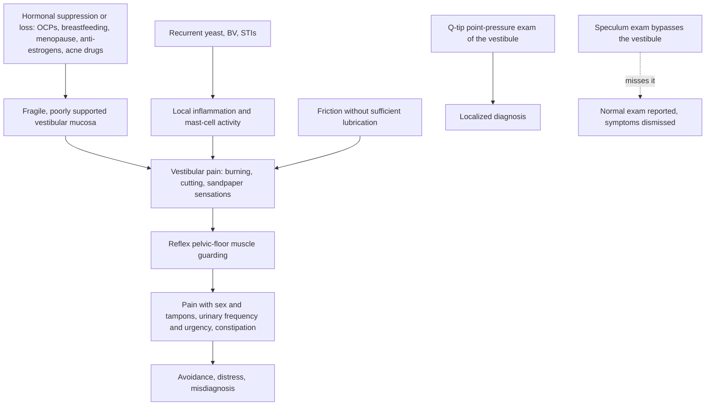

# Vulvovaginal anatomy and hormone sensitivity

The vulva is not hormonally uniform. The labia majora and the outer surface of the labia minora are keratinized skin; the vulvar vestibule — the oval strip of tissue exposed when the labia minora are opened, surrounding the urethral opening and the vaginal opening — is a delicate mucosal surface embryologically continuous with the urethra and bladder lining. The contrast is the difference between the outside and the inside of the cheek: adjacent tissues with different resilience and reactivity. The vestibule expresses estrogen and androgen receptors, and low-estrogen states such as lactation and menopause can affect vulvovaginal tissue. Hormonal contraception has also been proposed as a contributor to vestibular symptoms in susceptible patients, but heterogeneous observational evidence does not establish that any hormone-changing exposure necessarily causes tissue disease or pain. Mast-cell–driven inflammation may add to symptoms. (@RenaMalikMD (Rena Malik, M.D.) — "Why Your Vagina Doesn't Get 'Loose' From Sex (Despite What Social Media Says)", 2026-07-24, [link](https://www.youtube.com/watch?v=DnbhB-6vy80)) [[hormonal-contraception]]

The labia minora vary widely between people and across the life course. Rachel Rubin attributes some size change to hormonal state and warns that labiaplasty can remove innervated tissue, supporting careful counseling before cosmetic reduction. Her further suggestion that performers' anatomy in pornography partly reflects hormonal contraception is not established by evidence supplied here; pornography is also a selected and surgically modified sample. Labial appearance is not a validated marker of systemic hormonal health. (@RenaMalikMD (Rena Malik, M.D.) — "Why Your Vagina Doesn't Get 'Loose' From Sex (Despite What Social Media Says)", 2026-07-24, [link](https://www.youtube.com/watch?v=DnbhB-6vy80))

## Vestibular pain: mechanism and the examination gap

Vestibular tissue problems present as pain with penetration or tampons, post-sex pain, burning described as sandpaper, shards of glass, cutting, or tearing, recurrent urinary-tract-infection–like symptoms, and secondary pelvic-floor muscle tightness that can even present as isolated constipation. The diagnostic failure mode is structural: a speculum passes through the vestibule and opens beyond it, so the standard exam literally bypasses the painful tissue and returns "normal." The corrective exam is simple point pressure with a cotton swab across the vestibule — localized pain there is abnormal. Patients in this pathway commonly accumulate years of dismissal ("it's all in your head") before the tissue is examined directly. (@RenaMalikMD (Rena Malik, M.D.) — "Why Your Vagina Doesn't Get 'Loose' From Sex (Despite What Social Media Says)", 2026-07-24, [link](https://www.youtube.com/watch?v=DnbhB-6vy80))

This anatomy-first diagnostic point is independently present in the staged aging-sex compilation: the vestibule can be the specific pain generator even when a conventional speculum examination is reported as normal, and directly locating the pain can reduce partner self-blame as well as patient dismissal. The source does not establish the sensitivity, specificity, or treatment-predictive value of cotton-swab mapping, so it remains one component of a broader vulvar-pain evaluation. (@RenaMalikMD (Rena Malik, M.D.) — "The Real Reason Sex Gets Better (or Worse) with Age", 2026-07-15, [link](https://www.youtube.com/watch?v=pVZnliApCWQ))

Management in the source follows the mechanism: restore local hormone support (vaginal DHEA, topical estrogen, or estrogen–testosterone compounds), switch combined-pill users toward a hormonal IUD, treat pelvic-floor muscle overactivity with pelvic-floor physical therapy — with pelvic-floor botulinum toxin described as helpful in selected patients — address inflammatory drivers, and reserve surgery for rare refractory cases. These are specialist practice patterns; the transcript does not supply trial-level efficacy data, so the treatment sequence should be treated as investigational practice guided by a clinician experienced in vulvar pain. (@RenaMalikMD (Rena Malik, M.D.) — "Why Your Vagina Doesn't Get 'Loose' From Sex (Despite What Social Media Says)", 2026-07-24, [link](https://www.youtube.com/watch?v=DnbhB-6vy80))

## What sex does and does not change

Two socially persistent claims fail on anatomy. First, vaginal "looseness" does not track partner count: the tissue has no mechanism to distinguish one partner a hundred times from a hundred partners once, and neither pattern produces laxity. Second, partner count does not irreversibly damage the vaginal microbiome. What can happen is transient moisture- or semen-associated irritation, yeast, or bacterial vaginosis after sex — manageable with simple measures (avoid trapping moisture afterward; preventive medication for genuinely recurrent infections) and, for any partner pattern, STI protection remains the health-relevant variable. Douching, "yoni steams," and inserting substances such as garlic have no medical role and can introduce harm. (@RenaMalikMD (Rena Malik, M.D.) — "Why Your Vagina Doesn't Get 'Loose' From Sex (Despite What Social Media Says)", 2026-07-24, [link](https://www.youtube.com/watch?v=DnbhB-6vy80))

Mechanical injury is a different category. High-velocity water exposure (water slides, water-sport falls) can force water into the vagina and cause internal lacerations, occasionally severe; crossing the legs on slides or wearing suits with leg coverage reduces exposure. Retained foreign bodies happen when an object without a flared base or handle passes beyond reach and suction prevents retrieval; removal sometimes requires an emergency department or sedation, so devices intended for insertion should have a flared base or handle. Positions are not universally risky, but position-specific pain that recurs warrants gynecologic assessment for causes such as endometriosis or pelvic-floor spasm. (@RenaMalikMD (Rena Malik, M.D.) — "Why Your Vagina Doesn't Get 'Loose' From Sex (Despite What Social Media Says)", 2026-07-24, [link](https://www.youtube.com/watch?v=DnbhB-6vy80)) [[endometriosis]]

## Hysterectomy, the cervix, and pelvic support

Group data reported in the source show sexual function on average improves after hysterectomy whether or not the cervix is removed, but a subset of women who experience cervical pleasure may do worse with removal — so elective cases deserve explicit counseling about keeping or removing the cervix. Claims that retaining the cervix prevents prolapse have not held up, and retention leaves cancer risk and screening needs in place. Independently, removing the uterus does not treat prolapse: without deliberate apical support (attaching the vaginal apex to the uterosacral ligaments and closing the intervening space), prolapse recurs. These are surgeon-practice positions consistent with the stated trial data but not independently graded here. (@RenaMalikMD (Rena Malik, M.D.) — "Why Your Vagina Doesn't Get 'Loose' From Sex (Despite What Social Media Says)", 2026-07-24, [link](https://www.youtube.com/watch?v=DnbhB-6vy80))

## Practical implications

- **For pain with sex, tampons, or recurrent UTI-like symptoms despite "normal" exams: ask specifically for a cotton-swab examination of the vulvar vestibule — strong as a low-cost diagnostic step; prevalence and treatment effects not quantified here.** Bring the hormonal-exposure history (contraception, breastfeeding, menopause, anti-estrogens) to the visit. (@RenaMalikMD (Rena Malik, M.D.) — "Why Your Vagina Doesn't Get 'Loose' From Sex (Despite What Social Media Says)", 2026-07-24, [link](https://www.youtube.com/watch?v=DnbhB-6vy80))
- **Do not pursue labiaplasty for appearance normalized by pornography without counseling on nerve-rich tissue and hormonal context — moderate harm-avoidance principle.** (@RenaMalikMD (Rena Malik, M.D.) — "Why Your Vagina Doesn't Get 'Loose' From Sex (Despite What Social Media Says)", 2026-07-24, [link](https://www.youtube.com/watch?v=DnbhB-6vy80))
- **Ignore partner-count "looseness" and microbiome-damage claims; keep STI protection, post-sex moisture management, and infection treatment as the real variables — strong on anatomy, moderate on the practical measures.** Avoid douching and vaginal insertion of non-medical substances. (@RenaMalikMD (Rena Malik, M.D.) — "Why Your Vagina Doesn't Get 'Loose' From Sex (Despite What Social Media Says)", 2026-07-24, [link](https://www.youtube.com/watch?v=DnbhB-6vy80))
- **Use insertable devices with a flared base or handle, and treat retained objects or severe genital injury as emergency-department problems — strong safety principle.** (@RenaMalikMD (Rena Malik, M.D.) — "Why Your Vagina Doesn't Get 'Loose' From Sex (Despite What Social Media Says)", 2026-07-24, [link](https://www.youtube.com/watch?v=DnbhB-6vy80))
- **Before elective hysterectomy: discuss cervix retention versus removal and confirm the surgeon's apical-support plan — moderate; based on group-level outcome data plus surgical reasoning.** (@RenaMalikMD (Rena Malik, M.D.) — "Why Your Vagina Doesn't Get 'Loose' From Sex (Despite What Social Media Says)", 2026-07-24, [link](https://www.youtube.com/watch?v=DnbhB-6vy80))

## Gaps & open questions

- Which hormones drive labia minora growth and postmenopausal resorption, and can local therapy reverse it?
- What is the population prevalence of hormonally associated vestibulodynia, and which treatments work in randomized trials?
- How often does contraceptive-associated vestibular pain resolve after switching to non-suppressive methods?
- Which patients benefit from pelvic-floor botulinum toxin, and at what doses and intervals?
- Does cervical retention measurably preserve sexual function in the subset who report cervical pleasure?

## Related

[[genitourinary-syndrome-of-menopause]] · [[vulvovaginal-candidiasis]] · [[hormonal-contraception]] · [[sexual-desire-arousal-and-aging]] · [[genital-modification-and-sexual-function]] · [[endometriosis]] · [[bladder-filling-and-voiding-behavior]] · [[menopause-hormone-therapy]] · [[rena-malik]]
