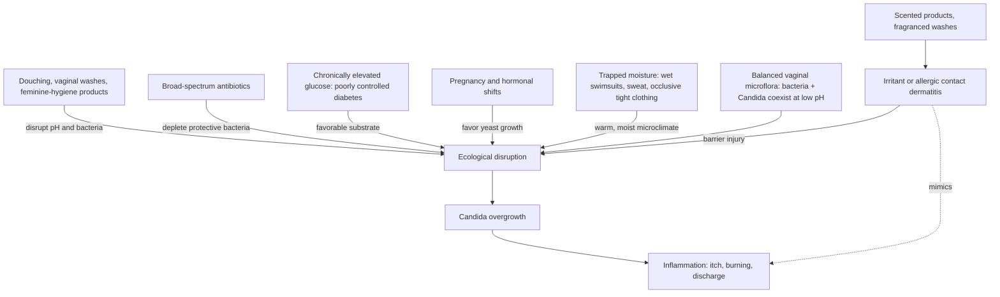

# Vulvovaginal candidiasis

Vulvovaginal candidiasis — the vaginal yeast infection — is symptomatic overgrowth of *Candida* yeast. *Candida* is not a foreign invader: it is a normal member of the vaginal microflora, coexisting with resident bacteria that help maintain the low-pH environment in which no single organism dominates. Disease occurs when that ecological balance shifts and *Candida* proliferates enough to provoke inflammation. Symptoms include vulvar itching, burning, irritation, redness, and swelling, classically with a thick white discharge described as cottage-cheese-like, and sometimes burning with urination or discomfort during intercourse. (@DrDrayzday (Dr Dray) — "How to Prevent Yeast Infections | Dermatologist Explains", 2026-08-14, [link](https://www.youtube.com/watch?v=vexU74uqAT0))

The central diagnostic caution is that none of these symptoms is specific. Itching and burning also occur in bacterial vaginosis, some sexually transmitted infections, urinary tract infections, allergic or irritant contact dermatitis from products applied to the area, and vulvar skin diseases such as lichen sclerosus. Self-diagnosis from symptoms alone therefore risks treating the wrong condition and missing an important one — the same diagnosis-before-treatment rule that governs the rest of this wiki's skin and genitourinary chapters ([[vulvovaginal-anatomy-and-hormone-sensitivity]]). (@DrDrayzday (Dr Dray) — "How to Prevent Yeast Infections | Dermatologist Explains", 2026-08-14, [link](https://www.youtube.com/watch?v=vexU74uqAT0))

## Ecology of risk

The vagina maintains its own hygiene — gynecologists commonly describe it as a "self-cleaning oven" — and attempts to clean it internally are counterproductive. Douches and vaginal washes disturb pH and suppress the resident bacteria whose presence limits *Candida*, setting the stage for more infections and other problems such as bacterial vaginosis. The external vulva needs at most plain water; even fragrance-free washes marketed for feminine hygiene can irritate, and scented powders, deodorants, and scented pads or tampons add contact-dermatitis risk that is then easily mistaken for another yeast infection. A normal vagina can have a smell; that is not a hygiene failure to be scrubbed away. (@DrDrayzday (Dr Dray) — "How to Prevent Yeast Infections | Dermatologist Explains", 2026-08-14, [link](https://www.youtube.com/watch?v=vexU74uqAT0))

Moisture and occlusion act on the same ecology from outside: yeast thrives in a moist environment, so time in a wet swimsuit, incomplete drying after bathing, and habitually occlusive clothing — leggings, very tight jeans — trap the moisture and friction that favor *Candida* colonization. Breathable cotton underwear is adequate; antimicrobial underwear is unnecessary. Systemically, three exposures matter most: broad-spectrum antibiotics deplete the protective bacteria along with the pathogens they were prescribed for; chronically elevated blood glucose in poorly controlled diabetes feeds yeast growth, which is why recurrent yeast infections are a recognized warning sign of diabetes; and the hormonal state of pregnancy favors overgrowth, which is why yeast infections commonly appear or recur during pregnancy. None of these justifies refusing or truncating a needed antibiotic course — stopping early promotes antibiotic resistance — but they do justify declining antibiotics that are not indicated, as for viral upper-respiratory infections. (@DrDrayzday (Dr Dray) — "How to Prevent Yeast Infections | Dermatologist Explains", 2026-08-14, [link](https://www.youtube.com/watch?v=vexU74uqAT0))

## Sex, partners, and condoms

An uncomplicated yeast infection is not a sexually transmitted infection, and treating a sexual partner does not make sense — the partner did not cause it and is not necessarily harboring yeast. Intercourse during an active infection can worsen symptoms through friction on inflamed vulvar tissue, so abstaining temporarily is a comfort measure rather than a requirement. One safety interaction is concrete: some intravaginal yeast treatments can weaken condoms and render them ineffective, so alternative protection is needed while using them. (@DrDrayzday (Dr Dray) — "How to Prevent Yeast Infections | Dermatologist Explains", 2026-08-14, [link](https://www.youtube.com/watch?v=vexU74uqAT0))

## Diet and probiotic myths

Internet forums attribute yeast infections to sugar, dairy, carbohydrates, or bread and prescribe restrictive Candida elimination diets. The claim conflates two different exposures: chronically elevated blood glucose in poorly controlled diabetes genuinely favors yeast, but ordinary dietary sugar in a person with normal glucose regulation does not produce that state, and eliminating food groups does not treat an infection those foods did not cause. Elimination diets carry real cost — nutritional deficiencies can weaken immune defenses and leave a person more vulnerable to the infections the diet was meant to prevent. Probiotics, yogurt, and fermented foods sound logical as microflora repopulation, but the clinical evidence for treating or preventing vulvovaginal candidiasis with them is not compelling; they are foods to enjoy, not treatments ([[probiotics-prebiotics-and-postbiotics]]). (@DrDrayzday (Dr Dray) — "How to Prevent Yeast Infections | Dermatologist Explains", 2026-08-14, [link](https://www.youtube.com/watch?v=vexU74uqAT0))

## Recurrence and when self-treatment should stop

Recurrent vulvovaginal candidiasis is defined as three or more infections in less than a year. Recurrence sometimes has an identifiable driver — repeated antibiotics, undiagnosed or poorly controlled diabetes — and sometimes has no obvious underlying cause; a person can do everything right and still get infections, so recurrence is not evidence of poor hygiene or personal failure. The practical rule is to stop cycling through over-the-counter antifungals and obtain a diagnosis: a clinician can confirm that yeast is actually present, identify the *Candida* species, and tailor treatment accordingly. Evaluation is also warranted for a first-ever episode, for symptoms that fail to resolve with treatment, and for symptoms that return quickly after treatment. (@DrDrayzday (Dr Dray) — "How to Prevent Yeast Infections | Dermatologist Explains", 2026-08-14, [link](https://www.youtube.com/watch?v=vexU74uqAT0))

## Practical implications

- **Never douche or use internal vaginal washes; wash the external vulva with plain water — strong; consistent clinical guidance on microflora disruption.** Skip scented powders, deodorants, scented pads and tampons, and fragranced washes in the vulvar area. (@DrDrayzday (Dr Dray) — "How to Prevent Yeast Infections | Dermatologist Explains", 2026-08-14, [link](https://www.youtube.com/watch?v=vexU74uqAT0))
- **Daily and after bathing or swimming: dry the vulvar area fully before dressing, change out of wet or sweaty clothing promptly, and favor breathable cotton underwear — moderate; mechanism-based prevention for those prone to infections.** If recurrent infections coincide with constant leggings or tight jeans, trial looser clothing. (@DrDrayzday (Dr Dray) — "How to Prevent Yeast Infections | Dermatologist Explains", 2026-08-14, [link](https://www.youtube.com/watch?v=vexU74uqAT0))
- **When prescribed antibiotics: complete the course, but decline antibiotics for likely viral illness — strong for both halves; resistance and microflora disruption are established consequences.** Expect elevated yeast-infection risk after broad-spectrum courses. (@DrDrayzday (Dr Dray) — "How to Prevent Yeast Infections | Dermatologist Explains", 2026-08-14, [link](https://www.youtube.com/watch?v=vexU74uqAT0))
- **Do not adopt a Candida elimination diet or take probiotics/yogurt as yeast-infection treatment — moderate-to-strong evidence against benefit, and elimination diets carry deficiency risk.** The blood-sugar connection applies to poorly controlled diabetes, not to ordinary desserts. (@DrDrayzday (Dr Dray) — "How to Prevent Yeast Infections | Dermatologist Explains", 2026-08-14, [link](https://www.youtube.com/watch?v=vexU74uqAT0))
- **During intravaginal antifungal treatment: assume condoms may be weakened and use alternative protection — strong safety practice.** (@DrDrayzday (Dr Dray) — "How to Prevent Yeast Infections | Dermatologist Explains", 2026-08-14, [link](https://www.youtube.com/watch?v=vexU74uqAT0))
- **For a first episode, treatment failure, rapid relapse, or three or more infections in a year: see a healthcare provider rather than continuing self-treatment — strong.** Species identification and diabetes assessment can change management; overlapping conditions (BV, STIs, UTI, contact dermatitis, lichen sclerosus) need different treatment entirely. (@DrDrayzday (Dr Dray) — "How to Prevent Yeast Infections | Dermatologist Explains", 2026-08-14, [link](https://www.youtube.com/watch?v=vexU74uqAT0))

## Gaps & open questions

- What proportion of self-diagnosed, self-treated yeast infections are actually something else, and what harm accrues from the misdirected treatment?
- Why do some people with no identifiable risk factor get recurrent infections, and what distinguishes their vaginal ecology?
- Do any specific probiotic strains, doses, or routes meaningfully reduce recurrence in well-designed trials, given the weak evidence for the category?
- How much do clothing and moisture interventions actually reduce recurrence, versus being plausible mechanism-based advice?
- How should recurrent candidiasis prompt diabetes screening — at what threshold and with what yield?

## Related

[[vulvovaginal-anatomy-and-hormone-sensitivity]] · [[genitourinary-syndrome-of-menopause]] · [[probiotics-prebiotics-and-postbiotics]] · [[free-sugars-and-glycemic-response]] · [[skin-barrier-and-moisturization]] · [[dr-dray]]
