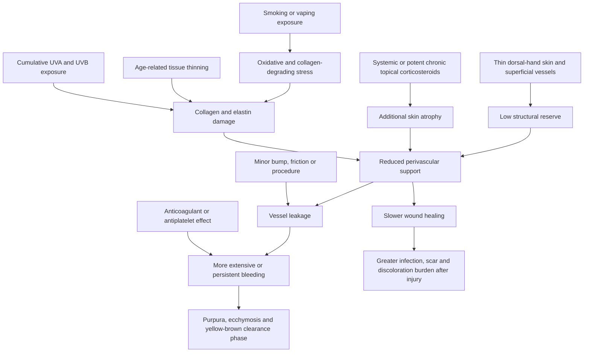

# Actinic purpura and aging skin fragility

Actinic purpura, also called senile or solar purpura, is easy bruising caused by fragile superficial vessels embedded in chronically thinned, sun-damaged skin. It is usually benign and noninfectious, but it is also a visible marker of reduced tissue support: minor trauma can release blood into the dermis, and the same vulnerable site may tear and heal slowly. The backs of the hands are especially susceptible because their skin is naturally thin, vessels and bony structures lie close to the surface, and ordinary life repeatedly exposes the area to ultraviolet radiation, washing, friction, and impacts. (@DrDrayzday (Dr Dray) — "Why Do My Hands Bruise So Easily? Dermatologist Explains", 2026-08-06, [link](https://www.youtube.com/watch?v=0o0bMXOL-Lo))

## Mechanism and modifiers

Cumulative ultraviolet injury degrades the dermal collagen and elastic framework that mechanically supports small vessels. Tobacco exposure adds oxidative stress, increases destructive pathways, and reduces antioxidant defenses; systemic corticosteroids or prolonged use of potent topical corticosteroids can add pharmacologic atrophy. Anticoagulants and aspirin do not create the damaged framework, but can make bleeding after vessel injury larger or more persistent. Escaped blood is gradually broken down and resorbed, accounting for the prolonged purple-to-yellow-brown color evolution. (@DrDrayzday (Dr Dray) — "Why Do My Hands Bruise So Easily? Dermatologist Explains", 2026-08-06, [link](https://www.youtube.com/watch?v=0o0bMXOL-Lo))

Skin fragility matters beyond appearance. Delayed closure after a tear, biopsy, skin-cancer treatment, or other procedure extends the period in which infection, scarring, and pigment alteration can occur. The same cumulative UV history also raises the likelihood of actinic keratoses and squamous-cell carcinoma, although purpura itself is not cancer and does not prove that a lesion is malignant. (@DrDrayzday (Dr Dray) — "Why Do My Hands Bruise So Easily? Dermatologist Explains", 2026-08-06, [link](https://www.youtube.com/watch?v=0o0bMXOL-Lo))

## Prevention and treatment hierarchy

Reducing future ultraviolet dose is foundational because it acts upstream of continued matrix damage. Broad-spectrum sunscreen must cover the backs of the hands and be restored after washing or rubbing; clothing or UPF gloves can provide more durable protection during prolonged driving or outdoor exposure. Side windows may block much UVB while transmitting clinically relevant UVA, so absence of sunburn inside a vehicle does not imply absence of collagen-damaging exposure. [[photoprotection]] (@DrDrayzday (Dr Dray) — "Why Do My Hands Bruise So Easily? Dermatologist Explains", 2026-08-06, [link](https://www.youtube.com/watch?v=0o0bMXOL-Lo))

Moisturizers improve surface hydration, flexibility, and friction tolerance but do not rebuild deep collagen or reverse DNA damage. Petrolatum strongly limits water loss and irritant entry; glycerin, urea, and ceramide-containing products can support hydration and barrier function. A source-cited small evidence base suggests that 12% ammonium lactate used twice daily can increase dermal as well as epidermal thickness, but the clinical magnitude and direct effect on bruising are less certain than its hydration and texture effects. [[skin-barrier-and-moisturization]] (@DrDrayzday (Dr Dray) — "Why Do My Hands Bruise So Easily? Dermatologist Explains", 2026-08-06, [link](https://www.youtube.com/watch?v=0o0bMXOL-Lo))

Tretinoin has the longest evidence history among topical retinoids for photoaged skin and may gradually increase collagen, thicken skin, lighten photodamage-associated discoloration, and reduce formation of actinic keratoses; other prescription retinoids and over-the-counter adapalene act through related pathways, while cosmetic retinol and retinaldehyde have less direct treatment evidence. Properly formulated ascorbic acid is a plausible antioxidant and collagen-support adjunct, but formulation quality is decisive and its incremental benefit is less certain. [[topical-retinoids]] (@DrDrayzday (Dr Dray) — "Why Do My Hands Bruise So Easily? Dermatologist Explains", 2026-08-06, [link](https://www.youtube.com/watch?v=0o0bMXOL-Lo))

Procedures address different targets rather than offering a single reversal. Fractional laser can improve pigment and collagen but entails redness, peeling, and pigment-change risk; office microneedling is usable across more skin tones but usually requires multiple sessions and may not restore deep volume; biostimulatory fillers can gradually conceal veins and add collagen but are costly, not readily reversible, and can form nodules in thin hand skin if poorly placed; fat grafting can restore volume but requires harvesting and reinjection, with unpredictable retention, swelling, bruising, and asymmetry. At-home microneedling adds infection and scarring risk without reaching equivalent controlled depths. [[procedural-skin-remodeling]] (@DrDrayzday (Dr Dray) — "Why Do My Hands Bruise So Easily? Dermatologist Explains", 2026-08-06, [link](https://www.youtube.com/watch?v=0o0bMXOL-Lo))

## Practical implications

- **Daily and after hand washing during meaningful exposure: protect the backs of the hands from UV — strong for preventing additional photodamage; moderate for preventing future purpura.** Apply broad-spectrum sunscreen and restore the film after removal; use gloves or other covering for prolonged driving, gardening, or outdoor work when practical. (@DrDrayzday (Dr Dray) — "Why Do My Hands Bruise So Easily? Dermatologist Explains", 2026-08-06, [link](https://www.youtube.com/watch?v=0o0bMXOL-Lo))
- **Daily, especially after washing: moisturize fragile hand skin — strong for hydration and friction reduction; limited for reducing bruising.** A bland moisturizer or petrolatum is a lower-burden first step; introduce urea or ammonium lactate only as tolerated. (@DrDrayzday (Dr Dray) — "Why Do My Hands Bruise So Easily? Dermatologist Explains", 2026-08-06, [link](https://www.youtube.com/watch?v=0o0bMXOL-Lo))
- **When bruising is new, widespread, spontaneous, accompanied by other bleeding, or follows a medication change: seek clinical assessment — strong safety practice.** Do not assume every bruise in an older adult is actinic purpura, and do not stop prescribed anticoagulants, antiplatelets, or corticosteroids without the prescriber. (@DrDrayzday (Dr Dray) — "Why Do My Hands Bruise So Easily? Dermatologist Explains", 2026-08-06, [link](https://www.youtube.com/watch?v=0o0bMXOL-Lo))
- **Over months, if active remodeling is desired: discuss a tolerable topical retinoid before high-cost procedures — moderate for photoaging, limited for direct bruise reduction.** Any procedure should be selected for a defined pigment, texture, volume, or fragility target and performed by an experienced clinician. (@DrDrayzday (Dr Dray) — "Why Do My Hands Bruise So Easily? Dermatologist Explains", 2026-08-06, [link](https://www.youtube.com/watch?v=0o0bMXOL-Lo))

## Gaps & open questions

- Which topical intervention most reduces clinically important bruising, tears, and wound-healing complications rather than improving appearance alone? (@DrDrayzday (Dr Dray) — "Why Do My Hands Bruise So Easily? Dermatologist Explains", 2026-08-06, [link](https://www.youtube.com/watch?v=0o0bMXOL-Lo))
- How much do sunscreen, driving gloves, retinoids, ammonium lactate, or low-level light therapy independently change actinic-purpura incidence in long-term comparative trials? (@DrDrayzday (Dr Dray) — "Why Do My Hands Bruise So Easily? Dermatologist Explains", 2026-08-06, [link](https://www.youtube.com/watch?v=0o0bMXOL-Lo))
- Which procedure offers the best durability, safety, and patient-important benefit across skin tones and degrees of hand-skin atrophy? (@DrDrayzday (Dr Dray) — "Why Do My Hands Bruise So Easily? Dermatologist Explains", 2026-08-06, [link](https://www.youtube.com/watch?v=0o0bMXOL-Lo))

## Related

[[photoprotection]] · [[skin-barrier-and-moisturization]] · [[topical-retinoids]] · [[procedural-skin-remodeling]] · [[extracellular-matrix-aging]] · [[dr-dray]] · [[practice-playbook]]
