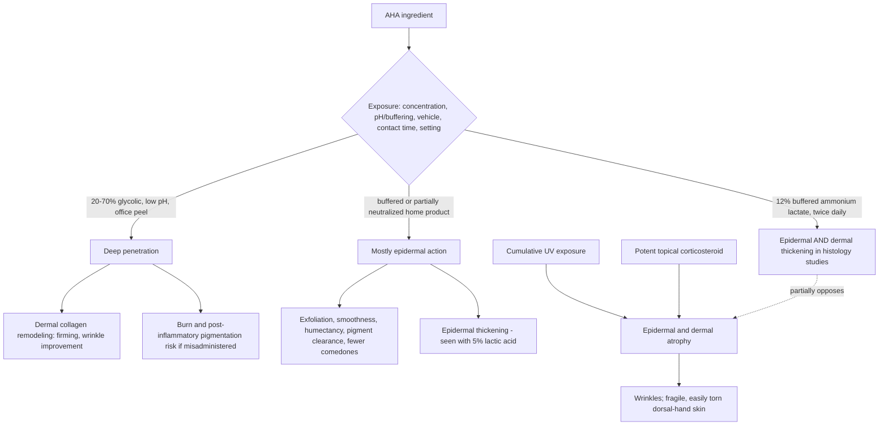

# Alpha-hydroxy acids

Alpha-hydroxy acids (AHAs) are a class of small organic acids — principally glycolic acid and lactic acid, the latter often supplied as its buffered salt ammonium lactate — used topically to reduce corneocyte cohesion, smooth surface texture, hasten epidermal turnover, act as humectants, and speed clearance of superficial hyperpigmentation. Lactic acid occurs naturally in skin; ammonium lactate is its buffered form. Glycolic acid has a smaller molecular size than lactic acid and therefore penetrates skin more readily, which is an asset when the goal is delivering a high concentration deep into tissue. (@DrDrayzday (Dr Dray) — "Amlactin vs. Glycolic Acid: Which Is Better for Anti-Aging?", 2026-08-31, [link](https://www.youtube.com/watch?v=pnlFKtIQSNE))

The central lesson of this chapter is that an AHA name does not define an exposure. What an AHA does in skin is set jointly by acid identity, concentration, degree of neutralization or buffering (pH and free-acid fraction), vehicle, contact time, and whether application happens at home or under clinical supervision. The same ingredient spans a spectrum from a gentle humectant lotion to a peel reagent capable of burning skin — so the question of which AHA is better is unanswerable until the exposure is specified ([[topical-visible-aging-interventions]], [[skincare-evidence-and-routine-design]]). (@DrDrayzday (Dr Dray) — "Amlactin vs. Glycolic Acid: Which Is Better for Anti-Aging?", 2026-08-31, [link](https://www.youtube.com/watch?v=pnlFKtIQSNE))

## Exposure determines depth of action

With intrinsic aging and photoaging, both the epidermis and the dermis atrophy; dermal loss of collagen, elastin, and glycosaminoglycans underlies wrinkling and, on chronically sun-exposed sites like the backs of the hands, the fragility, tearing, easy bruising, and poor wound healing developed at [[actinic-purpura-and-aging-skin-fragility]]. An anti-aging topical is therefore judged by which layer it can actually reach. (@DrDrayzday (Dr Dray) — "Amlactin vs. Glycolic Acid: Which Is Better for Anti-Aging?", 2026-08-31, [link](https://www.youtube.com/watch?v=pnlFKtIQSNE))

## In-office glycolic peels: the deep end of the class

Clinician-administered glycolic peels use 20–70% concentrations at low pH in vehicles designed for high penetration. This exposure has clinical and histologic (biopsy-level) support for improving photoaged skin at the surface and in the dermis, including collagen improvement that firms, tightens, and smooths sun-damaged areas. The same properties create real harm potential: AHA irritation can provoke unwanted pigmentation in deeper skin tones and can burn skin, and these risks scale with concentration and low pH — which is why this exposure belongs in a supervised setting. Between professionally administered lactic and glycolic peels, the source ranks glycolic clearly superior. (@DrDrayzday (Dr Dray) — "Amlactin vs. Glycolic Acid: Which Is Better for Anti-Aging?", 2026-08-31, [link](https://www.youtube.com/watch?v=pnlFKtIQSNE))

Home glycolic products are a different exposure: partially neutralized or buffered to higher pH for safe unsupervised use, they act mostly at the skin surface — exfoliation, smoothness, moisture retention, faster clearance of epidermal pigment, and some reduction in comedone formation in acne-prone skin. Those are genuine benefits, but peel-derived dermal-remodeling evidence cannot be transferred to them, regardless of the labeled percentage. (@DrDrayzday (Dr Dray) — "Amlactin vs. Glycolic Acid: Which Is Better for Anti-Aging?", 2026-08-31, [link](https://www.youtube.com/watch?v=pnlFKtIQSNE))

## 12% ammonium lactate: home-use evidence that reaches the dermis

Buffered 12% ammonium lactate lotion is distinctive within the class because user-applied, at-home exposure has human histologic evidence of dermal effect. In a study comparing 5% versus 12% lactic acid applied to the face twice daily (avoiding the eyelids) for 16 weeks with evaluations at 4, 8, 12, and 16 weeks, the 5% preparation increased epidermal thickness on biopsy, while the 12% preparation increased both epidermal and dermal thickness. (@DrDrayzday (Dr Dray) — "Amlactin vs. Glycolic Acid: Which Is Better for Anti-Aging?", 2026-08-31, [link](https://www.youtube.com/watch?v=pnlFKtIQSNE))

A second human study tested whether 12% ammonium lactate could protect against skin atrophy induced by the potent corticosteroid clobetasol. Concomitant application mitigated both the epidermal and the dermal atrophy that clobetasol can cause, and anti-inflammatory markers confirmed the steroid was still working — the lactate spared tissue without neutralizing the drug. (@DrDrayzday (Dr Dray) — "Amlactin vs. Glycolic Acid: Which Is Better for Anti-Aging?", 2026-08-31, [link](https://www.youtube.com/watch?v=pnlFKtIQSNE))

Two boundaries keep this in proportion. First, these are histologic thickness outcomes — objective, but intermediate; per the outcome hierarchy they do not establish how large the visible wrinkle improvement is, only that the effect plausibly extends beyond surface exfoliation ([[visible-aging-outcomes-and-evidence]]). Second, comparative rank is exposure-specific: 12% ammonium lactate at home is presented as superior to home glycolic products for dermal effect, and clearly inferior to an in-office glycolic peel. A 15% ammonium lactate product is not established as superior to 12% — the difference may reflect formulation rather than depth of action, with no head-to-head comparison. (@DrDrayzday (Dr Dray) — "Amlactin vs. Glycolic Acid: Which Is Better for Anti-Aging?", 2026-08-31, [link](https://www.youtube.com/watch?v=pnlFKtIQSNE))

## Position among dermis-reaching home topicals

Few home-use topicals have evidence of acting below the epidermis. The short list is the retinoid family (prescription tretinoin — FDA-approved for photodamage — plus adapalene, tazarotene, trifarotene, and the slower cosmetic converters retinol and retinaldehyde; [[topical-retinoids]]), properly formulated ascorbic acid but not its derivatives ([[topical-vitamin-c]]), 12% ammonium lactate, and — acting preventively rather than reparatively — photoprotection, since UV both upregulates collagen-degrading enzymes and suppresses immune-mediated repair ([[photoprotection]]). Stacking multiple actives has no objective at-home evidence of additive benefit and raises irritation risk, which itself can drive hyperpigmentation. The source's explicit anti-ranking frame: skin-care ingredients are not in an Olympics with gold, silver, and bronze — tolerance and individual response legitimately drive selection, and none of this is medically necessary except sun protection. (@DrDrayzday (Dr Dray) — "Amlactin vs. Glycolic Acid: Which Is Better for Anti-Aging?", 2026-08-31, [link](https://www.youtube.com/watch?v=pnlFKtIQSNE))

## Practical implications

- **Daily: broad-spectrum sun protection remains the only medically necessary element and the upstream lever on both epidermal and dermal aging — strong evidence.** ([[photoprotection]]) (@DrDrayzday (Dr Dray) — "Amlactin vs. Glycolic Acid: Which Is Better for Anti-Aging?", 2026-08-31, [link](https://www.youtube.com/watch?v=pnlFKtIQSNE))
- **Investigational practice — if seeking an at-home AHA with possible dermal benefit: 12% buffered ammonium lactate applied twice daily, avoiding the eyelids, as tolerated.** Supported by human histology (epidermal and dermal thickening; steroid-atrophy sparing), not by visible-outcome or patient-important-outcome trials; expect at most modest wrinkle improvement, not reversal. Sensitive skin may not tolerate it. (@DrDrayzday (Dr Dray) — "Amlactin vs. Glycolic Acid: Which Is Better for Anti-Aging?", 2026-08-31, [link](https://www.youtube.com/watch?v=pnlFKtIQSNE))
- **Use home glycolic products for surface goals — smoothness, radiance, epidermal pigment clearance, mild comedone reduction — with limited-to-moderate evidence, and do not expect dermal remodeling from them at any labeled percentage.** (@DrDrayzday (Dr Dray) — "Amlactin vs. Glycolic Acid: Which Is Better for Anti-Aging?", 2026-08-31, [link](https://www.youtube.com/watch?v=pnlFKtIQSNE))
- **For dermal remodeling proper, the in-office glycolic peel is the evidence-backed AHA exposure — moderate-to-strong for histologic and appearance change in supervised settings; carries burn and pigmentation risk that requires clinical administration.** ([[procedural-skin-remodeling]]) (@DrDrayzday (Dr Dray) — "Amlactin vs. Glycolic Acid: Which Is Better for Anti-Aging?", 2026-08-31, [link](https://www.youtube.com/watch?v=pnlFKtIQSNE))
- **Introduce one active at a time and back off if irritation appears — moderate; irritation is a pigmentation risk, especially in deeper skin tones, not a sign of efficacy.** ([[skincare-evidence-and-routine-design]]) (@DrDrayzday (Dr Dray) — "Amlactin vs. Glycolic Acid: Which Is Better for Anti-Aging?", 2026-08-31, [link](https://www.youtube.com/watch?v=pnlFKtIQSNE))
- **Count an AHA against the routine's total exfoliation load — shaving, washcloths, shower friction, cleansing, and other acids all advance the same desquamation process — and do not stack it on a mechanically exfoliated site — expert practice with strong barrier rationale.** ([[exfoliation-and-desquamation]]) (@DrDrayzday (Dr Dray) — "How Often Should You Really Exfoliate Your Skin?", 2026-09-02, [link](https://www.youtube.com/watch?v=bLDs-KM0F1o))

## Gaps & open questions

- Do the histologic epidermal/dermal thickness changes from 12% ammonium lactate translate into visible, patient-important wrinkle or fragility outcomes, and of what magnitude?
- Does 12% ammonium lactate reduce clinically important dorsal-hand outcomes — bruising, skin tears, wound-healing complications — in older adults with photoaged fragile skin?
- Is 15% ammonium lactate meaningfully different from 12%, or a formulation artifact? No head-to-head comparison exists.
- What free-acid concentration and pH thresholds separate surface-only from dermis-reaching AHA exposure in finished home products?
- Does stacking an AHA with a retinoid or ascorbic acid add measurable benefit over either alone in an at-home routine, net of irritation?

## Related

[[topical-visible-aging-interventions]] · [[visible-skin-and-facial-aging]] · [[visible-aging-outcomes-and-evidence]] · [[actinic-purpura-and-aging-skin-fragility]] · [[skin-barrier-and-moisturization]] · [[exfoliation-and-desquamation]] · [[topical-retinoids]] · [[topical-vitamin-c]] · [[photoprotection]] · [[procedural-skin-remodeling]] · [[skincare-evidence-and-routine-design]] · [[keratosis-pilaris]] · [[azelaic-acid]] · [[dr-dray]] · [[practice-playbook]]
