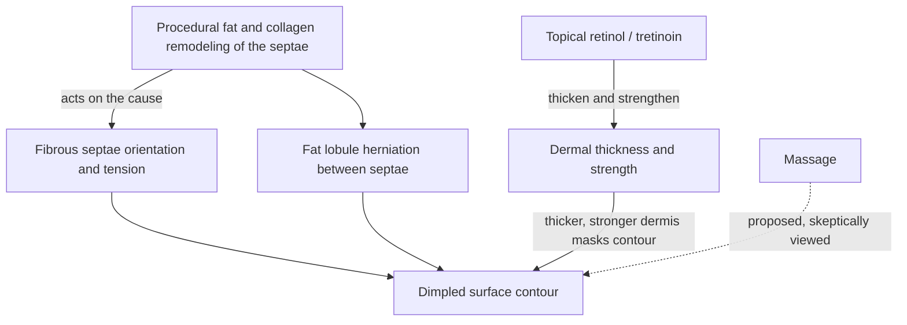

# Cellulite

Cellulite is the dimpled, bumpy surface contour most often visible on the thighs, hips, and buttocks. Its root is structural rather than a property of the skin surface: fibrous septae — the connective-tissue bands that tether skin to deeper planes — are oriented so that tension across them, combined with herniation of underlying fat lobules between the bands, draws pits into an otherwise smooth surface. This anatomy explains both why cellulite is not a hygiene, weight, or "toxin" problem and why the intervention ceiling for topicals is low: a cream can act on the dermis it reaches, but it cannot reorient septae or reposition herniated fat. (@DrDrayzday (Dr Dray) — "Anua Azelaic Acid REFORMULATED? Controversy Explained | Derm Q&A", 2026-08-22, [link](https://www.youtube.com/watch?v=1b7nGYAIktw))

## What the evidence supports

A couple of peer-reviewed clinical trials of cosmetic retinol formulations report subtle improvement in the surface appearance of cellulite — the bumpiness and dimpling — without good long-term follow-up; topical retinol or tretinoin plausibly helps by thickening and strengthening the dermis so the underlying contour telegraphs less ([[topical-retinoids]]). Meaningful change in the appearance, however, requires interventions that remodel fat and collagen more extensively and act on the fibrous septae and their orientation. Ascorbic acid has no cellulite-specific research; a collagen-support rationale makes benefit conceivable but untested ([[topical-vitamin-c]]). Massage is sometimes proposed to help; Dr Dray is skeptical of that claim while noting it is harmless. All of this is expert synthesis of a thin trial base rather than an established treatment ladder. (@DrDrayzday (Dr Dray) — "Anua Azelaic Acid REFORMULATED? Controversy Explained | Derm Q&A", 2026-08-22, [link](https://www.youtube.com/watch?v=1b7nGYAIktw))

The general lesson mirrors [[visible-skin-and-facial-aging]] and [[post-weight-loss-skin-laxity]]: name the anatomical compartment producing the visible feature before crediting a product that cannot reach it. Cellulite creams that promise transformation are selling dermal-surface effects against a septal-architecture problem.

## Practical implications

- **If treating topically: a consistent retinol or tretinoin routine on the area is the only topical with any trial support, and the expected effect is subtle surface softening — limited evidence, no long-term follow-up.** (@DrDrayzday (Dr Dray) — "Anua Azelaic Acid REFORMULATED? Controversy Explained | Derm Q&A", 2026-08-22, [link](https://www.youtube.com/watch?v=1b7nGYAIktw))
- **For meaningful contour change: expect to need procedural fat/collagen/septae remodeling, not a cream — moderate anatomical reasoning; procedure-specific evidence varies and belongs to a clinician consultation.** [[procedural-skin-remodeling]]
- **Do not buy products or programs premised on cellulite as a toxin, circulation, or hygiene problem — strong mechanism-based boundary.**

## Gaps & open questions

- How large and durable is the retinoid effect on cellulite appearance under blinded, photograph-standardized conditions?
- Does topical ascorbic acid change cellulite appearance at all?
- Does mechanical massage produce any measurable, lasting contour change beyond transient swelling?
- Which procedural approaches produce durable septae remodeling with acceptable risk, and in whom?

## Related

[[topical-retinoids]] · [[topical-vitamin-c]] · [[visible-skin-and-facial-aging]] · [[post-weight-loss-skin-laxity]] · [[procedural-skin-remodeling]] · [[skincare-evidence-and-routine-design]] · [[dr-dray]]
