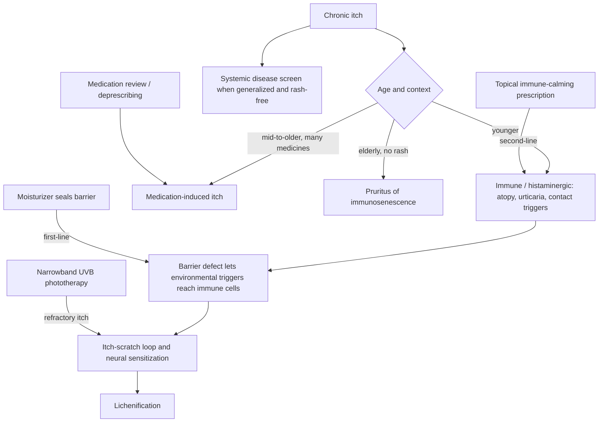

# Chronic itch and pruritus

Itch (pruritus) is a distinct sensory modality carried by dedicated cutaneous nerve fibers, not merely low-grade pain. Chronic itch is increasingly understood as primarily a neural disease in which the skin lesion, when present, is often secondary: dedicated itch fibers become activated or sensitized, and scratching — briefly relieving — perpetuates the state. The burden is severe and underrecognized; unrelenting generalized itch is described clinically as capable of driving patients to suicidality, which makes it a disease target rather than a cosmetic complaint. The old dermatologic aphorism that eczema is the itch that rashes, not the rash that itches, captures the causal order: itch and scratching produce much of the visible disease. (@maxlugavere (Max Lugavere) — "The Skin Doctor: Hair Loss, Itchy Skin, Sunscreen Myths, and Anti-Aging Truths", 2026-07-15, [link](https://www.youtube.com/watch?v=99LCstvkNVw))

## Etiologic structure by age

Clinically, chronic itch sorts into three broad buckets whose prior probabilities shift with age. In younger adults the dominant category is immune/histaminergic: atopy (hay fever, asthma, eczema), urticaria, and allergen- or irritant-triggered skin immune activation. In middle and older age, medications become a leading cause — polypharmacy is common (the transcript cites an average of 13 prescriptions among older US dermatology patients, an unverified practice observation), and itch is a frequent drug effect. In the elderly a third entity appears: pruritus of immunosenescence, itch without rash attributed to a dysregulated aging immune and nervous system — described in the transcript as phantom noise the body cannot dial down. Generalized itch without primary rash can also signal systemic disease (cholestasis, kidney disease, thyroid disease, hematologic disorders); that differential lives at [[cutaneous-signs-of-systemic-disease]]. (@maxlugavere (Max Lugavere) — "The Skin Doctor: Hair Loss, Itchy Skin, Sunscreen Myths, and Anti-Aging Truths", 2026-07-15, [link](https://www.youtube.com/watch?v=99LCstvkNVw))

Localized itch in a barrier-vulnerable site (classically ankles and lower legs) is modeled as a two-hit problem: an environmental trigger (pet dander, dust, irritants) plus a barrier defect — genetic (childhood eczema, filaggrin-type openness of the epidermal weave) or acquired dryness — that lets the trigger reach cutaneous immune cells. The treatment order follows the model: first seal the barrier with a good moisturizer; if itch persists, calm the skin immune response with a prescription topical. When scratching itself sustains the lesion the process has become [[lichen-simplex-chronicus]]. Refractory chronic itch responds to narrowband UVB phototherapy ([[uv-phototherapy]]), consistent with an immune/neural rather than purely surface mechanism. (@maxlugavere (Max Lugavere) — "The Skin Doctor: Hair Loss, Itchy Skin, Sunscreen Myths, and Anti-Aging Truths", 2026-07-15, [link](https://www.youtube.com/watch?v=99LCstvkNVw))

Mechanistic mediators beyond histamine — IL-4, IL-13, IL-31, and neural sensitization — are discussed at [[lichen-simplex-chronicus]]; much chronic itch is non-histaminergic, which is why antihistamines often fail beyond their sedative effect.

## Practical implications

- **For new persistent localized itch: moisturize consistently first (seal the barrier), reduce heat/friction/known triggers, and escalate to clinician-directed topical anti-inflammatories if it persists — moderate; mechanism-based practice relayed by dermatologists, consistent across sources.** [[skin-barrier-and-moisturization]] (@maxlugavere (Max Lugavere) — "The Skin Doctor: Hair Loss, Itchy Skin, Sunscreen Myths, and Anti-Aging Truths", 2026-07-15, [link](https://www.youtube.com/watch?v=99LCstvkNVw))
- **Generalized itch without rash, sleep-disrupting itch, or itch with systemic symptoms: seek medical evaluation including medication review — strong safety practice.** In an older adult on many medicines, a structured deprescribing review is a first-line diagnostic act, not an afterthought.
- **Do not rely on antihistamines for chronic non-urticarial itch — moderate; much chronic itch is non-histaminergic, and sedating antihistamines add falls and sleep-quality risk in older adults.**
- **For refractory diagnosed chronic itch: dermatologist-supervised narrowband UVB is an established option — moderate; see [[uv-phototherapy]].**

## Gaps & open questions

- What fraction of elderly rash-free itch is attributable to immunosenescence versus occult systemic disease or medication load, and can the entities be distinguished by biomarkers?
- Which itch mediators (IL-31, others) dominate in which phenotype, and can targeted biologics be matched prospectively?
- Does proactive barrier care in barrier-defective people prevent progression to chronic neural sensitization?
- How large is the suicide and mental-health burden of chronic pruritus, and does aggressive itch control reduce it?

## Related

[[lichen-simplex-chronicus]] · [[skin-barrier-and-moisturization]] · [[cutaneous-signs-of-systemic-disease]] · [[uv-phototherapy]] · [[immune-aging-and-rejuvenation]] · [[teo-soleymani]]
