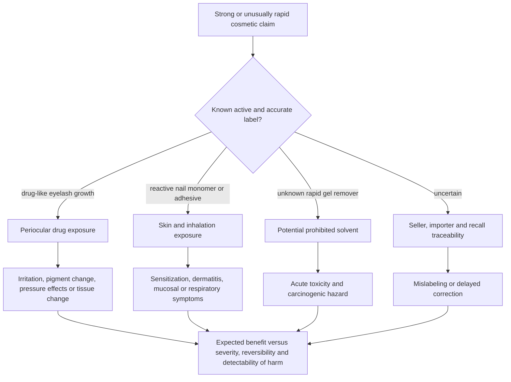

# Cosmetic product safety and regulatory gaps

Cosmetic safety depends on the chemical hazard, route and amount of exposure, formulation, labeling, manufacturing control, and the ability of a seller and regulator to identify and correct failures. A cosmetic is not necessarily inert: a product can produce a drug-like effect, sensitization, inhalation exposure, eye injury, or solvent toxicity. Conversely, the presence of a hazardous chemical does not make every use equally risky; exposure and controls determine realized risk. The practical task is to recognize products whose efficacy, route, or supply chain raises the consequence of an undisclosed ingredient or poorly controlled exposure. (@LabMuffinBeautyScience (Lab Muffin Beauty Science) — "Products I refuse to use (as a chemist)", 2025-09-08, [link](https://www.youtube.com/watch?v=Lb8DkTzFyYI))

## From product claim to realized risk

## Drug-like eyelash growth

Bimatoprost prolongs the eyelash growth phase and is an approved prescription treatment for eyelash hypotrichosis. The current U.S. label warns about eyelid and iris pigmentation, intraocular inflammation, macular edema in susceptible eyes, hair growth outside the application area, contamination, and changes in intraocular pressure; some pigment change may be long-lasting. The label also specifies upper-lid-margin application with sterile single-use applicators, making unlabeled prostaglandin-analogue serums non-equivalent to supervised use of the approved product ([FDA label](https://www.accessdata.fda.gov/drugsatfda_docs/label/2020/022369s012lbl.pdf)). Michelle Wong's contrarian safety position is that the strong efficacy of prostaglandin-analogue cosmetic lash serums should trigger drug-level informed consent rather than be hidden by ordinary beauty-retail framing. She also identifies periocular fat loss as a class concern, although that effect is not itemized in the cited 2020 eyelash-product label and its frequency for cosmetic serums was not independently established here. (@LabMuffinBeautyScience (Lab Muffin Beauty Science) — "Products I refuse to use (as a chemist)", 2025-09-08, [link](https://www.youtube.com/watch?v=Lb8DkTzFyYI))

Peptide lash serums do not provide an evidence-equivalent substitute. Wong describes them as plausibly less effective and less studied; weaker visible effect is not proof of safety, and an unlabeled product that produces unusually rapid growth raises rather than resolves concern about undeclared pharmacologic ingredients. This is a product-authenticity heuristic, not a diagnostic test. (@LabMuffinBeautyScience (Lab Muffin Beauty Science) — "Products I refuse to use (as a chemist)", 2025-09-08, [link](https://www.youtube.com/watch?v=Lb8DkTzFyYI))

## Reactive nail systems and removers

Long-wear nail coatings harden by polymerizing reactive small molecules. Once sensitization occurs, even small later exposures may provoke dermatitis; volatile material and dust can also reach the eyes and respiratory tract. Dip systems use cyanoacrylate adhesive with polymer powder, while gel and acrylic systems use different acrylate or methacrylate chemistry, so the categories should not be treated as interchangeable. NIOSH lists acrylic monomers among cosmetology exposures that can cause or trigger work-related asthma and recommends exposure control before sensitization; FDA likewise notes that residual methacrylate monomers can cause redness, swelling, pain, and contact allergy ([CDC/NIOSH](https://www.cdc.gov/niosh/asthma/hcp/exposures/index.html); [FDA](https://www.fda.gov/cosmetics/cosmetic-products/nail-care-products)). Wong's respiratory symptoms after home dip use are an attributed self-observation, not proof of “dip flu” prevalence or cause, but they align with the plausible inhalation and mucosal-exposure pathway. (@LabMuffinBeautyScience (Lab Muffin Beauty Science) — "Products I refuse to use (as a chemist)", 2025-09-08, [link](https://www.youtube.com/watch?v=Lb8DkTzFyYI))

Rapid burst-type gel removers are a clearer avoid category when they contain methylene chloride (dichloromethane). FDA prohibits methylene chloride in cosmetics at any concentration and in 2024–2025 measured roughly 77–94% in several products sold as rapid gel removers, often without accurate disclosure; FDA identifies animal carcinogenicity and likely human harm ([FDA safety notice](https://www.fda.gov/consumers/health-fraud-scams/cosmetic-products-containing-methylene-chloride)). This independently confirms the transcript's core warning, while replacing its general inference with product-specific regulator testing. (@LabMuffinBeautyScience (Lab Muffin Beauty Science) — "Products I refuse to use (as a chemist)", 2025-09-08, [link](https://www.youtube.com/watch?v=Lb8DkTzFyYI))

## Supply-chain and packaging controls

Seller provenance changes the probability that an ingredient declaration is accurate, a lot is traceable, and an adverse event leads to a recall; it does not prove that every cross-border marketplace item is unsafe or every domestic item is safe. Extra caution is proportionate for products used near the eye, products claiming conspicuous pharmacologic effects, reactive home nail systems, and formulas whose appearance is chemically inconsistent with the declared active. Suspicion based on price, appearance, or marketplace is a screening signal that should lead to verification or avoidance, not a chemical assay. (@LabMuffinBeautyScience (Lab Muffin Beauty Science) — "Products I refuse to use (as a chemist)", 2025-09-08, [link](https://www.youtube.com/watch?v=Lb8DkTzFyYI))

Packaging is part of exposure control. Orifice size, pump force, closure security, formula viscosity, and dose visibility determine whether a person can dispense a repeatable amount without leakage or accidental excess. Transferring a preserved formula to another container can introduce microbes, increase air or light exposure, or create material incompatibility; sensory change can detect some failures but cannot prove preserved potency or microbiological safety. (@LabMuffinBeautyScience (Lab Muffin Beauty Science) — "Products I refuse to use (as a chemist)", 2025-09-08, [link](https://www.youtube.com/watch?v=Lb8DkTzFyYI)) (@LabMuffinBeautyScience (Lab Muffin Beauty Science) — "I tried cult Korean skincare products so you don't have to (Stylevana AD)", 2025-10-15, [link](https://www.youtube.com/watch?v=c6vcx4LIDGA))

## Practical implications

- **Before using a prostaglandin-analogue lash product: use the approved, clinician-supervised route if treatment is worth the risks — strong for following regulator labeling.** Review eye disease, eye medications, contact lenses, pigment change, irritation, and application hygiene with the prescriber; stop and seek eye care for visual change, significant pain, inflammation, or other concerning symptoms. Do not treat an unlabeled cosmetic as equivalent to prescription bimatoprost. (@LabMuffinBeautyScience (Lab Muffin Beauty Science) — "Products I refuse to use (as a chemist)", 2025-09-08, [link](https://www.youtube.com/watch?v=Lb8DkTzFyYI))
- **At every purchase of a rapid gel remover: avoid products labeled with methylene chloride, dichloromethane, or methyl bichloride, and avoid removers with unidentified solvents — strong regulator-based precaution.** Check FDA or the relevant regulator's alerts and report suspected products or adverse events. (@LabMuffinBeautyScience (Lab Muffin Beauty Science) — "Products I refuse to use (as a chemist)", 2025-09-08, [link](https://www.youtube.com/watch?v=Lb8DkTzFyYI))
- **For home long-wear nails: ordinary polish is the lower-complexity option; reactive systems require exact label compliance, avoidance of skin contact, and effective ventilation — moderate safety rationale.** Do not admit the transcript's switch from dip to home gel as a generally safer protocol: gel also carries sensitization risk, and comparative home-user outcome evidence was not reviewed. Seek medical assessment for persistent periungual rash, eyelid or facial dermatitis, wheeze, chest tightness, or breathing difficulty. (@LabMuffinBeautyScience (Lab Muffin Beauty Science) — "Products I refuse to use (as a chemist)", 2025-09-08, [link](https://www.youtube.com/watch?v=Lb8DkTzFyYI))
- **At purchase: increase scrutiny with consequence and traceability — strong risk-management principle.** For periocular, high-potency, reactive, or unusually fast-acting products, prefer a traceable seller and complete standardized label; check lot, seal, recalls, and regulator notices. Low price or foreign origin alone is not evidence of danger. (@LabMuffinBeautyScience (Lab Muffin Beauty Science) — "Products I refuse to use (as a chemist)", 2025-09-08, [link](https://www.youtube.com/watch?v=Lb8DkTzFyYI))
- **At each use: reject packaging that makes controlled dosing or secure closure unreliable — moderate usability and exposure-control principle.** Replace the product if possible rather than routinely decanting it; if transfer is unavoidable, use a clean compatible container and discard the product after a material change in odor, color, texture, separation, or performance, recognizing that no sensory check guarantees safety. (@LabMuffinBeautyScience (Lab Muffin Beauty Science) — "Products I refuse to use (as a chemist)", 2025-09-08, [link](https://www.youtube.com/watch?v=Lb8DkTzFyYI))

## Evidence conflicts

- The transcript recommends a reputable home gel kit instead of dip for a coordinated user. Current official sources confirm sensitization and respiratory concerns across artificial-nail chemistry but do not establish that home gel has lower net harm than home dip. Coral therefore preserves the comparison as Wong's position and recommends exposure minimization rather than a category substitution.
- The transcript presents periocular fat loss as a prostaglandin-analogue lash-serum effect. The reviewed FDA eyelash-product label confirms several ocular and pigment risks but does not list fat atrophy; route-specific incidence and reversibility remain unresolved here.

## Gaps & open questions

- What are the incidence, dose-response, and reversibility of periocular fat change from prescription bimatoprost versus unapproved prostaglandin-analogue lash serums?
- How often do cosmetic lash serums contain undeclared pharmacologic ingredients, and which jurisdictions test them systematically?
- What are comparative sensitization and respiratory-event rates for home dip, gel, acrylic, adhesive, and ordinary-polish systems under real use?
- Which marketplace, importer, and fulfillment structures most reliably predict ingredient accuracy and recall traceability?
- Which packaging usability tests predict accidental overdose, contamination, leakage, and abandonment in actual consumers?

## Related

[[skincare-evidence-and-routine-design]] · [[skin-barrier-and-moisturization]] · [[hair-loss-diagnosis-and-scalp-health]] · [[topical-retinoids]] · [[photoprotection]] · [[michelle-wong]]
