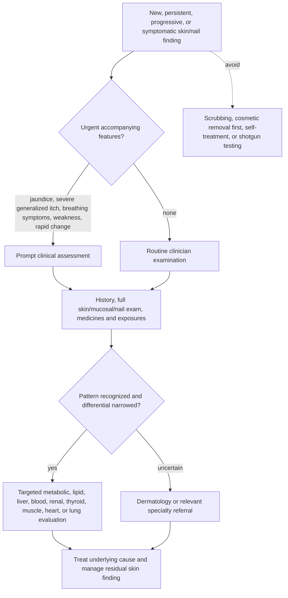

# Cutaneous signs of systemic disease

Skin, mucosa, hair, and nails can display consequences of metabolic, hematologic, hepatic, renal, endocrine, autoimmune, cardiac, or pulmonary disease. These findings are **clinical clues, not diagnoses**: prevalence and specificity differ, several have benign mimics, and the same internal disease may produce none of them. Their value is to trigger proportionate history, examination, and targeted testing—not internet self-diagnosis or indiscriminate laboratory panels. (@DrDrayzday (Dr Dray) — "7 Skin Signs That Could Reveal a Health Problem | Dermatologist Explains", 2026-08-26, [link](https://www.youtube.com/watch?v=QKDlc1r8fQk))

## From visible finding to diagnostic decision

## Metabolic and lipid clues

**Acanthosis nigricans** is a dark-appearing, thick, velvety plaque often found on the posterior neck or in folds. Hyperinsulinemia and insulin-like-growth-factor signaling can stimulate keratinocyte proliferation, making it an important clue to insulin resistance, although the visual finding is not itself a glucose test and has other causes. It is not dirt and aggressive scrubbing or exfoliation can irritate it. Treating the metabolic driver may limit progression, but visible thickening can persist; keratolytics or topical retinoids may modestly alter texture without correcting the cause. (@DrDrayzday (Dr Dray) — "7 Skin Signs That Could Reveal a Health Problem | Dermatologist Explains", 2026-08-26, [link](https://www.youtube.com/watch?v=QKDlc1r8fQk)) [[insulin-resistance]]

A second dermatologist source confirms acanthosis nigricans as the highest-yield metabolic clue — patients present asking to clean dirt off the neck, and the finding alone marks the person as at minimum pre-diabetic pending testing — and adds **skin tags** as a related signal with an important qualifier: most skin tags are hereditary and harmless, but an abundance of new, quickly multiplying tags coinciding with weight gain suggests insulin-resistant drive. The proposed shared mechanism is hyperinsulinemia raising insulin-like growth factor 1, a growth signal for benign proliferations and implicated in some tumors — mechanistically coherent, though the tag-growth-rate threshold is clinical heuristic rather than validated criterion. The same source reports acne, psoriasis, and eczema flaring with dietary deterioration (his recurring example: students during exams), treated here as practice observation ([[insulin-resistance]], [[diet-and-inflammatory-skin-disease]]). (@maxlugavere (Max Lugavere) — "The Skin Doctor: Hair Loss, Itchy Skin, Sunscreen Myths, and Anti-Aging Truths", 2026-07-15, [link](https://www.youtube.com/watch?v=99LCstvkNVw))

**Xanthelasma** describes yellow lipid-laden plaques around the eyelids; **xanthomas** elsewhere may be papular, nodular, or eruptive. They can accompany cholesterol or triglyceride disorders but can also occur with normal measured lipids, so appearance neither proves nor excludes dyslipidemia. New eruptive lesions warrant medication and lipid review. A case report from the transcript source illustrates the eruptive end: a young man on a strict carnivore diet presented with severe hand xanthomas from circulating lipid extreme enough to visibly alter his drawn blood — a single anecdote, but a concrete reminder that new xanthomas are a laboratory referral, not a cosmetic complaint. (@maxlugavere (Max Lugavere) — "The Skin Doctor: Hair Loss, Itchy Skin, Sunscreen Myths, and Anti-Aging Truths", 2026-07-15, [link](https://www.youtube.com/watch?v=99LCstvkNVw)) Cosmetic destruction around the eye carries scar and pigment risk, and lesions may recur unless an underlying driver is addressed. The transcript additionally suggests an isotretinoin–diet interaction causing eruptive xanthomas, but supplies no case details or comparative evidence; treat that causal claim as unverified rather than as dietary guidance. (@DrDrayzday (Dr Dray) — "7 Skin Signs That Could Reveal a Health Problem | Dermatologist Explains", 2026-08-26, [link](https://www.youtube.com/watch?v=QKDlc1r8fQk))

## Pigment, nail, muscle, and itch patterns

**Jaundice** is bilirubin deposition visible in skin and especially sclera or oral mucosa. Bilirubin may accumulate from increased red-cell breakdown, impaired hepatic processing, or obstructed bile flow; the finding therefore locates a pathway failure but not its cause. Carotenemia from high carotenoid intake can color skin yellow-orange while sparing the sclera, but a lay visual distinction should not delay evaluation of new scleral yellowing. (@DrDrayzday (Dr Dray) — "7 Skin Signs That Could Reveal a Health Problem | Dermatologist Explains", 2026-08-26, [link](https://www.youtube.com/watch?v=QKDlc1r8fQk))

**Digital clubbing** combines bulbous distal fingers with increased nail curvature and altered nail-fold angle. It can accompany pulmonary, cardiac, congenital, inflammatory, malignant, and other disorders; the transcript's explanation as simply abnormal oxygen is incomplete because clubbing can occur without chronic hypoxemia. New clubbing merits evaluation rather than cosmetic treatment. **Koilonychia** is a thin, concave or spoon-shaped nail and can be associated with iron deficiency, but is not specific and may be physiologic in infancy. Reduced intake during weight-loss pharmacotherapy is a reason to assess nutritional adequacy, not proof that a GLP-1 receptor agonist caused iron deficiency. (@DrDrayzday (Dr Dray) — "7 Skin Signs That Could Reveal a Health Problem | Dermatologist Explains", 2026-08-26, [link](https://www.youtube.com/watch?v=QKDlc1r8fQk)) [[glp-1-receptor-agonists]]

**Dermatomyositis** may produce a violaceous eyelid eruption, Gottron papules over the knuckles, periungual capillary changes, and proximal muscle weakness such as difficulty raising the arms or rising from a chair. Clinically amyopathic variants can have characteristic skin disease without evident weakness, so absence of weakness does not dismiss the pattern. Diagnosis matters because this is systemic autoimmune disease rather than an isolated cosmetic rash. (@DrDrayzday (Dr Dray) — "7 Skin Signs That Could Reveal a Health Problem | Dermatologist Explains", 2026-08-26, [link](https://www.youtube.com/watch?v=QKDlc1r8fQk))

**Generalized pruritus with little or no primary rash** can reflect xerosis or medication effects but also cholestatic liver disease, kidney disease, thyroid disease, iron or other hematologic disorders, and malignancy. New water-triggered severe itch is a recognized clue in some blood disorders, but it is not diagnostic of blood cancer. Sleep disruption, constitutional symptoms, jaundice, or persistent generalized itch raise the need for prompt assessment. (@DrDrayzday (Dr Dray) — "7 Skin Signs That Could Reveal a Health Problem | Dermatologist Explains", 2026-08-26, [link](https://www.youtube.com/watch?v=QKDlc1r8fQk)) [[lichen-simplex-chronicus]]

## Practical implications

- **When sclera become yellow, generalized itch is severe or new, proximal weakness accompanies a characteristic rash, or new clubbing appears: seek prompt clinical assessment—strong safety principle.** Urgency depends on accompanying pain, fever, confusion, bleeding, breathing difficulty, or rapid progression. (@DrDrayzday (Dr Dray) — "7 Skin Signs That Could Reveal a Health Problem | Dermatologist Explains", 2026-08-26, [link](https://www.youtube.com/watch?v=QKDlc1r8fQk))
- **For a new persistent velvety fold plaque, xanthoma, spoon nail, or unexplained generalized itch: arrange diagnosis-led evaluation rather than cosmetic removal or self-ordered broad panels—moderate-to-strong clinical principle.** Testing should follow the differential and the person's medicines, symptoms, and risk. (@DrDrayzday (Dr Dray) — "7 Skin Signs That Could Reveal a Health Problem | Dermatologist Explains", 2026-08-26, [link](https://www.youtube.com/watch?v=QKDlc1r8fQk))
- **Before a planned full skin examination: make nails and skin accessible when feasible—common-sense examination practice, not outcome-trial evidence.** Remove nail polish or artificial coverings if the nails are part of the concern, and bring photographs showing evolution. (@DrDrayzday (Dr Dray) — "7 Skin Signs That Could Reveal a Health Problem | Dermatologist Explains", 2026-08-26, [link](https://www.youtube.com/watch?v=QKDlc1r8fQk))

## Gaps & open questions

- What are the sensitivity, specificity, and predictive values of each sign in primary care and dermatology populations?
- Which combinations of morphology, symptoms, medicines, age, and background skin tone most efficiently direct testing?
- How often do automated images or teledermatology miss color and texture changes across skin tones?
- After an underlying disorder is controlled, which residual skin or nail findings resolve, over what time, and which treatments add benefit?

## Related

[[insulin-resistance]] · [[proactive-health-monitoring]] · [[lichen-simplex-chronicus]] · [[glp-1-receptor-agonists]] · [[hair-loss-diagnosis-and-scalp-health]] · [[chronic-itch-and-pruritus]] · [[dr-dray]] · [[teo-soleymani]] · [[practice-playbook]]
