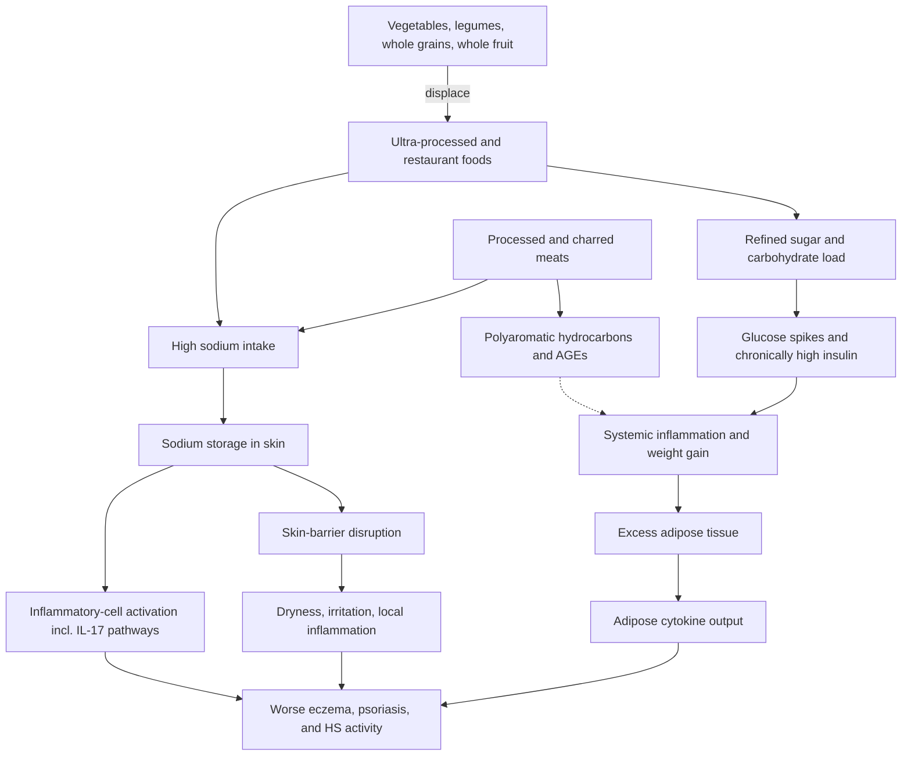

# Diet and inflammatory skin disease

Dietary pattern can influence the trajectory of chronic inflammatory skin diseases — eczema (atopic dermatitis), psoriasis, and hidradenitis suppurativa — but no single anti-inflammatory diet cures them, and with rare exceptions dietary change does not remove the need for medical treatment. The mechanistically supported inputs are specific: sodium that accumulates in skin and engages inflammatory pathways, refined sugars and carbohydrates acting through glucose–insulin dynamics, processed meats carrying sodium plus combustion and glycation products, and excess adipose tissue as an inflammatory organ. The unit of action is the overall eating pattern, not a single feared macronutrient or a forbidden food. (@DrDrayzday (Dr Dray) — "Your Diet Could Be Making Your Skin Inflammation Worse", 2026-08-25, [link](https://www.youtube.com/watch?v=kwdfMqF6SSk))

## Sodium: a skin-specific inflammatory input

Sodium's harms are usually framed cardiovascularly, but the body can store excess sodium in the skin, and skin-accumulated sodium can activate inflammatory cell types and promote inflammatory pathways — notably those involving interleukin-17, a key axis in psoriasis with dedicated drug targets ([[psoriasis-and-systemic-inflammation]]). High-sodium diets are also described as disruptive to the skin barrier, predisposing to dryness, rough texture, irritation, and local inflammation that aggravates conditions with an already-impaired barrier: acne, rosacea, and atopic dermatitis ([[skin-barrier-and-moisturization]]). (@DrDrayzday (Dr Dray) — "Your Diet Could Be Making Your Skin Inflammation Worse", 2026-08-25, [link](https://www.youtube.com/watch?v=kwdfMqF6SSk))

The human evidence has recently strengthened for eczema. A large study published in JAMA Dermatology, as described in the source, associated each 1 g increase in sodium excretion with an 11% increase in the risk of an eczema diagnosis, a 16% higher likelihood of an active flare, and an 11% increase in overall disease severity. This is association, not proof that salt causes eczema, and it is explicitly not a recommendation to eliminate sodium — but it fits the mechanistic picture of sodium acting on skin immunity and barrier function. (@DrDrayzday (Dr Dray) — "Your Diet Could Be Making Your Skin Inflammation Worse", 2026-08-25, [link](https://www.youtube.com/watch?v=kwdfMqF6SSk))

The dominant sodium sources are structural, not the salt shaker: ultra-processed convenience foods, fast food and restaurant meals, deli and packaged meats, sauces, soups, canned goods, snack foods, and shelf-stable bread. These same foods bundle refined carbohydrates and low-quality fats, so daily reliance on them stacks several inflammatory inputs at once. Two practical frictions deserve naming: most people have no idea of their intake (a few days of diet-app tracking reveals it), and sodium reduction initially makes food taste bland because taste adapts to high salt — an effect that reverses over a couple of weeks, after which food tastes better and more satiating at lower salt levels. (@DrDrayzday (Dr Dray) — "Your Diet Could Be Making Your Skin Inflammation Worse", 2026-08-25, [link](https://www.youtube.com/watch?v=kwdfMqF6SSk))

## Refined carbohydrate, and the one-macronutrient trap

Ultra-processed refined carbohydrate — sugar-sweetened snacks, sweetened cereals, pastries, desserts, fast food, and highly processed grain products like white bread — produces rapid glucose and insulin excursions, and chronically elevated insulin over time damages overall health, inflammation, and body weight, which is the relevance to inflammatory skin disease ([[free-sugars-and-glycemic-response]], [[insulin-resistance]]). The instructive history is the low-fat era: when dietary fat was demonized, the food industry replaced fat with refined sugar and carbohydrate in equally caloric products marketed as healthy, calorie intake rose while activity fell, and insulin resistance, diabetes, and obesity followed. The lesson cuts both ways — centering dietary advice on any single macronutrient invites the same substitution failure in reverse (carbohydrate-fearing consumers swapping to equally processed high-sodium foods), and food-industry health claims on otherwise unhealthy products remain a standing hazard ([[food-label-literacy-and-health-halos]]). Whole-food carbohydrates — whole grains, beans, legumes — are not the enemy, and whole fruit should not be eliminated in pursuit of low glycemic load: its sugars arrive with fiber and micronutrients that temper the glycemic response. Even potatoes are "guilty by association" with their fried, salted preparations; baked, boiled, mashed, or steamed, they are nutritious and satiating. (@DrDrayzday (Dr Dray) — "Your Diet Could Be Making Your Skin Inflammation Worse", 2026-08-25, [link](https://www.youtube.com/watch?v=kwdfMqF6SSk))

Processed meats — deli meats, smoked meats, hot dogs, bacon, sausage — contribute substantial sodium plus additional inflammatory and carcinogenic compounds: heavily charred or smoked meats carry a high burden of polyaromatic hydrocarbons, and high-heat preparation generates advanced glycation end products ([[advanced-glycation-end-products]], [[heme-iron-and-colorectal-cancer]]). For continued meat eating, the source's harm-reduction advice is self-prepared meat, stewed rather than charred, with vinegar-based marinades to reduce AGE formation. (@DrDrayzday (Dr Dray) — "Your Diet Could Be Making Your Skin Inflammation Worse", 2026-08-25, [link](https://www.youtube.com/watch?v=kwdfMqF6SSk))

Disease-specific diet evidence — weight loss, Mediterranean pattern, and the dairy and brewer's-yeast elimination signals in hidradenitis suppurativa — lives at [[hidradenitis-suppurativa]]; the fiber–microbiome arm of the diet–skin relationship lives at [[fiber-gut-skin-axis]].

## Acne and the dairy question

The common instruction to cut dairy for acne gets the causal unit wrong, according to skin cancer surgeon Teo Soleymani. He describes a US study (attributed to Pennsylvania; not independently located for this page) finding that non-fat dairy products flared acne while full-fat, less-processed dairy did not, and attributes the difference to emulsifiers and gums added to fat-free products to restore mouthfeel — additives he says measurably spike insulin, feeding the same insulin/IGF-1 axis implicated elsewhere on this page. If correct, the acne trigger is the processing additive, not dairy fat, which parallels this page's low-fat-era lesson: removing a feared macronutrient invited compensatory formulation that was worse than the original. The direction (skim milk associating with acne more than whole milk) matches the published dairy–acne literature; the specific emulsifier-insulin mechanism is his interpretation and remains unverified. Treat as limited, mechanistically interesting evidence for choosing less-processed dairy rather than eliminating dairy in acne. (@maxlugavere (Max Lugavere) — "The Skin Doctor: Hair Loss, Itchy Skin, Sunscreen Myths, and Anti-Aging Truths", 2026-07-15, [link](https://www.youtube.com/watch?v=99LCstvkNVw))

The same source strengthens this page's psoriasis and eczema framing from clinical practice: he describes weight loss and an anti-inflammatory dietary shift improving psoriasis without medication in some patients — something he says dermatology could not have fathomed twenty years ago — and diet-responsive improvement in a significant minority of eczema. These are practice observations consistent with the trial-supported weight-loss evidence at [[hidradenitis-suppurativa]] and the systemic framing at [[psoriasis-and-systemic-inflammation]]; they do not change this page's rule that diet is adjunctive to medical treatment. (@maxlugavere (Max Lugavere) — "The Skin Doctor: Hair Loss, Itchy Skin, Sunscreen Myths, and Anti-Aging Truths", 2026-07-15, [link](https://www.youtube.com/watch?v=99LCstvkNVw))

## Interpreting cure testimonies

Online testimony of diet curing a chronic disease deserves a specific differential: provisional diagnoses made from laboratory work that later normalizes, diseases with temporary states that spontaneously remit, and autoimmune markers that rise transiently in unrelated circumstances all produce sincere I-was-cured stories in which the disease may never have been present or was destined to remit untreated. The source affirms that diet-responsive cases do occur while insisting nobody can predict who they will be — the reason dietary change is layered on top of, not substituted for, medical therapy ([[health-misinformation-and-media-incentives]]). (@DrDrayzday (Dr Dray) — "Your Diet Could Be Making Your Skin Inflammation Worse", 2026-08-25, [link](https://www.youtube.com/watch?v=kwdfMqF6SSk))

## Practical implications

- **Daily: eat vegetables at every meal where possible, legumes (beans, lentils, chickpeas) every day, and choose whole grains and minimally processed starches over refined ones — moderate for inflammatory and cardiometabolic benefit; limited for direct skin-disease endpoints.** Include a few servings of whole fruit daily rather than fearing its sugar. (@DrDrayzday (Dr Dray) — "Your Diet Could Be Making Your Skin Inflammation Worse", 2026-08-25, [link](https://www.youtube.com/watch?v=kwdfMqF6SSk))
- **Once, then as needed: track sodium intake with a diet app for a few days to expose the real number, then cut the ultra-processed and restaurant sources rather than home seasoning — moderate for blood pressure, limited-and-associational for eczema outcomes.** Expect about two weeks of bland-tasting food before taste adapts. (@DrDrayzday (Dr Dray) — "Your Diet Could Be Making Your Skin Inflammation Worse", 2026-08-25, [link](https://www.youtube.com/watch?v=kwdfMqF6SSk))
- **Ongoing: minimize processed meats; when eating meat, prepare it yourself, favor stewing over charring, and consider vinegar-based marinades — moderate for carcinogen and AGE exposure reduction; skin-disease benefit unmeasured.** (@DrDrayzday (Dr Dray) — "Your Diet Could Be Making Your Skin Inflammation Worse", 2026-08-25, [link](https://www.youtube.com/watch?v=kwdfMqF6SSk))
- **For diagnosed eczema, psoriasis, or HS: keep dietary change adjunctive to medical treatment, and do not adopt unsupervised elimination diets — strong safety principle.** (@DrDrayzday (Dr Dray) — "Your Diet Could Be Making Your Skin Inflammation Worse", 2026-08-25, [link](https://www.youtube.com/watch?v=kwdfMqF6SSk))

## Gaps & open questions

- Does sodium restriction causally improve eczema incidence, flares, or severity in randomized trials, and is there a dose threshold?
- How much of the sodium–eczema association is confounded by the ultra-processed food matrix it travels in?
- Do skin-sodium measurements (rather than intake or excretion) predict disease activity or treatment response?
- Which patients with inflammatory skin disease benefit most from glycemic-load reduction, and on what timescale?
- Do the emulsifiers and gums in fat-free dairy products raise insulin or flare acne when tested directly, or is the skim-milk–acne association carried by something else?

## Related

[[hidradenitis-suppurativa]] · [[psoriasis-and-systemic-inflammation]] · [[fiber-gut-skin-axis]] · [[free-sugars-and-glycemic-response]] · [[advanced-glycation-end-products]] · [[food-label-literacy-and-health-halos]] · [[nutrition-evidence-and-personalization]] · [[insulin-resistance]] · [[skin-barrier-and-moisturization]] · [[health-misinformation-and-media-incentives]] · [[dr-dray]] · [[teo-soleymani]] · [[practice-playbook]]
