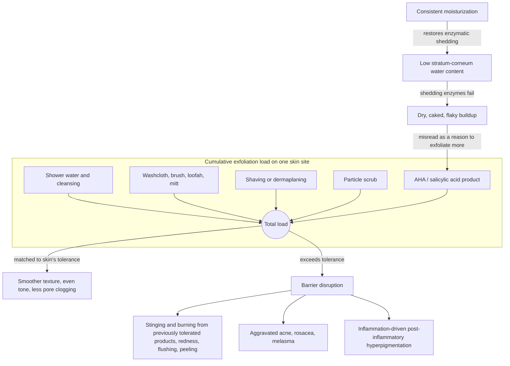

# Exfoliation and desquamation

Desquamation is the skin's continuous, self-regulating shedding of dead surface cells (corneocytes) from the outermost epidermis. Exfoliation is any deliberate acceleration of that process. Because the baseline process is already built in, exfoliation is an optional adjustment, not a maintenance requirement: having skin is not, by itself, a reason to exfoliate. Where it helps, exfoliation smooths surface texture, evens apparent tone, hastens clearance of superficial (upper-epidermal) pigment, reduces pore clogging relevant to comedonal acne, and improves the rough follicular buildup of [[keratosis-pilaris]]. Where the process is already adequate, adding exfoliation mainly adds irritation risk. (@DrDrayzday (Dr Dray) — "How Often Should You Really Exfoliate Your Skin?", 2026-09-02, [link](https://www.youtube.com/watch?v=bLDs-KM0F1o))

## Two routes, one budget

Chemical exfoliation loosens the bonds between shedding corneocytes. The alpha-hydroxy acids — glycolic, lactic, mandelic ([[alpha-hydroxy-acids]]) — act broadly at the surface, while oil-soluble salicylic acid (a beta-hydroxy acid) localizes into the pore, which is why it suits blackheads, whiteheads, and acne-adjacent goals. Retinoids sit outside the category proper: a topical retinoid or cosmetic retinol/retinaldehyde does not directly exfoliate but normalizes the rate at which the epidermis matures, so cells arrive at the surface and shed more uniformly — reducing the need to exfoliate ([[topical-retinoids]]). Within a chemical exfoliant, concentration mainly trades speed against tolerability: lower percentages are gentler and slower, higher percentages faster but more drying and irritating, and for home-safe products the end result is largely the same — the strongest option is not a requirement. (@DrDrayzday (Dr Dray) — "How Often Should You Really Exfoliate Your Skin?", 2026-09-02, [link](https://www.youtube.com/watch?v=bLDs-KM0F1o))

Mechanical exfoliation removes shedding cells by friction — and most of it is unlabeled. Scrubs, brushes, loofahs, and exfoliating mitts are the obvious cases; washcloths at light-to-medium pressure, shaving (which planes off surface cells along with hair), dermaplaning, microdermabrasion, and even shower water beating on the skin and ordinary cleansing all advance the same process. This is the source's central teaching point: people over-exfoliate not because any single step is extreme but because they fail to count the exfoliation already embedded in their routine. Showering, using a washcloth, shaving, following with a scrub, and finishing with an exfoliating acid lotion stacks five accelerations of the same process onto one skin site in one session. (@DrDrayzday (Dr Dray) — "How Often Should You Really Exfoliate Your Skin?", 2026-09-02, [link](https://www.youtube.com/watch?v=bLDs-KM0F1o))

## Moisturization is the upstream lever

The enzymes that maintain the barrier and separate surface corneocytes are water-dependent: when stratum-corneum water content drops, shedding stalls and cells accumulate as rough, flaky, caked-on texture. Consistent moisturization keeps that machinery working, which is why it both improves texture and reduces the need to exfoliate at all — and why regular moisturizing also softens the appearance of uneven pigment through light scattering ([[skin-barrier-and-moisturization]]). The characteristic error runs the loop backward: flaky patches are read as a cue to exfoliate, when flaking is the sign of desquamation failing for lack of water, and exfoliating it produces more barrier damage and more flaking. The retinoid-peeling case makes the rule concrete — for tretinoin flakes, a little mineral or facial oil rubbed over the flakes dislodges them while lubricating the surface, followed by moisturizer, rather than an acid or scrub that removes today's flakes at the cost of tomorrow's. (@DrDrayzday (Dr Dray) — "How Often Should You Really Exfoliate Your Skin?", 2026-09-02, [link](https://www.youtube.com/watch?v=bLDs-KM0F1o))

## Frequency: no universal schedule exists

There is no correct exfoliation frequency; the tolerable and useful dose depends on skin type, body site, climate, concurrent conditions, and everything else in the routine. Many chemical exfoliant products can be used up to twice daily as tolerated; mechanical frequency depends on site, pressure, and tool; some people benefit from once or twice weekly; and some skin needs no added exfoliation at all — in the source's phrasing, "if it's not broken, don't fix it." Introduction should be conservative — one method, watched for response — and daily-shaved areas (legs, face) warrant particular caution before layering any additional exfoliant. The source is equally explicit against the opposite dogma: neither daily exfoliation nor blanket prohibition earns "extra credit"; the response of the individual's skin is the arbiter. (@DrDrayzday (Dr Dray) — "How Often Should You Really Exfoliate Your Skin?", 2026-09-02, [link](https://www.youtube.com/watch?v=bLDs-KM0F1o))

Over-exfoliation announces itself: previously tolerated products begin to sting or burn, the face reddens or flushes after application, and underlying conditions flare — acne, rosacea worsen, and the inflammation drives new pigment, worsening post-inflammatory hyperpigmentation and the notoriously irritation-sensitive melasma ([[hyperpigmentation-and-dark-spots]]). Recovery is simplification: stop exfoliating products for a period, shift to thicker barrier-supporting creams, optionally add a soothing hydrating serum or toner with anti-inflammatory ingredients such as niacinamide or licorice root, and hold a bare cleanse–moisturize–sunscreen routine for a few weeks, after which things typically settle. (@DrDrayzday (Dr Dray) — "How Often Should You Really Exfoliate Your Skin?", 2026-09-02, [link](https://www.youtube.com/watch?v=bLDs-KM0F1o))

## Aging and menopause shift the balance in both directions

With menopause, declining estrogen reduces natural moisturizing factor production, compromises barrier function, and thins both epidermis and dermis, so water content falls and dry, rough buildup becomes more likely — the mechanistic basis for the common advice that women in their forties and beyond must exfoliate. The source reframes that advice: moisturizer comes first, because it addresses the water deficit driving the buildup, and an alpha-hydroxy acid is a reasonable addition for some — it is a humectant at baseline, loosens the accumulated dry cell heaps, and depending on formulation can improve skin thickness ([[alpha-hydroxy-acids]]) — while other women, particularly the many with rosacea, tolerate less exfoliation after menopause, not more, because the same changes make skin more sensitive and fragile ([[visible-skin-and-facial-aging]]). A must-exfoliate rule for aging skin therefore has the same defect as every universal schedule. (@DrDrayzday (Dr Dray) — "How Often Should You Really Exfoliate Your Skin?", 2026-09-02, [link](https://www.youtube.com/watch?v=bLDs-KM0F1o))

## Practical implications

All items below are dermatologist expert practice grounded in established barrier physiology; none is backed by frequency-comparison trials in the supplied source.

- **Before adding any exfoliant: count the exfoliation already in the routine — shaving, washcloth, shower, cleanser, existing acids — and treat it as one budget per skin site.** Introduce at most one new method conservatively and judge by response. (@DrDrayzday (Dr Dray) — "How Often Should You Really Exfoliate Your Skin?", 2026-09-02, [link](https://www.youtube.com/watch?v=bLDs-KM0F1o))
- **For flaky, dry, rough patches: moisturize first; do not exfoliate flakes.** Flaking signals stalled water-dependent shedding; for retinoid peeling, use a bland oil to dislodge flakes, then moisturizer. (@DrDrayzday (Dr Dray) — "How Often Should You Really Exfoliate Your Skin?", 2026-09-02, [link](https://www.youtube.com/watch?v=bLDs-KM0F1o))
- **Ongoing: keep whatever frequency delivers the desired result without stinging, burning, redness, or disease flare — from twice daily (some chemical products, as tolerated) to never.** New stinging from previously tolerated products is the signal to cut frequency and extent. (@DrDrayzday (Dr Dray) — "How Often Should You Really Exfoliate Your Skin?", 2026-09-02, [link](https://www.youtube.com/watch?v=bLDs-KM0F1o))
- **Do not stack exfoliants — e.g., shaving the face plus a glycolic toner plus a salicylic cream — and be doubly cautious on daily-shaved sites; more products means more irritation risk.** (@DrDrayzday (Dr Dray) — "How Often Should You Really Exfoliate Your Skin?", 2026-09-02, [link](https://www.youtube.com/watch?v=bLDs-KM0F1o))
- **After over-exfoliation: stop exfoliants, hold a cleanse–moisturize–sunscreen routine with richer barrier creams (optionally niacinamide or licorice-root soothers) for a few weeks.** (@DrDrayzday (Dr Dray) — "How Often Should You Really Exfoliate Your Skin?", 2026-09-02, [link](https://www.youtube.com/watch?v=bLDs-KM0F1o))
- **Postmenopausal rough, dry skin: moisturizer is the first-line response; an AHA is a reasonable optional addition for those who tolerate it, not a universal must.** (@DrDrayzday (Dr Dray) — "How Often Should You Really Exfoliate Your Skin?", 2026-09-02, [link](https://www.youtube.com/watch?v=bLDs-KM0F1o))

## Gaps & open questions

- No trial evidence in this corpus compares exfoliation frequencies on texture, pigment, or acne endpoints, so every cadence above is tolerability-guided practice rather than an optimized dose.
- What is the quantitative contribution of shaving, washcloth use, cleansing, and shower-water friction to total desquamation — is the "hidden load" model measurable?
- Which skin types or conditions derive durable benefit from added exfoliation versus moisturization alone, and can responders be identified in advance?
- Does exfoliation meaningfully accelerate clearance of superficial hyperpigmentation net of its irritation-driven pigment risk, and in which skin tones does the trade-off invert?
- How do menopause-related barrier changes shift the tolerable exfoliation dose, and does hormone therapy change it back?

## Related

[[skin-barrier-and-moisturization]] · [[alpha-hydroxy-acids]] · [[topical-retinoids]] · [[skincare-evidence-and-routine-design]] · [[keratosis-pilaris]] · [[hyperpigmentation-and-dark-spots]] · [[visible-skin-and-facial-aging]] · [[topical-visible-aging-interventions]] · [[dr-dray]] · [[practice-playbook]]
