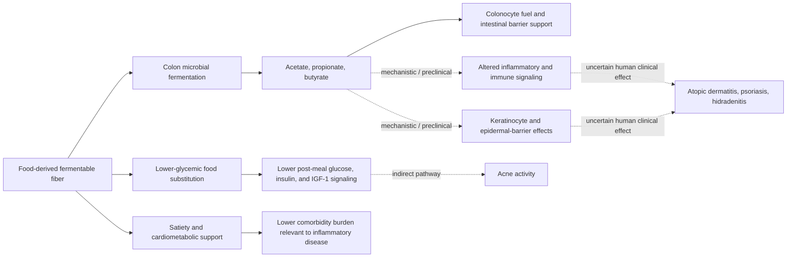

# Fiber and the gut–skin axis

The gut–skin axis is the proposed two-way coupling among diet, intestinal microbes and barrier function, systemic immune and metabolic signals, and skin cells. Dietary fiber is one candidate input because fiber that escapes small-intestinal digestion reaches the colon, where selected microbes ferment it into short-chain fatty acids (SCFAs), principally acetate, propionate, and butyrate. Colonocytes use butyrate as fuel; SCFAs may also modify immune signaling and interact with epidermal keratinocytes. The existence of these steps does not establish that adding fiber treats a skin disease. (@DrDrayzday (Dr Dray) — "Can Eating More Fiber Improve Your Skin? | Dermatologist Explains", 2026-08-27, [link](https://www.youtube.com/watch?v=FzrowYqQnnE)) [[dietary-fiber]]

## Proposed pathways and evidence boundaries

Atopic dermatitis and psoriasis cohorts show differences in gut microbial composition, but cross-sectional dysbiosis cannot tell whether microbes cause disease, result from disease or treatment, or track diet and other confounders. Fiber or SCFA administration reduces inflammatory skin phenotypes in some animal models; these experiments strengthen plausibility, not human treatment efficacy. The transcript identifies no large human trial showing that a specified fiber dose clears eczema, psoriasis, or hidradenitis suppurativa. Dr Dray's bounded position is that fiber-rich eating may support general and skin health but should not replace standard therapy, and abruptly stopping medication without supervision can cause harm. (@DrDrayzday (Dr Dray) — "Can Eating More Fiber Improve Your Skin? | Dermatologist Explains", 2026-08-27, [link](https://www.youtube.com/watch?v=FzrowYqQnnE))

The acne pathway may be more metabolic than microbiome-specific. Replacing refined carbohydrates with intact fiber-rich foods can lower dietary glycemic load and the resulting insulin and insulin-like-growth-factor signaling that can promote acne-related processes. This is a food-substitution claim, not evidence that an isolated fiber supplement clears acne. Likewise, the cardiometabolic benefits of a fiber-rich pattern matter to psoriasis because psoriasis carries systemic inflammatory and cardiovascular comorbidity, but improving a shared risk factor is not the same as treating plaques. (@DrDrayzday (Dr Dray) — "Can Eating More Fiber Improve Your Skin? | Dermatologist Explains", 2026-08-27, [link](https://www.youtube.com/watch?v=FzrowYqQnnE)) [[free-sugars-and-glycemic-response]] [[inflammaging-and-il-6]]

## Food pattern, dose, and tolerance

The label Mediterranean diet is useful only when translated into foods and substitutions. Dr Dray objects to the label's vagueness and to industry products that borrow a health halo while retaining a low-satiety, highly processed matrix. The relevant pattern here emphasizes vegetables, fruit, legumes, whole grains, nuts, seeds, fish, and olive oil while limiting highly processed foods; its effects cannot be assigned to fiber alone because water, micronutrients, polyphenols, fats, energy density, and food displacement change together. (@DrDrayzday (Dr Dray) — "Can Eating More Fiber Improve Your Skin? | Dermatologist Explains", 2026-08-27, [link](https://www.youtube.com/watch?v=FzrowYqQnnE)) [[food-label-literacy-and-health-halos]] [[nutrition-evidence-and-personalization]]

The source gives 25–38 g/day as a common adult range but also notes that needs vary by age and sex. That transcript-level range was not independently checked against current guidance here. Rapid increases can cause gas, bloating, pain, and altered bowel function; fortified low-water products and supplements do not reproduce the complete matrix of legumes, fruit, vegetables, whole grains, nuts, and seeds. Adequate fluid and gradual adaptation matter, while gastrointestinal disease, obstruction risk, swallowing difficulty, or a prescribed low-fiber diet requires individualized advice. (@DrDrayzday (Dr Dray) — "Can Eating More Fiber Improve Your Skin? | Dermatologist Explains", 2026-08-27, [link](https://www.youtube.com/watch?v=FzrowYqQnnE))

## Practical implications

- **Daily: meet an applicable fiber target primarily through varied minimally processed plant foods—strong for general health, indirect/emerging for skin outcomes.** Treat the 25–38 g/day range as source provenance pending current-guidance review; a clinician or dietitian should individualize for disease, age, and tolerance. (@DrDrayzday (Dr Dray) — "Can Eating More Fiber Improve Your Skin? | Dermatologist Explains", 2026-08-27, [link](https://www.youtube.com/watch?v=FzrowYqQnnE))
- **When increasing intake: add small portions progressively and maintain adequate fluid—moderate for gastrointestinal tolerance; no validated skin-treatment cadence.** The transcript's tablespoon-of-legumes progression is investigational practice rather than a tested universal schedule. (@DrDrayzday (Dr Dray) — "Can Eating More Fiber Improve Your Skin? | Dermatologist Explains", 2026-08-27, [link](https://www.youtube.com/watch?v=FzrowYqQnnE))
- **For eczema, psoriasis, hidradenitis, or acne: continue indicated treatment and use dietary change as supportive care—strong safety principle, uncertain incremental skin benefit.** Do not stop prescribed medication abruptly or expect a fiber supplement to clear disease. (@DrDrayzday (Dr Dray) — "Can Eating More Fiber Improve Your Skin? | Dermatologist Explains", 2026-08-27, [link](https://www.youtube.com/watch?v=FzrowYqQnnE))

## Gaps & open questions

- Which fiber structures, foods, microbial functions, and SCFAs causally change human skin outcomes?
- Are microbiome differences causes, consequences, treatment effects, or correlates of inflammatory skin disease?
- Do benefits differ by baseline diet, microbiome, medication, disease phenotype, or metabolic health?
- What are the absolute skin effects and adverse-event rates in adequately powered, controlled feeding trials?

## Related

[[dietary-fiber]] · [[food-patterns-and-gut-ecology]] · [[skin-barrier-and-moisturization]] · [[nutrition-evidence-and-personalization]] · [[free-sugars-and-glycemic-response]] · [[diet-and-inflammatory-skin-disease]] · [[hidradenitis-suppurativa]] · [[dr-dray]] · [[practice-playbook]]
