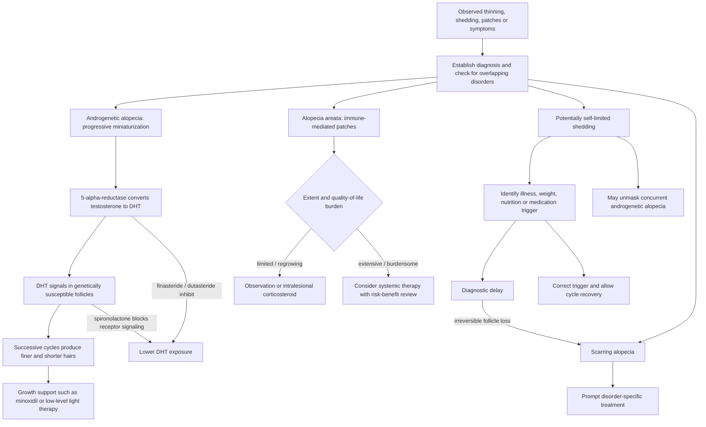

# Hair-loss diagnosis and scalp health

Hair loss is a symptom category, not a diagnosis. Androgenetic alopecia progressively miniaturizes genetically susceptible follicles under androgen signaling; alopecia areata is immune-mediated and may remit and recur; some shedding disorders may resolve without growth treatment; and cicatricial disorders destroy follicles through scarring. Because prognosis and treatment differ, selecting a shampoo or growth serum before identifying the process can waste time and, in scarring disease, allow irreversible loss. (@DrDrayzday (Dr Dray) — "Is Sugar Really Bad for Your Skin? | Dermatologist Q&A", 2026-08-09, [link](https://www.youtube.com/watch?v=c0tYCBtxRO4)) (@DrDrayzday (Dr Dray) — "Copper Peptides, Hair Loss & Retinol Questions Answered", 2026-08-08, [link](https://www.youtube.com/watch?v=0sxHRZPDvss))

## Diagnostic and treatment structure

In androgenetic alopecia, 5-alpha-reductase converts testosterone to dihydrotestosterone (DHT); in genetically susceptible follicles, androgen signaling drives miniaturization so successive cycles produce finer, shorter hairs with less scalp coverage. Finasteride inhibits type 2 5-alpha-reductase and is FDA-approved for male androgenetic alopecia, while dutasteride inhibits types 1 and 2, suppresses DHT more strongly, persists longer, and is used off-label for hair loss in the United States. Neither removes follicular susceptibility, so benefit generally requires continued exposure. Spironolactone instead blocks androgen signaling and is commonly used in women; finasteride, dutasteride, and spironolactone require clinician-led reproductive and adverse-effect counseling, and finasteride and dutasteride are contraindicated in pregnancy. (@DrDrayzday (Dr Dray) — "DHT Blockers for Hair Loss: What Actually Works? | Dermatologist Explains", 2026-08-11, [link](https://www.youtube.com/watch?v=lOaole90oSI))

Minoxidil and low-level light therapy act at other nodes and can support growth or prolong the growing state but do not cure the underlying progressive tendency. Combining mechanistically distinct treatments may be reasonable when diagnosis, safety, burden, and adherence are addressed, but the sponsored source's specific device claims and numerical hair-count result are not enough to establish comparative superiority. Scalp massage has small studies suggesting possible growth effects, plausibly through circulation, but additive benefit on top of light therapy has not been tested. (@DrDrayzday (Dr Dray) — "Is Sugar Really Bad for Your Skin? | Dermatologist Q&A", 2026-08-09, [link](https://www.youtube.com/watch?v=c0tYCBtxRO4)) (@DrDrayzday (Dr Dray) — "DHT Blockers for Hair Loss: What Actually Works? | Dermatologist Explains", 2026-08-11, [link](https://www.youtube.com/watch?v=lOaole90oSI))

Scalp cleansing addresses a different node. Accumulated sebum can oxidize and support Malassezia overgrowth; both can promote inflammation, dandruff, and itch, creating an unfavorable scalp environment. Consistent shampooing matters more than salon, medical-grade, or drugstore positioning, and expensive salon formulas are not inherently more concentrated or scientifically superior. Frequency can range from roughly weekly to daily according to hair type, scalp oil, symptoms, and tolerability. (@DrDrayzday (Dr Dray) — "Costco Skincare: What’s Actually Worth Buying? | Dermatologist Shops", 2026-08-10, [link](https://www.youtube.com/watch?v=JukyC7WttqI)) (@DrDrayzday (Dr Dray) — "Copper Peptides, Hair Loss & Retinol Questions Answered", 2026-08-08, [link](https://www.youtube.com/watch?v=0sxHRZPDvss))

Telogen effluvium is a delayed diffuse shedding response to systemic disruption. Severe infection, rapid weight loss, inadequate energy or nutrient intake, childbirth, and medication changes can shift many follicles from growth toward rest; shedding becomes visible roughly three months later, so the trigger may no longer feel temporally connected. It usually improves after the trigger resolves and nutrition and weight stabilize, but a large shed can reveal previously subtle androgenetic miniaturization, explaining why density does not always return fully even when the acute shedding abates. Severe Ebola illness and GLP-1–associated rapid weight loss illustrate the same stress-to-cycle pathway. [[ebola-virus-disease-and-skin-signs]] [[glp-1-receptor-agonists]] (@DrDrayzday (Dr Dray) — "Ebola Rash Explained: Dermatologist Breaks Down the Skin Signs", 2026-08-05, [link](https://www.youtube.com/watch?v=oD6Uch-vfkQ)) (@DrDrayzday (Dr Dray) — "Does Ozempic Cause Hair Loss? New Research Explained", 2026-08-04, [link](https://www.youtube.com/watch?v=0VW43kd63zM))

In GLP-1 users, reduced appetite can compound shedding through inadequate total intake, protein, or micronutrients. A proposed additional mechanism is loss or altered signaling of dermal white adipose tissue, the metabolically active fat compartment around follicles that supplies structural and paracrine support; whether GLP-1 drugs directly perturb this niche enough to cause human hair loss remains hypothesis-driven rather than established. The association between GLP-1 use and newly diagnosed alopecia does not by itself separate drug-specific effects from weight-loss rate, nutritional status, detection, or concurrent androgenetic alopecia. (@DrDrayzday (Dr Dray) — "Does Ozempic Cause Hair Loss? New Research Explained", 2026-08-04, [link](https://www.youtube.com/watch?v=0VW43kd63zM))

Cosmetic and supplement actives require a lower-confidence label. Pumpkin-seed oil has one small unreproduced randomized trial; saw palmetto has limited evidence for modest density or thickness effects; and horsetail and EGCG rely mainly on laboratory or otherwise sparse evidence. Supplements do not become safer by being natural: dose and composition may be uncertain, contamination is possible, and concentrated green-tea extract has been associated with liver injury. Ketoconazole shampoo does not have the evidence status of a systemic DHT inhibitor, but its antifungal control of Malassezia and possible local anti-androgen activity make it a relatively low-burden adjunct when dandruff coexists. (@DrDrayzday (Dr Dray) — "DHT Blockers for Hair Loss: What Actually Works? | Dermatologist Explains", 2026-08-11, [link](https://www.youtube.com/watch?v=lOaole90oSI))

Alopecia areata often regrows spontaneously, so treatment intensity should reflect extent, persistence, symptoms, and quality-of-life impact. Intralesional triamcinolone can hasten localized regrowth; JAK inhibitors can be effective for more extensive disease but require continued treatment, can cause adverse effects including acne, and do not eliminate recurrence. (@DrDrayzday (Dr Dray) — "Is Sugar Really Bad for Your Skin? | Dermatologist Q&A", 2026-08-09, [link](https://www.youtube.com/watch?v=c0tYCBtxRO4))

## Practical implications

- **At the onset of unexplained or persistent loss: establish the hair-loss diagnosis before buying growth products — strong.** Seek prompt dermatologic assessment for scalp inflammation, pain, scale, loss of follicular openings, or other signs that could indicate scarring disease.
- **On an ongoing cadence matched to scalp needs: shampoo consistently — moderate for scalp health.** Use any tolerated formula; branding and price do not establish superiority.
- **For confirmed androgenetic alopecia: discuss established, mechanism-matched treatments and adherence — moderate-to-strong.** Finasteride is an established option for men; dutasteride is a more potent off-label option; spironolactone is an anti-androgen option used in women; and minoxidil or low-level light therapy may address complementary nodes. Medication selection, pregnancy risk, adverse effects, and monitoring require individualized clinical review. (@DrDrayzday (Dr Dray) — "DHT Blockers for Hair Loss: What Actually Works? | Dermatologist Explains", 2026-08-11, [link](https://www.youtube.com/watch?v=lOaole90oSI))
- **When dandruff accompanies diagnosed androgenetic alopecia: consider tolerated ketoconazole shampoo as an adjunct — limited-to-moderate.** Do not treat it as a substitute for diagnosis or established growth treatment. (@DrDrayzday (Dr Dray) — "DHT Blockers for Hair Loss: What Actually Works? | Dermatologist Explains", 2026-08-11, [link](https://www.youtube.com/watch?v=lOaole90oSI))
- **For alopecia areata: match treatment burden to disease burden — moderate.** Observation can be reasonable for small regrowing patches, while injections or systemic therapy require individualized medical counseling.
- **When diffuse shedding begins after major illness, weight loss, or GLP-1 treatment: review the preceding three months and assess diet, weight trajectory, medications, and pattern — moderate.** Do not abruptly stop a beneficial prescribed drug; discuss dose and weight-loss pace with the prescriber and use a registered dietitian when intake is difficult to maintain. Treat persistent patterned miniaturization as possible concurrent androgenetic alopecia rather than buying an unvalidated GLP-1 hair-loss product. (@DrDrayzday (Dr Dray) — "Does Ozempic Cause Hair Loss? New Research Explained", 2026-08-04, [link](https://www.youtube.com/watch?v=0VW43kd63zM))

## Gaps & open questions

- Does scalp massage add benefit to minoxidil or low-level light therapy rather than duplicate a circulation-related effect?
- Do GHK-copper, aminexil, stemoxydine, or standardized topical green-tea formulations improve diagnosed hair disorders in independent comparative trials?
- What cleansing frequency optimizes inflammatory control without unacceptable dryness across hair textures and scalp disorders?
- Which alopecia-areata patients can discontinue JAK inhibition without relapse?
- How much GLP-1–associated shedding is explained by weight-loss rate, protein or micronutrient insufficiency, direct drug action, and dermal-white-adipose-tissue remodeling? (@DrDrayzday (Dr Dray) — "Does Ozempic Cause Hair Loss? New Research Explained", 2026-08-04, [link](https://www.youtube.com/watch?v=0VW43kd63zM))

## Related

[[skincare-evidence-and-routine-design]] · [[supplement-evidence-and-safety]] · [[skin-barrier-and-moisturization]] · [[glp-1-receptor-agonists]] · [[ebola-virus-disease-and-skin-signs]] · [[practice-playbook]]
