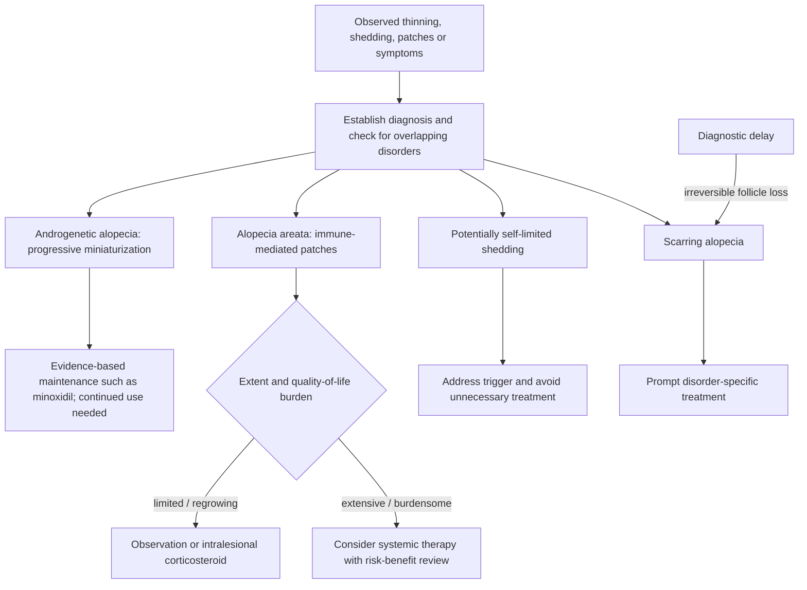

# Hair-loss diagnosis and scalp health

Hair loss is a symptom category, not a diagnosis. Androgenetic alopecia progressively miniaturizes genetically susceptible follicles under androgen signaling; alopecia areata is immune-mediated and may remit and recur; some shedding disorders may resolve without growth treatment; and cicatricial disorders destroy follicles through scarring. Because prognosis and treatment differ, selecting a shampoo or growth serum before identifying the process can waste time and, in scarring disease, allow irreversible loss. (@DrDrayzday (Dr Dray) — "Is Sugar Really Bad for Your Skin? | Dermatologist Q&A", 2026-08-09, [link](https://www.youtube.com/watch?v=c0tYCBtxRO4)) (@DrDrayzday (Dr Dray) — "Copper Peptides, Hair Loss & Retinol Questions Answered", 2026-08-08, [link](https://www.youtube.com/watch?v=0sxHRZPDvss))

## Diagnostic and treatment structure

In androgenetic alopecia, follicular sensitivity to dihydrotestosterone contributes to progressively finer, shorter, slower-growing hairs. Minoxidil and low-level light therapy can support growth or prolong the growing state but do not cure the underlying progressive tendency, so benefit depends on continued use. Scalp massage has small studies suggesting possible growth effects, plausibly through circulation, but additive benefit on top of light therapy has not been tested. (@DrDrayzday (Dr Dray) — "Is Sugar Really Bad for Your Skin? | Dermatologist Q&A", 2026-08-09, [link](https://www.youtube.com/watch?v=c0tYCBtxRO4))

Scalp cleansing addresses a different node. Accumulated sebum can oxidize and support Malassezia overgrowth; both can promote inflammation, dandruff, and itch, creating an unfavorable scalp environment. Consistent shampooing matters more than salon, medical-grade, or drugstore positioning, and expensive salon formulas are not inherently more concentrated or scientifically superior. Frequency can range from roughly weekly to daily according to hair type, scalp oil, symptoms, and tolerability. (@DrDrayzday (Dr Dray) — "Costco Skincare: What’s Actually Worth Buying? | Dermatologist Shops", 2026-08-10, [link](https://www.youtube.com/watch?v=JukyC7WttqI)) (@DrDrayzday (Dr Dray) — "Copper Peptides, Hair Loss & Retinol Questions Answered", 2026-08-08, [link](https://www.youtube.com/watch?v=0sxHRZPDvss))

Cosmetic actives require a lower-confidence label. GHK-copper peptides, stemoxydine, aminexil, and shampoo-delivered green-tea compounds have proposed effects on circulation, follicle size, inflammation, or androgen metabolism, but the cited evidence is small, manufacturer-dependent, non-peer-reviewed, formulation-dependent, or otherwise inadequate to rank them alongside established treatments. Oral green-tea extracts should not be treated as a natural DHT-blocker substitute; support is poor and liver failure has been reported. (@DrDrayzday (Dr Dray) — "Costco Skincare: What’s Actually Worth Buying? | Dermatologist Shops", 2026-08-10, [link](https://www.youtube.com/watch?v=JukyC7WttqI)) (@DrDrayzday (Dr Dray) — "Copper Peptides, Hair Loss & Retinol Questions Answered", 2026-08-08, [link](https://www.youtube.com/watch?v=0sxHRZPDvss))

Alopecia areata often regrows spontaneously, so treatment intensity should reflect extent, persistence, symptoms, and quality-of-life impact. Intralesional triamcinolone can hasten localized regrowth; JAK inhibitors can be effective for more extensive disease but require continued treatment, can cause adverse effects including acne, and do not eliminate recurrence. (@DrDrayzday (Dr Dray) — "Is Sugar Really Bad for Your Skin? | Dermatologist Q&A", 2026-08-09, [link](https://www.youtube.com/watch?v=c0tYCBtxRO4))

## Practical implications

- **At the onset of unexplained or persistent loss: establish the hair-loss diagnosis before buying growth products — strong.** Seek prompt dermatologic assessment for scalp inflammation, pain, scale, loss of follicular openings, or other signs that could indicate scarring disease.
- **On an ongoing cadence matched to scalp needs: shampoo consistently — moderate for scalp health.** Use any tolerated formula; branding and price do not establish superiority.
- **For confirmed androgenetic alopecia: prioritize established treatments and adherence — strong for minoxidil relative to cosmetic alternatives.** Review topical irritation and systemic adverse effects with a clinician; continued treatment is generally needed to preserve benefit.
- **For alopecia areata: match treatment burden to disease burden — moderate.** Observation can be reasonable for small regrowing patches, while injections or systemic therapy require individualized medical counseling.

## Gaps & open questions

- Does scalp massage add benefit to minoxidil or low-level light therapy rather than duplicate a circulation-related effect?
- Do GHK-copper, aminexil, stemoxydine, or standardized topical green-tea formulations improve diagnosed hair disorders in independent comparative trials?
- What cleansing frequency optimizes inflammatory control without unacceptable dryness across hair textures and scalp disorders?
- Which alopecia-areata patients can discontinue JAK inhibition without relapse?

## Related

[[skincare-evidence-and-routine-design]] · [[supplement-evidence-and-safety]] · [[skin-barrier-and-moisturization]] · [[practice-playbook]]
