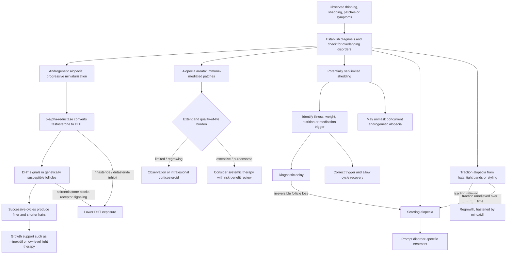

# Hair-loss diagnosis and scalp health

Hair loss is a symptom category, not a diagnosis. Androgenetic alopecia progressively miniaturizes genetically susceptible follicles under androgen signaling; alopecia areata is immune-mediated and may remit and recur; some shedding disorders may resolve without growth treatment; and cicatricial disorders destroy follicles through scarring. Because prognosis and treatment differ, selecting a shampoo or growth serum before identifying the process can waste time and, in scarring disease, allow irreversible loss. (@DrDrayzday (Dr Dray) — "Is Sugar Really Bad for Your Skin? | Dermatologist Q&A", 2026-08-09, [link](https://www.youtube.com/watch?v=c0tYCBtxRO4)) (@DrDrayzday (Dr Dray) — "Copper Peptides, Hair Loss & Retinol Questions Answered", 2026-08-08, [link](https://www.youtube.com/watch?v=0sxHRZPDvss))

## Diagnostic and treatment structure

```mermaid
flowchart TD
  LOSS[Observed thinning, shedding, patches or symptoms] --> DX[Establish diagnosis and check for overlapping disorders]
  DX --> AGA[Androgenetic alopecia: progressive miniaturization]
  DX --> AA[Alopecia areata: immune-mediated patches]
  DX --> TEL[Potentially self-limited shedding]
  DX --> SCAR[Scarring alopecia]
  AGA --> CONV[5-alpha-reductase converts testosterone to DHT]
  CONV --> SENS[DHT signals in genetically susceptible follicles]
  SENS --> MINI[Successive cycles produce finer and shorter hairs]
  CONV -->|finasteride / dutasteride inhibit| LOWER[Lower DHT exposure]
  SENS -->|spironolactone blocks receptor signaling| LOWER
  MINI --> MAINT[Growth support such as minoxidil or low-level light therapy]
  AA --> SEV{Extent and quality-of-life burden}
  SEV -->|limited / regrowing| OBS[Observation or intralesional corticosteroid]
  SEV -->|extensive / burdensome| JAK[Consider systemic therapy with risk-benefit review]
  TEL --> TRIG[Identify illness, weight, nutrition or medication trigger]
  TRIG --> DELAY[About three-month lag can obscure the cause]
  TRIG --> STAB[Correct trigger and allow cycle recovery]
  TEL --> AGA2[May unmask concurrent androgenetic alopecia]
  DX --> TRACT[Traction alopecia from hats, tight bands or styling]
  TRACT -->|traction relieved| REGROW[Regrowth, hastened by minoxidil]
  TRACT -->|traction unrelieved over time| SCAR
  SCAR --> URG[Prompt disorder-specific treatment]
  DELAY[Diagnostic delay] -->|irreversible follicle loss| SCAR
```

In androgenetic alopecia, 5-alpha-reductase converts testosterone to dihydrotestosterone (DHT); in genetically susceptible follicles, androgen signaling drives miniaturization so successive cycles produce finer, shorter hairs with less scalp coverage. Finasteride inhibits type 2 5-alpha-reductase and is FDA-approved for male androgenetic alopecia, while dutasteride inhibits types 1 and 2, suppresses DHT more strongly, persists longer, and is used off-label for hair loss in the United States. Neither removes follicular susceptibility, so benefit generally requires continued exposure. Spironolactone instead blocks androgen signaling and is commonly used in women; finasteride, dutasteride, and spironolactone require clinician-led reproductive and adverse-effect counseling, and finasteride and dutasteride are contraindicated in pregnancy. (@DrDrayzday (Dr Dray) — "DHT Blockers for Hair Loss: What Actually Works? | Dermatologist Explains", 2026-08-11, [link](https://www.youtube.com/watch?v=lOaole90oSI))

The claim that spironolactone or minoxidil ages the face by suppressing healthy dermal collagen confuses pathological fibrosis with normal tissue maintenance. Spironolactone can alter profibrotic signaling in organs such as the heart, but an antifibrotic effect in scar-forming disease does not entail loss of type I/III dermal matrix or clinical facial aging. A 2023 systematic review of oral spironolactone for female-pattern hair loss reported menstrual effects, scalp symptoms, facial hypertrichosis, and discontinuation among observed adverse events, not a facial-aging syndrome; the studies were small and heterogeneous, so absence of a reported signal is reassuring rather than proof of zero rare risk.[^spironolactone-2023] Dr Dray's stronger clinical position is that there is no clinical evidence of medication-induced facial aging from either drug. (@DrDrayzday (Dr Dray) — "Does Spironolactone Age Your Skin? The Truth About Collagen", 2026-08-30, [link](https://www.youtube.com/watch?v=q9Vvl_SJVNA))

A receding hairline runs the whole diagnostic tree in one presentation. In men it is most often androgenetic alopecia, where minoxidil can move miniaturized follicles back into the growing phase and improve thickness, density, and filling-in of the hairline — but only while the follicles remain intact, and only for as long as treatment continues: stopping produces a telogen-effluvium shed of the treatment-supported hairs and a return to the untreated trajectory. Frontal fibrosing alopecia also attacks the frontal hairline and is a scarring alopecia — once a follicle has scarred it will never grow hair again and transplantation is the only way to restore hair there; it is uncommon in men but does occur, typically accompanied by eyebrow loss and sometimes beard or body-site loss. Traction alopecia can likewise present frontally, from tight hats or bands as well as styling tension: hairs regrow once traction is relieved, and minoxidil can hasten that regrowth, but chronically unrelieved traction lets the strained follicle fibrose and scar down, at which point minoxidil no longer works. The hairline therefore illustrates the page's central rule — the same visible pattern spans fully treatable, time-limited, and irreversible diagnoses, and the scarring branch punishes delay. (@DrDrayzday (Dr Dray) — "Anua Azelaic Acid REFORMULATED? Controversy Explained | Derm Q&A", 2026-08-22, [link](https://www.youtube.com/watch?v=1b7nGYAIktw))

A unifying anatomical frame from a dermatologic surgeon clarifies what every treatment on this page can and cannot do: in non-scarring loss the follicles are not gone — biopsy of a bald androgenetic scalp still shows follicles, regressed and dormant — so every drug, device, and supplement on the market is attempting to reawaken dormant follicles, and nothing in medicine grows a new follicle; only transplantation moves hair permanently, by relocating follicles from DHT-insensitive donor zones. The same frame explains why topicals underperform: the hair fiber is dead once it exits the scalp, and the living bulb sits roughly 2.5–3 mm deep, so over-the-counter oils and serums either coat the dead shaft cosmetically or fail to reach the bulb at meaningful concentration — the reason rosemary and castor oil marketing outruns evidence, and the reason he considers topical minoxidil the only over-the-counter topical with even modest efficacy. He accordingly favors low-dose oral minoxidil (about one-tenth the old blood-pressure dose): higher circulating concentration, better growth than topicals, generic and cheap, well tolerated in his experience with palpitations and leg swelling as the dose-related cautions — and a body-hair-thickening effect that bothers some users, particularly women. These are consistent with this page's earlier oral-minoxidil positions but remain practice observations rather than trial comparisons. (@maxlugavere (Max Lugavere) — "The Skin Doctor: Hair Loss, Itchy Skin, Sunscreen Myths, and Anti-Aging Truths", 2026-07-15, [link](https://www.youtube.com/watch?v=99LCstvkNVw))

**Evidence conflict — 5-alpha-reductase-inhibitor sexual side effects.** Original finasteride trial data report sexual dysfunction in roughly 2–3% of men; Soleymani's real-world practice estimate is closer to 50%, and he further reports that finasteride clearly reduces semen volume with unresolved questions about sperm quality and motility. He layers a nocebo interpretation on top: telling a man a drug may impair erections can itself produce the symptom, many symptoms resolve when patients stop attending to them, and post-finasteride syndrome debates are entangled with this — while insisting side-effect disclosure is ethically mandatory regardless. He avoids first-line 5-ARIs in men of childbearing age and in women with hormone-sensitive-cancer family history (an off-label use with a theoretical risk rationale), reserves dutasteride as the more potent option, notes 30–50% of treated patients regrow some hair, and sequences therapy deliberately — start with the least potent workable drug, because patients break through over the years and escalation options must be preserved. His sharpest consumer warning is aimed at online pharmacies dispensing finasteride with no side-effect or fertility counseling. The 50% figure conflicts with randomized data and with this page's earlier framing; both are retained — trial rates may underestimate real-world experience (attention, duration, selection), while practice impressions overestimate causal rates for exactly the nocebo reasons he names. (@maxlugavere (Max Lugavere) — "The Skin Doctor: Hair Loss, Itchy Skin, Sunscreen Myths, and Anti-Aging Truths", 2026-07-15, [link](https://www.youtube.com/watch?v=99LCstvkNVw))

Androgen dynamics also explain a training paradox: anything that raises testosterone — heavy resistance training naturally, anabolic steroids dramatically — accelerates shedding in men genetically susceptible to DHT conversion, which is why rapid thinning can mark a steroid cycle. Susceptibility is polygenic with, in his account, maternal-side predominance for male pattern loss. On adjuncts, he rates ketoconazole shampoo as negligible-risk but low-efficacy, noting the original studies were confounded: many participants had uncontrolled seborrheic dermatitis, and treating that inflammation reversed a telogen shock loss that was never androgenetic — the apparent regrowth belonged to the dandruff treatment, not DHT blockade ([[seborrheic-dermatitis]]). Saw palmetto, pumpkin seed, and rosemary he classes as genuine but weak natural 5-alpha-reductase inhibitors, potentially slowing progression but rarely producing visible benefit — consistent with this page's existing low-confidence labels. (@maxlugavere (Max Lugavere) — "The Skin Doctor: Hair Loss, Itchy Skin, Sunscreen Myths, and Anti-Aging Truths", 2026-07-15, [link](https://www.youtube.com/watch?v=99LCstvkNVw))

Minoxidil and low-level light therapy act at other nodes and can support growth or prolong the growing state but do not cure the underlying progressive tendency. Combining mechanistically distinct treatments may be reasonable when diagnosis, safety, burden, and adherence are addressed, but the sponsored source's specific device claims and numerical hair-count result are not enough to establish comparative superiority. Scalp massage has small studies suggesting possible growth effects, plausibly through circulation, but additive benefit on top of light therapy has not been tested. (@DrDrayzday (Dr Dray) — "Is Sugar Really Bad for Your Skin? | Dermatologist Q&A", 2026-08-09, [link](https://www.youtube.com/watch?v=c0tYCBtxRO4)) (@DrDrayzday (Dr Dray) — "DHT Blockers for Hair Loss: What Actually Works? | Dermatologist Explains", 2026-08-11, [link](https://www.youtube.com/watch?v=lOaole90oSI))

This node distinction resolves a common treatment error: minoxidil stimulates growth but does not block DHT-driven miniaturization, while 5-alpha-reductase inhibition reduces the androgenic driver but does not guarantee visible regrowth. Derek from More Plates More Dates favors layered therapy and regards dutasteride as a reasonable personal trade-off, while explicitly acknowledging real sexual and possible neuropsychiatric adverse effects and not endorsing his own regimen for others. His further speculation that DHT suppression might extend lifespan is unsupported by direct longevity evidence and should not influence treatment. Topical minoxidil generally limits systemic exposure relative to oral minoxidil; oral use has more consequential hypotension, edema, tachycardia and rare pericardial risks and requires prescribing oversight. (@FoundMyFitness (FoundMyFitness) — "How To Increase Your Testosterone Levels Naturally | Derek from MPMD", 2025-09-09, [link](https://www.youtube.com/watch?v=jj2J1ONi0JM))

Response to low-level light therapy tracks disease stage. In extensive, long-standing androgenetic alopecia the chance that a home device changes the picture is very low, whereas earlier, mild-to-moderate disease is much more likely to benefit; the supported role is as an adjunct to established treatments such as minoxidil, not a replacement. Reputable home masks and helmets that publish on their devices are the better bets, and a blanket waste-of-time dismissal is as wrong as a blanket endorsement — the answer is diagnosis- and stage-specific. (@DrDrayzday (Dr Dray) — "Can Adapalene Really Prevent Wrinkles? Dermatologist Q&A", 2026-08-15, [link](https://www.youtube.com/watch?v=l30kQh-VdwI)) [[home-skin-photobiomodulation]]

Platelet-rich plasma (PRP) and platelet-rich fibrin (PRF) inject blood-derived components into the scalp to stimulate growth ([[platelet-rich-plasma-and-fibrin]]). An earlier source on this page characterized the field as lacking good large randomized trials; a later, dedicated review from the same clinician updates that picture: randomized-trial syntheses — a 2024 systematic review and meta-analysis finding increased hair density versus placebo, and a 2025 systematic review of 43 randomized controlled trials in nearly 1,900 participants — now support PRP as a potential androgenetic-alopecia treatment at the group level, while preparation and activation heterogeneity still prevents saying which protocol works, for whom, or how it compares with standard treatments. The practical cautions stand unchanged: isolation method, injection depth, and frequency vary between providers; responders typically need ongoing maintenance treatments, making it costly; some people get no benefit; individual response is unpredictable; earlier-stage disease is more likely to respond; and cases are thought to have occurred in which treatment contributed to worsening of the androgenetic alopecia. PRF remains less studied (a 2024 systematic review covered only seven studies and 130 patients) and can be substantially more expensive without better evidence — next-generation marketing rests on a plausible fibrin-scaffold sustained-release mechanism, not on demonstrated superiority. (@DrDrayzday (Dr Dray) — "Can Adapalene Really Prevent Wrinkles? Dermatologist Q&A", 2026-08-15, [link](https://www.youtube.com/watch?v=l30kQh-VdwI)) (@DrDrayzday (Dr Dray) — "PRP vs PRF: Which Is Better for Hair Loss & Skin Rejuvenation?", 2026-09-01, [link](https://www.youtube.com/watch?v=pa0XPk2UuHA))

The scarring branch of the tree includes self-inflicted mechanical damage. In trichotillomania, years of repetitive pulling can destroy follicles the same way long-standing traction does; once a follicle has scarred, no topical, medication, or device will make hair grow from that spot, because no follicle remains. The only restorative option for a truly scarred brow or scalp area is transplantation — hair can be transplanted into a scar even though the scar cannot regrow its own. Brow transplantation specifically harvests scalp donor hair, which differs in texture from native brow hair and grows much faster, so recipients must trim their brows regularly; many people are nonetheless happy with the results. The practical implication runs through diagnosis: bald spots that have persisted for years after pulling stopped warrant assessment for scarring before money is spent on growth products. (@DrDrayzday (Dr Dray) — "Dermatologist Answers Your Skincare Questions | AmLactin, Fraxel, Sunscreen & KP", 2026-08-29, [link](https://www.youtube.com/watch?v=YIQdXvlvmgA))

Scalp cleansing addresses a different node. Accumulated sebum can oxidize and support Malassezia overgrowth; both can promote inflammation, dandruff, and itch, creating an unfavorable scalp environment. Shampooing does not cause compensatory sebaceous-gland output: gland activity is governed mainly by hormones, genetics, and local signaling. Consistent shampooing matters more than salon, medical-grade, or drugstore positioning, and expensive salon formulas are not inherently more concentrated or scientifically superior. Frequency can range from roughly weekly to daily according to hair type, scalp oil, symptoms, and tolerability; for visibly greasy daily recurrence, daily scalp-directed shampooing is reasonable, while salicylic-acid shampoo can help scale and inflammation without necessarily lowering sebum production. (@DrDrayzday (Dr Dray) — "Costco Skincare: What’s Actually Worth Buying? | Dermatologist Shops", 2026-08-10, [link](https://www.youtube.com/watch?v=JukyC7WttqI)) (@DrDrayzday (Dr Dray) — "Copper Peptides, Hair Loss & Retinol Questions Answered", 2026-08-08, [link](https://www.youtube.com/watch?v=0sxHRZPDvss)) (@DrDrayzday (Dr Dray) — "Does Spironolactone Age Your Skin? The Truth About Collagen", 2026-08-30, [link](https://www.youtube.com/watch?v=q9Vvl_SJVNA))

Oxidative stress is a plausible bridge between scalp environment and hair retention. Ultraviolet exposure, pollution, normal metabolism, sebum oxidation, and microbial metabolism can generate reactive products; inflammation and barrier disruption may then impair the follicular environment, while newly forming fibers may be more fragile. A sponsor-funded six-month controlled study described in the source compared an antioxidant/antimicrobial shampoo-plus-leave-on regimen with a matched shampoo lacking the actives in people reporting thinning but without overt scalp disease. Biomarkers of oxidation and barrier disruption, bulb-bearing shed hairs, and hair counts favored the active regimen, while hair diameter did not change; improvement by eight weeks is more consistent with retention than new follicle growth. This is product-specific, commercially conflicted evidence and does not establish oxidative stress as the cause of unexplained thinning or show that any antioxidant shampoo works. (@LabMuffinBeautyScience (Lab Muffin Beauty Science) — "The surprising science behind these supermarket hair loss products (Pantene AD)", 2025-11-20, [link](https://www.youtube.com/watch?v=9eO6AF7eFsA))

Minoxidil changes hair-cycle allocation but does not necessarily eliminate other shedding signals. The source distinguishes a temporary shedding increase after starting or increasing minoxidil from calendar-associated variation that may still occur during long-term treatment; coincident initiation and seasonal shedding can make the early change look larger. The proposed daylight/circadian explanation for seasonal shedding is expert interpretation and was not externally reviewed here, so persistent or abrupt loss should not be attributed to season without reassessing diagnosis, medication timing, illness, nutrition, and scalp findings. (@DrDrayzday (Dr Dray) — "Are Copper Peptides Better Than Vitamin C? Dermatologist Explain", 2026-08-01, [link](https://www.youtube.com/watch?v=YuHLRmJMUzI))

Hair-shaft care acts on breakage and manageability rather than follicle number. Satin or silk contact surfaces and a bonnet may reduce friction, frizz, and mechanical breakage, while a microfiber wrap can shorten the time long or curly hair and the scalp remain wet. These are plausible, low-risk grooming strategies supported here by expert experience rather than controlled hair-growth evidence; scalp massage from a shampoo tool should likewise not be represented as an established growth treatment. (@DrDrayzday (Dr Dray) — "TJ Maxx Skincare: Dermatologist Reviews What's Worth Buying", 2026-07-31, [link](https://www.youtube.com/watch?v=bkruuZQ_QTE))

Telogen effluvium is a delayed diffuse shedding response to systemic disruption. Severe infection, rapid weight loss, inadequate energy or nutrient intake, childbirth, and medication changes can shift many follicles from growth toward rest; shedding becomes visible roughly three months later, so the trigger may no longer feel temporally connected. It usually improves after the trigger resolves and nutrition and weight stabilize, but a large shed can reveal previously subtle androgenetic miniaturization, explaining why density does not always return fully even when the acute shedding abates. Severe Ebola illness and GLP-1–associated rapid weight loss illustrate the same stress-to-cycle pathway. [[ebola-virus-disease-and-skin-signs]] [[glp-1-receptor-agonists]] (@DrDrayzday (Dr Dray) — "Ebola Rash Explained: Dermatologist Breaks Down the Skin Signs", 2026-08-05, [link](https://www.youtube.com/watch?v=oD6Uch-vfkQ)) (@DrDrayzday (Dr Dray) — "Does Ozempic Cause Hair Loss? New Research Explained", 2026-08-04, [link](https://www.youtube.com/watch?v=0VW43kd63zM))

In GLP-1 users, reduced appetite can compound shedding through inadequate total intake, protein, or micronutrients. A proposed additional mechanism is loss or altered signaling of dermal white adipose tissue, the metabolically active fat compartment around follicles that supplies structural and paracrine support; whether GLP-1 drugs directly perturb this niche enough to cause human hair loss remains hypothesis-driven rather than established. The association between GLP-1 use and newly diagnosed alopecia does not by itself separate drug-specific effects from weight-loss rate, nutritional status, detection, or concurrent androgenetic alopecia. (@DrDrayzday (Dr Dray) — "Does Ozempic Cause Hair Loss? New Research Explained", 2026-08-04, [link](https://www.youtube.com/watch?v=0VW43kd63zM))

Menopause concentrates androgenetic (female-pattern) loss. With estrogen decline, sex-hormone-binding-globulin falls and free androgen activity rises even without rising androgen levels, and roughly 50–60% of women are described as noticing widened part lines, temple recession, or overall thinning across the transition — partly genetic, partly hormonal. Lauren Streicher's treatment hierarchy for this population is blunt: supplements including biotin do not work; topical minoxidil (sometimes compounded with finasteride) works but fails in practice through inconsistent use; and low-dose oral minoxidil — off-label, prescription, originally a blood-pressure drug — is what hair-focused dermatologists increasingly favor, at the cost of unwanted facial or body hair growth in some users. Stress, heat styling, and traction remain additive contributors. These are practice positions consistent with the page's diagnosis-first rule: patterned midlife thinning still deserves diagnostic confirmation before systemic treatment. (@RenaMalikMD (Rena Malik, M.D.) — "Why Your Vagina Doesn't Get 'Loose' From Sex (Despite What Social Media Says)", 2026-07-24, [link](https://www.youtube.com/watch?v=DnbhB-6vy80)) [[menopause-hormone-therapy]]

Streicher's investigation of Nutrafol is a case study in supplement-claim auditing. She reports that the under-45 and over-45 formulas list the same ingredients reordered; that the over-45 marketing page cites no references applicable to that population; and that the single study in people over 45 showed on average about seven additional hair follicles per square centimeter against a baseline of 50–60 — a calculation she says the company confirmed in writing. At nearly $1,000 per year, with benefit lost on discontinuation, she contrasts this with generic minoxidil at a few dollars monthly, and notes that the citation list's age and irrelevance (many references predating the product or concerning skin) is obscured by formatting. As an over-the-counter supplement it carries no obligation to prove its claims. This is one clinician's documented analysis rather than a systematic review, but it is concrete, checkable, and consistent with the supplement-evidence framework in [[supplement-evidence-and-safety]]. (@RenaMalikMD (Rena Malik, M.D.) — "Why Your Vagina Doesn't Get 'Loose' From Sex (Despite What Social Media Says)", 2026-07-24, [link](https://www.youtube.com/watch?v=DnbhB-6vy80))

Cosmetic and supplement actives require a lower-confidence label. Pumpkin-seed oil has one small unreproduced randomized trial; saw palmetto has limited evidence for modest density or thickness effects; and horsetail and EGCG rely mainly on laboratory or otherwise sparse evidence. Supplements do not become safer by being natural: dose and composition may be uncertain, contamination is possible, and concentrated green-tea extract has been associated with liver injury. Ketoconazole shampoo does not have the evidence status of a systemic DHT inhibitor, but its antifungal control of Malassezia and possible local anti-androgen activity make it a relatively low-burden adjunct when dandruff coexists. (@DrDrayzday (Dr Dray) — "DHT Blockers for Hair Loss: What Actually Works? | Dermatologist Explains", 2026-08-11, [link](https://www.youtube.com/watch?v=lOaole90oSI))

The route matters for pumpkin-seed oil specifically: there is no evidence that pumpkin-seed oil applied to the scalp grows hair, treats any hair-loss disorder, or slows or prevents any type of loss — the single promising-but-limited study was of oral supplementation. Topical use is generally well tolerated, so the honest framing is an unproven popular practice rather than a hazard; whether scalp oils aggravate dandruff by feeding *Malassezia* is itself unresolved in both directions ([[seborrheic-dermatitis]]). Azelaic acid on the scalp is likewise theory without study: it is anti-inflammatory, but its effects concentrate at the skin surface, follicular delivery is doubtful, and nobody has tested it for scalp irritation or hair growth. (@DrDrayzday (Dr Dray) — "Can You Mix Azelaic Acid With Anything? Dermatologist Q&A", 2026-08-16, [link](https://www.youtube.com/watch?v=oyQl5MU3pRQ)) (@DrDrayzday (Dr Dray) — "Can Adapalene Really Prevent Wrinkles? Dermatologist Q&A", 2026-08-15, [link](https://www.youtube.com/watch?v=l30kQh-VdwI))

The frequently repeated claim that pumpkin-seed oil increased growth by 40% misidentifies both the intervention and the inference. The cited human trial tested a sponsor's multi-ingredient supplement containing pumpkin-seed powder plus six other ingredients, not isolated pumpkin-seed oil, so attribution to one component is impossible and animal studies do not repair that gap. Likewise, ingredient-trademark data for Follicusan, Capixyl, aminexil, or stemoxydine cannot automatically be transferred to a different finished formula; botanical extracts are especially variable, and shampoo contact time and delivery matter. Conversely, standard-use sulfates, parabens, phthalates, silicones, and formaldehyde-releasing preservatives have not been shown in the staged source to kill follicles. Irritation or allergy can worsen shedding in a susceptible person, but that is different from intrinsic follicle toxicity; dimethicone primarily conditions the dead fiber and can reduce frictional breakage. (@LabMuffinBeautyScience (Lab Muffin Beauty Science) — "Which viral hair hacks actually work? Supplements, shampoos, curly care", 2025-11-27, [link](https://www.youtube.com/watch?v=M27QzbADybI))

Iron or vitamin-D deficiency can coexist with diffuse shedding without being its sole cause. The interviewed dermatologist estimated that roughly 30–40% of women presenting with hair loss have one of these common deficiencies, but also emphasized that supplementation trials for reversal of shedding are absent, hair-specific iron thresholds are disputed, and correction often does not stop loss. Replacement remains appropriate for a clinically confirmed deficiency because of general-health indications, while expectations for regrowth should remain modest and concurrent female-pattern loss, telogen effluvium, menopause, medication effects, and scalp inflammation should still be assessed. This prevalence estimate and practice view are expert interpretation from the transcript, not an independently reviewed epidemiologic synthesis. (@LabMuffinBeautyScience (Lab Muffin Beauty Science) — "Which viral hair hacks actually work? Supplements, shampoos, curly care", 2025-11-27, [link](https://www.youtube.com/watch?v=M27QzbADybI))

Piroctone olamine is another antifungal antidandruff ingredient that reduces Malassezia. Small studies suggest possible increases in hair thickness or density in androgenetic alopecia, but it has less clinical experience and no established head-to-head advantage over zinc pyrithione in the source. Any growth inference remains adjunctive and product-specific rather than evidence that antifungal shampoo treats all hair loss. (@DrDrayzday (Dr Dray) — "Are Chemical Sunscreens Really Safe? Dermatologist Explains", 2026-08-02, [link](https://www.youtube.com/watch?v=BVnGrOMfeRM))

Leave-on scalp serums can extend exposure between washes, but ingredient plausibility is not finished-product efficacy. A featured multi-active serum combined piroctone olamine, humectants, exfoliating acids, antioxidants, oil-absorbing starch, and a proprietary hair-loss/greying complex; the source found the design coherent for oily, itchy scalp care but explicitly noted the absence of clinical testing. Personal ability to wash less often is an adherence anecdote, not evidence that less washing improves scalp disease or hair growth. (@LabMuffinBeautyScience (Lab Muffin Beauty Science) — "Innovative new beauty favourites (Nooance AD)", 2026-04-25, [link](https://www.youtube.com/watch?v=GBTdWi_2DD0))

Alopecia areata often regrows spontaneously, so treatment intensity should reflect extent, persistence, symptoms, and quality-of-life impact. Intralesional triamcinolone can hasten localized regrowth; JAK inhibitors can be effective for more extensive disease but require continued treatment, can cause adverse effects including acne, and do not eliminate recurrence. (@DrDrayzday (Dr Dray) — "Is Sugar Really Bad for Your Skin? | Dermatologist Q&A", 2026-08-09, [link](https://www.youtube.com/watch?v=c0tYCBtxRO4))

## Practical implications

- **At the onset of unexplained or persistent loss: establish the hair-loss diagnosis before buying growth products — strong.** Seek prompt dermatologic assessment for scalp inflammation, pain, scale, loss of follicular openings, or other signs that could indicate scarring disease.
- **On an ongoing cadence matched to scalp needs: shampoo consistently—moderate for scalp health.** Daily scalp-directed shampooing is reasonable when oil returns daily; it does not train glands to make more oil. Use a tolerated formula and condition the hair shaft separately as needed; salicylic acid may improve scale but is not an established sebum-suppressing treatment. (@DrDrayzday (Dr Dray) — "Does Spironolactone Age Your Skin? The Truth About Collagen", 2026-08-30, [link](https://www.youtube.com/watch?v=q9Vvl_SJVNA))
- **For confirmed androgenetic alopecia: discuss established, mechanism-matched treatments and adherence — moderate-to-strong.** Finasteride is an established option for men; dutasteride is a more potent off-label option; spironolactone is an anti-androgen option used in women; and minoxidil or low-level light therapy may address complementary nodes. Medication selection, pregnancy risk, adverse effects, and monitoring require individualized clinical review. (@DrDrayzday (Dr Dray) — "DHT Blockers for Hair Loss: What Actually Works? | Dermatologist Explains", 2026-08-11, [link](https://www.youtube.com/watch?v=lOaole90oSI))
- **For a receding hairline: relieve suspected traction immediately and seek diagnosis before or alongside starting minoxidil — moderate-to-strong; the scarring differential (frontal fibrosing alopecia, chronic traction) is time-sensitive and minoxidil-unresponsive.** Expect minoxidil benefit in androgenetic recession to require indefinite continued use. (@DrDrayzday (Dr Dray) — "Anua Azelaic Acid REFORMULATED? Controversy Explained | Derm Q&A", 2026-08-22, [link](https://www.youtube.com/watch?v=1b7nGYAIktw))
- **After starting or changing minoxidil: record timing and trend rather than assuming treatment failure from an early shed — limited/source-described practice.** Contact the prescriber for severe, prolonged, patchy, symptomatic, or otherwise unexplained shedding. (@DrDrayzday (Dr Dray) — "Are Copper Peptides Better Than Vitamin C? Dermatologist Explain", 2026-08-01, [link](https://www.youtube.com/watch?v=YuHLRmJMUzI))
- **When dandruff accompanies diagnosed androgenetic alopecia: consider tolerated ketoconazole shampoo as an adjunct — limited-to-moderate.** Do not treat it as a substitute for diagnosis or established growth treatment. (@DrDrayzday (Dr Dray) — "DHT Blockers for Hair Loss: What Actually Works? | Dermatologist Explains", 2026-08-11, [link](https://www.youtube.com/watch?v=lOaole90oSI))
- **When piroctone olamine is the locally available antidandruff active: it is reasonable for dandruff control, with any hair-density benefit treated as uncertain — limited.** Reassess persistent shedding or thinning rather than inferring that scalp yeast is the sole cause. (@DrDrayzday (Dr Dray) — "Are Chemical Sunscreens Really Safe? Dermatologist Explains", 2026-08-02, [link](https://www.youtube.com/watch?v=BVnGrOMfeRM))
- **When considering an antioxidant or “hair-growth” shampoo: use it only as adjunctive scalp care and reassess after roughly 3–6 months — limited and product-specific.** Do not substitute it for diagnosis or established medical treatment; early improvement may reflect reduced shedding, fiber coating, or spontaneous recovery rather than new growth. (@LabMuffinBeautyScience (Lab Muffin Beauty Science) — "The surprising science behind these supermarket hair loss products (Pantene AD)", 2025-11-20, [link](https://www.youtube.com/watch?v=9eO6AF7eFsA)) (@LabMuffinBeautyScience (Lab Muffin Beauty Science) — "Which viral hair hacks actually work? Supplements, shampoos, curly care", 2025-11-27, [link](https://www.youtube.com/watch?v=M27QzbADybI))
- **When testing shows iron or vitamin-D deficiency: replace it under appropriate clinical guidance for general health, but continue the diagnostic workup — strong for correcting deficiency; unproven for hair regrowth.** Do not take iron empirically without confirming need because excess can harm. (@LabMuffinBeautyScience (Lab Muffin Beauty Science) — "Which viral hair hacks actually work? Supplements, shampoos, curly care", 2025-11-27, [link](https://www.youtube.com/watch?v=M27QzbADybI))
- **Before paying for PRP or PRF for androgenetic alopecia: treat it as an optional adjunct after established treatments are in place — moderate for a group-level density effect (meta-analytic randomized evidence), limited for protocol selection and individual prediction.** Maintenance treatments are usually needed, worsening is thought to have occurred in some cases, and PRF carries the least evidence; ask what exactly is injected, how many sessions, what evidence supports the specific protocol, and what happens on non-response. [[platelet-rich-plasma-and-fibrin]] (@DrDrayzday (Dr Dray) — "PRP vs PRF: Which Is Better for Hair Loss & Skin Rejuvenation?", 2026-09-01, [link](https://www.youtube.com/watch?v=pa0XPk2UuHA))
- **Consider a reputable home low-level light device mainly for mild-to-moderate, earlier androgenetic alopecia, as an adjunct to established treatment — moderate for that population; expect little in extensive long-standing disease.** (@DrDrayzday (Dr Dray) — "Can Adapalene Really Prevent Wrinkles? Dermatologist Q&A", 2026-08-15, [link](https://www.youtube.com/watch?v=l30kQh-VdwI))
- **For long-bald areas after trichotillomania or chronic traction: seek assessment for scarring rather than trialing growth products — strong anatomical rationale.** Scarred follicles never regrow; transplantation is the only restorative option, and donor scalp hair will need ongoing trimming in a brow site. (@DrDrayzday (Dr Dray) — "Dermatologist Answers Your Skincare Questions | AmLactin, Fraxel, Sunscreen & KP", 2026-08-29, [link](https://www.youtube.com/watch?v=YIQdXvlvmgA))
- **Before starting finasteride or dutasteride — especially via an online pharmacy: get explicit counseling on sexual side effects, fertility, and conception planning, and tell any fertility clinician about the drug — strong consent principle; telehealth platforms are reported to dispense these drugs without it.** (@maxlugavere (Max Lugavere) — "The Skin Doctor: Hair Loss, Itchy Skin, Sunscreen Myths, and Anti-Aging Truths", 2026-07-15, [link](https://www.youtube.com/watch?v=99LCstvkNVw))
- **For alopecia areata: match treatment burden to disease burden — moderate.** Observation can be reasonable for small regrowing patches, while injections or systemic therapy require individualized medical counseling.
- **For menopausal pattern thinning: skip hair supplements and discuss minoxidil (topical, or clinician-prescribed low-dose oral) after diagnostic confirmation — moderate; oral use is off-label with androgenic-hair side effects.** Budget comparison favors generic minoxidil by more than two orders of magnitude over branded supplements. (@RenaMalikMD (Rena Malik, M.D.) — "Why Your Vagina Doesn't Get 'Loose' From Sex (Despite What Social Media Says)", 2026-07-24, [link](https://www.youtube.com/watch?v=DnbhB-6vy80))
- **When diffuse shedding begins after major illness, weight loss, or GLP-1 treatment: review the preceding three months and assess diet, weight trajectory, medications, and pattern — moderate.** Do not abruptly stop a beneficial prescribed drug; discuss dose and weight-loss pace with the prescriber and use a registered dietitian when intake is difficult to maintain. Treat persistent patterned miniaturization as possible concurrent androgenetic alopecia rather than buying an unvalidated GLP-1 hair-loss product. (@DrDrayzday (Dr Dray) — "Does Ozempic Cause Hair Loss? New Research Explained", 2026-08-04, [link](https://www.youtube.com/watch?v=0VW43kd63zM))

## Gaps & open questions

- Does scalp massage add benefit to minoxidil or low-level light therapy rather than duplicate a circulation-related effect?
- Do GHK-copper, aminexil, stemoxydine, or standardized topical green-tea formulations improve diagnosed hair disorders in independent comparative trials?
- What cleansing frequency optimizes inflammatory control without unacceptable dryness across hair textures and scalp disorders?
- Does piroctone olamine improve androgenetic-alopecia outcomes beyond dandruff control, and how does it compare directly with other antifungal actives?
- Which alopecia-areata patients can discontinue JAK inhibition without relapse?
- How much GLP-1–associated shedding is explained by weight-loss rate, protein or micronutrient insufficiency, direct drug action, and dermal-white-adipose-tissue remodeling? (@DrDrayzday (Dr Dray) — "Does Ozempic Cause Hair Loss? New Research Explained", 2026-08-04, [link](https://www.youtube.com/watch?v=0VW43kd63zM))
- Do leave-on piroctone-olamine scalp serums control dandruff or itch better than an appropriate shampoo schedule, and do multi-active formulas add benefit?
- Do antioxidant/antimicrobial scalp regimens independently reproduce the reported hair-retention effect, which ingredient is necessary, and does benefit persist after discontinuation?
- Which ferritin, iron-status, or vitamin-D thresholds predict reversible shedding, and does correction improve hair outcomes beyond spontaneous recovery?
- What is the true causal rate of finasteride sexual dysfunction once nocebo, attention, and selection effects are separated from pharmacology, and does dose or duration modify it?
- Does habitual resistance training measurably accelerate androgenetic progression in susceptible men, and does that alter the treatment calculus for lifters?

## References

[^spironolactone-2023]: Aleissa M, et al. “The Efficacy and Safety of Oral Spironolactone in the Treatment of Female Pattern Hair Loss: A Systematic Review and Meta-Analysis.” *Cureus*. 2023. [systematic review and meta-analysis]. [PMC10502763](https://pmc.ncbi.nlm.nih.gov/articles/PMC10502763/)

## Related

[[hair-shaft-damage-and-bond-builders]] · [[platelet-rich-plasma-and-fibrin]] · [[seborrheic-dermatitis]] · [[skincare-evidence-and-routine-design]] · [[menopause-hormone-therapy]] · [[cyperus-oil-hair-removal]] · [[supplement-evidence-and-safety]] · [[skin-barrier-and-moisturization]] · [[glp-1-receptor-agonists]] · [[post-weight-loss-skin-laxity]] · [[home-skin-photobiomodulation]] · [[ebola-virus-disease-and-skin-signs]] · [[dr-dray]] · [[teo-soleymani]] · [[practice-playbook]]
