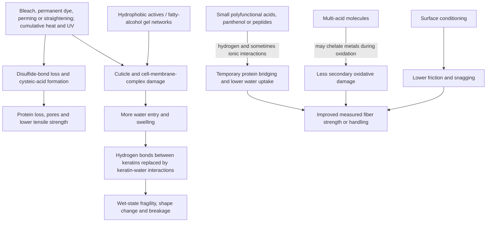
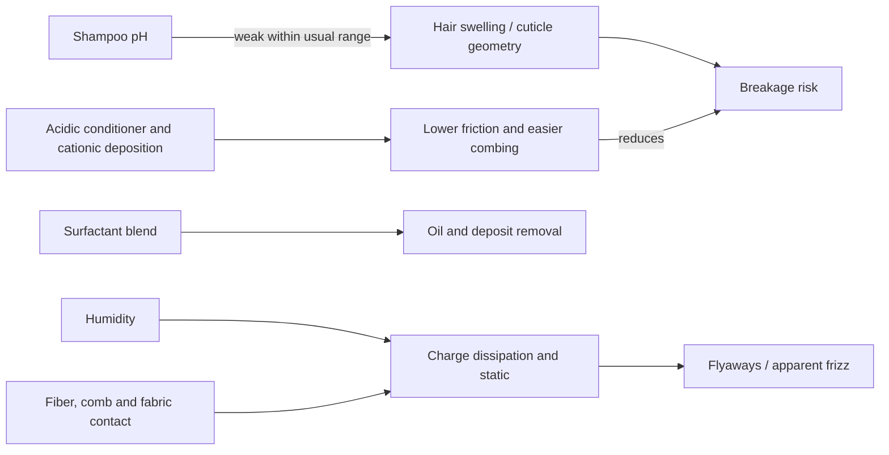

# Hair-shaft damage and bond builders

The hair shaft is a dead, layered keratin composite: overlapping cuticle cells surround a cortex of intermediate filaments embedded in matrix proteins, while the cell-membrane complex binds cells and provides lipid-rich transport pathways. “Bond builder” has no standardized scientific definition. In useful mechanistic terms, it describes a formulation intended to penetrate or substantively bind damaged hair and improve fiber properties by adding interactions among proteins, reducing water entry, protecting bonds during chemical processing, or conditioning the surface. That is different from restoring a living follicle or literally returning every oxidized disulfide bond to its native state. (@LabMuffinBeautyScience (Lab Muffin Beauty Science) — "How do bond builders REALLY work? The science", 2026-02-08, [link](https://www.youtube.com/watch?v=n8IuQh8xoRQ))

## Structure, damage, and repair targets

Disulfide bonds are relatively strong covalent links between sulfur-bearing amino-acid residues; ionic interactions are weaker and pH-sensitive; hydrogen bonds are individually weak but numerous and repeatedly break and reform with water, humidity, and heat. Chemical bleaching and reshaping produce much greater covalent damage than ordinary humidity, while repeated heat and ultraviolet exposure can accumulate damage. Lost cohesion permits protein fragments to leave the shaft, increases porosity, lowers force-to-break, and can loosen curl or texture. (@LabMuffinBeautyScience (Lab Muffin Beauty Science) — "How do bond builders REALLY work? The science", 2026-02-08, [link](https://www.youtube.com/watch?v=n8IuQh8xoRQ))

The most defensible general mechanism is not necessarily direct disulfide reconstruction. Small molecules with multiple hydrogen-bonding groups can bridge abundant sites on keratin, sometimes add ionic interactions, occupy binding sites otherwise available to water, and reduce swelling. Acids with several coordinating groups may also bind metal ions that accelerate oxidative damage during bleaching. Peptides and hydrolyzed proteins offer many polar binding sites, but molecular size, charge, hydrophobicity, vehicle, damage level, and exposure determine whether they reach the relevant compartment. A 2019 NanoSIMS study directly showed that small cosmetic molecules partition differently: lipophilic molecules concentrated in lipid-rich cell-membrane-complex pathways whereas less-lipophilic molecules were more dispersed ([Marsh et al., 2019](https://doi.org/10.1016/j.colsurfb.2018.11.036)). A 2022 review describes proteins and peptides as functional hair-cosmetic materials but also emphasizes that cosmetic damage is irreversible in the biological sense ([Tinoco et al., 2022](https://pubmed.ncbi.nlm.nih.gov/34666897/)). (@LabMuffinBeautyScience (Lab Muffin Beauty Science) — "How do bond builders REALLY work? The science", 2026-02-08, [link](https://www.youtube.com/watch?v=n8IuQh8xoRQ))

## Product claims and evidence limits

Conditioners reduce interfiber friction by depositing a thin, discontinuous surface layer. Chemical damage strips the hydrophobic 18-methyleicosanoic-acid-rich “F-layer” and changes surface charge, so ingredients that deposit acceptably on relatively intact hair may not provide enough substantivity on heavily bleached fibers. Cationic conditioning agents and selectively depositing silicones such as amodimethicone can therefore be more useful after severe damage. Solid format is not inherently inferior, but current bars may have formulation constraints that make those ingredients harder to deliver; format should be judged against the fiber's damage level and the finished formula, not sustainability or “natural” positioning alone. (@LabMuffinBeautyScience (Lab Muffin Beauty Science) — "Products I do not use (as a chemist)", 2025-12-23, [link](https://www.youtube.com/watch?v=qPonEF3EVcM))

A dermatologist's framing of the category is usefully deflationary: the main goals of a conditioner are to cut frizz, improve manageability, and impart gloss, shine, and smoothness — surface outcomes, not fiber repair. Silicones such as amodimethicone and dimethicone serve those goals directly by coating the fiber and reducing brittleness, and their bad reputation in hair-care discourse is undeserved. Hydrolyzed silk and similar proteins help fill surface gaps that develop on damaged strands, reducing brittleness and improving manageability after heat or color damage. The difference between a conditioner and a hair mask is, in practice, mostly texture — a sufficiently thick, rich conditioner is functionally a mask, and whether a product suits daily use or weekly use comes down to whether it rinses clean or accumulates weighty residue on a given head of hair. (@DrDrayzday (Dr Dray) — "Dermatologist’s TOP Korean Skincare Picks | What’s Actually Worth It?", 2026-08-21, [link](https://www.youtube.com/watch?v=7x1UCXXw6GU))

Water temporarily disrupts hydrogen bonding and makes hair easier to reshape. In wavy or curly styling, detangling with adequate conditioner can lower brushing force; distributing water and product, scrunching aligned wet fibers into clumps, applying film-forming stylers, supporting the curl against gravity, and drying it in place allow hydrogen bonds and external polymer contacts to reform around the chosen geometry. The “bowl method” is therefore a coherent styling sequence, not a biological treatment. Wet brushing is not categorically safe or harmful: water also weakens the fiber, so net damage depends on texture, tangles, lubrication, tool, and applied force. (@LabMuffinBeautyScience (Lab Muffin Beauty Science) — "Which viral hair hacks actually work? Supplements, shampoos, curly care", 2025-11-27, [link](https://www.youtube.com/watch?v=M27QzbADybI))

Apple-cider vinegar does not need to “open” the cuticle to clarify hair. Across roughly pH 2–9, ordinary washing does not produce the dramatic opening-and-closing metaphor used online; surfactants mainly remove deposits from the outside. Acid rinses historically dissolved mineral–soap scum formed by true soaps in hard water, whereas modern shampoos generally use synthetic surfactants that do not create the same deposit. Vinegar may still dissolve some acid-soluble residue, but its historical reputation does not make it a general substitute for a well-formulated clarifying shampoo. (@LabMuffinBeautyScience (Lab Muffin Beauty Science) — "Which viral hair hacks actually work? Supplements, shampoos, curly care", 2025-11-27, [link](https://www.youtube.com/watch?v=M27QzbADybI))

Shampoo pH within the ordinary commercial range is not a demonstrated master variable for fiber damage. The often-cited survey behind the pH-5.5 rule measured 123 shampoos with indicator paper but did not test shampoo on hair; its proposed chain from higher pH to charge, friction, swelling, cuticle lifting, frizz, and breakage was assembled from an unsupported reference trail. Wong's review of more direct experiments found little change in swelling, microscopy, friction, extensibility, appearance, or strength across approximately pH 3–8 or wider ranges, often after exposure far longer than shampoo contact; larger changes tended to appear only at more extreme pH. This is a source-level critical synthesis rather than an independently reproduced systematic review, so it weakens a rigid purchasing threshold without proving that pH never matters. (@LabMuffinBeautyScience (Lab Muffin Beauty Science) — "Do most shampoos damage hair? Spotting bad studies", 2025-09-29, [link](https://www.youtube.com/watch?v=Bf_Wl2gpEvM))

The pH question also illustrates evidence appraisal. A peer-reviewed paper may measure a surrogate unrelated to its title, cite sources that do not entail the claim, or use extreme soaking conditions that do not resemble a brief wash followed by conditioner. Credible inference requires reading methods and results, following the reference trail to the originating experiment, checking the chemical logic, and comparing material, exposure time, outcome, and aftercare with real use. See [[michelle-wong]] and [[skincare-evidence-and-routine-design]]. (@LabMuffinBeautyScience (Lab Muffin Beauty Science) — "Do most shampoos damage hair? Spotting bad studies", 2025-09-29, [link](https://www.youtube.com/watch?v=Bf_Wl2gpEvM))

Maleic, succinic, malic, citric and phytic acids; gluconolactone derivatives; panthenol; arginine; peptides; and hydrolyzed proteins can all supply plausible interactions, but ingredient presence does not establish penetration or finished-product performance. Damage itself changes uptake: a porous bleached shaft may admit an active that penetrates intact or differently textured hair poorly. Direct tests on appropriately matched hair—tensile strength, fatigue breakage, swelling, uptake, combing force, and microscopy—therefore matter more than structural diagrams or a hero-ingredient percentage. (@LabMuffinBeautyScience (Lab Muffin Beauty Science) — "How do bond builders REALLY work? The science", 2026-02-08, [link](https://www.youtube.com/watch?v=n8IuQh8xoRQ))

The original Olaplex explanation proposed that bis-aminopropyl diglycol dimaleate reconnects broken disulfide fragments. The transcript's contrarian correction, attributed to Michelle Wong, is that this exact reaction has not been demonstrated and that simpler polyfunctional acids can produce similar effects through hydrogen bonding, ionic interactions, water exclusion, and metal chelation. Likewise, Epres is marketed as disulfide repair, but its long hydrophobic chains make partition into lipid-rich regions or surface conditioning an alternative explanation. These are unresolved mechanistic disputes, not evidence that either product is ineffective. (@LabMuffinBeautyScience (Lab Muffin Beauty Science) — "How do bond builders REALLY work? The science", 2026-02-08, [link](https://www.youtube.com/watch?v=n8IuQh8xoRQ))

Evidence is patchy and unusually industry-dependent. Specialist companies may have better equipment, larger sample sets, and deeper hair-fiber expertise than occasional academic investigators, yet selective publication, proprietary methods, weak controls, and lack of independent replication lower confidence. Formula-level conditioning also matters: a treatment that increases internal cohesion but leaves the surface rough can increase snagging and apparent breakage, especially when proteins deposit on the cuticle. Hair type, shaft diameter, damage cause, root-to-tip history, humidity, and wash cycle are important applicability variables. (@LabMuffinBeautyScience (Lab Muffin Beauty Science) — "How do bond builders REALLY work? The science", 2026-02-08, [link](https://www.youtube.com/watch?v=n8IuQh8xoRQ))

## Practical implications

- **After bleaching, permanent coloring, perming, or chemical straightening: first reduce further damage and use a well-conditioning routine — moderate for damage prevention and surface handling.** A bond-building product is an optional adjunct, not a reversal of biological damage. Follow its labeled cadence and stop if roughness, tangling, or breakage worsens. (@LabMuffinBeautyScience (Lab Muffin Beauty Science) — "How do bond builders REALLY work? The science", 2026-02-08, [link](https://www.youtube.com/watch?v=n8IuQh8xoRQ))
- **When comparing products: favor finished-product tests on hair with damage and texture resembling yours — limited-to-moderate.** Do not rank formulas by a claimed bond type, patent diagram, active percentage, or number of “repair” ingredients alone. (@LabMuffinBeautyScience (Lab Muffin Beauty Science) — "How do bond builders REALLY work? The science", 2026-02-08, [link](https://www.youtube.com/watch?v=n8IuQh8xoRQ))
- **For a personal trial: use a split-hair or alternating-side comparison across several wash cycles — investigational practice.** Keep shampoo, conditioner, heat, and styling stable; judge breakage, tangling, feel, and manageability. This can detect a large personal effect but cannot identify the molecular mechanism. (@LabMuffinBeautyScience (Lab Muffin Beauty Science) — "How do bond builders REALLY work? The science", 2026-02-08, [link](https://www.youtube.com/watch?v=n8IuQh8xoRQ))
- **Do not improvise concentrated acid treatments from raw citric or other acids — strong safety precaution.** The transcript notes 3–5% research solutions but does not establish a safe home protocol; pH, vehicle, uniformity, eye exposure, scalp contact, and compatibility are uncontrolled. (@LabMuffinBeautyScience (Lab Muffin Beauty Science) — "How do bond builders REALLY work? The science", 2026-02-08, [link](https://www.youtube.com/watch?v=n8IuQh8xoRQ))
- **For chemically damaged hair: prioritize friction reduction and conditioning at every wash — moderate for fiber protection, product-specific for any named active.** A liquid conditioner with cationic agents or selectively depositing silicones may outperform a solid bar on heavily bleached hair, but test the finished product rather than the format label. (@LabMuffinBeautyScience (Lab Muffin Beauty Science) — "Products I do not use (as a chemist)", 2025-12-23, [link](https://www.youtube.com/watch?v=qPonEF3EVcM))
- **For wavy or curly styling: detangle with lubrication and the least force that works, then set wet clumps while drying — mechanistically plausible, limited comparative-outcome evidence.** Use the bowl method only if its extra water, product use, time, and handling improve the result for that head of hair. (@LabMuffinBeautyScience (Lab Muffin Beauty Science) — "Which viral hair hacks actually work? Supplements, shampoos, curly care", 2025-11-27, [link](https://www.youtube.com/watch?v=M27QzbADybI))
- **For buildup: start with an appropriate shampoo rather than routine undiluted vinegar — moderate formulation principle, limited clinical evidence.** An acid rinse is most plausible for verified hard-water or soap deposits; stop if it irritates the scalp or worsens fiber feel. (@LabMuffinBeautyScience (Lab Muffin Beauty Science) — "Which viral hair hacks actually work? Supplements, shampoos, curly care", 2025-11-27, [link](https://www.youtube.com/watch?v=M27QzbADybI))
- **At each wash: choose shampoo by cleansing, scalp tolerance, conditioning context, and hair response rather than requiring pH 5.5 or below — moderate negative-evidence conclusion.** A persistent irritated scalp warrants review of diagnosis, allergens, fragrance, cleansing intensity, frequency, and treatment before pH is treated as the cause. (@LabMuffinBeautyScience (Lab Muffin Beauty Science) — "Do most shampoos damage hair? Spotting bad studies", 2025-09-29, [link](https://www.youtube.com/watch?v=Bf_Wl2gpEvM))

## Gaps & open questions

- Which commercial formulas improve fatigue breakage and retained length in controlled, independently replicated tests rather than only single-fiber strength after one treatment?
- How durable are hydrogen-bonding, ionic, hydrophobic, and surface-conditioning effects across washing and humidity cycles?
- Does any marketed product directly reconstruct oxidatively broken disulfide bonds in situ at a clinically meaningful scale?
- Which molecular properties predict penetration and benefit across straight, wavy, curly, and coily hair and across bleach, heat, ultraviolet, and mechanical damage?
- How much of apparent “bond repair” is internal reinforcement versus lower surface friction?
- Which solid-conditioner architectures deposit damaged-hair-selective agents as effectively as liquid emulsions?
- Does the bowl method reduce breakage or improve style durability compared with simpler wet-setting routines when product dose and handling are controlled?
- Do finished shampoos spanning the common pH range produce different long-term breakage, frizz, scalp symptoms, or retained length when surfactant system, conditioner, wash time, humidity, and hair damage are controlled?

## Related

[[hair-loss-diagnosis-and-scalp-health]] · [[skincare-evidence-and-routine-design]] · [[skin-barrier-and-moisturization]] · [[photoprotection]] · [[cyperus-oil-hair-removal]] · [[michelle-wong]]
