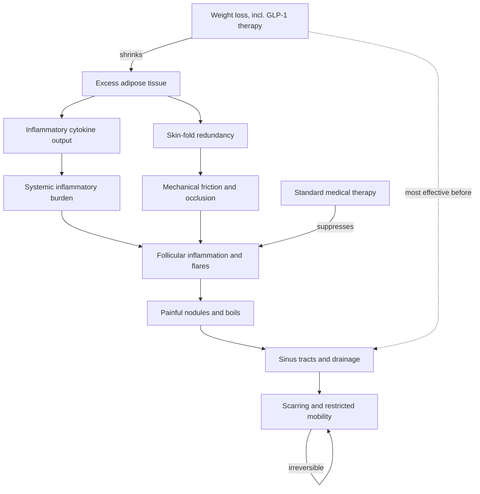

# Hidradenitis suppurativa

Hidradenitis suppurativa (HS) is a chronic inflammatory skin disease of the skin folds — underarms, under the breasts, the groin, abdominal folds, and between the buttocks — in which painful inflamed nodules and boils form, connect into draining sinus tracts (tunnels beneath the skin that fill with pus), and eventually scar down. The disease is disfiguring and severely painful; scarring can progressively restrict mobility, and the combination of pain, drainage, and location imposes heavy costs on quality of life and intimate relationships. HS is a complex inflammatory disease with multiple converging causes, not a hygiene problem and not simply a consequence of body weight. (@DrDrayzday (Dr Dray) — "Can Ozempic & Wegovy Improve Your Skin? Skin Benefits of GLP-1s", 2026-08-28, [link](https://www.youtube.com/watch?v=vESsyr2i6iA)) (@DrDrayzday (Dr Dray) — "Your Diet Could Be Making Your Skin Inflammation Worse", 2026-08-25, [link](https://www.youtube.com/watch?v=kwdfMqF6SSk))

## Why adiposity matters twice

Excess adiposity feeds HS through two distinct arms. Mechanically, greater skin-fold redundancy creates friction and occlusion — dense tissue rubbing on itself precipitates disease in exactly the sites HS occupies. Biologically, adipose tissue is a metabolically active organ releasing inflammatory mediators, so a larger fat compartment raises the systemic inflammatory burden that drives flares; patients with HS also carry elevated rates of cardiometabolic disease, mirroring psoriasis ([[psoriasis-and-systemic-inflammation]]). Neither arm makes obesity the cause of HS — many patients with HS are not overweight — but both make weight a treatment-relevant variable. The scarring step is the irreversibility boundary: interventions that reduce flares matter most early, before tunnels and scars have formed. (@DrDrayzday (Dr Dray) — "Your Diet Could Be Making Your Skin Inflammation Worse", 2026-08-25, [link](https://www.youtube.com/watch?v=kwdfMqF6SSk)) (@DrDrayzday (Dr Dray) — "Can Ozempic & Wegovy Improve Your Skin? Skin Benefits of GLP-1s", 2026-08-28, [link](https://www.youtube.com/watch?v=vESsyr2i6iA))

## Weight, diet, and disease severity

The strongest dietary-adjacent signal in HS is weight loss itself. Several small studies suggest weight loss reduces HS severity in people with overweight or obesity; in one small study, patients who lost 15% of their body weight all experienced at least some reduction in disease, and over half experienced complete clearance — most plausibly early in the disease course, before structural damage. These are small studies, not randomized programs, but the direction is consistent with both mechanistic arms above. (@DrDrayzday (Dr Dray) — "Your Diet Could Be Making Your Skin Inflammation Worse", 2026-08-25, [link](https://www.youtube.com/watch?v=kwdfMqF6SSk))

Specific dietary manipulations sit on much thinner evidence. Small, preliminary studies associate a Mediterranean-style pattern (legumes, whole fruits, vegetables, whole grains, olive oil, some fish, limited red meat) with less severe disease and fewer flares; sugar reduction has been studied on the same small scale. Two elimination signals recur: in a study of 47 patients, 83% experienced fewer flares after eliminating dairy, and a tiny study reported improvement after complete elimination of brewer's yeast, which appears to be a culprit for some individuals. All of these samples are far too small to generalize, and the source's explicit recommendation is against complete elimination diets in HS despite the temptation severe disease creates — there is no approved HS diet, and diet does not substitute for medical therapy. (@DrDrayzday (Dr Dray) — "Your Diet Could Be Making Your Skin Inflammation Worse", 2026-08-25, [link](https://www.youtube.com/watch?v=kwdfMqF6SSk))

## GLP-1 medications

GLP-1 receptor agonists are an emerging adjunct with observational support: a recent systematic review identified 19 studies totaling about 67,000 patients, with roughly 60% achieving clinical improvement in disease appearance and extent, quality of life, and inflammatory and metabolic markers; other reviews report improvement in flares, pain, and drainage — the disease's most debilitating features — without clearing HS in everyone. Unlike the randomized psoriasis combination trial, the HS data cannot yet separate drug effect from concurrent weight loss, and randomized trials are needed before GLP-1 therapy becomes an established HS treatment. Prescribing boundaries, dosing (start low, go slow), and compounded-product cautions are kept at [[glp-1-receptor-agonists]]. (@DrDrayzday (Dr Dray) — "Can Ozempic & Wegovy Improve Your Skin? Skin Benefits of GLP-1s", 2026-08-28, [link](https://www.youtube.com/watch?v=vESsyr2i6iA))

## Practical implications

- **At diagnosis and ongoing: treat HS medically and early — strong urgency rationale; sinus tracts and scars are irreversible, so flare control before structural damage carries the most value.** (@DrDrayzday (Dr Dray) — "Your Diet Could Be Making Your Skin Inflammation Worse", 2026-08-25, [link](https://www.youtube.com/watch?v=kwdfMqF6SSk))
- **With overweight or obesity: pursue weight reduction as a disease-modifying adjunct — moderate; small-study evidence with consistent mechanism, strongest earlier in the disease course.** Discuss GLP-1 therapy where a metabolic indication exists — limited-to-moderate, observational HS evidence only. (@DrDrayzday (Dr Dray) — "Can Ozempic & Wegovy Improve Your Skin? Skin Benefits of GLP-1s", 2026-08-28, [link](https://www.youtube.com/watch?v=vESsyr2i6iA))
- **Dietary pattern: favor a Mediterranean-style whole-food pattern and reduced added sugar — limited, small preliminary studies.** A supervised trial of dairy reduction, or brewer's-yeast avoidance if a personal trigger pattern is suspected, is investigational practice; do not run unsupervised complete elimination diets. (@DrDrayzday (Dr Dray) — "Your Diet Could Be Making Your Skin Inflammation Worse", 2026-08-25, [link](https://www.youtube.com/watch?v=kwdfMqF6SSk))

## Gaps & open questions

- Do randomized trials confirm GLP-1-associated HS improvement, and is any benefit weight-independent?
- Which patients respond to dairy or brewer's-yeast elimination, and can a responder phenotype be identified prospectively rather than by trial-and-error?
- How large and durable is the weight-loss effect on HS severity by disease stage, and does the surgical weight-loss literature match the lifestyle data?
- What drives HS in normal-weight patients, and do metabolic adjuncts help them at all?

## Related

[[glp-1-receptor-agonists]] · [[psoriasis-and-systemic-inflammation]] · [[diet-and-inflammatory-skin-disease]] · [[fiber-gut-skin-axis]] · [[inflammaging-and-il-6]] · [[visceral-and-ectopic-fat]] · [[dr-dray]]
